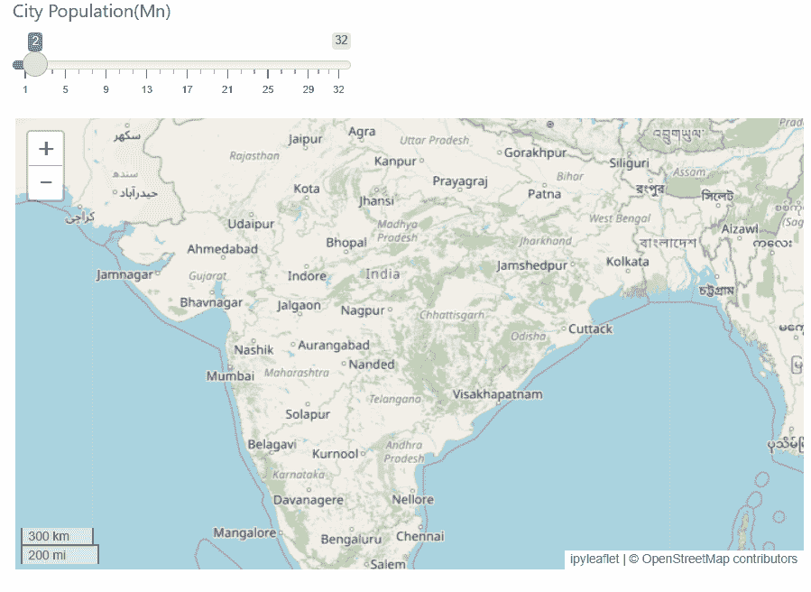

# Python 的 R Shiny 终于来了！

> 原文：<https://medium.com/geekculture/r-shiny-for-python-is-here-finally-dfcd8cb75856?source=collection_archive---------5----------------------->

下面是 RStudio 的 Shiny for Python 的 alpha 版本的预览图

Interactive shiny app ( Image source : author)

# RStudio 的闪亮

如果你是一个 R 程序员，Shiny 不需要介绍。它是数据科学家在没有任何 web 设计/开发知识的情况下构建交互式 web 应用程序的最受欢迎的软件包。