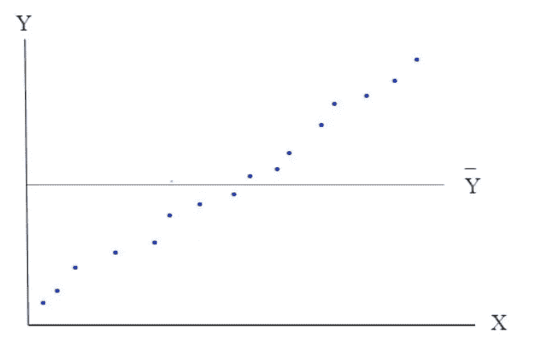
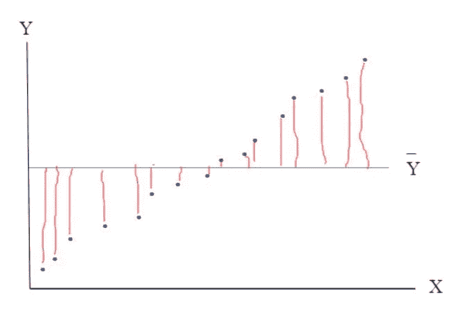
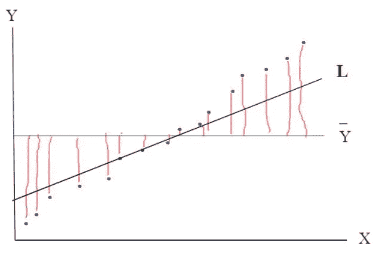
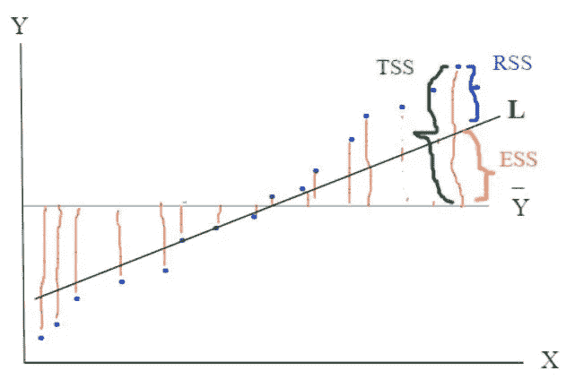
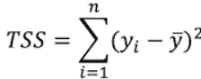
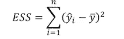
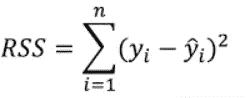
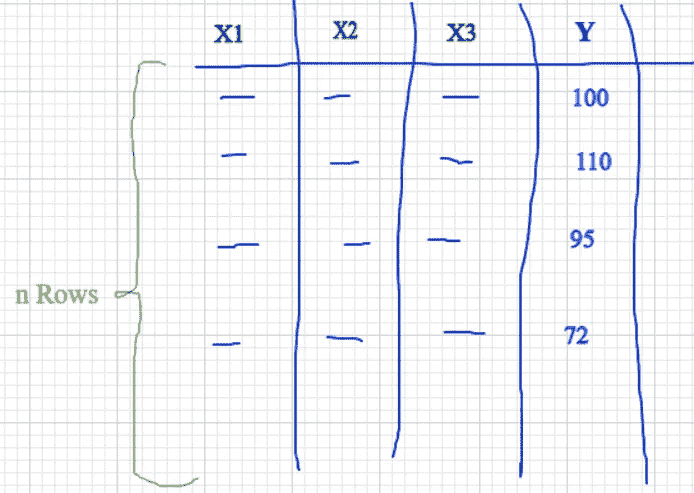
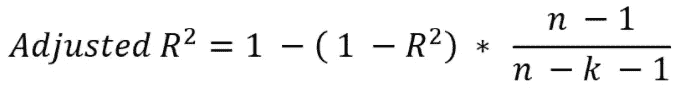

# R 平方、调整的 R 平方和自由度

> 原文：<https://medium.com/geekculture/r-squared-adjusted-r-squared-and-the-degree-of-freedom-80e7203a7e27?source=collection_archive---------10----------------------->

## **用于确定回归模型中拟合优度的度量**

## **R 平方(R )**

当我们执行回归时，模型对回归的拟合程度取决于我们预处理数据的程度以及我们用于拟合回归模型的算法。现在需要某种度量标准来确定拟合度有多好。
R 平方(也用 **R** 表示)就是这些指标之一。让我们来理解一下 **R** 的概念。

让我们举一个例子，我们有前 5 天的温度记录，以摄氏度为单位，分别是:32、24、26、30 和 28。根据过去 5 天的给定值，我们可以预测第 6 天的温度的一个最简单的方法是取这些温度的平均值，即 28 摄氏度。

虽然平均预测的方法在最初看起来可行，但是随着将来温度的实际新值，这种预测方法可能不可行，这取决于新值的大小。我们可能不得不再次重新计算新的平均值，并按照相同的过程进行预测。

现在，让我们绘制一个简单数据集的图表，该数据集具有单个自变量' **x** '和因变量' **y** '。计算 Y 平均值，Y 平均值线(**由 Y 条**指示)也绘制在下图中。

正如我们从上图中观察到的，y 的实际值和 y 的平均值之间存在偏差。这叫做*平均偏差*。
现在，在下面更新的图表中，红线表示每个数据点的平均偏差。

注意**的平均偏差总和将为零*。因此，为了避免这种使平均值之和为零的影响，我们对每个平均偏差取平方，然后求和。*

> *这个均方差的平方和称为 **TSS(总平方和)。***

*现在让我们为给定数据拟合一条回归线(L ),如下所示:*

**

*如果我们仔细观察上面的图表，我们会注意到预测值(回归线‘L’上的 y 值)比 y 平均线上的值更接近实际值。
回归线上的平均值和预测值之间的距离表示模型解释了多少。*

**为了简单和更好地解释，让我们考虑仅参考一个数据点，假设我们在参考这一个数据点来解释概念时正在考虑其余的数据点。**

*现在，如果我们对回归线上的预测值和 Y 均值之间的所有距离进行平方和，那么这个和就称为 **ESS(解释平方和)**。
预测值和实际值之间的距离被称为残差(误差)，如果我们取每个残差的平方并求和，那么这被称为 **RSS(残差平方和)**。*

*下图显示了 TSS、RSS 和 ESS。*

****

*Total Sum of Squares*

**

*Explained Sum of Squares*

**

*Residual Sum of Squares*

*拟合优度由 **R 表示。**它解释了开发的模型解释了给定数据变化的哪一部分。换句话说，它表示环境服务系统占服务系统的百分比或比例。*

*于是，***R****= ESS/TSS* =>****R****=(TSS-RSS)/TSS
=>****R****= 1-(RSS/TSS)***

**从上图我们还观察到，ess 值越大，拟合优度越好，ESS 值越小，拟合优度越小。我们推断，如果 ESS 最大，即当 ESS 等于 TSS 时，那么 **R** 将为 1。
在最坏的情况下，ESS 将为 0，因此 **R** 将为 0。因此，R 值越高，模型的拟合度越好。**

> ****因此 0≤ R ≤ 1****
> 
> **请注意，在模型不遵循数据趋势的罕见情况下(通常具有负斜率且 RSS > TSS ), R 也有可能为负，但这种模型无论如何都是无用的。**

# ****调整后的 R 平方(调整后的 R )****

**在跳入调整后 R 的概念之前，让我们先了解一下什么是*自由度*。**

****自由度** 根据上下文有不同的确定自由度的方法。让我们理解下面给定方程的自由度:**

***x1 + x2 + x3 = 500***

**在上式中，我们可以自由选择 x1 的任意值，所以让我们选择 x1 = 100 的任意值。同样，我们可以自由选择 x2 的任何值，让我们选择 x2 = 350。
但是当我们来到第三个变量时，我们没有选择 x3 的任何值的自由，因为我们需要选择 x3 的值，使得先前选择的 x1 和 x2 的值以及 x3 的值应该满足等式。
这意味着我们必须选择 x3 的值为 50，因为该值将满足等式 x1+x2+x3 = 500。
因此，在方程的 3 个变量中，我们可以自由地为 2 个(即 3 - 1 个)变量选择任何值。类似地，对于更大数量的变量，比如一个方程中有 n 个变量，我们可以自由选择 n-1 个变量的任意值。这个值 n-1 被称为*自由度*。**

> **自由度= n-1**

****现在让我们从回归的角度来理解自由度。****

**给定一个具有“n”个观察值或样本的数据集，如下所示:**

****

**上述数据集可由以下线性方程表示:**

> **Y = β0 + β1*X1 + β2*X2 + β3*X3**

**其中“β0”是截距，β1、β2 和β3 是我们需要确定和估计的斜率。**

**所以设观测次数为‘n’，斜率系数的个数为‘k’，截距的个数总是‘1’(也就是β0)。**

**因此，在这种情况下，自由度为:**

*****观察次数-待定系数数-截距数。*****

**这意味着:**

> **线性回归的自由度= **n - k - 1****

**因此，对于上述具有 3 个特征的数据集，自由度(df)将为:**

***df = n - 3 - 1 = n - 4***

**我们还推断，对于要执行的回归，观察值的数量应该总是大于参数(或变量)的数量，否则回归将不能正确执行，并将导致错误。**

> ****观察数量(n) >参数数量(k+1)****

**因此，在上述情况下，由于参数数量为 4 (3 个斜率系数和 1 个截距)，因此最小观测值至少应为 5，以便回归工作。**

**正如我们之前看到的，R 提供了模型拟合程度的度量，那么**为什么需要调整 R** ？**

**为了回答上面的问题，让我们理解使用 R 时所面临的问题。
让我们在之前的等式中添加一个新变量' **X4** '。因此，新等式现在变成了:**

> **y =β0+β1 * X1+β2 * X2+β3 * X3+**β4 * X4****

**我们可以清楚地看到，新的自由度(df1)将减少，如下所示:**

***df1 = n-k-1 = n-4-1 =***n-5****

**如果自由度降低，那么模型的解释力也会降低，但是随着变量数量的增加，R 值往往会增加或保持不变，这给我们一个概念，即模型的解释力在增加或保持不变，这实际上可能并不总是正确的。**

**另一方面，如果新变量非常相关，那么模型的解释力将会增加。因此，根据新增加变量的相关程度，模型的拟合优度或解释力会相应增加。**

**因此，可能存在不同的情况，其中新添加的变量与业务领域高度相关，并且模型的解释能力的增加增加到很好的程度，同时自由度有所减少，尽管净效果是总体上模型解释能力有所增加。
也可能出现相反的情况，即新增加的变量不显著相关，因此模型的解释能力没有太大增加，因此净效应是自由度的减少占主导地位。**

**如果我们在这种情况下使用 R 作为度量标准，那么它将永远不会减少，即使自由度随着模型解释能力的减少而减少。所以在这种情况下，R 不会给出正确的结果。**

> ****调整后的 R 前来救援****

**在这种情况下，调整后的 R 将是更合适的指标，在这种情况下，我们需要在添加新变量时捕捉模型拟合优度的整体净效果，这取决于该变量与同时发生的自由度减少的相关程度。**

**现在让我们来确定调整后的 R。首先让我们回忆一下下面的公式:**

***ESS+RSS = TSS
ESS/TSS+RSS/TSS = 1
R = 1-RSS/TSS***

> ****通过调整 RSS 和 TSS 及其相应的自由度来调整 R****

**由于 RSS 与回归线相关，而 TSS 与“Y”的平均值相关，因此我们将使用回归的自由度(n - k - 1)对 RSS 进行调整，同时使用其方程的自由度(n - 1)对 TSS 进行调整。**

**调整后的 R 公式写为:**

***调整后的 R = 1-[RSS/(n-k-1)]/[TSS/(n-1)]
=>调整后的 R = 1-[(n-1)/(n-k-1)]-RSS/TSS
由于 RSS/TSS = 1- R 所以公式也可以写成:***

****

> **调整后的 R 将随着新变量的增加而增加或减少，这取决于新变量的增加对模型解释能力的总体影响，在某些情况下，R 可能无法表明这一点，因此我们得出结论，在回归过程中增加或删除新变量的情况下，调整后的 R 是一个更可靠的指标。**