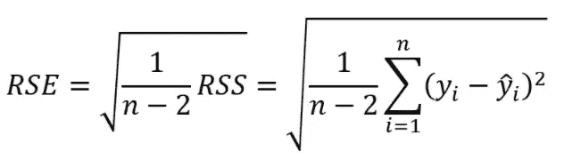
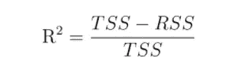
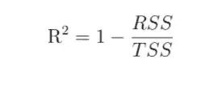
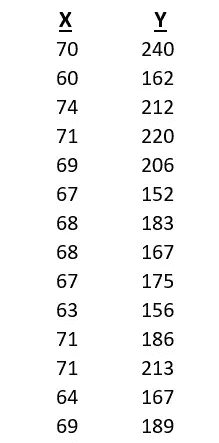
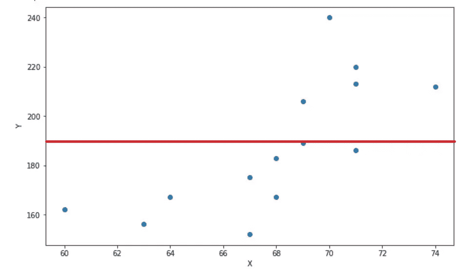
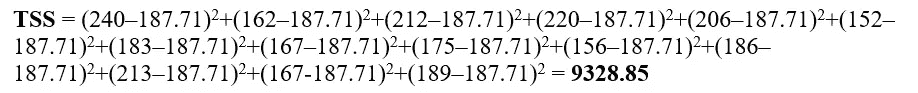
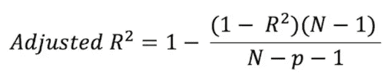

# r 平方统计:基本直觉

> 原文：<https://medium.com/geekculture/r-squared-statistic-basic-intuition-c8620412b196?source=collection_archive---------26----------------------->

回归模型的质量通常使用两个相关的量来评估:残差标准差(RSE)和 R 平方统计量。RSE 使用以下公式提供模型与数据不匹配的绝对测量值

然而，RSE 是以因变量(Y)的单位来衡量的，并不总是清楚什么是好的 RSE。或者，R 平方是一种统计度量，它告诉我们数据在回归模型中的拟合程度。它测量因变量(Y)中可以用自变量(X)解释的方差的比例。它可以是 0 到 1 之间的任何值，与 y 的比例无关。R 平方的公式为-

或者简单地说，我们可以写成-

其中，TSS 为**总平方和*，RSS 为**残差平方和*。TSS 测量响应 Y 中的总方差，可定义为执行*回归之前响应中固有的可变性量。*另一方面，RSS 测量执行回归后留下的无法解释的可变性数量。因此，(TSS-RSS)测量通过执行回归解释(或消除)的响应中的可变性量，而 R 平方测量可以使用 x 解释的 Y 中的可变性比例。让我们取一个小数据集如下-**

********

**Scatter plot of the data set, where red line depicts the mean of Y.**

**如果我们取 Y 的所有点的平均值，我们会得到 187.71。然后，TSS 将如下-**

****

**所以没有最小二乘回归，我们的平方和是 9328.85。也可以看出红线似乎不太符合数据。**

**同样，如果我们为上述数据集绘制回归线，那么我们将得到它为-**

****

**Regression line**

**上面的回归线似乎很好地拟合了数据，但为了测量它的拟合程度，我们必须测量残差平方和，即 RSS，发现它是 **4382.89** 。**

**如果不使用回归，我们的模型的总平方和为 **9328.85** 。使用最小二乘法，回归将该值降低至 **4382.89** 。所以使用最小二乘法，回归消除了大量的预测误差。**

**因此，总减少量为**(9328.85–4382.89)= 4945.96****

**我们可以将这种减少表示为原始预测误差量的百分比:**

**((9328.85–4382.89)/(9328.85))*100 = 0.5301 * 100 = 53.01%**

**这里，R 平方= 0.5301，即 Y 中几乎一半的可变性是通过对 x 的线性回归来解释的。**

**所以，R 平方告诉我们，当我们对自变量 x 使用最小二乘回归时，因变量 Y 的预测误差的百分比被消除了。**

**接近于 1 的 R 平方统计表明响应中的大部分可变性已经由回归解释。接近 0 的数字表示回归不能解释响应中的大部分可变性。**

# ****调整后的 R 平方:****

**如果我们在模型中加入一些预测因子，不管预测因子的有效性如何，R 平方都有增加的趋势。由于 R 平方总是增加而从不减少，随着我们向模型中添加更多的变量，它可能会显得更适合。这可能完全是误导。调整后的 R 平方告诉我们仅由自变量解释的实际影响因变量的变化比例。调整后的 R 平方将对添加不符合模型的独立变量进行惩罚。调整后的 R 平方将始终小于或等于 R 平方。调整后的 R 平方的公式为:**

****

**where, N = the number of points in the data sample and p = the number of independent [variables](https://www.statisticshowto.com/probability-and-statistics/types-of-variables/) in the model, excluding the [constant](https://www.calculushowto.com/constant-term-definition/).**