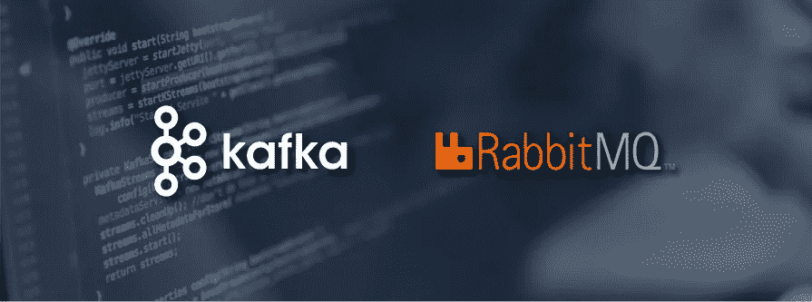
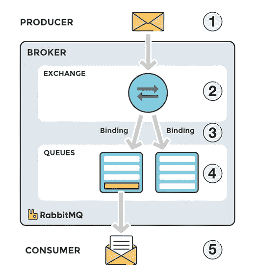
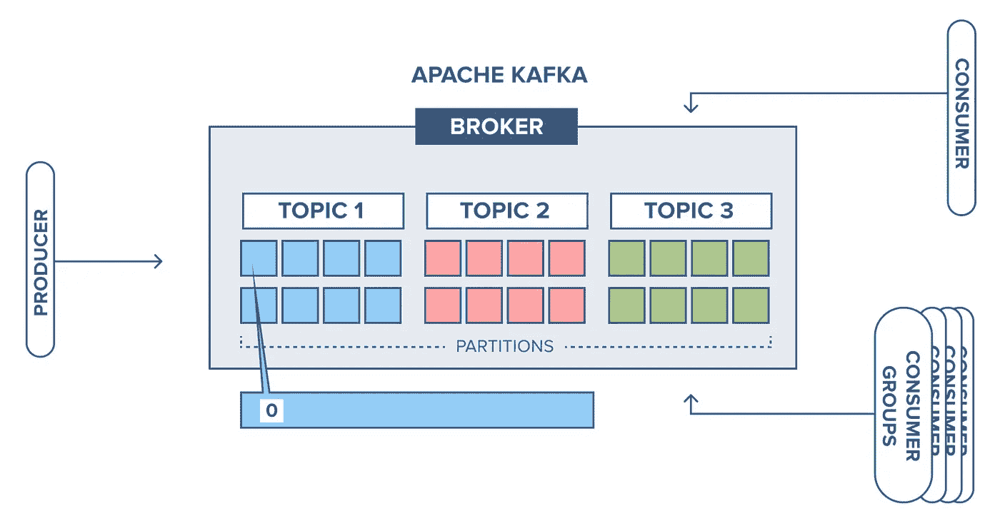
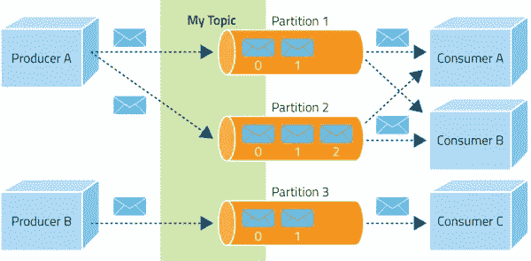

# Rabbitmq 和 Kafka，那是什么？

> 原文：<https://medium.com/geekculture/rabbitmq-and-kafka-what-is-that-c99e080ffa11?source=collection_archive---------11----------------------->

软件应用可以使用消息队列进行同步和扩展。此外，这些队列使得两个系统之间的**异步通信**成为可能，并且解耦了软件应用，这使得扩展过程变得容易。

*在深入主题之前，让我们先了解一下什么是* ***消息队列*** *以及它是如何在实际项目中用于扩展应用程序的？*

**消息队列**由生产者、代理和消费者组成。生产者是为代理生成消息的客户端应用程序。代理接收消息，将消息存储在队列中，并等待使用者连接和使用它。

为了说明这一点，让我们假设一个 web 应用程序，它允许用户提交信息、处理信息、生成 pdf 并作为电子邮件发送回用户。web 应用程序充当客户端，将信息提交给代理，代理将信息放入队列中。消费者检索和处理信息，生成 pdf，并将电子邮件发回给用户。当消息在队列中等待以及处理电子邮件时，producer 继续将新消息排队。在这种情况下，通过使用 message broker，我们可以通过连接更多的消费者来处理 pdf 生成和发送电子邮件，从而扩大 pdf 生成和电子邮件流程。

# 兔子 q:

RabbitMQ 是部署最广泛的开源消息代理。

Rabbitmq — message broker

消息不会直接发布到队列。相反，生产者将消息发送到交换。交换是消息路由代理，它负责借助标头属性、绑定和路由关键字将消息路由到不同的队列。

一个**绑定**是一个“桥”,它将一个队列绑定到一个交换。

**路由关键字**是交换在决定如何将消息路由到队列时所查看的消息属性(取决于交换类型)。

在 RabbitMQ 中，有四种不同类型的交换，它们使用不同的参数和绑定设置来不同地路由消息。客户端可以创建自己的交换，也可以使用服务器首次启动时创建的预定义默认交换。

RabbitMQ 的智能代理代替消费者完成消息传递的工作*。*一般来说，消息是在批量事务中获取的。几封邮件同时阅读。可以对可用于批量获取的消息数量进行限制，以免让消费者不知所措。

在 RabbitMQ 中，消息被存储，直到消费者连接并从队列中检索出消息。客户端可以在收到消息时确认消息，也可以在客户端完全处理完消息后确认消息。在这两种情况下，一旦消息被确认，它就会从队列中删除。

RabbitMQ 客户端也可以在无法处理消息时否定确认消息，在这种情况下，该消息将作为新消息返回到队列中。

RabbitMQ 提供了为消费者发送的消息分配优先级的能力。在这种情况下，会维护一个优先级队列，并相应地对消息进行排队。

# 卡夫卡:

**事件流**是指以事件流的形式从数据库、传感器、移动设备、云服务和软件应用等事件源实时捕获数据的实践。Kafka 对于流处理非常有用。

一个**消息队列**是 RabbitMQ 中的一个队列，这个“队列”在 Kafka 中被称为日志。卡夫卡的一条信息通常被称为**记录。当我在 Kafka 中写关于一个主题的时候，你可以把它想象成一个消息队列中的分类。Kafka 主题被划分为分区，分区中包含不变序列的记录。**

Kafka — message broker

Kafka 不支持路由。Kafka 的主题被划分成不同的部分，这些部分以不变的顺序包含信息。您可以使用消费者组和持久主题来替代 RabbitMQ 中的路由，在 rabbit MQ 中，您将所有消息发送到一个主题，但是让您的消费者组从不同的偏移量进行订阅。Kafka 在一个分区中为每个消息维护一个偏移量。

Kafka 支持一种**拉取机制**，客户/消费者可以批量从代理那里拉取数据。客户端/消费者从代理读取消息，并保持偏移量以跟踪队列中计数器的当前位置。在读取一条消息后，消费者增加它的偏移量，因此计数器被更新用于随后的检索。

您可以在 Kafka streams 的帮助下自己创建动态路由，在 Kafka streams 中，您可以将事件动态路由到主题，但这不是默认功能。

在 Kafka 中，消息不能以优先级别发送，也不能以优先顺序传递。卡夫卡的所有信息都是按照接收的顺序存储和传递的。

Kafka 中的消息队列是持久的。发送的数据会一直存储到指定的保留期结束，可以是一段时间，也可以是一个大小限制。邮件会一直留在队列中，直到超过保留期/大小限制，这意味着邮件在使用后不会被删除。而是可以多次重播或消费，这是一个可以调整的设置。

在 Kafka 中，您可以通过向集群添加更多节点或者向主题添加更多分区来进行扩展。这有时比像在 RabbitMQ 中那样给现有机器添加 CPU 或内存更容易。

# **用法:**

如果您想要一个简单/传统的发布-订阅消息代理，通过通道/队列进行系统通信，并且不需要保留和流式传输，那么显而易见的选择是 RabbitMQ，因为它很可能会比您需要的规模更大。

如果需要分析/传输数据(跟踪、摄取、记录、安全等。)卡夫卡可能是更好的选择。Kafka 用于**事件驱动的**应用程序，其中数据必须在应用程序的多个组件之间流动。

# **总结:**

两者都是流行的消息代理。最后，这取决于用户的需求。两者都适合捕捉数百万条信息，尽管它们都有自己的体系结构。