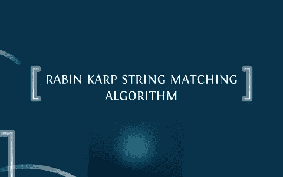

# JavaScript 中的拉宾-卡普

> 原文：<https://medium.com/geekculture/rabin-karp-in-javascript-6b32fba41b4c?source=collection_archive---------13----------------------->

## 通过实现拉宾-卡普算法来搜索你的关键词。

Fig: Rabin-Karp Algorithm. Source: [https://prezi.com/gs4j-jviaszn/rabin-karp-string-searching-algorithm/](https://prezi.com/gs4j-jviaszn/rabin-karp-string-searching-algorithm/)

大家好，在这篇文章中，我将讨论 Rabin-Karp 算法，用于搜索句子中的文本或模式匹配。我将为这个算法使用 JavaScript。我们来挖掘一下拉宾-卡普算法。