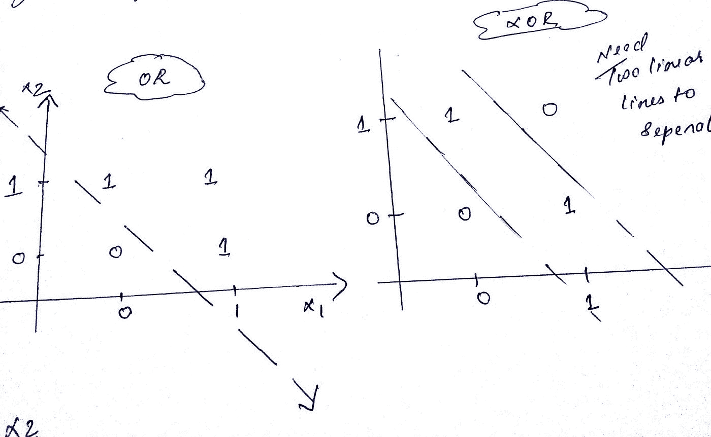
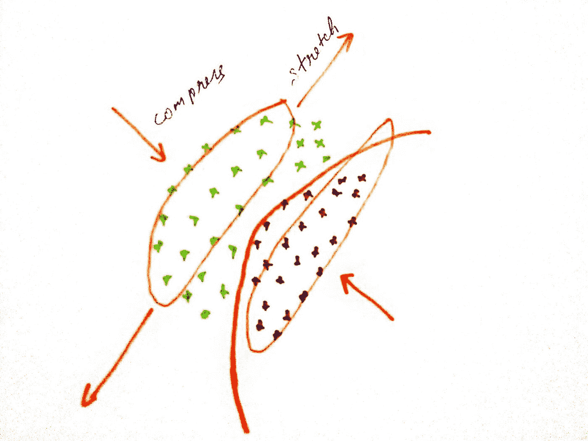
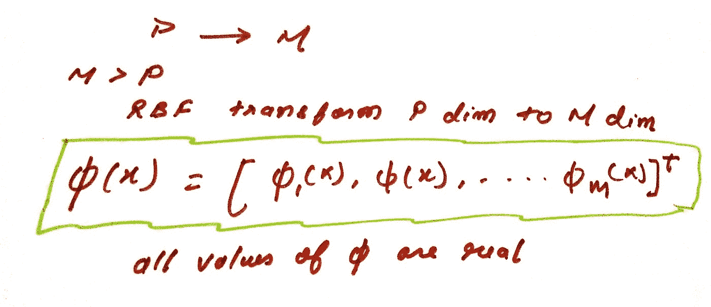
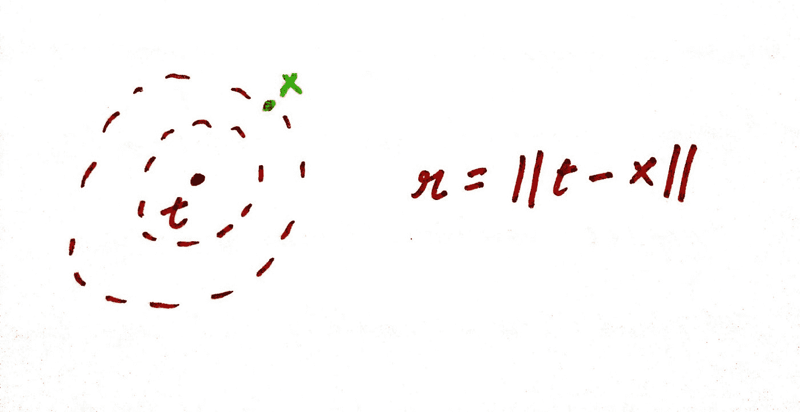
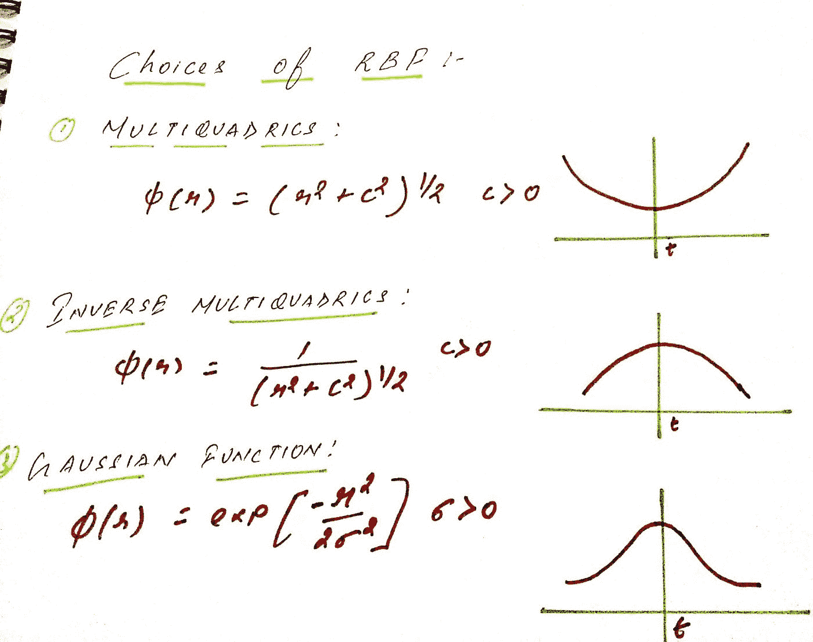
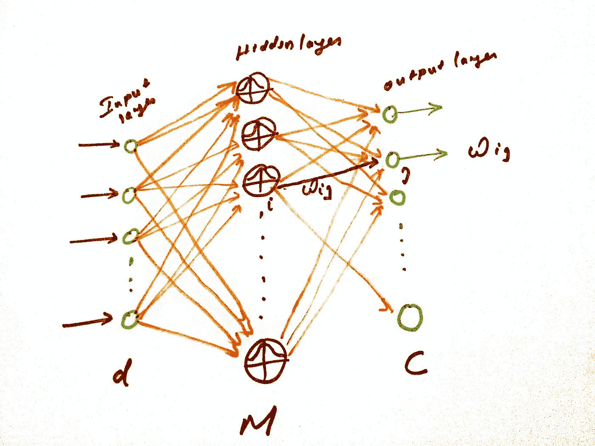
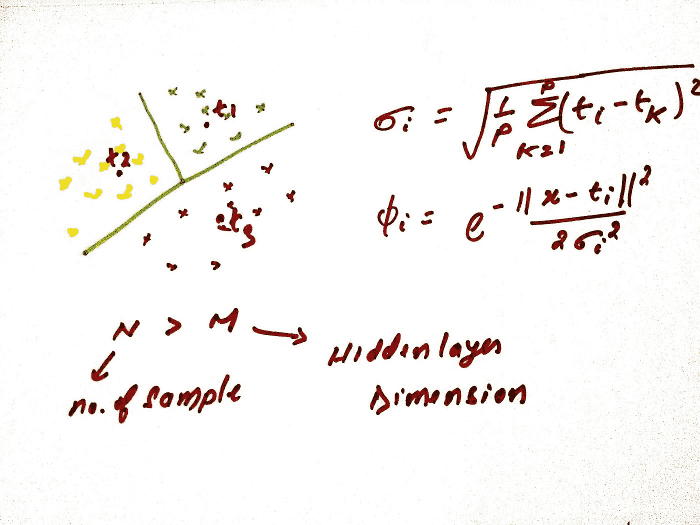
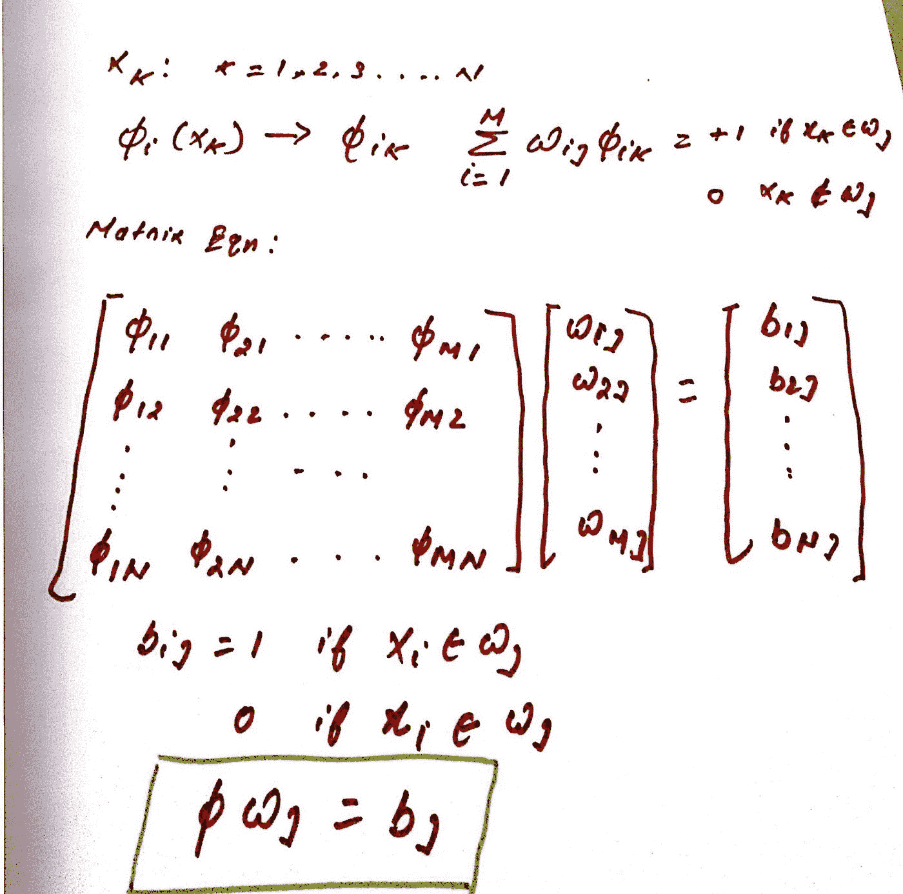
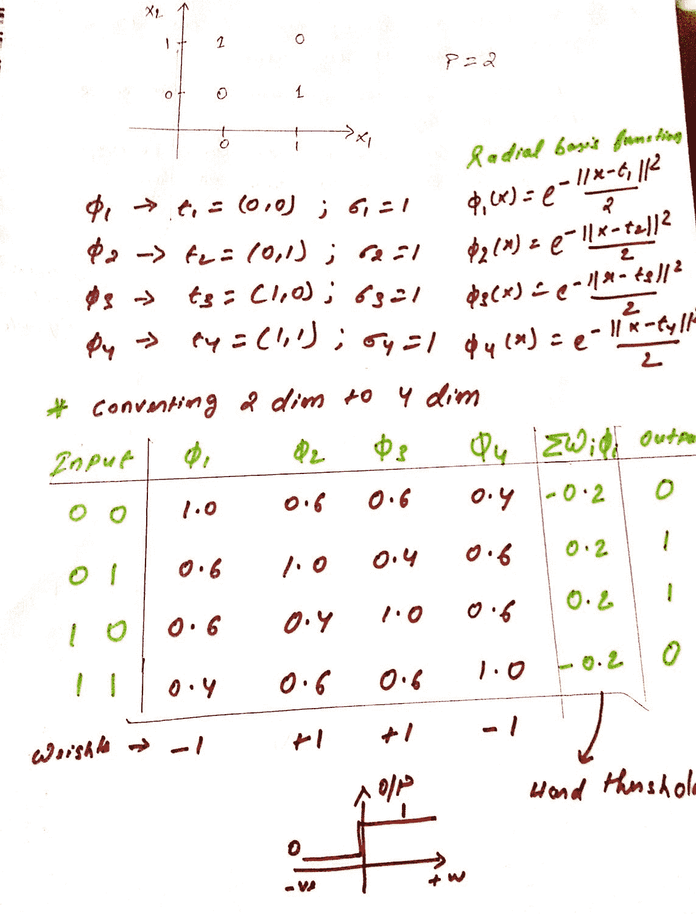
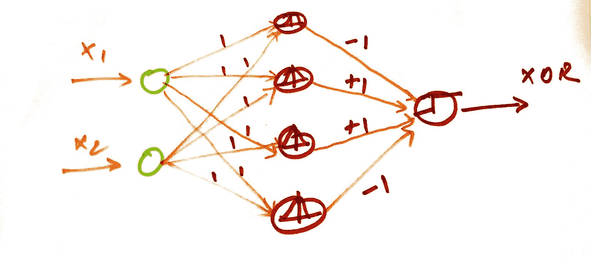

# 径向基函数网络

> 原文：<https://medium.com/geekculture/radial-basis-function-network-952785127d61?source=collection_archive---------0----------------------->

如果类别或模式是线性可分的，那么单层感知器就足够了，否则我们需要在网络中加入隐藏层，以在网络中引入非线性。

隐藏层简单地通过一组成对线性边界来表示非线性边界。

一般来说，在当前维度上不可线性分离的输入特征向量在投影到更高维度上时总是有可能变得可线性分离。

让我们看一个 OR 和 XOR 门输出的例子，我们可以看到 OR 输出可以线性分类，但 XOR 输出则不是这样，因为我们需要两条线性线来分隔输出(0 和 1)的边界。

那么来看看径向基函数(RBF)对于我们上面的非线性可分模式问题的作用。

RBF 对输入向量进行非线性变换，然后通过下面的变换进行分类。

a)对输入特征向量进行非线性变换。

b)增加特征向量的维数。

在上面图像中，绿色和红色是两个不同类别的特征向量，很明显它们是非线性可分的，所以一旦我们施加 RBF，它就对特征向量执行非线性变换，这实际上是沿宽度压缩它们并沿长度拉伸它们，由于它变得线性可分。

随着非线性变换，维度从 P 个原始维度增加到 M 个维度，具有以下等式

RBF 行为:

每个 RBF 函数都有一个受体，并且函数值随着远离受体 t 而增加或减少。

r 是接收器 t 和任何输入特征向量 X 之间的距离

以上是 RBF 的一般选择，但高斯是最受欢迎的一个，我们可以看到函数随着远离受体而衰减。

RBF 神经网络的网络结构；

径向基函数(RBF)网络通常具有三层:输入层、具有非线性 RBF 激活函数的隐藏层和线性输出层。输入可以被建模为实数的向量。网络的输出是输入向量的标量函数。

d 是输入特征空间的维数，M 是我们施加了 RBF 的变换特征空间的维数，C 是要识别的类的数量。

这类网络的培训分为两个阶段:

a)训练包括 M 个 RBF 函数的隐藏层，RBF 函数的待确定参数是受体位置 t 和高斯 RBF 情况下的适马。

b)为输出层训练权重向量 Wij。

训练隐藏层:

因此，对于训练隐藏层有不同的方法，让我们假设现在我们正在处理高斯径向基函数，所以我们需要确定受体 t 和传播即适马。一种方法是从 N 个样本特征向量中随机选择 M 个受体，但这似乎不符合逻辑，因此我们可以用聚类机制来确定受体 ti。

因为我们在隐藏层中有 M 个节点和 N 个样本，所以这里的聚类工作 N>M。

受体的计算:

让我们看看上面的例子，我们有 M=3，所以我们需要确定三个 t。因此，最初我们将特征向量空间划分为三个任意的聚类，并将它们的平均值作为初始受体，然后我们需要对每个样本特征向量进行迭代，并执行以下步骤:

a)根据所选择的输入特征向量 x，确定三个不同聚类的均值距离(t1，t2，t3 ),无论哪个距离均值最小，样本 x 都将被分配给该聚类。

b)在 x 被分配到不同的群之后，所有的平均值(t1，t2，t3)被重新计算

c)对所有样本点执行步骤 1 和步骤 2

一旦迭代结束，我们将得到最优的 t1、t2 和 t3。

适马的计算:

一旦计算出受体，我们就可以使用 K 最近邻算法来计算σ，公式如上图所示。我们需要选择 p 的值。

训练权重向量:

让我们假设隐藏层的维数为 M，样本大小为 N。我们可以使用伪逆矩阵解来计算网络的最佳权重向量。

让我们假设我们没有完美的解决方案，因此我们将采用误差 e，并尝试使用封闭形式的解决方案来优化我们的标准函数 J(wj ),以获得我们的最佳 wj

可以对每个输出节点 j =1，2…进行上述 Wj 计算。以获得它们各自的权重向量。

优势:

1)与多层感知器相比，训练阶段更快，因为不涉及反向传播学习。

2)与多层感知器相比，隐藏层节点的解释角色是容易的。

3)在 RBF 网络的情况下，隐藏层的数目和隐藏层中的节点数目是确定的，但是在多层感知器中，没有确定隐藏层中的节点数目或隐藏层数目的解析方法。

缺点:

虽然 RBF 网络的训练速度更快，但与多层感知器相比，分类速度较慢，因为在分类过程中，隐藏层中的每个节点都必须计算输入样本向量的 RBF 函数。

示例:使用 RBF 网络的 XOR 门解决方案:

这里，最佳权重为-1、+1、+1 和-1，在输出端，我们实施了硬阈值函数，就好像值为-ve o/p 为 0，如果值为+ve o/p 为 1

XOR 的架构图:

谢谢你