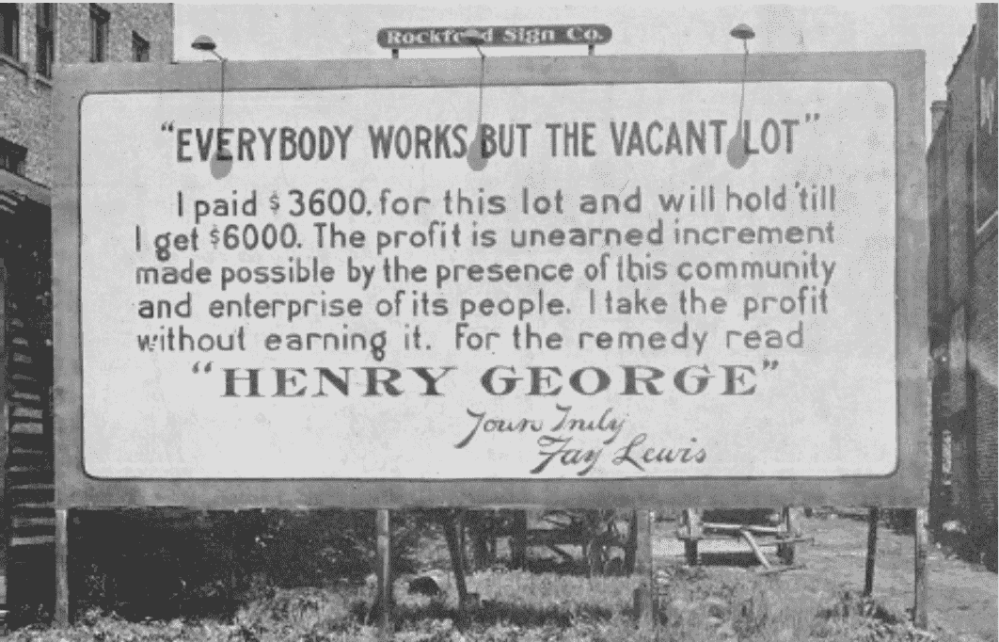
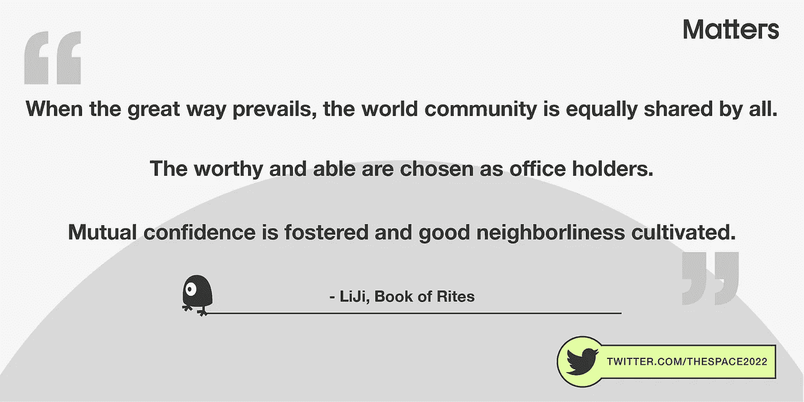

# 区块链上的激进市场:抽奖游戏如何想象财富的再分配

> 原文：<https://medium.com/geekculture/radical-markets-blockchain-monopoly-how-a-draw-to-earn-game-imagines-the-redistribution-of-ba3fa361cefc?source=collection_archive---------15----------------------->

One of our inspirations in creating [our draw-to-earn blockchain project](https://bit.ly/3jf5WUW), The Space, a public game governed by [radical market principles](https://vitalik.ca/general/2018/04/20/radical_markets.html), is a quote from the *Book of Rites: When the great way prevails, the world community is equally shared by all.* (大道之行也，天下為公) / *The worthy and able are chosen as office holders.* (選賢與能)

一个明显的矛盾威胁着被区块链技术颠覆的狂热梦想:NFT 和 crypto 仍然是富人的玩物，其规则保护财富转移计划，而不是平等保护所有用户。不到 1%的用户(机构投资者)构成了比特币基地交易量的 [64%，仅](https://incrypted.net/wp-content/uploads/2021/10/Digital-Assets-Primer.pdf) [10%的交易者](https://www.nature.com/articles/s41598-021-00053-8)就占了 NFT 交易量的 85%。[的普通 NFT 买家](https://currency.com/who-buys-nfts#:~:text=The%20Civic%20Science%20survey%20found,making%20a%20short%2Dterm%20profit.)收入超过 15 万美元，购买代币获利。

当我们在[上一次更新](https://bit.ly/3jf5WUW)中讨论[空间](https://bit.ly/35MyAcO)时，我们想知道激进市场是否能在区块链运作，并解释了哈伯格税和普遍基本收入。这篇文章被 [Coinmonks](https://medium.com/coinmonks) 、 [Simon de la Rouviere](/@simondlr) ，甚至 [Glen Weyl](https://twitter.com/glenweyl) (激进市场的作者)转载。

在我们的后续报道中，我们希望更深入地了解激进市场的历史，以及为什么我们认为区块链应该成为改善用户体验和公共合作的基础设施，而不是富人的投机目标。

在我们开始之前，让我们解释一下这个空间所基于的几个基本市场术语:

1.  哈伯格税是一项经济政策，财产所有者决定他们财产的价值，并在一段时间内支付一定比例的税款。房主必须准备以申报的价格将房产卖给任何人。
2.  **全民基本收入:**政府主导或社会主导的计划，每个人都获得有保障的基本收入。
3.  激进市场:一种组织市场以促进经济平等和增长，同时促进公共秩序和妥协的新方式。

[The Space](https://bit.ly/35MyAcO) 是第一个将区块链应用程序与哈伯格税和普遍基本收入(UBI)等概念相结合的大规模实验，以解决公共和私人所有权之间的困境。但首先，让我们探讨一下传统财产所有权的问题。

# 激进市场的历史:财产垄断吗？

[Billboard promoting Henry George’s ideas. The New York Public Library.](https://digitalcollections.nypl.org/items/510d47de-036a-a3d9-e040-e00a18064a99)

在[激进市场](https://press.princeton.edu/books/hardcover/9780691177502/radical-markets)中，微软经济学家 Glen Weyl 和芝加哥大学法学教授 Eric Posner 认为拥有私有财产本质上是一种垄断。

> 夺取土地。比方说，加利福尼亚湾区一块有价值的土地的所有者天生就是垄断者。如果一位企业家需要大量空间来建造办公楼或住宅，那么一个地块的所有者可以向她索要赎金。财产不一定是盗窃，但却是垄断。

垄断造成了财产分配和投资的低效率，因为它造成了“抵制”问题。如果你希望以 100，000 美元出售你的公寓，即使有人出价 80，000 美元购买，你也会坚持这个价格。

房产没有被分配到最有价值的地方，而是在市场上“晃来晃去”。用 Weyl 和 Posner 的话说:

> 直截了当地说，这个问题是:在私有制存在的情况下，配置效率和有效的市场经济是不可能的……垄断力量阻碍了进步的道路。

简言之，私有财产提高了投资效率，但干扰了配置效率(因为抵制问题)，共同所有权干扰了投资效率但提高了配置效率。

# 区块链能解决配置效率问题吗？

Centralized Web 1 vs Web 2 vs Blockchain

Weyl 和 Posner 的激进解决方案是新的财富税。每个人都会对自己拥有的每件物品进行估价，并对自己申报的全部财富进行征税。问题是:如果出现买家，她必须准备好以申报价格出售任何物品。如果她把价值定得很高，高额的税收将用于补偿社会。如果她把价格定得很低，以尽量减少她的税务负担，那么她的资产就会被收购。

从理论上讲，该税将使房地产得到最有利可图的利用，同时有效地增加收入，为全民基本收入提供资金。这项税收将使房地产得到最有利可图的利用，同时有效地增加收入。因为富人拥有最多的东西，这将是彻底的再分配。**最重要的是，人们将会把财产看作是从社会上租来的，而不是授予专有所有权。**

类似地，Web3 利用区块链来“分散”管理。伴随所有权分配的是决策权的分配。通过依靠自我管理的平台，例如，基于用户对平台所有权的份额，用户可以对管理网站的规则进行投票(例如，什么被归类为错误信息)。这些规则然后由智能合约执行。正因为如此，Web3 是测试激进市场原则的理想发射台——尤其是因为很少有人能在现实世界中接受激进市场。

在 Matters Lab，我们一直对建立基于区块链技术、去中心化治理和内容共同创造的 Web3 生态系统感兴趣。在[空间](https://bit.ly/35MyAcO)中，哈伯格税被设定为高税率，以压低像素价格并保持其流动性，而不是被寡头垄断。这消除了拖延问题，因为每个人都必须随时出售他们的像素。但也有一个激励继续交易像素，因为收集的税收作为 UBI 返回给用户，实现投资效率。

# 那么这个空间是如何运作的呢？

The Space in action.

[空间](https://bit.ly/35MyAcO)的规则如下:

*   每个像素都是一个 ERC721 NFT。像素所有者可以为他们的像素设定任何价格，并根据其价格纳税。
*   每一个像素都一直在打折。如果所有者不想出售像素，他或她可以提高价格，以防止购买。但这意味着所有者也必须支付更高的税来保留像素。
*   收到的税收的 90%记录在智能合同上，并以通用基本收入(UBI)的形式分配给[空间](https://bit.ly/35MyAcO)上的每个像素所有者。所收税款的 10%将作为 SpaceDAO 的社区基金。
*   无论像素所有者决定出售还是保留他们的像素，社区都从中受益。如果他们保持他们的像素，社区享有更高的 UBI。如果他们出售他们的 pixel，社区就能拥有他们喜欢的艺术品。

在制定这些规则时，我们希望建立有限公共资源的最有效分配，并最大限度地提高“像素市场”的流动性。

# 面向公共协作的区块链 DAOs

Kilroy was here. Source: [Warbird Digest](https://warbirdsnews.com/aircraft-restoration/a-veterans-story-kilroy-was-here.html).

在一个层面上，就像 Reddit Place T1、T2 T3 一样，Space T3 是一个有趣的着色游戏，玩家可以在数字涂鸦画布上给像素着色，创造出独特的艺术品。涂鸦是最古老的文明特征之一。从可追溯到公元前 13000 年的“手之洞穴”到二战士兵描绘的“基尔罗伊曾在此”迷因，涂鸦深深植根于人类保持相互联系的本能。

就像足球一样，每个单独的球员团结起来，作为一个团队一起工作，击败“敌人”，[空间](https://bit.ly/35MyAcO)让球员在区块链的一个分散的社区中共同创造，建立自己的规则，互相帮助，并团结起来对抗“敌人”，如果有一个的话。

在我们的测试发布中，我们看到了用户如何在[空间](https://bit.ly/35MyAcO)中合作，联合起来对抗捣乱者。在一个游戏中，一个破坏者用绿色盒子覆盖画布，这些盒子覆盖了其他玩家的作品。由于破坏者为他的像素设定了最高价格，其他人买不起他。

随着紧张局势的加剧，混乱开始了。这两个竞争团队虽然最初是竞争对手，但现在联手夺回了他们的 pixel 画布。他们集体集思广益，想出了解决方案。最终，他们找到了一个漏洞。通过使用“绿盒子人”的电子邮件登录游戏，像素价格被重置，绿盒子被移除。

最终，通过所有玩家的合作，来自两组的参与者扭转了混乱的局面，共同创作出了美丽、充满活力的像素画布。正如一位与会者所说:“*合作是一个渐进的过程。没有互信就不可能合作，破坏容易，建设难。这次经历很有趣。*

在激进市场和道的动态中，参与者甚至可以在没有中央权威的帮助下自治。我们已经看到他们如何集体做出决定来解决一个复杂的问题，并互相帮助。

# 下一步是什么？

A quote from LiJi, Book of Rites.

通过引入激进的市场原则，我们希望在区块链建立一个质疑经济不平等的新的政治经济体系——当[空间](https://bit.ly/35MyAcO)于 5 月正式启动时，看到动态将如何发展确实令人兴奋。

我们不仅受到激进市场原则的启发，我们的灵感还源于社会主义、资本主义，甚至佛教。自由市场带来的效率，由人民平等分享，减少痛苦。空间中的像素将会消失，但仍然继续存在于区块链上——我们对无常和放弃执着的想法。

当我们尝试这些激进的想法时，我们也希望建立一个互联网文化历史博物馆。在被关闭之前，Reddit Place 是互联网文化和模因的聚集地。想象一下，它将作为我们这一代文化的象征被永远记录在区块链上。

我们在当前的区块链世界中看到的，从 NFTs 到 GameFi，只是一个初级的发展水平。目前，用户仍在争先恐后地了解技术细节，这些细节最好藏在引擎盖下。他们被留下来毫无意义地猜测 NFTs，就像在 web 1.0 中猜测网站和域名一样。

NFTs 应该是一个基础设施，而不是投机。用户不需要知道他们是否在操作 NFTs 或其他链上数据，类似于人们不考虑 Twitter 是否部署在 AWS 或 Google Cloud 上。所有基础设施的选择只是为了提供更好的用户体验。

在[空间](https://bit.ly/35MyAcO)，人们可以简单地享受与他人合作和竞争的乐趣。NFT 和代币是这一游戏的目的所固有的，也是分散化和可持续发展的整体愿景所固有的，而不仅仅是一个激励系统。但更重要的是，在享受乐趣的同时，我们还可以在区块链测试激进的市场原则，想象在一个垄断的世界里，财富是如何重新分配的。

# 关于物质实验室

自 2018 年以来，Matters Lab 的使命是建立一个真正去中心化的 web3 生态系统，融合区块链技术、去中心化治理和内容共创。在我们的首个项目 [Matters.news](https://bit.ly/3DOA8jc) 中，我们成功地建立了一个由 10 万名自主用户组成的强大社区，他们共同创造、赚取和管理这个空间。我们充满活力的 NFT 系列， [Traveloggers](https://bit.ly/3ugn8zw) ，也是第一个通过合作创作扩大私人所有权的社交媒体化身，具有前所未有的[日志功能](https://bit.ly/3uhxG1v)。

空间是我们 web3 生态系统中的下一块拼图。通过这个项目，我们旨在改革当前的政治经济秩序，将区块链作为更好的用户体验的基础设施。

> **想给自己体验一下******的空间吗？** [**报名参加**](https://bit.ly/3jbKq3l) **我们 4 月 8 日的下一次太空公测。****

**该测试将密切反映该空间的官方版本，该版本将于 2022 年 5 月推出，因为每个像素将在第一次使用模拟令牌的交易中被铸造为 NFT。游戏的每个方面都将永久保存在区块链上。**

**如果你没有注册，不要担心，看看我们的官方网站[和订阅我们的电子邮件时事通讯，了解最新的更新！](https://bit.ly/35MyAcO)**

***对 NFTs 感兴趣？找到我们的 NFT 狩集，* [*行记*](https://bit.ly/3uf3HHy) *，上 OpenSea* [*这里*](https://bit.ly/3ugn8zw) *。***

***在 Twitter 上关注我们的* [*媒体*](https://bit.ly/3LKtiOr) *和*【matters lab】**和*[*@ the space 2022*](https://bit.ly/3jbLC6O)*了解 NFT 和 web3 的最新消息和见解，或者在* [*我们的网站*](https://bit.ly/3uT4gWA) *上注册我们的电子邮件简讯。****

## ****参考文献****

*   **不要缩小市场的作用——扩大它**
*   **[全球加密货币和数字资产](https://incrypted.net/wp-content/uploads/2021/10/Digital-Assets-Primer.pdf)**
*   **描绘 NFT 革命:市场趋势、贸易网络和视觉特征**
*   **[激进市场](https://vitalik.ca/general/2018/04/20/radical_markets.html)**
*   **[谁会购买 NFTs:“crypto 的兄弟俱乐部”变得更加多样化了吗？](https://currency.com/who-buys-nfts#:~:text=The%20Civic%20Science%20survey%20found,making%20a%20short%2Dterm%20profit.)**
*   **[激进市场:根除资本主义和民主，建立一个公正的社会](https://press.princeton.edu/books/hardcover/9780691177502/radical-markets)**
*   **[财产只是垄断的另一个名称](https://academic.oup.com/jla/article/9/1/51/3572441)**
*   **激进的市场可以在区块链发挥作用。我们的 web3 实验——空间——展示了这一点。**