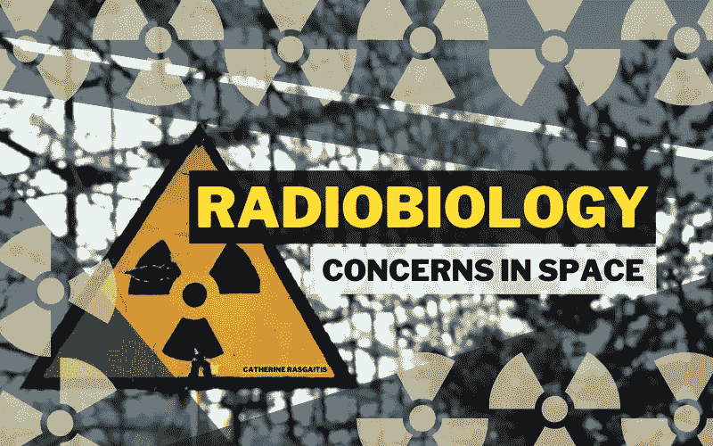

# 太空中的放射生物学问题

> 原文：<https://medium.com/geekculture/radiobiology-concerns-in-space-90c7a36670fa?source=collection_archive---------19----------------------->

## 宇宙辐射问题的根源

photo by [Vladyslav Cherkasenko](https://unsplash.com/@vl_cherkasenko), courtesy of [Unsplash](https://unsplash.com/photos/lkJOpbBxeuM)

科幻电影对长期暴露在有害辐射下的后果提出了一个不切实际的标准。比起获得超能力，你更有可能出现健康问题，或者增加将来出现健康问题的风险。