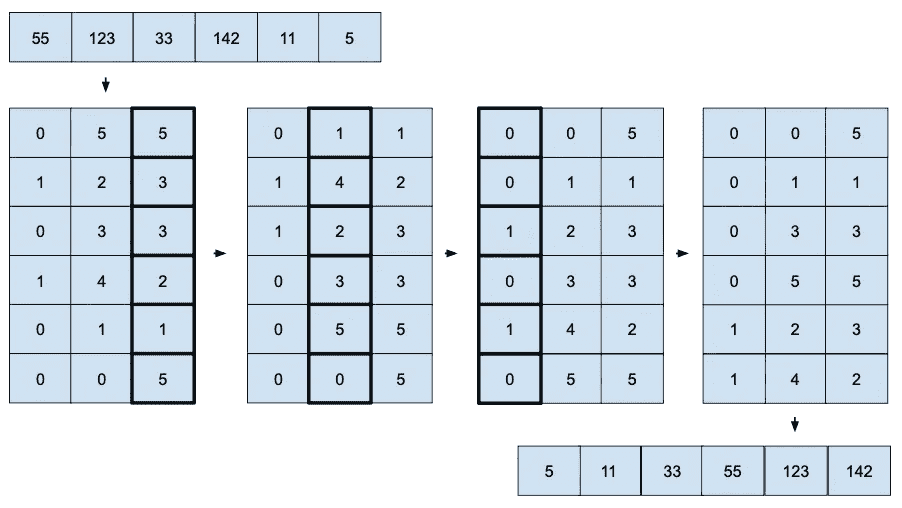

# 基数排序

> 原文：<https://medium.com/geekculture/radix-sort-44547cb31d95?source=collection_archive---------13----------------------->

## 基数排序和桶排序一样，是一种非比较的分布式排序算法。

> 基数是唯一数字的个数(小数为 0-9)。

**它根据基数**将元素分布在桶中。然后，展平并重复每个数字。

**感谢保持有序的水桶**(稳定，保持原始…