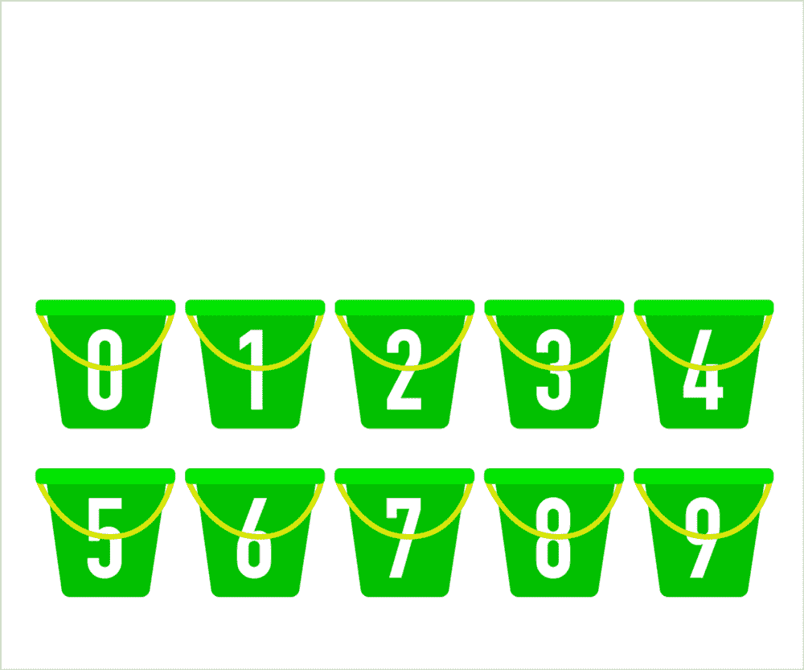
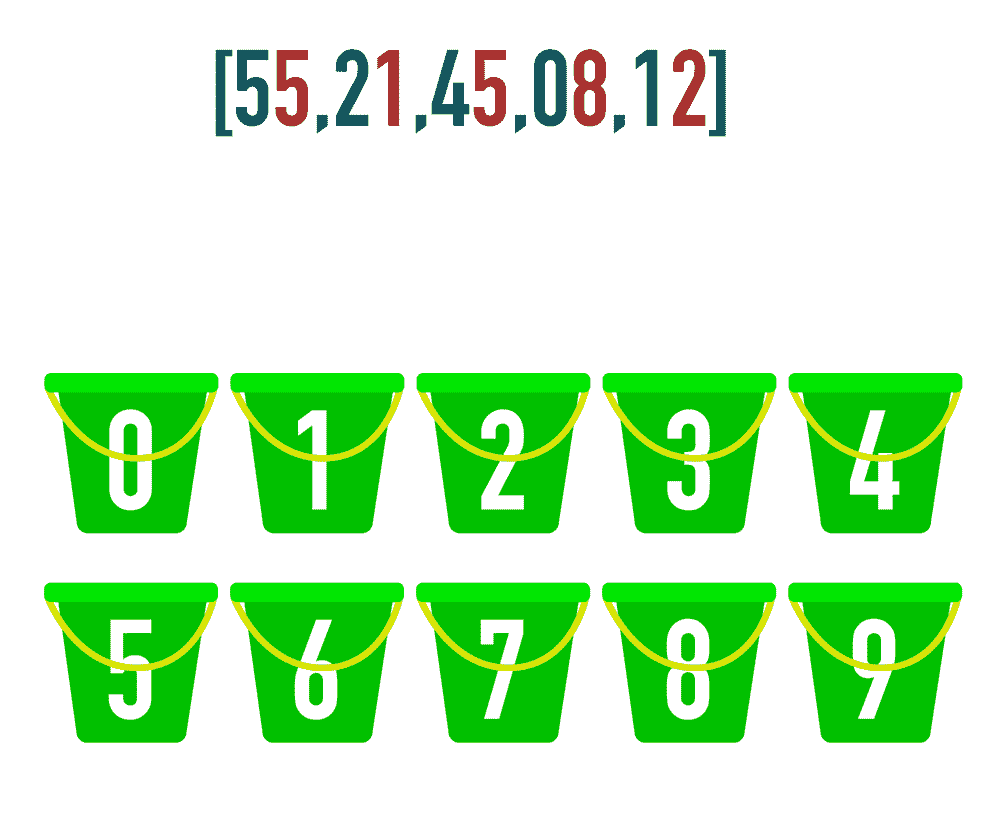

# 基数排序。数字魔法？

> 原文：<https://medium.com/geekculture/radix-sort-number-magic-694c103e11c8?source=collection_archive---------27----------------------->

基数排序在排序算法领域有点特殊，让我想起了麦片盒子背面的数字魔术。所以让我们来看看基数排序到底有多神奇。


Photo by [Nick Hillier](https://unsplash.com/@nhillier?utm_source=medium&utm_medium=referral) on [Unsplash](https://unsplash.com?utm_source=medium&utm_medium=referral)

# 什么是基数排序？

根据[维基百科](https://en.wikipedia.org/wiki/Radix_sort)。基数排序是一种非[比较](https://en.wikipedia.org/wiki/Comparison_sort) [排序算法](https://en.wikipedia.org/wiki/Sorting_algorithm)。它通过根据[基数](https://en.wikipedia.org/wiki/Radix)创建元素并将其分配到桶中来避免比较。换句话说，它利用数字的固有属性进行排序。

基数是什么？基数只是数字系统的基础系统。对于你的标准数字系统，它是以 10 为基数，数字 0-9 或 10 个独特的符号。在十六进制中，它将是一个基数为 16 的系统，因为你有 16 个唯一的符号。

这里有一些文字桶来帮助解释发生了什么。



我们将转向更复杂的例子，但是我想把这一点放在区分因素上。基数排序与其他排序算法的主要区别在于，它不是将项目相互比较，而是使用符号(如 0，1，2，3)将它们排序到桶中。哦，还有一件事要提，因为它是不可比较的，所以它确实需要数字来排序。从技术上讲，其他数据类型的数据可以转换成它们的数字对应物。例如，您可以通过将像素的颜色转换为十六进制形式来对图像的颜色进行基数排序。

# 虚假的例子

所以我解释了什么是基数排序。现在是时候看看一些伪例子了。来展示这个算法是如何发挥它的魔力的。正如我之前提到的，它确实需要数字来排序，但是它的工作方式是循环遍历数字中相同位置的所有数字。举个例子，如果我们有一个数组。`[55,21,45,8,12]`它将遍历每个循环的数字集合的相同位置值，以将它们分配到桶中。假设我们的循环是在一个位置值上，它将按 5(5)，2(1)，4(5)，(8)，1(2)分布上面的数组。为了帮助澄清发生了什么，这里有一个可视化的表示。



如上所述，该算法根据一个位置的数字将数字分类到桶中。这将从数字的右边继续到左边，直到我们用完所有数字中的位置。

当我们对 12 和 34872 这样的数字进行排序时会发生什么？基数排序会在排序中缺少的数字中插入零。所以会是 000012 和 34872。因此，在每次迭代期间，12 将继续被放入 0 存储桶，因为它本身没有位置值。

这是它的*魔法*的一部分秘密。就像魔术一样，一旦“秘密”被揭露，这一点往往变得非常明显。通过基数排序，从右到左将数字放入其位置值的桶中，较大的数字最终会比较小的数字出现在较大值的桶中，因为有时较大的数字在位置值中将具有值> 0，而较小的数字对于该特定位置值仅为 0。

# 放到实际的代码上

我们已经讨论了什么是基数排序以及一个伪代码示例。现在让我们深入研究排序算法的实际代码。

## 首先，我们需要一些辅助方法。

我们将需要的三个帮助器方法中的第一个是在特定的位置值计算数字的实际值。

好吧，虽然只有 3 行代码，但是有相当多的数学魔法在进行。所以让我们打开它。该函数需要两个参数。首先是一个数字，然后是你想要返回的值的位置。下一行看起来有点复杂，所以让我们按照操作顺序来分解它。

```
return Math.floor(Math.abs(num) / Math.pow(10, i)) % 10-> Math.abs(num) -- this just allows negative numbers to be retrieved

-> Math.pow(10, i) -- this is 10 to the i // so Math.pow(10, 2) is 10 * 10 or 100-> % 10 -- is modulo 10 // this returns the remainder of x / 10
```

让我们看一个例子。

```
getNum(5927, 2)Math.abs(num) / Math.pow(10, i) or 5927 / 100
= 59.2759.27 % 10
= 9.270...Math.floor(9.270...)
= 9
```

> 作为一个旁注,你可以用这种抽象单个数字的方法来解决其他算法问题，比如颠倒数字的顺序。；-)

第二个 helper 方法是一个函数，用于获取数组中一个数字的位数。例如，数字 254 将返回 us 3。

同样，我们需要运行一些数学逻辑来理解这里发生了什么。也许如果你的背景和我的不同，第 5 行非常有意义，但是我的非数学背景需要一些解释。我们将再次按照操作的顺序来处理它。

```
if (num === 0) return 1; // an exception if num = 0, just return 1 digit in javascript Math.log10(0) returns -Infinityreturn Math.floor(Math.log10(Math.abs(num))) + 1;digitCount(462);Math.abs(num) // allows for negative numbers to be calculated 
Math.log10 // is log base 10 // or in other words 10 to x power gives us this numberMath.log10(Math.abs(462))
= 2.6646... // 10 to the 2.6646... power goes into 462 Math.floor(2.6646...)
= 2+ 1 // we need to add 1 digit since we did log10
= 3
```

我们需要的第三个也是最后一个帮助器方法是找到数组中单个整数的最大位数。这个更简单，因为我们在函数中使用了我们早期的助手。

我们只需要讨论上面代码的第 6 行。我们将名为`maxDigits`的变量初始化为`0`，然后遍历数组以找到最大值。

```
maxDigits = Math.max(maxDigits, digitCount(nums[i]));using digitCount() find the maximum amount of digits in the array
then return the number
```

## 现在是主要的方法

在伪部分，这是我们讨论过的函数。提醒一下，输入是一个整数数组，然后使用基数将它们分类到桶中，每 10 到 x 个值放入一个循环中。

所以让我们一行一行地讨论这里发生了什么。

```
let maxDigitCount = findMaxDigits(nums) 
// find the max number of digitsfor (let k = 0; k < maxDigitCount; k++)
// loop through the digits based off the max number of digitslet digitBuckets = Array.from({length: 10}, () => [])
// this line creates our buckets we will use to distribute our numbers, an array with 10 sub arraysfor (let i = 0; i < nums.length; i++)
// loop through the individual numbers in the arraylet digit = getNum(nums[i],k);
// get the individual number at k index for i in the arraydigitBuckets[digit].push(nums[i]);
// push the array item into the bucket of the returned value of getNum()nums = [].concat(...digitBuckets);
// after looping through the array at the k position concat() the arrays// now rinse and repeat until we have distributed for the maximum number of digits in the arrayreturn nums;
// return the sorted array
```

# 那么基数排序的大 O 呢？

嗯，通过看上面的代码，你会认为它是 O(n)因为循环中的循环，但它不是互相比较项目，所以大 O 是 O(nk)，n 是元素的数量，k 是数字中的位数。与此同时，关于这个大 O 方程也有一些争议。普遍认为比比较排序算法要快。

这就是了。基数排序，我想一旦你把它分解，它不是数字魔术，而是利用数字的固有属性进行非比较排序。另外，对 Udemy 上的 [Javascript 算法和数据结构主类](https://www.udemy.com/course/js-algorithms-and-data-structures-masterclass/)大声喊出来，它向我介绍了基数排序以及这篇文章的灵感。