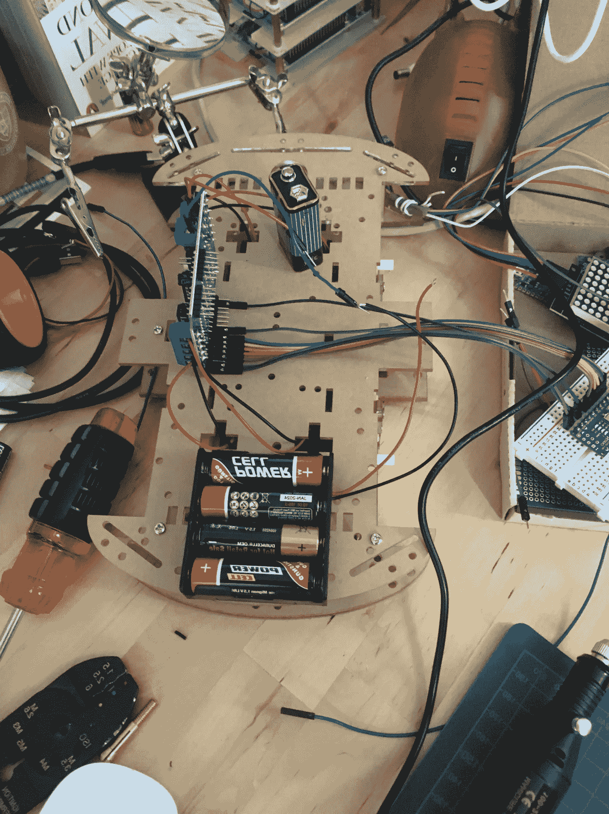

# RADU:从静止到移动的机器人

> 原文：<https://medium.com/geekculture/radu-from-stationary-to-moving-robot-f65e4de2e16a?source=collection_archive---------17----------------------->

我的机器人继续稳步发展。在上一篇文章中，我展示了机器人的一个不可移动的盒子，这意味着一个配备了 Raspberry Pi、Arduino Nano、LED 显示屏和 IR 接收器的完全传感器的机器。这个箱子现在装上了轮子，可以自由移动。

在这篇文章中，我反映了我在这个转变过程中遇到的主要困难。

*本文原载于我的博客*[*【admantium.com】*](https://admantium.com/blog/robo07_radu_moveable/)。

# 安装轮式底盘

将所有传感器放在移动的底盘上出乎意料地容易，但我非常幸运的是底盘本身:它足够大，可以将所有东西放在上面！我想把一些组件放在顶部和底部隔间之间，但较大的电机没有为此留下足够的空间。这就引出了下一点。

# 电机控制

为了控制 4 个不同的电机，我决定使用 L293D 电机屏蔽。这个 IC 允许我只用 8 根线来控制 4 个直流电机。因此，RADU 原型只需要一个 Arduino Nano 来连接所有组件。这极大地简化了设置，因为我不需要设置 MCU 与 UART 或 I2C 的连接。

然而，让 L293D 工作完全是另一回事。连接所有需要的电线，给 L293D 提供额外的电源，上传可信的 Arduino 库，我无法让所有 4 个电机正常工作。大多数时候，只是两个电机移动，有时前进和后退方向看似随机变化。

在花了 6 个多小时，三次和四次检查线路，使用万用表，尝试不同的库后，无数教程中的一个通知抓住了我的意图:使用 12 V 它说。嗯…我的 9V 电池不够用？因此，我检查了类似的机器人版本，看到他们使用的电池类型为 18650，具有令人印象深刻的 3000 毫安和 3.7V。我订购了这些电池，将它们连接到底盘，然后…它工作了！动力强劲，4 轮加速，前进后退。图书馆、线路、硬件都运行得完美无缺——我只是没有提供足够的电力。这的确是一门重要的学问。

# 库不兼容

汽车移动后，我再次连接了 Radu 盒中的所有传感器，上传了草图，然后试图将 IR 命令解释为移动命令。这一直有效，直到我添加了距离传感器。突然，解释 IR 命令的程序代码显示出奇怪的输出，它不能再处理了。当我拔掉红外模块，它再次工作。在研究这个问题时，我发现 IR 库和距离传感器库引用的是同一个定时器。定时器是一个 Arduino 框架抽象，用于控制特定硬件进程的时钟速度，并与 GPIOs 接口。在互联网上搜索解决方案时，您会发现各种关于修改各自库的头文件库和/或设置头文件保护以防止加载某些代码的方法。我可以理解，但是当我遇到问题时，我的 C 经验太少，无法有效地理解和解决问题。最后，我决定完全忽略距离传感器，但仍然将组件添加到原型中，因为我喜欢它的设计。

# 移动电源

除了为电机供电，我还需要提供 Arduino 和 Raspberry Pi。一个非常常见的解决方案是带一个 USB 电源板。它具有高容量，提供适量的电压，并有几个 USB 输出用于连接多个电路板。我拿了一个非常坚固的模型，有一个很大的表面，我用胶带把试验板和其他传感器粘在上面。不是一个工程杰作，但它的作品。

# 连接 MCU 和远程程序

最后一部分是将微控制器相互连接起来。首先，我通过 USB 线将 Arduino 与 Raspberry Pi 连接起来。Arduino 因此由 PI 供电，它们共享一根 USB 电缆来交换数据。通过使用 USB 串行接口和我在以前的文章中解释过的命令行接口，这两个设备可以交换文本消息。

除了使用 IR，我还可以将移动命令从 Raspberry Pi 发送到 Arduino。因此，我在 Raspberry 上打开了一个`minicom`连接，然后可以向 Arduino 输入任何命令。然后通过终端进行远程控制。我只需通过 SSH 连接到 raspberry Pi，然后打开`minicom` shell，就可以执行任何命令。

# 结论

将 RADU 盒子搬到机箱上给了我宝贵的见解。首先，为所有 MCU、传感器和执行器正确供电。由于提供的能量不够，你的程序会出现奇怪的行为，并且会浪费很多时间去追逐幽灵。其次，如果您使用多个库，可能会出现不兼容。在撰写本文时，由于我的编程经验有限，我对此还没有补救措施，但我只是建议在复杂的项目中注意这个问题。尽管存在问题，组装移动的 RADU 还是很有趣的。看到机器人一件一件地组装起来，然后给它通电，让 led 闪烁。第一次通过 Wifi 远程登录并发出命令。然后有一个神奇的时刻，当我把 RADU 放在地上，按下红外上的前进按钮，它就动了。

本文完成了我的机器人项目的第二阶段——以下是目前的状态:

*   ✅精粹:软件和硬件
*   ✅移动机器人
*   模拟
*   视觉传感器
*   自我导航
*   提货和交付