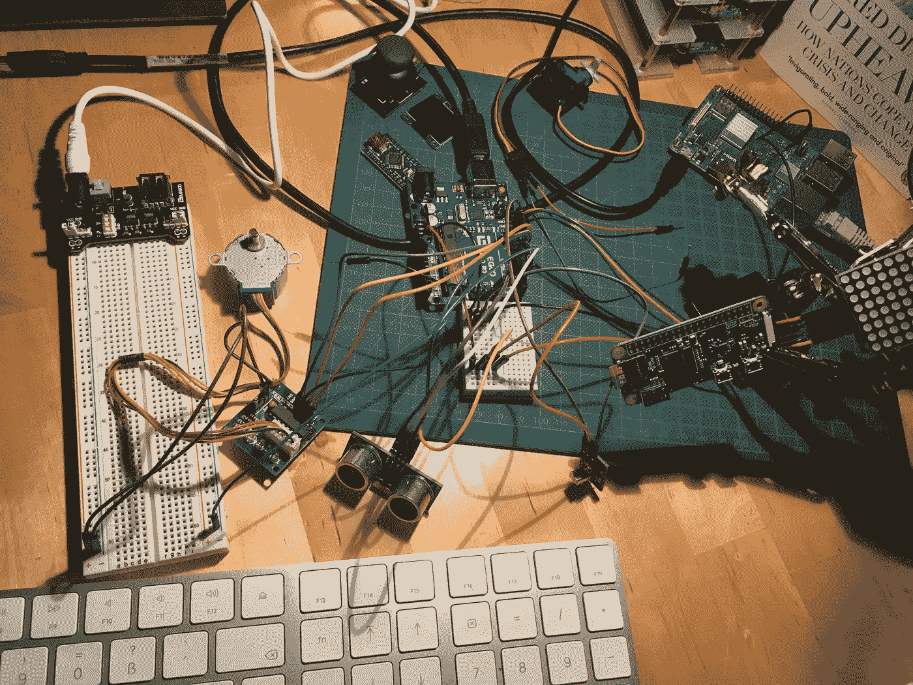
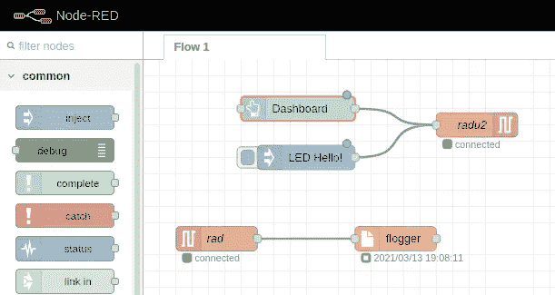
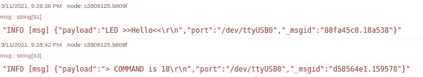

# RADU:如何用 Arduino 和 Raspberry Pi 构建一个机器人

> 原文：<https://medium.com/geekculture/radu-how-to-build-a-robot-with-arduino-and-raspberry-pi-5180291babac?source=collection_archive---------13----------------------->



RADU 是我的机器人项目的代号。在本系列的上一篇文章中，我介绍了材料清单，以及我想用来组装机器人的物品的类型和数量。从这个开始，我分别尝试了几种传感器，然后逐渐将它们结合起来。

本文是对这个早期设计阶段的反思。我介绍了主要组件，并解释了它们在 RADU 是如何使用的，以及在使用过程中我遇到了哪些特殊的挑战。

*本文原载于我的博客*[*【admantium.com】*](https://admantium.com/blog/robo06_radu_box/)。

# Arduino Nano

中央微控制器是值得信赖的 Arduino Nano。它位于试验板上，从这里它连接到周围所有的传感器。它通过 USB 连接到 Raspberry Pi 3 供电。

微控制器在启动时提供一个简单的命令行界面:

```
Boot Menu
START
Using library version 3.0.3/RAD10_chassis_prototype.cpp from Mar 13 2021+++ RADU MKI v0.4 Booting +++
Please select a command:
- LED {msg}   Print msg to LED Matrix
- DRIVE {dir} Drive in direction
- EXIT        Restart the program
```

当通过串行输入连接时，这些命令执行原型的各种功能。所有被识别的命令也将通过串行输出一个小的日志消息。这个日志消息将被 Raspberry Pi 记录——见下一节。

# 树莓 Pi 3

机载 SMC 为第一架 RADU 原型机提供了两种功能。

第一个功能是拥有一个远程连接:基于 WIFI 的 SSH 串行连接。启动后，树莓 Pi 会连接到我的本地 WIFI。使用 SSH，我可以连接到 Pi，然后打开一个串行控制台连接到 Arduino。这允许我远程执行串行命令。

```
$> ssh devcon@192.168.2.212
Linux raspi-3-2 5.4.83-v7+ #1379 SMP Mon Dec 14 13:08:57 GMT 2020 armv7lLast login: Sat Mar 13 19:13:44 2021 from 192.168.2.200devcon@raspi-3-2:/home/devcon $ picocom -b 9600 --omap crcrlf /dev/ttyUSB0
picocom v3.1port is        : /dev/ttyUSB0
flowcontrol    : none
baudrate is    : 9600
parity is      : none
....
Terminal ready
...
START src/RAD10_chassis_prototypbrary version 3.0.3
+++ RADU MKI v0.4 Booting +++
Please select a command:
- LED {msg}   Print msg to LED Matrix
```

第二个功能是监听和记录串行接口的所有消息。为此，我使用 IOT 软件 NodeRed，它提供了一个图形编辑器来定义数据流，例如“读取串行数据，转换为 JSON，写入日志文件”。下面是这样一个流的例子:



部署完成后，我将所有 RADU 状态消息收集到一个本地日志文件中，以便以后进行数据分析。



# LED 矩阵

我的原型应该给它所做的视觉反馈。为此，我使用了一个矩阵 LED，这是一个 LEDS 的水槽，可以点亮单个的点。正确使用时，可以在上面打印任何 ASCI 字符。

让这个硬件工作给了我一些愉快的回忆。首先，我记得我研究了代码库，看了几个例子，看看如何打印字符。可以通过提供各个发光二极管的位屏蔽来控制矩阵:哪个应该打开，哪个应该关闭？有了这个开/关开关，标志和字母可以印在矩阵上。

但是如何将字符转换成位掩码呢？难题的第一部分是将字符转换成它的 ASCI 代码值。第二部分是拥有一个数组，其中存储了所有字符的位掩码，数组索引对应于字符的 ASCI 值。第三部分是使用`stringcpy`函数将位掩码从这个数组复制到 LED 矩阵。弄清楚这一点，并实现代码，是一个非常有见地的活动。

以下是整体方案的相关部分。首先，这是表示字符`A`的位掩码数组中的一个例子。该值由两个整数组成，代表应该在矩阵上画点的位置，后跟 5 个位掩码，用于 5x8 行中的每一行。在这些面具中，`0`表示关闭，而`1`表示 LED 开启。如果你真的把头转过来，你可以想象屏幕上会显示的图案。

```
const unsigned char char_arr[] PROGMEM = {
  //...
  4, 8, B01111110, B00010001, B00010001, B01111110, B00000000 // A
  //... 
```

下面的函数包括实际的打印代码。首先，它将给定的字符转换成它的 asci 值。然后，它创建一个缓冲区来保存位掩码数据，然后通过使用指针语义进行复制:从`char_arr`索引 asci 值乘以 7 开始，它复制所有接下来的 7 个值，这将是上面所示的行。最后，这被写入矩阵，在短暂的延迟之后，矩阵被清除。

```
void printCharOnMatrix(char car) {
  int ascii = int(car); byte buffer[7];
  memcpy_P(buffer, char_arr + (7 * ascii), 7); matrix.writeSprite(2,0,buffer);
  delay(700);
  matrix.clear();
}
```

当我第一次看到一个完整的单词一个字符一个字符地闪过时，真是一件了不起的事情。

# 红外控制

除了串行命令，我还想立即控制机器人。这是通过红外传感器和电视遥控器实现的。在控制器上，我有一个方向轮，可以转换成上下和左右命令——当这个被使用时，RADU 应该相应地移动。此外，我还捕获数字键盘上的所有按键。IR 代码很容易编写——请阅读我的[博客中关于 IR 命令](https://admantium.com/blog/micro11_infra_red_commands.md)的详细内容。在这个版本的 RADU 原型中，我只是在 LED 显示屏上显示按下的按钮。

# 状态 LED

添加到 RADU 的最后一件设备是一个小型的、自行设计的带有 RGB LED 的 perf-board。不同的颜色代表不同的身份。在引导和处理命令期间，LED 变为蓝色。如果 RADU 准备好接收命令，LED 为绿色。如果出现某种形式的错误，LED 就会变成红色。

实现非常简单:每种颜色都可以用一种方法设置，这将相应地配置输出引脚。例如，要将 LED 设置为绿色，使用以下代码:

```
void StatusLED::set_green() {
  digitalWrite(A3, LOW);
  digitalWrite(A4, HIGH);
  digitalWrite(A5, LOW);
}StatusLED led{};
```

# RADU 盒子

对所有传感器进行单独测试后，下一步是将它们放在一起。我简单的称它为盒子。它实际上是不同传感器的集合体，平铺在互连的试验板上，连接到 Arduino，Arduino 连接到 Raspberry Pi。周围到处都是松散的传感器、电线和带 RGB LED 的自焊接 perf-board。


这是否真的是一个原型，或者不仅仅是一堆乱七八糟的东西，还有待商榷。然而，这个原型是我的第一个构建。所有的组件对最终的机器人都很重要，所以习惯使用它们，并把它们包含在一个 Arduino 程序中，是重要的一步。

# 结论

这篇文章解释了我是如何逐步使用单板计算机、微控制器单元和传感器来构建第一个原型的独特集合的。让我们重复基本步骤。Raspberry Pi 是机器人的大脑，它为机器人提供无线接入，并记录从连接的 Arduino 发送的消息。Arduino 是控制器:它控制红外传感器、LED 矩阵，还将控制电机。合并后的传感器看起来真的是一团糟。在下一篇文章中，我将把它们安装到底盘上，连接马达，并建造第一个可移动的 RADU 原型。