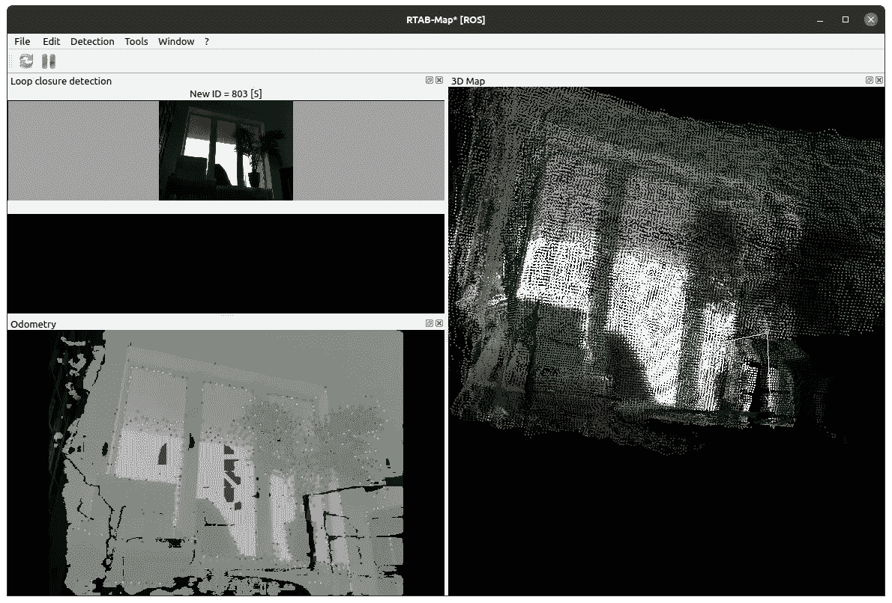
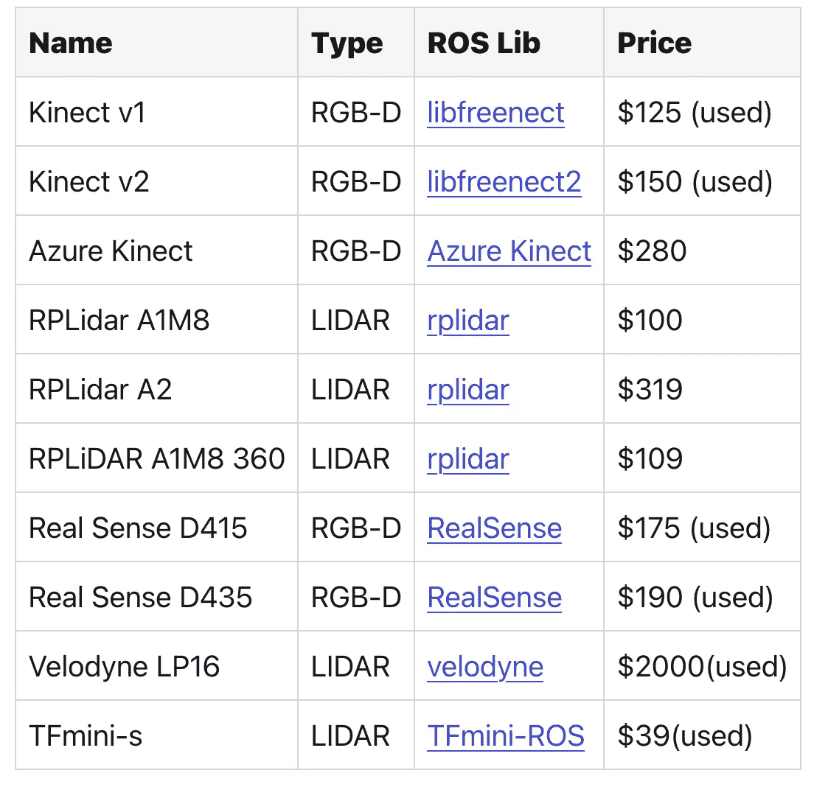

# RADU:视觉传感器概述

> 原文：<https://medium.com/geekculture/radu-visual-sensor-overview-618d556d69ed?source=collection_archive---------17----------------------->

机器人可以通过处理移动命令来移动，盲目地执行这些命令，直到碰到障碍物。与此相反，导航是自主选择如何移动以达到目标的能力。为此，机器人需要三种不同的能力:第一，根据周围环境定位自己。第二，构建和解析地图，它是环境的抽象表示。第三，设计和执行从当前位置到达指定目标的路径计划的能力。

机器人导航是一个广泛的领域，需要考虑不同的方面:机器人的主要运动类型和环境(地面、海洋、空中)，其定位、可视化和距离传感器，以及访问传感器数据以控制导航目标的具体算法。

这篇文章帮助你寻找有效的 ROS 导航。本质上，您将了解传感器类型和技术，然后通过具体的库和算法将其与 ROS 世界联系起来。由此，我将解释我的方法，如何找到一个传感器和图书馆的组合，机器人可以实现同时定位和地图。

*本文原载于我的博客*[*【admantium.com】*](https://admantium.com/blog/robo08_visual_sensors/)

# 传感器类型

机器人的传感器是获取环境信息的主要手段，因此也是定位和导航所必需的。不同的传感器可以分为 4 组:位置、视觉、2d 距离、3d 距离。

# 位置传感器

位置传感器确定机器人绝对位置。一个非常常见的是 [GPS](https://en.wikipedia.org/wiki/Global_Positioning_System) 是一个基于卫星的定位系统，它将当前位置确定为经度和纬度值的坐标集。当导航发生在建筑物内部时，通常会添加额外的本地数据源，例如贴在天花板或地面上的 RFID 标签。基于绝对参考点， [IMU](https://en.wikipedia.org/wiki/Inertial_measurement_unit) 可用于持续更新当前位置。这些系统结合了加速度计和陀螺仪。它们报告设备的当前力、角速度，有时还报告方向。IMUS 大多用于飞机和无人驾驶飞行器。最近，集成 IMU 的 GPS 被生产出来，以在 GPS 不可用时提供定位能力。

# 视觉传感器

视觉传感器通过测量可见光或不可见光并形成图形表示来处理周围环境。最常见的技术是[单目相机](https://en.wikipedia.org/wiki/Camera)，这是我们日常使用智能手机的经典摄影相机。通过组合两个或更多的镜头，[立体相机](https://en.wikipedia.org/wiki/Stereo_camera)就诞生了。他们记录的图像具有球面扭曲，当人类观察者从一个非常特定的角度观看时，会看到三维图像。关于视点，[全向摄像机](https://en.wikipedia.org/wiki/Omnidirectional_(360-degree)_camera)拥有 360 度的视角范围，可以在一张 2D 图像中捕捉到所有内容。这些相机通常用于汽车，以提供卓越的图像记录和传感。当离开人类可见光时，[红外相机](https://en.wikipedia.org/wiki/Thermographic_camera)产生红外光来测量物体的表面温度，然后捕捉为显示热量分布的图像。

# 距离传感器

距离传感器类别包括在车辆和机器人中使用的特定设备，以获得其环境的恒定表示。基本类型有[超声波](https://en.wikipedia.org/wiki/Ultrasonic_transducer)和[声纳](https://en.wikipedia.org/wiki/Sonar)。两个传感器都发射声音，接收声音反射，并通过插入发送和接收信号之间的时间来测量到物体的距离。它们的媒介不同:超声波在空气中传播，而声纳只在水下使用。[激光扫描仪](https://en.wikipedia.org/wiki/Laser_rangefinder)，也称为激光距离传感器，使用激光信号来确定到物体的距离。有三种不同的技术:*飞行时间*测量发送的激光与其在物体上的反射之间的差异，*多频相移*一次发送多束激光，确定它们的相移，并根据所有这些测量结果计算距离，以及*用于跟踪移动物体的干涉测量*。

# 3D 传感器

最终的传感器类型与制作 3D 点云来表示环境有关。这些传感器用于不同的领域，从自动驾驶汽车到卫星图像。[激光雷达](https://en.wikipedia.org/wiki/Lidar)基于持续扫描环境的激光，使用与激光扫描仪类似的技术来测量环境中所有物体的距离。 [RGB-D](https://en.wikipedia.org/wiki/Range_imaging) ，也被称为深度相机，使用视觉传感器和光脉冲来产生 3D 点云。最常见的技术是立体摄像机，因为它们不需要为观察到的环境增加额外的照明。其他技术例如是激光扫描仪也使用的*结构光*，或*飞行时间*和*干涉测量*。

# 3D 传感器硬件

在当前的机器人项目中，导航是由 3D 传感器实现的。当进行选择并且您知道您想要使用 ROS 时，请检查 3D 传感器 [1](https://dev.to/admantium/radu-visual-sensor-overview-955-temp-slug-9393504?preview=e87221943e23ed51139f91ace2e4fdf9ac024f3b67f03486c0538c9cbfb395504a1c0645a4b775dab6c02f4841dc01fa0890e7485edfd06aeab68c5b#fn1) 的[列表。下表显示了当前可用的支持 ROS 的 3D 传感器。](https://rosindustrial.org/3d-camera-survey)

*注:对不起亲爱的媒体读者，在文章中插入表格是一件很麻烦的事情，请到* [*原文*](https://admantium.com/blog/robo08_visual_sensors/) *中查看带有可点击链接的表格*。

# 结论

本文介绍了定位和测绘传感器的前景。我们了解了不同组的传感器——位置、视觉、2D 和 3D 距离——以及详细的传感器技术。对于机器人导航，3D 传感器是最先进的。因此，我展示了目前可用的支持 ROS 的 3D 传感器。

# 脚注

1.  对于所有其他传感器，检查[支持 ROS 的传感器](http://wiki.ros.org/Sensors)。 [↩](https://dev.to/admantium/radu-visual-sensor-overview-955-temp-slug-9393504?preview=e87221943e23ed51139f91ace2e4fdf9ac024f3b67f03486c0538c9cbfb395504a1c0645a4b775dab6c02f4841dc01fa0890e7485edfd06aeab68c5b#fnref1)