# MongoDB vs CoachroachDB 中的 Raft 共识算法和领导者选举

> 原文：<https://medium.com/geekculture/raft-consensus-algorithm-and-leader-election-in-mongodb-vs-coachroachdb-19b767c87f95?source=collection_archive---------6----------------------->

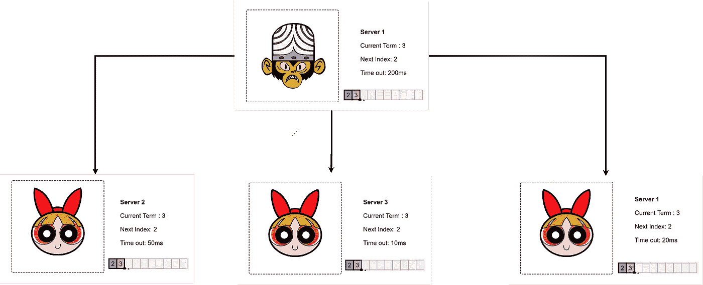

不管我们喜欢与否，我们都生活在一个分布式的世界里。分布式系统无处不在，从 Kafka 和 Cassandra 到您的 Mongo DB 集群。因此，作为开发人员，您不必担心您的集群由于复制问题或时钟不对齐问题而失败。相反，您可以将所有的状态机(复制的状态机)视为一个实体。

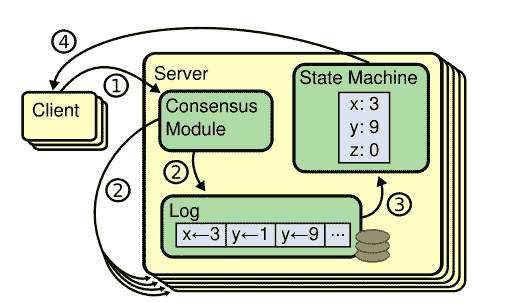

Consensus Module architecture

对于容错、强一致性的分布式系统，分布式一致性是一个基本的原语。复制日志通常用于创建复制状态机。每个服务器上都有一个日志，其中包含由状态机按顺序执行的一系列命令。因此，每个状态机执行相同的命令集。一致性算法的工作是维护复制日志的一致性。服务器的共识模块从客户端获取命令并记录它们。为了确保每个日志最终以相同的顺序包含相同的请求，即使一些服务器失败，它也会与其他服务器上的共识模块连接。

在 MongoDB 的上下文中，这可以看作是您提供命令和共识算法来处理整个副本集的复制。

对于我们这些试图理解 Paxos 的人来说，它让我们抓耳挠腮，疯狂地寻找一种既有效又可以理解的共识算法。或者试图理解 Mongo DB 内部是如何工作的，那么您来对地方了，可以开始一段旅程了。我们开始吧。

# 让我们造一个木筏吧

在创建算法之前，让我们设置一些限制来简化我们的设计。
1。系统是**非拜占庭的:**又名，我们可以信任我们集群中的所有机器。
2。*broadcast time<<election time out<<MTBF:*在能够开始迎合请求之前，该算法严重依赖于选出的领导者。因此，与其他计算机通信所需的时间应该比选举超时短(将在后面讨论)。因为故障之间的平均持续时间从几个小时到几个月不等，所以在现实场景中我们可能不必太担心。

## 基础

与 Paxos 不同，Raft 通过首先选举一个杰出的领导者，然后将管理复制日志的所有责任委派给领导者来建立共识。leader 从客户端收集日志条目，将它们复制到其他服务器上，并在日志条目可以安全地应用到它们的状态机时通知服务器。任何机器在任何给定时间都可以处于三种状态中的任意一种:
**1。领导者:**领导者是迎合所有要求的坏男孩。
**2。候选人:**领袖死后，任何追随者都可以参加选举，这就是所谓的候选人。
**3。跟随者:**跟随者只是接受领导者的命令，如果外界有人试图与它交流，跟随者会将请求重定向到它所知道的最后一个领导者。

## 领导人选举

领导人是通过一个被称为选举的程序选出的(好像这还不够明显)。每台服务器都有一个随机超时，每当跟随者收到来自领导者的心跳时就会重置。如果追随者在很长一段时间内没有收到领导者的消息，追随者将成为候选人，并开始通过“RequestVote RPC”请求投票成为领导者。

Raft 使用一个名为“term”的计数器来记录时间的流逝。当选举出一个新的领导者时，term 计数会增加，当前的 term 会随每个脉冲和附加条目 RPC 一起发送。任何追随者、候选人或领导者，如果他们的条件比心跳中获得的条件少，就承认他们是在一个过时的状态下运行，并立即转变为追随者状态。

在当前任期内，所有追随者只能投票给一个领导人。一旦追随者投票支持特定任期，他们只能投票支持下一届或以上任期的候选人。下面给出的是候选人要求投票时发送的参数，以及在什么条件下投票会授予候选人。

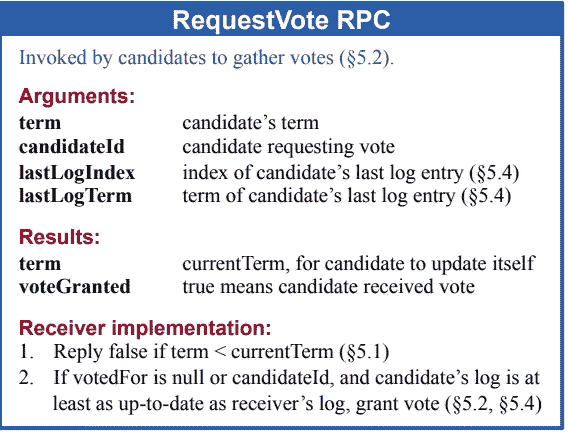

让我们来看看实际的选举。

**第一步:集群启动。
所有服务器的计时器开始滴答作响。你可以注意到所有服务器的初始项都被初始化为 1。因此术语 1 没有领导者。**

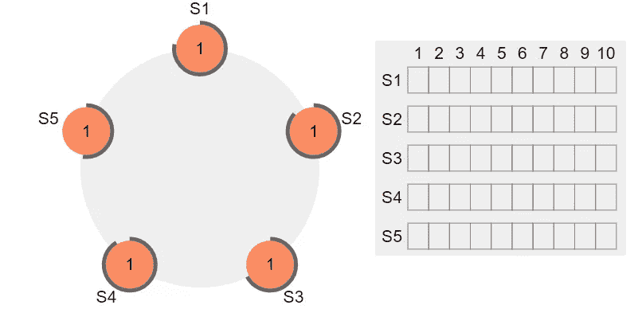

**第二步:第一次选举**

当追随者任期结束时，它会将自己提升为下一届选举的候选人。本例中的术语 2。然后，候选人开始拉票，并记录收到的票数。当追随者投票时，他们延长了他们的任期，并承认有了一个新的领导人。

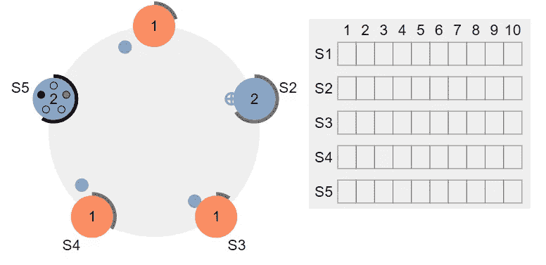

**第三步:心跳和保持控制**

一旦领袖当选，领袖会定期发出心跳以保持其影响力。心跳防止跟随器超时，并且每当跟随器接收到心跳时，时钟被重置。

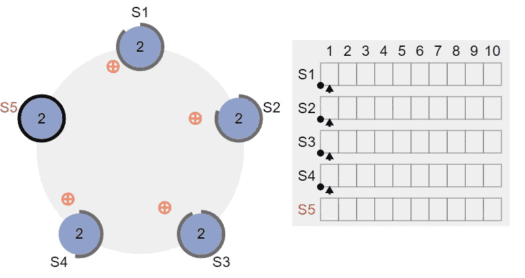

## 日志插入

既然我们有了领袖。群集可以恢复正常操作并接受来自客户端的命令。当 leader 收到来自客户机的命令时，它首先将条目添加到日志中，然后向所有其他服务器发送“AppendEntry RPC”。下面列出了 AppendEntry RPC 的参数。让我们再深入一点。

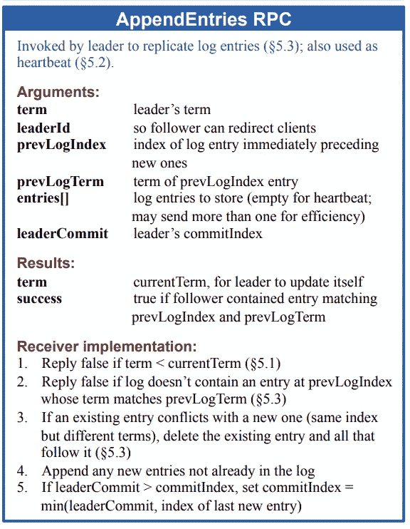

**步骤 1:接收来自客户端的请求**

正如我们所看到的，S5 是当前术语的领导者(2)。当 leader 收到请求时，它首先将请求添加到它的日志条目中，然后用上述参数将 AppendEntry RPC 发送到其他服务器。领导者通知追随者他所在的术语、他希望追随者添加条目的索引以及他先前日志条目的格式。值得注意的是，heartbeat 是一个 AppendEntry RPC，没有要追加的数据。

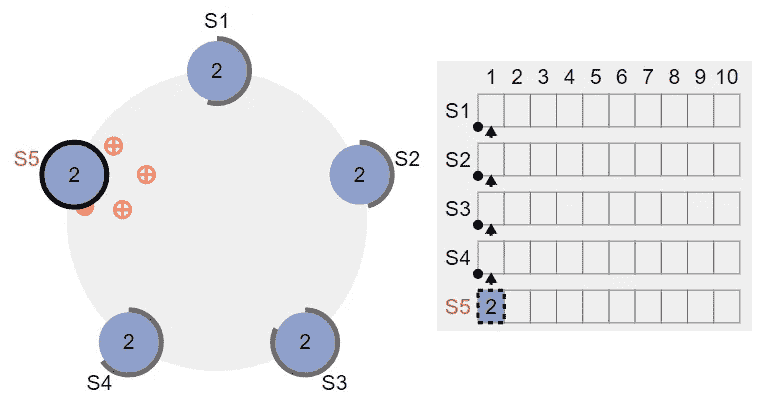

**第二步:追随者确认 RPC**

当追随者收到 AppendEntry RPC 时，他们首先检查领导者是否合法。如果跟随者的当前任期大于领导者的任期，跟随者拒绝 AppendEntry RPC，通知领导者他已经过期，领导者立即进入跟随者状态。但是，如果单词与跟随者匹配，请验证其日志条目；如果跟随者先前的日志条目与领导者的不匹配，跟随者拒绝 RPC 并等待纠正(稍后将详细介绍)。如果一切顺利，跟随者将条目添加到日志中，并等待领导者发出提交命令。看到虚线了吗？这意味着条目仍未提交。

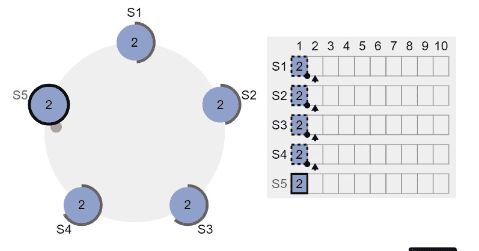

**第三步:提交**

当大多数追随者认可领导者时，领导者知道提交日志是安全的。然后，领导要求每个人提交日志。对于响应缓慢的追随者，或者领导者不断重试直到收到确认。重要的是要记住，日志是复制给追随者的，但只有当领导者要求每个人都提交它时，才能被认为是持久的，除非它听到大多数追随者的声音，否则它不会这样做。换句话说，一个未提交的日志很可能会被其他领导者删除。另一方面，Raft 确保任何已经提交的日志在任何情况下都不会被删除。

## 测井校正

很多时候，追随者或领导者可能已经离线，无法跟上最新的更新。让我们看看 Raft 是如何处理失败的领导者的，以及失败的领导者是如何与其余的服务器保持同步的。

**第一步:领头人的倒下**

假设 S3 是当前任期的领导人，它失败了。其他服务器上的时钟将继续滴答作响，直到任何一台服务器上的选举超时。服务器将把自己定位为一个竞争者，并开始拉票成为领导者。

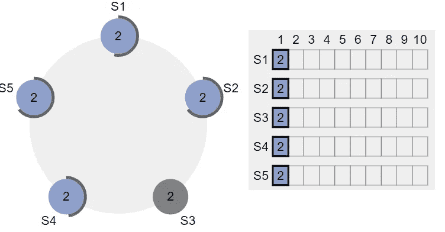

第二步:开始一个新学期

当服务器 S3 离线时，三个附加条款已经过去，服务器 S3 仍然相信他是领导者，尽管他倒下了。另一方面，新的领导者继续照常工作，同时监督集群。现在该提到 S3 了。

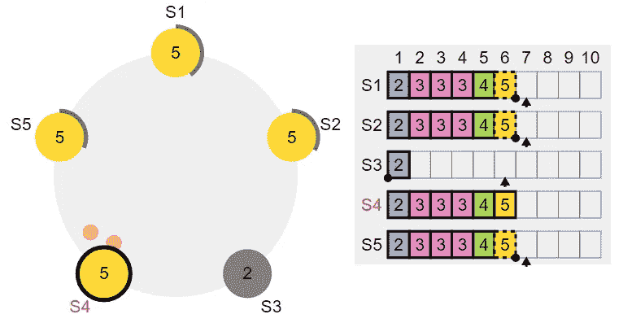

第三步:S3 的崛起

服务器 S3 醒来，相信他是领导者。如果他向任何追随者发出命令，追随者会提醒 S3 出现了新的领导人，它会立即恢复到追随者状态，等待 S4 的命令。这就完成了引线校正。现在让我们把 S3 的日志更新一下。

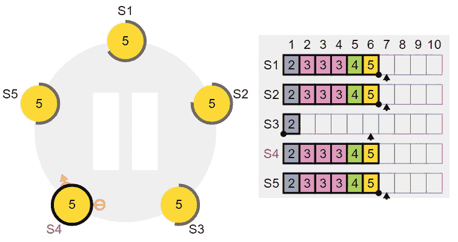

**步骤 4:集群中的新请求**

假设已经向领导者提出了新的请求。领导者向所有追随者广播一个 AppendEntry RPC，以及先前的日志术语和日志条目。除了 S3，所有的追随者都同意 RPC。Raft 保证原木不会有孔洞。由于 S3 的日志没有更新，它无法添加任何新的内容。当 S3 等待日志修正时，其他跟随者接受日志并提交到他们的日志中。

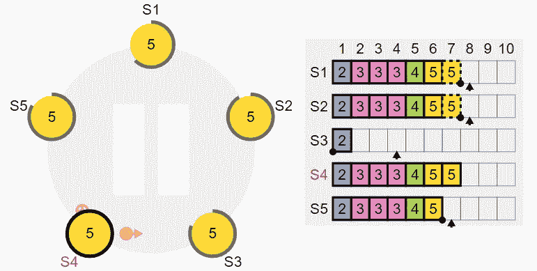

**第五步:开始 S3 测井校正**

领导者通过推动追随者复制他们自己的日志来处理不一致。追随者日志中的冲突条目将被领导者日志中的条目覆盖。为了使跟随者的日志与引导者的日志一致，引导者必须定位两个日志一致的最近的日志条目，删除跟随者日志中在该点之后的任何条目，并将该点之后的所有引导者条目传输给跟随者。所有这些活动都是响应 AppendEntries RPCs 的一致性检查而发生的。领导者为每个跟随者保存一个 nextIndex，它是领导者发送给跟随者的下一个日志条目的索引。当领导者第一次掌权时，它将所有 nextIndex 值设置为其日志中最后一个值之后的索引。如果跟随者的日志与领导者的日志不同，则在后续的 AppendEntries RPC 中，AppendEntries 一致性检查将会失败。领导者递减 nextIndex，并在拒绝后重试 AppendEntries RPC。NextIndex 将最终达到领导者和追随者日志匹配的点。当这种情况发生时，AppendEntries 成功，从追随者的日志中删除任何冲突的条目，并从领导者的日志(如果有)中追加条目。当 AppendEntries 成功时，跟随者的日志与领导者的日志相匹配，并且在整个任期内保持这种状态。

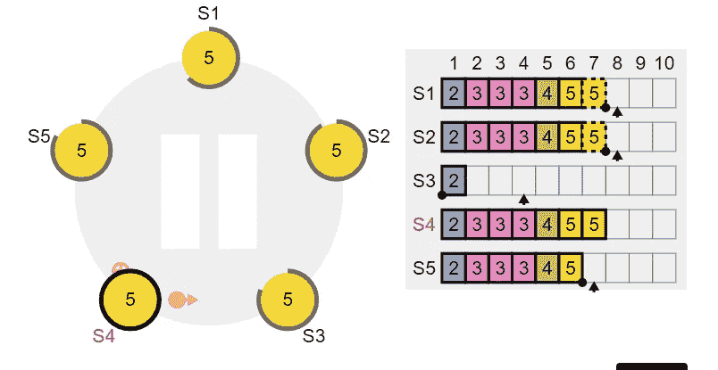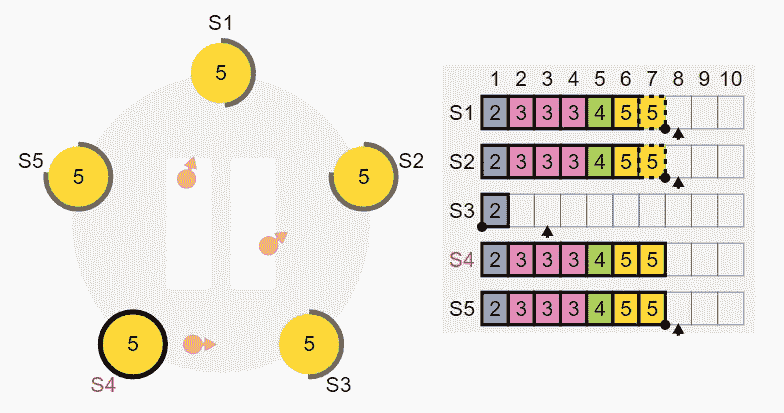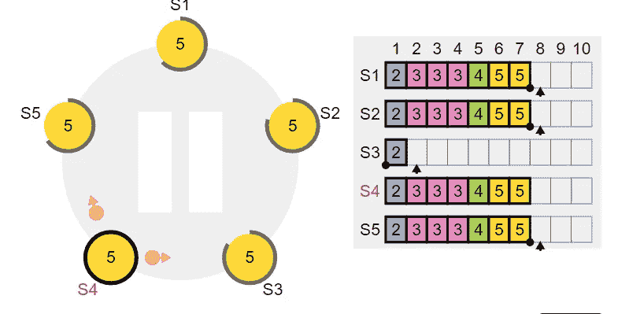

领导者现在找到了领导者的日志和 S3 的日志匹配的点。现在领导者将开始用最新的日志填充 S3 的日志。

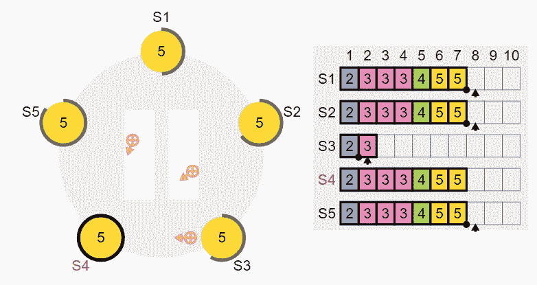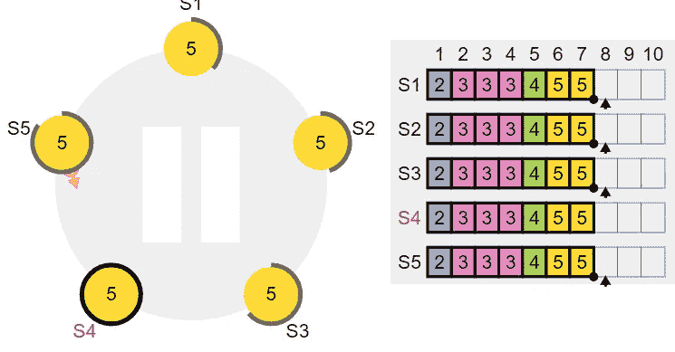

复制一个接一个地发生，直到 S3 赶上 S4。

# 共时数据库中的 Raft

如果你听说过蟑螂 DB。您可能听说过数据存储在所谓的密钥空间中。Keyspaces 是一组线性排序的键-值对，包括它所在的位置以及行的主键。然后，集群将键空间划分为所谓的范围。范围是 64MB 数据块，这些数据块在群集中的至少三个节点上复制，以确保一致性。

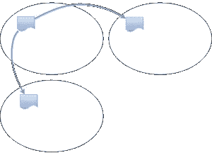

您可能希望跨地理位置复制这些范围，以促进跨区域的更快读取。蟑螂 DB 将范围划分到他们自己的共识组。因为一个节点可以存储几个范围。由于这种结构，一个节点可以是许多共识组的成员。随着越来越多的节点添加到集群中，保持领导者所需的心跳数也在增加。因此，仅从心跳来看，流量就出现了巨大的峰值。

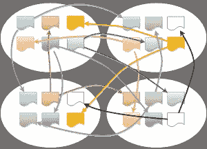

上图清楚地显示，即使在系统空闲时，系统中也有大量流量。此外，范围的数量远远大于集群中的节点数量，因此流量只会在添加新节点时成倍增加。为了解决这个问题，蟑螂数据库在 Raft 中创建了一个名为 multi raft 的新特性。

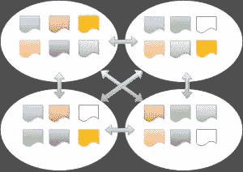

流量增加的问题通过使用 MultiRaft 解决(每个节点只有一个 Raft 实例——用蟑螂源代码语言存储——而不是每个范围)。CockroachDB 在单个响应/请求中合并/取消合并心跳。

Coachrach DB 缓存节点之间的 rpc 连接，并使用定期心跳来计算时钟偏差和链路延迟。各个 raft 共识团体根据需要通过这些已建立的链接进行通信，但它们不产生心跳。为了评估是否成为候选者，共识组中的追随者在其超时期满后检查连接的健康状况(即，在上一个心跳间隔内是否接收到心跳)。

这是运输工具的样子

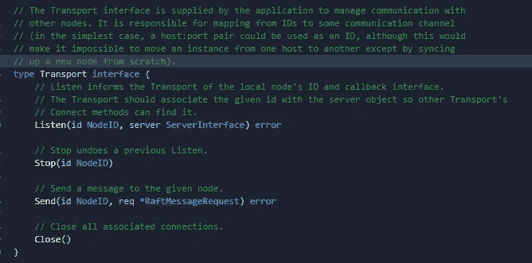

# Mongo DB 中的筏

然后就是大家最喜欢的 Mongo DB。除了几个变体，Mongo DB 和 raft 有很多共同点。让我们一个接一个地讨论一下不同之处。

1.  **先应用后复制:**指挥官在筏上收到新命令时。在承诺改变之前，领导者首先将它们传达给追随者。Mongo DB 采用了一种不同的方法，主节点返回一个确认，表示数据已经被立即写入其中一个节点。然后，更改会在节点之间传播，这就产生了 Mongo DB 中读写问题的概念。
2.  **基于拉与推的算法:**与 raft 相反，raft 中的领导者负责在节点间传播变化。链式复制是 Mongo DB 的一个特性，它允许一个节点从最近的跟随者那里获取更新，从而允许更快的复制并减少主要 aka 领导者的压力。
3.  **可配置的选举超时:** Raft 随机向机器发送选举超时，但是，如果主网络很慢，这会导致网络中的大量选举。Mongo DB 允许用户更改选举超时(经验法则:网络宕机的平均时间)。
4.  **优先级:** Mongo DB 也允许你分配服务器优先级。优先级 0 表示服务器永远不会参加选举，而如果您知道某个数据中心异常强大，您可以为其分配最高优先级，这样它就可以经常成为领导者。

# 参考资料:

1.  [pv0 到英雄:共识协议简史](https://www.youtube.com/watch?v=6JZdJ2J6mek&ab_channel=MongoDB)
2.  [筏范围](https://raft.github.io/raftscope/index.html)
3.  [为可理解性而设计:Raft 共识算法](https://www.youtube.com/watch?v=vYp4LYbnnW8&t=338s&ab_channel=DiegoOngaro)
4.  [Paxos vs Raft:我们对
    分布式共识达成共识了吗？](https://arxiv.org/pdf/2004.05074.pdf)
5.  [寻找可理解的共识算法](https://raft.github.io/raft.pdf)