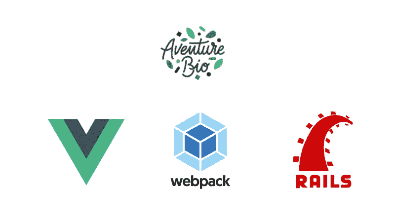
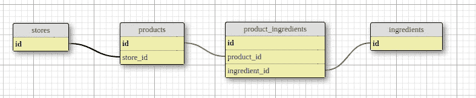
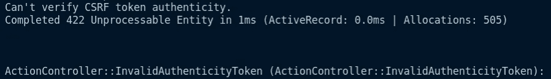
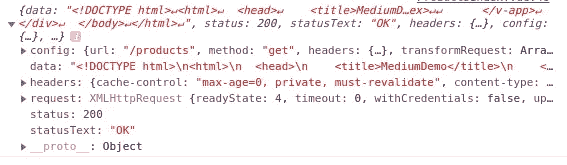
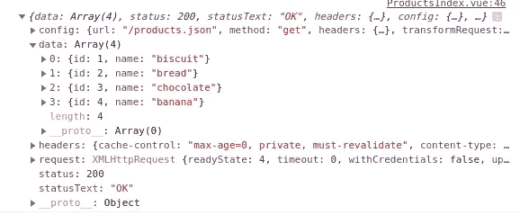

# 带有 VueJS 和 Vuetify 的 Rails 6😎

> 原文：<https://medium.com/geekculture/rails-6-with-vuejs-and-vuetify-fe7d0da10104?source=collection_archive---------11----------------------->



我在一家名为 [Aventure Bio](https://www.aventure.bio/) 的小型法国创业公司工作，我们最近启动了一个新项目。对于这个新项目，我们决定使用 Vue 作为我们前端的框架。

当我们开始这个项目时，我们已经注意到，在如何以我们需要的方式用 [Rails](https://github.com/rails/rails) 和[Vue 化](https://vuetifyjs.com/en/)实现 [Vue](https://vuejs.org/) 方面缺乏资源。因此，我们认为这将是一个好主意，与大家分享我们是如何做的！

## 创建新的 rails 项目

由于 rails 和 webpack 的魔力，创建一个嵌入 Vue 的新项目实际上非常容易。你只需要加上`--webpack=vue`。像这样:

```
> rails new medium_demo --webpack=vue
```

如果现在你打开`app/javascript`文件夹，你会在`app/javascript/packs`文件夹中看到一个`app.vue`和一个`hello_vue.js`文件。`app.vue`文件只是一个组件示例。你可以忽略它，因为我们将在 Vuetify 的帮助下从头开始创建一个。

`hello_vue.js`文件向您展示了在 Rails 应用程序中导入 vue 的不同方式。由于我们将使用 [turbolinks](https://github.com/turbolinks/turbolinks) ，您可以取消对该文件最后部分的注释:

而且正如评论所说，你只要做`> yarn add vue-turbolinks`就可以了。现在，我们还做了什么(这是可选的)我们把这段代码添加到我们的`application.js`文件中，并做了一些修改。我们删除了这个`hello_vue.js`文件，结果如下:

这里我们删除了`data`函数和组件，我们没有在变量中存储新的 vue 实例，我们将 Vue 元素(之前链接到 id `#hello`)更改为数据属性。

我们还添加了 [TurbolinksAdapter](https://github.com/jeffreyguenther/vue-turbolinks) ，这是一个 JS 包，它“*允许您轻松地将 Vue.js 组件添加到您的 turbo links&hot wire powered apps*”中。要安装它，只需添加上面例子中的代码并运行

```
> ./bin/yarn add vue-turbolinks
```

所以现在要做的最后一件事就是通过添加一个带有`data`属性的`div`来改变我们的`application.html.erb`文件。

您应该已经完成了(基本)设置！🎉感谢 Rails 团队🙌

## 模型+种子

为了能够有一些数据显示，让我们快速创建一些模型和一个简单的种子。比方说，我们的应用程序将是一个商店，销售由原料制成的产品。为了尽可能简单，我们假设一个商店没有员工，一种产品只能在一个商店中找到😀所以我们的数据库看起来像这样:



让我们快速创建我们的模型:

```
> rails g model store name
> rails g model product store:references name
> rails g model ingredient name
> rails g model product_ingredient product:references ingredient:references> rails db:migrate
```

让我们进行联想:

和一颗简单的种子

## 控制器

我们的应用程序中只有一个页面。我们可以创造新的产品的索引。因此，我们的产品控制器将只有两个动作。索引和创建。所以:

```
> rails g controller products index create
```

在您的路线中替换由

```
resources :products, only: [:index, :create]
```

让我们做一个非常简单的控制器

## 前件

由于我们已经改变了在`application.js`中启动 Vue 实例的方式，我们还需要对如何创建和导入不同的组件进行一些修改。在我们的例子中，我们创建了一个`components`文件夹来存储所有的 Vue 组件，然后创建了一个`components.js`文件来导入它们，这个文件被导入到我们的`application.js`中。我们的`javascript`文件夹结构看起来像这样。

```
├── channels
│   ├── consumer.js
│   └── index.js
├── components
│   └── ProductsIndex.vue
└── packs
    ├── application.js
    └── components.js
```

因此，让我们创建一个非常简单的`ProductsIndex.vue`组件。

```
> mkdir app/javascript/components && touch app/javascript/components/ProductsIndex.vue
```

在我们编写这个组件之前，有一个小注意。在本文中，我们将向您展示两种向 Vue 组件发送数据的方式。通过`prop`或使用 [axios](https://www.npmjs.com/package/axios) 的 API 调用。也许这些方法不会更适合这些例子，但是让我们记住这只是为了练习。

也就是说，对于这个例子，我们将通过`prop`传递数据。所以我们的简单组件看起来会像这样:

现在我们需要将它导入到我们的`components.js`文件中，并将其链接到我们的 Vue 实例。可以这样做:

现在让我们将它导入到我们的 application.js 中，只需添加

```
import './components';
```

最后但同样重要的是，让我们修改我们的`index.html.erb`。因为我们已经用我们的`application.html.erb`中的数据属性包装了 div 中的`<%= yield %>`,所以我们可以从任何视图页面调用我们的组件。因此，在我们的`index.html.erb`中，我们将删除那里的代码，只调用组件，将它作为一个道具传递给在控制器中创建的`@products`。像这样:

现在，如果你参观`/products`，你应该会看到我们令人惊叹的产品。就这么简单！

## 使虚弱

现在让我们快速看看如何实现 [Vuetify](http://vuetifyjs.com/) 来帮助我们进行前端设计。正如他们的文档所述，我们就这么做吧

```
> yarn add vuetify
> yarn add sass@~1.32 sass-loader deepmerge -D
```

完成后，将您的`application.js`改为:

这样做之后，您的 JS 控制台中仍然会出现错误。这就是我们花了一段时间才明白如何解决这个问题的地方。谢天谢地，我们找到了这个 [github](https://github.com/vuetifyjs/vuetify/discussions/4068#issuecomment-414914238) 评论，它解决了我们的问题！所以在阅读了评论之后，我们对我们的`config/webpack/environment.js`做了一些修改，现在看起来是这样的:

正如 vuetify 文档所述，无论您想在哪里添加 Vuetify 组件，它们都应该在父标签`v-app`中。因为我们想在任何地方使用它，所以我们在`application.html.erb`中添加了我们的，如下所示:

现在，为了测试我们的 Vuetify 是否正确安装，让我们创建一个简单的表[。让我们稍微改变一下我们的`ProductsIndex.vue`组件:](https://vuetifyjs.com/en/components/simple-tables)

因此，现在如果您访问我们的`/products`页面，您应该会看到一张展示我们所有产品的精美表格。

## 发布请求

现在让我们创建第二个组件，它将是一个创建新产品的表单。这里我们将做两件事。首先，我们将执行一个 POST 请求来创建产品，然后执行一个 GET 来再次检索所有产品。在现实生活中，我不会做 GET 请求。然而，只是为了练习，我们还是做吧😁。

所以，首先让我们添加 axios:

```
> yarn add axios
```

然后让我们创建新的组件

```
> touch app/javascript/components/ProductCreateForm.vue
```

对于我们使用的表单来说，它应该是这样的:

正如你在方法`createProduct()`中看到的，我们使用 axios 调用我们的控制器创建方法。当我们收到一个肯定的响应时，我们将它发送给父组件。这个想法是，当父组件收到消息时，它发出 GET 请求来检索所有产品。在实现之前，我们不要忘记在我们的`components.js`中导入这个新组件:

现在在我们的`ProductsIndex`组件中调用它，只需添加:

```
<product-create-form @response='getAllProducts'></product-create-form>
```

然后让我们创建`getAllProducts`方法来获取所有产品，让我们只`console.log`响应。所以我们新的`ProductsIndex`组件应该是这样的:

如果您现在测试您的代码，您应该会得到如下所示的错误:



这确实是因为我们不发送任何`authenticityToken`。要轻松解决这个问题，您只需在您的`application.js`中添加几行代码。最终文件应该如下所示:

现在，如果你测试它，它应该工作！至少帖子要求！现在，如果我们在 JS 控制台上检查 GET 请求的响应，我们会得到类似这样的结果，数据是 HTML:



这是因为在我们的控制器中，我们的索引方法不呈现 JSON。并且**我们不希望**它呈现一个 JSON，否则当你访问`/products`路径时，你只会看到 JSON 对象，而不是我们创建的精彩设计。为了解决这个问题，我们可以调用 jbuilder gem😃这是 RAILS 6 默认提供的。多亏了这个 gem，我们可以让我们的控制器保持原样，只创建一个名为`index.json.jbuilder`的新文件，所以:

```
> touch app/views/products/index.json.jbuilder
```

在里面加上

```
json.array! @products, :id, :name
```

最后，在您的`ProductsIndex.vue`组件中，将 axios 路径从`axios.get('/products')`更改为`axios.get('/products.json')`。

现在，如果我们尝试创建新产品，查看我们的控制台，我们会看到所有产品，包括我们刚刚创建的产品(“香蕉🍌)



几乎看起来像魔术😃

概括来说，我们有两个 Vue 组件。`ProductsIndex.vue`和`ProductCreateForm.vue`。父组件(`ProductsIndex`)接收带有属性的数据，并且在子组件`ProductCreateForm.vue`成功发出创建新产品的 POST 请求后，还接收对`/products.json`路径的 GET 请求。

是的，这就是我喜欢 Rails 的原因。它可以让你用现代的框架如 Vue 或 React 构建很酷的应用程序，而且它非常容易实现！你可以在这里找到完整的源代码。

有几件事我故意漏掉了。这篇文章已经够大了😆但至少你现在有了用 RAILS、Vue 和 Vuetify 创建自己项目的基础。不要犹豫使用这个源代码作为自己项目的样板！

## 我使用过的资源(不要剽窃别人的作品)

*   [https://go rails . com/episodes/vue js-components-in-rails-views？自动播放=1](https://gorails.com/episodes/vuejs-components-in-rails-views?autoplay=1)
*   [https://level up . git connected . com/vue-js-with-rails-6-and-performing-crud-operations-b 043 ef 3691 f 2](https://levelup.gitconnected.com/vue-js-with-rails-6-and-performing-crud-operations-b043ef3691f2)