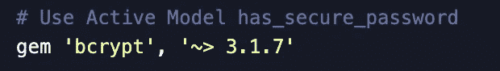
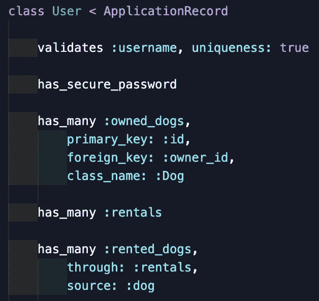
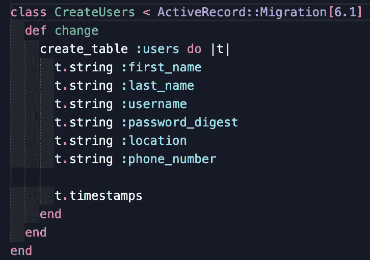
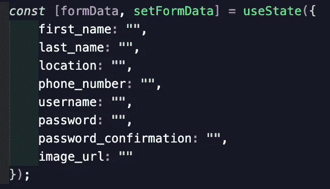
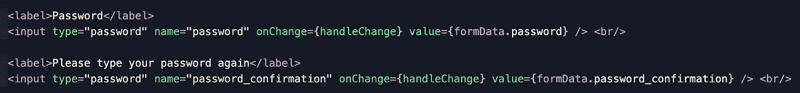
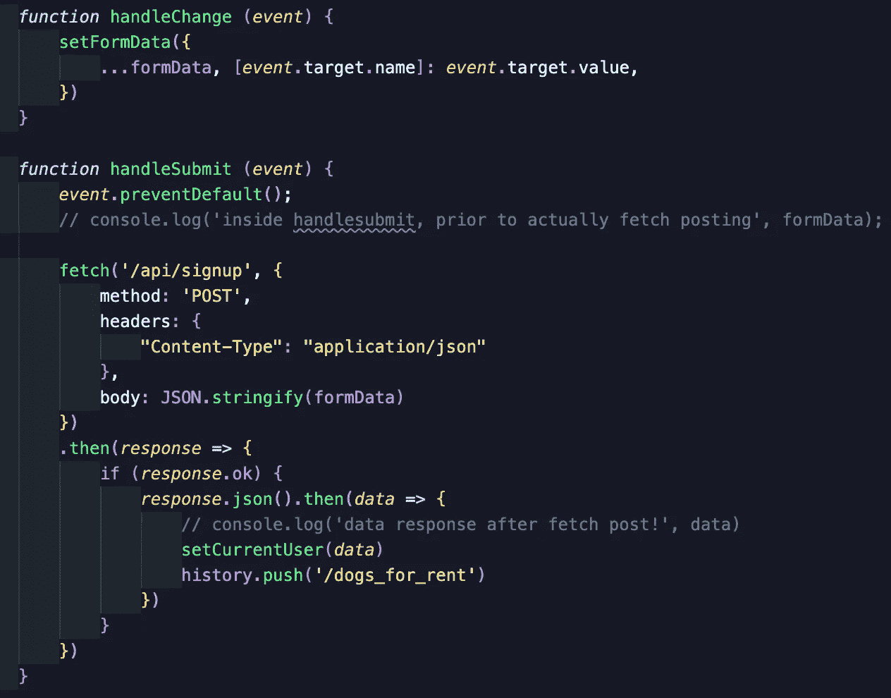

# Rails 魔术:has_secure_password

> 原文：<https://medium.com/geekculture/rails-magic-has-secure-password-a9bf0167642d?source=collection_archive---------13----------------------->

Photo by [Markus Spiske](https://unsplash.com/@markusspiske?utm_source=medium&utm_medium=referral) on [Unsplash](https://unsplash.com?utm_source=medium&utm_medium=referral)

我们都知道以纯文本形式存储密码是一种极其危险的做法(如果你敢，只要谷歌一下就能找到数量惊人的例子)。幸运的是，Rails 为我们提供了 *has_secure_password* 方法，这使得在您为项目编写的认证中散列和加盐密码变得非常容易。尽管 Rails 使这个过程比我们自己编码要容易得多，但我仍然很难理解实现的所有部分和步骤(可能是因为对于像我这样的视觉初学者来说，它可能相当抽象)。以下是我所学内容的简要概述——我希望这对其他学习者有所帮助！如果有任何帮助您理解 Rails 身份验证的其他学习点，请随意发表评论。

## gem 'bcrypt '

首先，为了在您的项目中使用 *has_secure_password* 宏，您需要将 gem*‘bcrypt’*添加到您的 gem 文件中。它不需要在任何特定的部分，所以不需要担心。记住这样做后再次运行*捆绑包安装*！

在我的项目中，看起来是这样的:

## 散列 _ 安全 _ 密码

您将把这个方法与您的其他活动记录关联合并到您的模型文件中。既然 Rails 是为了让我们的生活变得更简单，你只需添加 *has_secure_password* ，就像这样:

在包含身份验证和用户注册/登录功能的应用程序中，假设您有一个 users 表(或一些类似的语言来表示进行注册的组)似乎是安全的。我通常选择一个用户类，就像我上面做的那样。无论您决定在项目中如何描述这个组，您都需要确保将您的 *has_secure_password* 放在这个模型中，因为他们拥有密码。

## :密码摘要

为了让这个方便的活动记录方法工作，您还需要在同一个数据库表中有一个 *password_digest* 列。在我的例子中，这又是 users 表。下面是它在我的迁移文件中的样子:

好吧！现在我们可以使用与 *has_secure_password* 宏相关的 Rails 魔法了。事实上，我们现在可以访问两个新的实例方法— *password* 和 *password_confirmation* 。要理解这些，只要回想一下任何注册体验，你必须输入两次密码才能注册成为网站用户。你输入两次密码，然后相信程序会比较它们，确保它们是相同的。但是，正如我们所知，将这两个密码以纯文本的形式存储在我们的 users 表中是不负责任的，所以我们在模式中没有相应的列——我们在 *password_digest* 中只有经过摘要、散列和加盐的版本。

回想一下我们的真实体验，如果我们希望用户在注册过程中输入两次密码，我们知道需要将这两个字段分别编码到我们的注册表单中。在这个特殊的项目中，我们用 React.js 编写了前端，我决定声明一个保存表单数据的状态，如下所示:

我确保上面的键与 users 表中的列名完全相同(当然除了 password_digest)，这样我就可以用 fetch POST 方法将整个 formData 对象发送到后端。我还确保使用与表单中输入元素的名称完全相同的键，如下所示:

这使得编写一个 *handleChange* 函数来在我的表单接收输入时更新我的 formData 状态变得非常容易，而且这也使得获取 POST 变得非常简单，因为我可以将整个 formData 对象发送到后端。这看起来是这样的:

无论您决定在注册组件中处理用户输入，这里最重要的事情是:

1.  使用前端的*密码*和*密码确认*，
2.  将它们都发送到后端(即使在您的表中没有对应的列！),
3.  并且只在后端使用*密码摘要*。

由于我们通常非常小心地确保我们的前端提交具有匹配我们的后端列的键，我很难让自己记住在两端使用这些不同的密码术语，所以我希望这个简化的解释能帮助我们记住这些约定。

要了解更多信息，请查看 Rails 文档，如下所示:

[https://API . ruby on rails . org/classes/active model/secure password/class methods . html](https://api.rubyonrails.org/classes/ActiveModel/SecurePassword/ClassMethods.html)

感谢您的阅读！