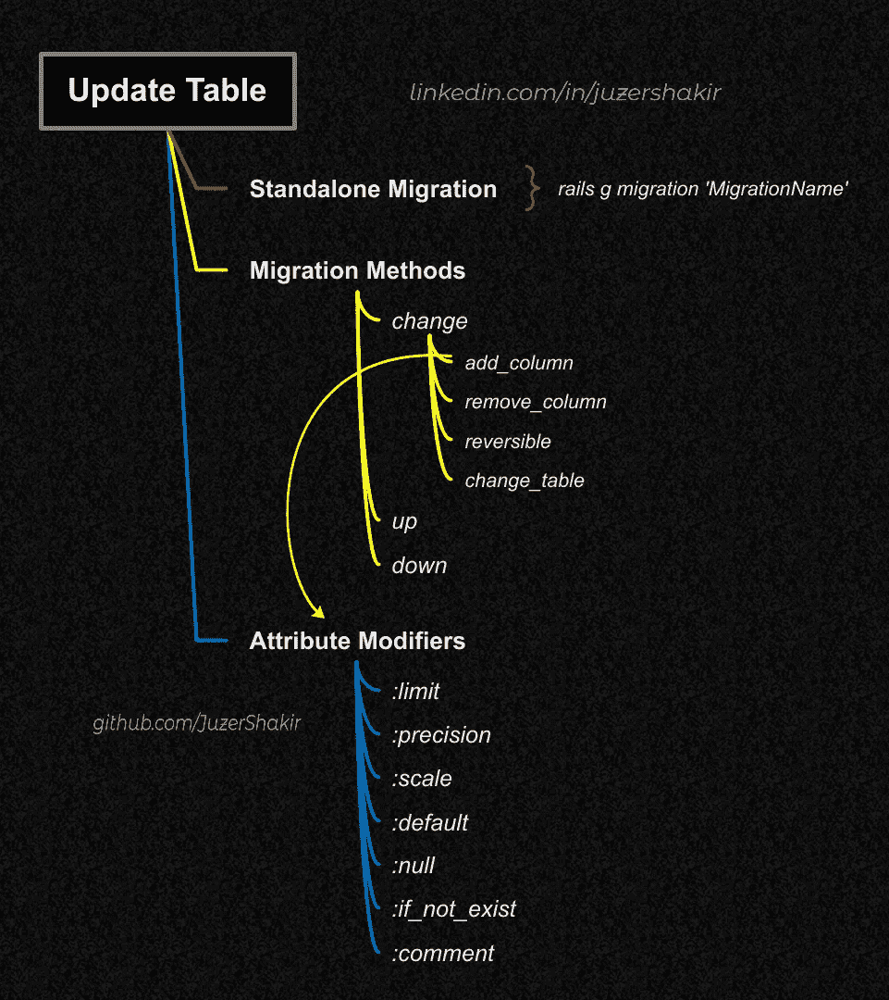
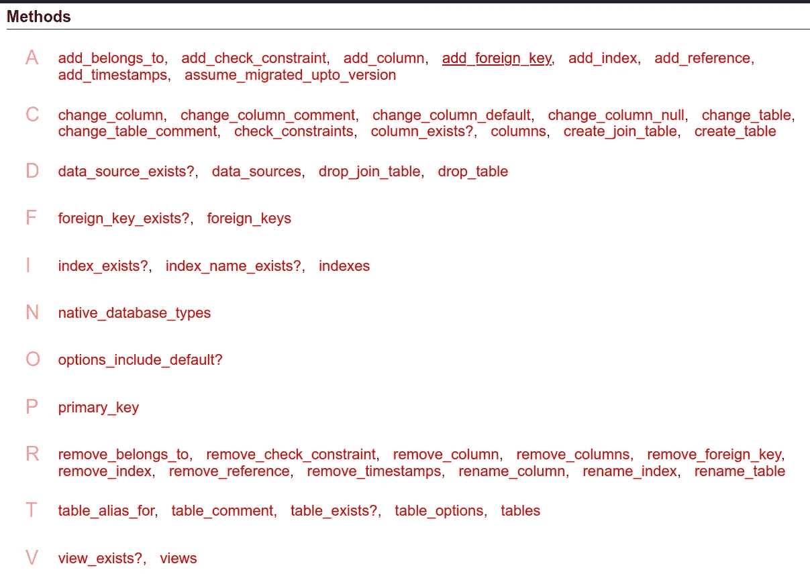
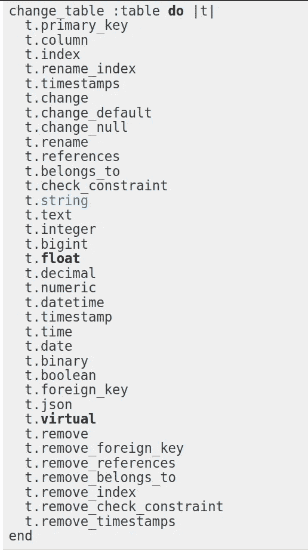

# Rails 迁移—第 3 部分

> 原文：<https://medium.com/geekculture/rails-migration-part-3-11ae1c2c1b0a?source=collection_archive---------17----------------------->

用不同的*迁移方法*更新现有的*表*。

# 先决条件:

本文是前几篇文章的延续:

*   [**Rails 迁移—第一部分**(生成*迁移文件* )](https://juzer-shakir.medium.com/rails-migration-part-1-8ce3af467ace)
*   [**Rails 迁移—第二部分**(执行*迁移文件* )](https://juzer-shakir.medium.com/rails-migration-part-2-c2ca189e9f57)

# 目录

↦ [**单机迁移**](#d8c6)

↦ [**迁移方法**](#528b)
↪ [改变](#831b)
↪ ↪ [属性修改器](#972e)
↪ [改变 _ 表格](#a86c)
↪ [向上&向下](#7620)
↪ [可逆](#a029)



Topics covered in this article

# 独立迁移

在我的[上一篇文章](https://juzer-shakir.medium.com/rails-migration-part-2-c2ca189e9f57#:~:text=Executing%20Migration%20file%3A)中，我们有两个迁移文件，在运行迁移之后，它们创建了两个带有一些属性的表`author`和`book`。现在让我们通过生成一个新的*迁移文件*来修改我们的*表*:

```
rails g migration AddColumnsToAuthors 
```

这将创建以下文件:

```
db/migrate/20210725125500_add_columns_to_authors.rb
```

这将创建一个空的*迁移文件*，也称为*独立迁移文件*:

但是如果我们把*属性名*和它的*类型*给上面的*迁移任务*，比如:

```
rails g migration AddColumnsToAuthors nationality:string
```

然后生成*迁移文件*，如下所示:

我们看到它隐式地将带有*属性* *名称* `nationality`的`add_column`方法作为`string`类型添加到`authors` *表*中。

表单`AddXxxToTable`的*迁移名称*后跟*属性名称*和*类型*，`attribute_name:attribute_type`，将调用`add_column`方法将属性添加到适当的*表*，如迁移名称`Table`中所述。

**记住*迁移名称*应该在*驼峰*中，列名在 *snake_case* 中。**

类似地，如果我们有形式为`RemoveXxxFromTable`的*迁移名称*，后跟*属性名称*和*类型，*它将调用`remove_column`方法，如下所示:

```
rails g migration RemoveColumnsFromAuthors nationality:string
```

它生成一个*迁移文件*，如下所示:

现在，我们总共有 4 个*迁移文件*，如果我们运行`db:migrate`，这不会以任何方式*修改*表*，因为第三次迁移*创建*属性，第四次迁移*删除*属性，它不会以任何有意义的方式更新我们的模式文件，所以让我们删除第三次和第四次*迁移文件*。我们可以使用 GUI 或 CMD 手动删除这两个文件。我们可以运行以下命令:*

```
$ rails d migration RemoveColumnsFromAuthorsremove    db/migrate/20210725132852_remove_something_from_authors.rb$ rails d migration AddColumnsToAuthorsremove    db/migrate/20210725131028_add_something_to_authors.rb
```

我们给出命令`d`，简称`destroy`，后跟*迁移文件*的名称..与命令`g` / `generate` *相反，迁移任务*。

> **注意:不要删除迁移的文件。首先回滚这些，然后删除它。**

然而，我们不仅仅局限于`add_column`和`remove_column`方法。

# 迁移方法

## 改变方法

[官方 ruby](https://api.rubyonrails.org/classes/ActiveRecord/ConnectionAdapters/SchemaStatements.html) 文档列出了*迁移文件*中`change` *方法*下可用的每一个*方法*。这是它的一个快照:



然而，**不是所有的方法都是可逆的**。这里有一个[可逆方法列表](https://guides.rubyonrails.org/active_record_migrations.html#using-the-change-method)。除了这些方法，还有几个:`change_column_comment` & `change_table_comment`，为了使这两个方法可逆，我们需要**传递包含`:from`和`:to`的哈希**。对于**不**可逆的方法，使用`up` & `down`方法或`reversible`方法下的方法，而不是`change`方法。(在后面的章节中详细阐述)

所以让我们应用一些*迁移方法*来修改数据库中的*表*。

## 要做:

在`authors`表中:

*   将属性名`name`更改为`full_name`。
*   添加新属性:`original_language`、`nationality`、`genre`作为`string`类型。
*   添加新属性:`fiction`作为`boolean`类型，设置`default`为真。
*   添加新属性:`max_est_sales`(最高预计销售额)作为`integer`类型，并将其`limit`设置为`8`。
*   添加新属性:`major_works`作为`text`类型。

## 属性修饰符:

这些是 ***修饰符*** ，当我们想要*创建*或*改变*一个表格的*属性*时，它们是可用的:

`**:limit**`👉设置`:string`属性类型的最大字符限制，而对于`:text`、`:binary`和`:integer`属性类型，设置最大字节数。

`**:default**`👉设置属性的默认值。将`nil`用于`NULL`。(**不能通过命令行提供**)

`**:null**`👉允许或禁止列中的`NULL`值。设置`false`不允许空值。默认情况下，所有*属性*的空值都被设置为`true`。(**无法通过命令行提供**)。

`**:precision**`👉允许小数点前后的总位数。例如，如果某个属性的`precision`被设置为`5`，则它可以具有以下形式的值:99999、999.99、9.9999 等。我们可以为这些属性类型指定`precision`:`:decimal`，`:numeric`，`:datetime`和`:time`。

`**:scale**`👉小数点后允许的总位数。我们可以为这些属性类型指定`precision`:`:decimal`和`:numeric`。

`**:comment**`👉指定列的注释。也可以为表指定。

`**:if_not_exists**`👉如果该列已经存在，不要尝试重新添加它。这将避免重复的列错误。

所有这些修饰符都是我们在*表*中存储所需值的好工具。我们将使用一些修饰符`default`和`limit`来完成“待办事项”任务。

> 注意:有许多其他的修改器可用于其他方法，更多关于这个[这里](https://api.rubyonrails.org/classes/ActiveRecord/ConnectionAdapters/SchemaStatements.html)。

为了完成我们的“待办”任务，让我们给出一个独立的迁移，如下所示:

```
rails g migration AddDetailsToAuthors
```

将`fiction`和`max_est_sales`属性及其*修改器*添加到*迁移文件*:

```
rails db:migrate
```

我们的模式文件:

## 更改表格方法

类似于我们在[第一部分](https://juzer-shakir.medium.com/rails-migration-part-1-8ce3af467ace#:~:text=and%20ActiveRecord%20classes.-,create_table,-create_table%20method%20takes)中看到的`create_table`方法，`[change_table](https://api.rubyonrails.org/classes/ActiveRecord/ConnectionAdapters/Table.html)`用于更新我们数据库中现有的*表*，它有更多可用的方法。并且它也被定义在*迁移文件*中的`change`方法的范围内。

可供使用的方法列表:



我们的“待办事项”任务尚未完成，因为我们必须向表中添加更多的属性。让我们创建另一个独立迁移并使用`change_table`方法。

我们的迁移文件:

除了使用`change_table`方法，我们还可以使用`add_column`方法来完成下面的任务，但是我们需要在每次给`add_column`方法时明确指定表名`:authors`。所以，`change_table`通过让出`change_table`的*块*内的*表* `:authors`提供了一点快捷方式。

这将相应地更新我们的*模式文件*。

除了`change`、`change_default`、`remove`之外，`change_table`的所有方法都是可逆的。因此，如果我们在`change_table`方法中给出这 3 个方法中的任何一个，并执行`db:rollback`(假设它们被迁移了)，那么**就会产生一个错误**。

让我们通过用`remove`方法删除`fiction`属性来尝试一下。

在*迁移该文件*后，如果我们*用`rails db:rollback`反转*该*迁移文件*，将会给出如下错误:

```
Caused by:
ActiveRecord::IrreversibleMigration:This migration uses remove_columns, which is not automatically reversible.
To make the migration reversible you can either:
1\. Define #up and #down methods in place of the #change method.
2\. Use the #reversible method to define reversible behavior.
```

它调用了`IrreversibleMigration`类，告诉我们如何克服这个错误。有 2 种方法，不用`change`法，用`up` & `down`或`reversible`法。

## 升降法

代替`change`方法，我们给出了 2 个方法，`up` & `down`。当运行`rails db:migrate`时，它触发执行每个迁移文件的`up`或`change`方法，在本例中，它执行删除指定属性的`up`方法。当运行`rails db:rollback`时，它执行`down`方法，该方法创建被删除的属性。

> 简而言之，`up`方法应该描述您想要对模式进行的转换，而`down`方法应该恢复由`up`方法完成的转换。换句话说，如果您在执行`up`之后执行`down`，那么数据库模式应该是不变的。例如，如果您在`up`方法中创建了一个表，那么您应该在`down`方法中删除它。

如果由于某种原因迁移是不可逆的，那么我们应该在`down`方法中引发`ActiveRecord::IrreversibleMigration`，这样如果有人试图恢复我们的迁移，就会显示一条错误消息，说这是不可能的。

## 可逆方法

在`change`方法中，我们给出了`reversible`方法，并在其*块*中给出了`up`和`down`方法。

`up` & `down`和`reversible`方法的区别在于在`reversible`中，`up` & `down`方法在`reversible`的*块*内，而*块又在`change`方法的*块*内。这是句法上的差异，而不是逻辑上的差异。你可以使用这两种适合你的方法中的任何一种。*

当活动记录不能逆转一小部分迁移时，例如当使用原始 SQL 语句时，应该使用这些方法。

好了，这就是我们需要了解的关于 AR 迁移的所有基础知识。这是一篇很长的 3 篇文章，涵盖了 AR 迁移的不同方面，如果你已经阅读了所有的文章，我很荣幸，我真诚地感谢你。

# 额外资源

[](https://rxbsxn.medium.com/how-to-keep-your-activerecord-migrations-clean-6d135730e076) [## 如何保持您的活动记录迁移干净

### 作为一名 Ruby on Rails 开发人员，您经常要处理迁移问题。您创建迁移，同时将新模型添加到…

rxbsxn.medium.com](https://rxbsxn.medium.com/how-to-keep-your-activerecord-migrations-clean-6d135730e076)