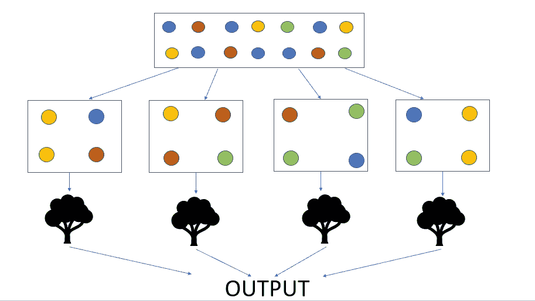
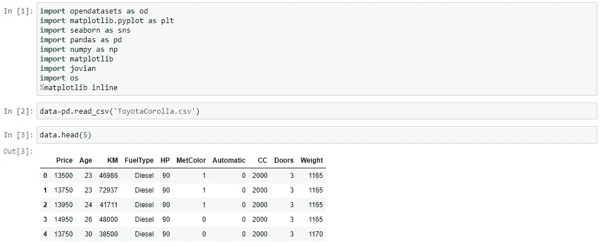
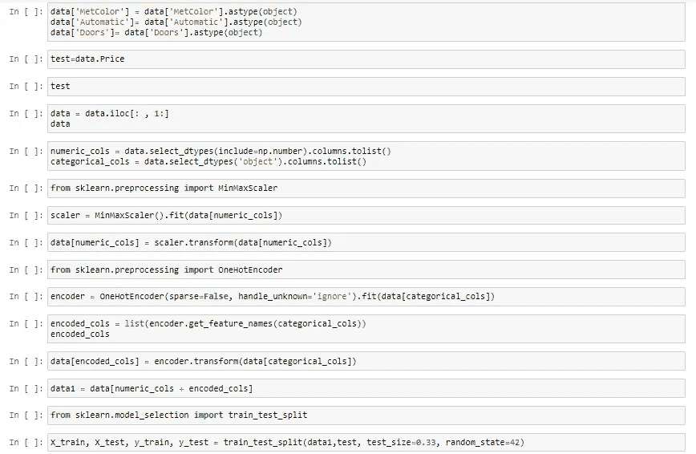
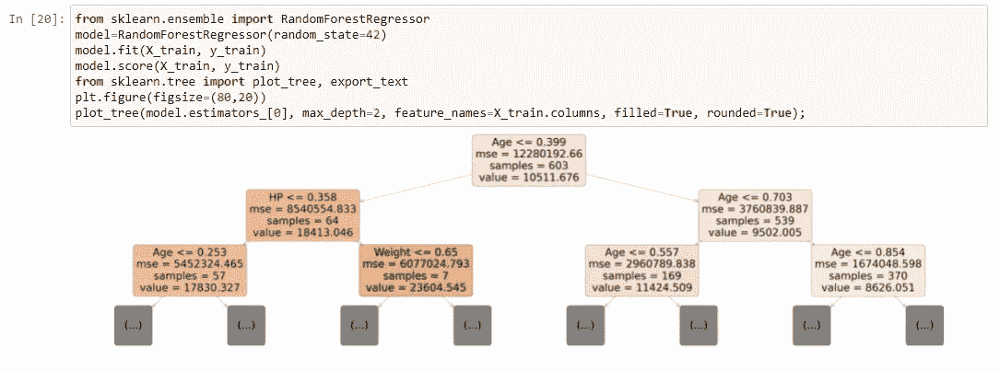
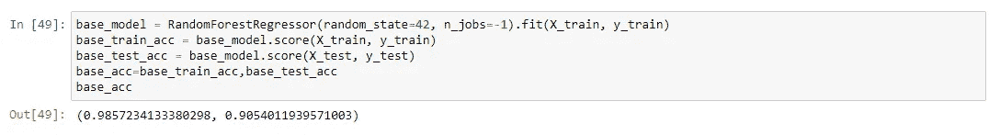
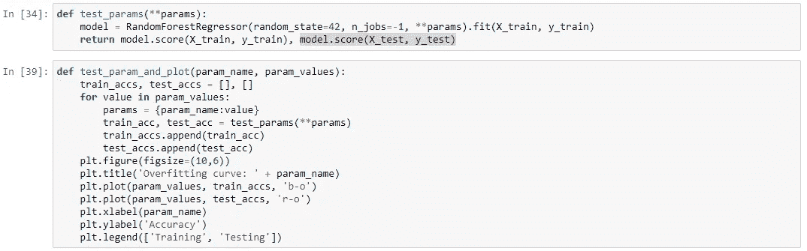
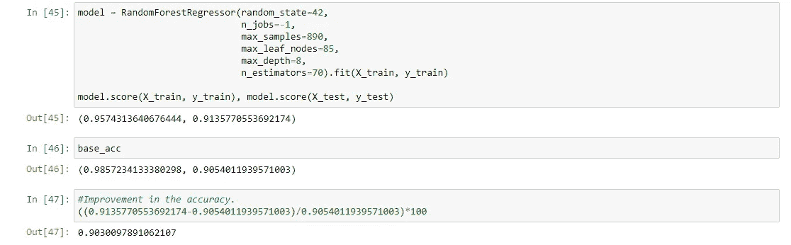

# 随机森林中超参数调整

> 原文：<https://medium.com/geekculture/random-forest-algorithm-has-proven-to-be-one-of-the-most-sought-after-algorithm-in-the-field-of-295da606bf9?source=collection_archive---------1----------------------->

随机森林算法已被证明是机器学习领域中最受欢迎的算法之一。这主要是因为它广泛地解决了由其父算法决策树引起的问题，即过度拟合。决策树被指责为具有低偏差和高方差，因为它们评估树中的每个节点，并且通常以遵循相同的模式而不是概括学习而告终。

另一方面，随机森林通过称为引导的过程随机选择数据集的行和要素来解决这个问题。这种随机化仅允许少数样本和特征出现在一个树中，但确保所有样本和特征都在其他树中被考虑，因此消除了过度拟合的可能性。在考虑不同的特征和样本创建多个树之后，在分类变量的情况下，算法的输出由接收最多投票的字段决定，而对于数值变量，所有可能输出的平均值被认为是最终预测。

Pictorial Representation of Random Forest with Bootstrapping

超参数调整也是随机森林算法中可用的主要特性，它允许我们微调参数以优化算法的性能。

在本文中，我将重点关注随机森林在回归数据集上的实现，然后讨论如何微调超参数以优化模型性能。

我已经从 Kaggle 下载了上面的数据集，并导入了所有必要的库和数据集。为了对数据集有所了解，使用了 df.head()命令。

已经对数据集执行了所有可能的转换，现在数据为机器学习算法做好了准备。

随机森林模型是用 sckitlearn 库的 Random Forest 类中可用的所有超参数的默认值创建的。随机森林的第一棵决策树是用命令模型绘制的。

The base model accuracy of the test dataset is 90.54%

基本模型精度为 90.54%，这是一个很好的开始数字，但是训练精度为 98.5%，我们可以得出该模型过度拟合的结论。但是，如果我们使用不同的超参数值来微调模型，我们可以进一步优化模型，使其具有更好的准确性，并且还可以在更大程度上消除过拟合。

首先让我们理解 sckitlearn 为随机森林提供的不同超参数。

**(我)。n_estimators :** 这表示要在随机森林模型中创建的决策树的数量。通常，树的数量越多，模型的性能越好。但是大量的树会降低计算速度，因此有必要找到一个最佳值。

**(二)。max_depth:** 这表示我们的树可以分裂的最大范围。如果该值高于最佳值，模型将会过拟合。但是深度太浅会妨碍训练过程。因此，它建议找到一个最佳点，以确保良好的准确性。

**(三)。min_samples_split:** 这表示从父节点分离后，节点中存在的最小样本。如果不满足这个条件，那么在父节点上不会发生分割。

**(四)。max_samples:** 这表示在引导过程中，从父数据集中考虑的最大样本数，以生成决策树。

**(五)。max_features:** 这表示自举时要考虑的最大特性数。

**(六)。自举** =真或假。bootstrap 的默认值为 True，但要禁用 bootstrap，我们可以将其指定为 False，整个数据集将被考虑用于决策树的形成。

创建这些辅助函数是为了找到所有超参数的最佳值，这将提高模型的准确性。经过分析，我获得了超参数的最佳值，如下图所示。

在用超参数的最佳值创建模型之后，已经观察到模型的精确度增加了 0.9%。甚至训练准确率降低到了 95.7%，说明过拟合也被照顾到了。

随机森林是首选，因为与决策树相比，它们提供了优化、灵活性和可靠性。在优化模型时，我们的工作是研究并找出所有超参数的最佳点，以提高算法的整体性能。