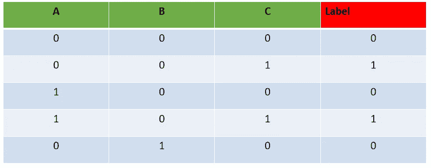
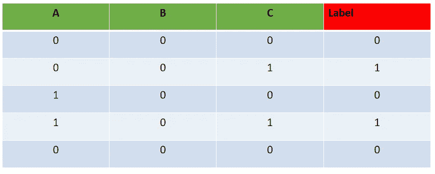
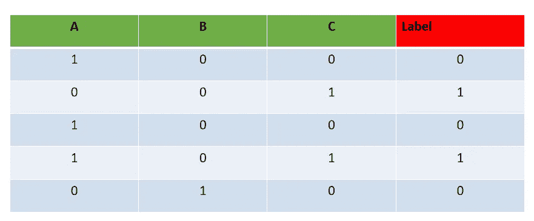
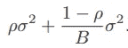
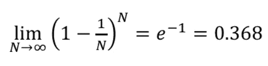

# 随机森林

> 原文：<https://medium.com/geekculture/random-forest-bdf35283f11a?source=collection_archive---------23----------------------->

了解森林。


**Let the forest make the decision**

*   如果你不熟悉决策树 **的概念，请阅读我写的关于** [**决策树的文章。**](/geekculture/decision-trees-51d4195a58d2)

随机森林算法，顾名思义，就是**个不同的不相关决策树**的集合。这个算法基本上是基于集体良知的。

*   **分类用例**:对于每一个输入，所有的树投票，最高票数的类获胜(民主)。
*   **回归用例**:通常所有树的结果的平均值就是森林的输出。

# 如何创建不同的不相关的树？

这分两步进行:

*   首先，**从原始数据集创建不同的数据集(允许替换行)**。让我们通过一个例子来理解它:



Original dataset



Child dataset #1

在子数据集#1 中，可以注意到第一行已经重复，最后一行已经从原始数据集中删除。



Child dataset #2

在子数据集#2 中，第一行已被原始数据集的第三行替换。类似地，准备各种数据集。随机数据集的数量将等于我们在训练时想要创建的树的数量。每棵树被称为一个估计量。

从单个数据集创建大量数据集的整个过程被称为**打包或引导聚合。**

*   其次，为了创建一棵树，**随机森林算法在每个节点分裂处从特征空间中提取随机特征子集**。

为了理解这一点，让我们考虑我们的示例数据集中的特征 A 是用于分类的强特征，即，它将总是在第一次分割中使用的特征，因为如果所有的特征被一次结合在一起，它会产生高信息增益(IG)。在这种情况下，生成树将彼此相似。因此，为了避免这种情况，在创建不同的树时，从样本空间中选择特征子集，因此在初始分割时不会总是考虑 A。

# **一个系综过程如何优于单个树？**

套袋法中每棵树的期望与随机森林的平均期望相同。因此，随机森林侧重于减少方差。如果树彼此之间不是完全不相关的，并且具有相关系数ρ“rho ”,那么方差由下式给出:



因此，通过平均大量的树，我们减少了第二项，从而减少了方差。当随机森林从特征集中选择特征的子集时，它进一步减小ρ的值，即理想地减小到 0。

对于分类，要素子集长度的默认值为√P，最小结点大小为 1。

对于回归，要素子集长度的默认值为 P/3，最小结点大小为 5。

特征子集的这些参数长度也可以被调整为超参数。

# 随机森林的其他功能:

*   **OOB** :出袋样品。这些是从子数据集中移除的样本，并且最初存在于数据集中，假设这样的样本是“A”。然后，使用“A”来测试从缺少“A”的数据集创建的树，即树将尝试预测“A”的标签，然后对所有预测取平均值。OOB 分数不应与验证分数相混淆。样本是 OOB 的几率约为 37%。

其中 N 是数据集中的样本数



Source: — [https://towardsdatascience.com/what-is-out-of-bag-oob-score-in-random-forest-a7fa23d710](https://towardsdatascience.com/what-is-out-of-bag-oob-score-in-random-forest-a7fa23d710)

*   **随机森林测量每个变量的强度**:当树被创建时，对应于树的 OOB 样本被用来知道树的性能。在这样做的时候，随机森林算法**随机置换 OOB 样本中的特征值**，并计算所有树的平均精确度。这个尺度用来判断一个变量的强弱。

# **Sklearn 随机森林算法的 python 实现:**

```
import matplotlib.pyplot as plt
from sklearn.ensemble import RandomForestClassifier
from sklearn.datasets import load_breast_cancer
from sklearn.model_selection import train_test_split
from sklearn.metrics import r2_score, roc_auc_score,classification_report
from sklearn.decomposition import PCA
import pandas as pd
from utils.utils_scores import scores

flag_pca = False

data, target = load_breast_cancer(return_X_y=True)
data = pd.DataFrame(data)
target = pd.DataFrame(target)

if flag_pca:
    pca = PCA()
    data = pca.fit_transform(data)

data_train, data_test, target_train, target_test = train_test_split(data, target, test_size=0.1,random_state=0)

RandomForestClassifierObject = RandomForestClassifier()
RandomForestClassifierObject.fit(data_train, target_train)

target_test_predict = RandomForestClassifierObject.predict(data_test)
scores(target_test,target_test_predict)
```

这段代码也可以在 github [这里找到。](https://github.com/Shubham-Saket/binary_classification_example_codes/blob/master/RandomForest_Classification.py)

我希望这篇文章能帮助你理解随机森林算法背后的直觉。

**来源:-**

*   [https://www . math . mcgill . ca/yyang/resources/doc/random forest . pdf](https://www.math.mcgill.ca/yyang/resources/doc/randomforest.pdf)

仅此而已。