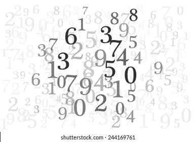

# PowerShell 中的随机数

> 原文：<https://medium.com/geekculture/random-numbers-in-powershell-57acd9d5c68e?source=collection_archive---------8----------------------->

## 你有没有想过如何在 PowerShell 中随机获得一个披头士成员？

Photo from [https://www.shutterstock.com/image-vector/abstract-background-random-numbers-gray-scale-244169761](https://www.shutterstock.com/image-vector/abstract-background-random-numbers-gray-scale-244169761)

你需要在你的 **PowerShell** 脚本中生成**随机数**吗？

你就是这么做的！(适用于从 5.1 开始的任何版本)

PowerShell 提供了一个简单的 *cmdlet，* `**Get-Random**`。