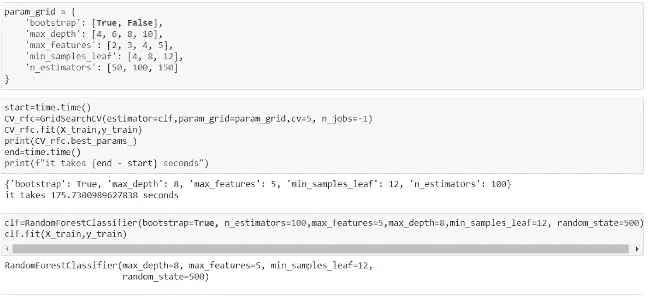
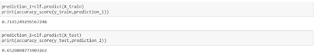
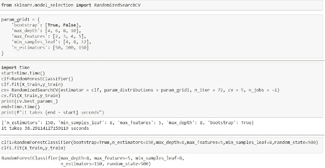
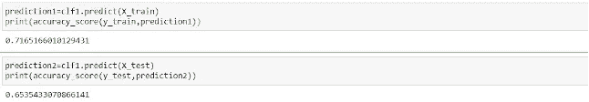

# 随机搜索

> 原文：<https://medium.com/geekculture/randomizedsearchcv-e6444c457c8d?source=collection_archive---------17----------------------->

作者:王祥玉

和格雷格·佩奇一起

在本文中，我们将展示在确定随机森林模型中使用的最佳超参数集时，使用穷举网格搜索与使用随机网格搜索之间的主要差异。

首先，简单说明一下超参数:在机器学习建模中，*参数*由模型拟合过程中的算法决定。*相比之下，超参数*由建模者指定，

每次，当我们使用随机森林时，我们都会考虑调整超参数，以提高模型对训练集和测试集的准确性。

scikit-learn 中一种非常常见的超参数调优方法是 GridSearchCV。GridSearchCV 被称为“穷举”方法，因为它全面检查超参数值的每个可能组合，以确定最佳组合。

为了举例说明这一点，让我们想象下面显示的选项集:

```
param_grid = {‘n_estimators’: [50, 100, 150, 200],‘max_depth’: [4, 8, 10, 12],‘max_features’: [12, 16, 20, 24],‘min_samples_leaf’: [6, 10, 14],}
```

一个详尽的方法，应用于上面列出的一组超参数，并建立了五重交叉验证，将需要生成和评估 960 个模型。

为什么这么大的数字？将每个独特的设置视为一种排列。我们必须检查四个可能的 n 估计值、四个可能的 max_depth 值、四个可能的 max_features 值和三个可能的 min_samples_leaf 值。那就是 4 x 4 x 4 x 3 = 192。但是等等！我们还没完。通过五重交叉验证，这意味着我们要对每种排列检查五次，因此我们在这里构建了 192*5 = 960 个独立的随机森林模型。对于某些数据集来说，构建 960 个随机森林模型可能既快速又轻松；但是，当使用包含数千行和数十个变量的大型数据集时，该过程可能会非常耗时。

幸运的是，有一种替代穷举网格搜索的方法，在 scikit-learn 中称为 RandomizedSearchCV。这种替代方法使用了一种巧妙的捷径——随机搜索对随机选择的 *n* 个组合的子集进行采样，而不是尝试每个超参数值的唯一组合。随机搜索过程所需的计算时间要少得多，并且通常会得到类似的结果。随机网格搜索背后的逻辑是，通过检查网格上足够多的随机选择的组合，搜索可能会识别出与穷举过程会识别出的组合相似的组合。

在下面的步骤中，我们将演示一系列数据准备步骤，然后使用随机森林模型来预测从应用程序的平均评级得出的分类结果变量。

本文中使用的这个数据集， *googleplaystore.csv* ，包含了从 iTunes 应用商店页面抓取的超过 10，000 个 Google play 商店应用的信息。这个数据集在 Kaggle 上[可用。](https://www.kaggle.com/lava18/google-play-store-apps)

在这个项目中，我们尝试使用随机森林分类模型来预测评级值。我们将比较 GridSearchCV 和 RandomizedSearchCV 的超参数调整，以及模型性能的任何变化。

```
play=pd.read_csv(‘googleplaystore.csv’)
```


**数据清理和准备**

首先，我们可以注意到数据集中有一些 NaN 值，但不是很多。考虑到丢失值的总体发生率很小，我们决定简单地删除任何包含不完整数据的行。

```
playclean=play.dropna()
```

然后，我们检查数据集中的重复行:

```
playclean.drop_duplicates(inplace=True)
```

**数据预处理:**

由于“应用程序”列包含应用程序的名称，每个名称都是一个唯一的字符串，因此它不能用作预测变量。

```
playclean=playclean.drop(‘App’,1)
```

为了将“评级”作为二元分类结果变量，我们将其分为两个级别，黄金级和钻石级:

```
cut_labels_2 = [‘gold’, ‘diamond’]cut_bins = [0,4.2,5]playclean[‘rating_2’] = pd.cut(playclean[‘Rating’], bins=cut_bins, labels=cut_labels_2)
```

对于变量“Install ”,我们使用了两个字符串函数来删除逗号和加号。然后我们把它转换成整数。

```
playclean[‘Installs’]=playclean[‘Installs’].str.replace(‘,’,’’).str.replace(‘+’,’’).astype(‘int’)
```

对于变量 Size，我们定义了以下函数来将大小转换为字节。

```
def change_size(a): Size=a[0] if Size[-1]==’M’: Size=Size[:-1] Size=float(Size)*1000000 return Size elif Size[-1]==’k’: Size=Size[:-1] Size=float(Size)*1000 return Size elif Size==’Varies with device’: Size=0 return Sizeplayclean[‘Size’]=playclean[[‘Size’]].apply(change_size,axis=1)
```

对于“流派”变量，我们从大量级别开始。我们把几个流派结合在一起，把它压缩到一个更小的数目。然后，我们对“类别”采取了类似的方法

对于“价格”，我们定义了一个函数来将值转换为“大于零”或“零”，以区分付费应用程序和免费应用程序。

对于“上次更新”，我们将其转换为日期时间格式。并将它们分成年、月和日。

```
playclean[‘year’]=playclean[‘Last Updated’].dt.yearplayclean[‘month’]=playclean[‘Last Updated’].dt.monthplayclean[‘day’]=playclean[‘Last Updated’].dt.yearplayclean[‘Last Updated’] = pd.to_datetime(playclean[‘Last Updated’], infer_datetime_format=True)
```

在对“类别”、“价格”、“类型”、“内容评级”、“流派”进行虚拟化之后，我们将数据划分为训练集和测试集。

接下来，我们构建了一个“快速”随机森林模型，用于确定特性的重要性。只使用最重要的特性，然后我们继续建模的过程。

**模型构建**

首先，我们使用 GridSearchCV 来调优超参数。这个过程需要将近 176 秒，它提供了如下所示的一组超参数:



使用从穷举网格搜索中获得的超参数，我们获得了略高于 65%的测试集的准确度。



使用上面显示的 RandomizedSearchCV()函数，我们指定了一个 n_iter 值。这表示要检查的唯一超参数组合的数量。这里指定的 72 种独特组合代表了整个网格总面积的四分之一。随机搜索仅用了 38 秒多一点就给出了我们的结果。



正如上面显示的准确性统计所揭示的，随机搜索过程更快地提供了这个结果，而没有牺牲模型的准确性；事实上，第二组超参数实际上提供了比测试集稍好的性能。

虽然它只覆盖了整个网格的一部分，但随机搜索过程往往仍然工作得很好，因为它检查的随机组合分布在网格的各个“邻域”中。因此，很可能选择与全网格搜索生成的超参数混合非常相似的超参数混合，特别是当指定了足够大的 n_iter 值时。至于最终的模型性能，应该记住，超参数调整只是在交叉验证的帮助下针对训练集执行的。不能保证所选的一组超参数将对全新的数据发挥最佳作用，因此当我们在处理通过随机搜索生成的值时看到性能提高时，这不一定是令人惊讶或不寻常的结果。