# 综合格斗排名第 2 部分:格利克等级系统

> 原文：<https://medium.com/geekculture/ranking-mma-fighters-part-2-the-glicko-rating-system-1d450e0703d8?source=collection_archive---------14----------------------->

## 如何使用 Cython 计算 Glicko 分数，cy thon 是 python 语言的超集。

Image by Daniel Lloyd Blunk-Fernandez on Unsplash

# 介绍

在之前的[帖子](/geekculture/ranking-mma-fighters-using-the-elo-rating-system-2704adbf0c94)中，我们使用 Elo 评级系统为 MMA 拳手创建了一个排名。结果很有趣，但是 Elo 的一个局限是它不能跟踪评级的可靠性。我这么说是什么意思？

假设我们正在评测 2 个格斗家， *A* 和 *B* ，他们的评分都是 1550，但是我们假设 *A* 刚刚开始职业生涯，有 2 场战斗，而 *B* 有 50 场战斗。在这种情况下，我们对哪个评级更有把握？根据这些拳手之间的比赛结果，我们应该以同样的方式更新他们的评分吗？

如果 *A* 击败 *B* 或者反之亦然，Elo 就会这么做；获胜者的评分将会降低相同的 *X* 分。尽管如此，仍然有一个论点是，我们并不真正知道 A 到底有多好，因为我们没有见过他们太多的战斗，也许战斗的结果给了我们更多关于他的信息，而不是关于 b 的信息。

Glicko 是 Mark Glickman[1]发明的一种国际象棋评分系统，是对 Elo 的改进。最初的主要改进是为每个玩家增加了一个“**评级可靠性**”分数，称为 *RD* 。它测量玩家评级的不确定性，并且可以被解释为评级的标准偏差的测量。在 Glicko 系统中，每个球员的评分应该被视为一个置信区间，而不是一个单一的值。区间越宽(RD 越大)，我们就越不确定一个玩家的真实技能。

格利克的另一个创新是，我们对玩家评级的不确定性不仅会根据战斗结果而变化，还会根据结果的新近性而变化。对于我们来说，在长时间裁员后对一个战斗机不确定是很常见的，在 Glicko 上，这个系统中战斗机的 *RD* 将会发生变化，随着战斗机不活动的每一段时间 *RD* 的增加。

Glicko 系统有两个版本。在第一个版本中，匹配之间的时间是 RD 变化的主要因素，而在第二个版本中，增加了一个波动性参数来解释这些变化。这里我们将探讨 Glicko-2 的应用(对 Glicko 的原始理论感兴趣的用户可以在这里找到更多信息[2])。我们来深入探讨一下。

# 该理论

格利克氏公式是一个动态配对比较模型。它使用本文[3]中描述的状态空间模型对游戏数据进行基于可能性的分析。它还与布拉德利-特里模型密切相关，后者是许多评级系统的基础。

Glicko-2 评级系统是一个 7 步近似贝叶斯更新算法，将在下文详述。算法推导的细节可以在这里[3]和这里[4]找到。

## **第一步**

Glicko 系统中的每架战斗机都有一个评级， *r* ，一个评级偏差， *RD* ，而在*Glicko-2 系统中，它们也有一个评级波动率σ。*

第一步是确定每架战斗机的初始参数和系统常数τ，它限制了 *RD* 值根据不可能的结果可以改变多少。一个小的τ意味着一个巨大的失败者击败一个受欢迎的人不会把他的评分提高很多。

对于初始参数，每架战斗机都以评级 *r* = 1500 开始——就像在 Elo 系统中一样——较大的 RD 为 350，波动率σ = 0.06。对于系统参数τ，算法推荐 0.2 到 1.2 之间的值。我们从 0.6 开始。

## 第二步

在第二步中，我们需要将参数从 Elo 标度转换到新的标度，在新标度中，下一个方程变得更加稳定:

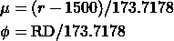

其他值保持不变。

## 第三步

根据该期间的结果计算战斗机等级的估计方差 *v* 。

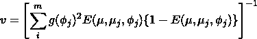

在哪里

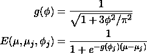

格利克曼表明，那些方程与 Elo 密切相关。 *E* 和 Elo 更新方程的相似之处非常清楚，并且*g(φ)*可以被视为方差和概率方程中的 *RD* *i* 影响因子。

## 第四步

通过将前期评分与基于结果的本期绩效进行比较，计算*δ、*评分的估计改进*。*

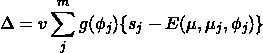

## 第五步

确定战斗机波动率σ的更新。这是通过基于 *regula falsi* 程序的迭代程序完成的。为了简洁起见，我们不会在这里详述这些步骤，但是它们可以在下面的文档中找到[5]。不过，我们将在 Cython 中展示一个实现。

## 第六步

将评级偏差更新为预评级周期值(即，基于给定新周期的玩家波动性值增加它)。

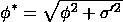

## 第七步

最后，将 Glicko 量表中的评级和 RD 更新为新值。

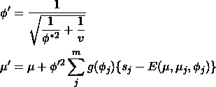

在期末，我们还会将值转换回 Elo 标度。请注意，如果一个战士在此期间一直不活跃，我们只应用第 6 步使用他们当前的波动性。

通过在一段时间内遵循该算法，我们可以创建新的 MMA 排名并找到目标。

# 应用

Glicko 在 Pypi 上有几个很棒的实现，包括这个[6]。尽管如此，由于更新玩家的波动性需要迭代过程，我们将使用 Cython 来加快我们的计算速度。Cython 是 python 语言的超集，它使得为 python 编写 C 扩展变得非常容易。由于优化的编译代码，Glicko 算法的执行变得更快。

这段代码有点长，不能作为要点，但是你可以在这里找到它:[glicko 2 _ cy thon . pyx(github.com)](https://gist.github.com/lspinheiro/6df74043b538056740b73d04b8ec5038)

代码对数据的应用如下:

我们将把这个算法应用到我用于 Elo 排名的同一个数据集上，看看它的性能。有关数据集的更多信息，请参见我们之前在简介中链接的帖子。

# 结果

## 第一次尝试

我们上次的分析提到，我们的数据集在缺乏性别信息和次优体重等级确定方面存在局限性。这一次，这些问题通过以下措施得到了解决(尽管仍不完善):

*   对于性别，我们使用 [Genderize.io](https://genderize.io/) API 来预测战士的性别。由于简单的 API 有每日限制，我只能为排名前 1000 的战士生成性别，这将足以生成山羊排名。
*   对于重量级/级别，每个拳击手现在都被分配到一个基于他大多数对手的重量级(也就是说，由于何塞·奥尔多大部分时间都在轻量级比赛，他现在被包括在这个级别，而不是次轻量级)。我们将尝试确定一个战士在未来每个时间点的等级和部门，但现在让我们坚持这样做。

话虽如此，让我们来看看使用格利克的男性战士在 G.O.A.T .师的排名。

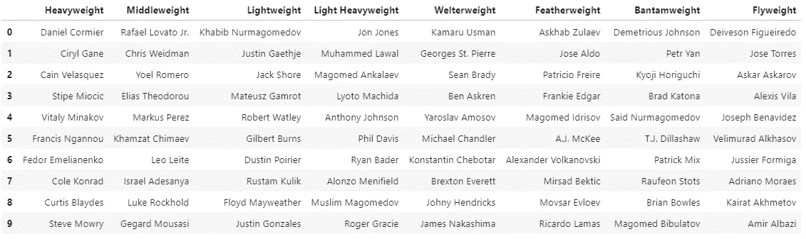

对于女战士来说也是如此。

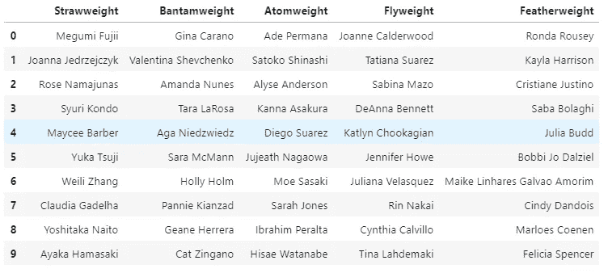

结果与 Elo 大相径庭，当然也更有争议。这是怎么回事？

看起来这个算法对于那些有更多战斗经验达到巅峰的战士来说是非常惩罚的。像凯拉·哈里森和阿斯哈巴·祖拉耶夫这样的拳手在克里斯·赛博格和何塞·奥尔多这样的拳手之上，因为他们开始面对高水平的对手，但很少参加比赛，这意味着他们有很大的研发，这导致他们的评级大幅上升。

可能的情况是，我们的算法的初始参数没有被适当地调整，并且可能需要调整以使结果看起来更真实。做到这一点的一个方法是最小化预测战斗结果和实际结果之间的误差，因为评级系统最终根据评级之间的差异来计算战斗机的胜利概率。如果系统工作正常，它应该更好地预测战斗结果，这实际上是不同评级系统在学术上的比较。

我将使用以下范围内的初始参数对 Glicko 分数进行网格计算:

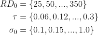

通过执行这一计算并最小化预测结果和实际结果之间的对数损失，我们发现最佳参数是:

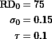

利用这些参数，我们得到了下面的男性排名。

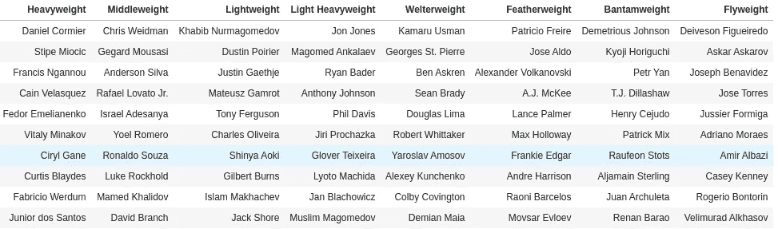

Male GOAT rankings using optimal parameters

和女性。

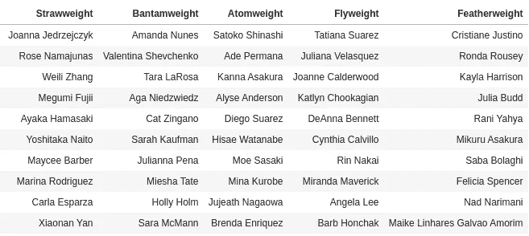

结果看起来更真实。你认为这些排名与我们首次发布的 Elo 排名相比如何？请在评论中留下你的想法。

# 最后的想法

使用 Glicko 评级系统，我们可以让我们对拳手真实技能的不确定性影响我们如何更新和评估评级，从而创建一个更全面的衡量标准来比较拳手。最终结果有点类似于 Elo，但可能更准确地预测战斗结果。

# 接下来

在战士分配到师和性别决定方面仍然有一些不一致，在我的下一篇文章中，我们将看到我们如何使用一些数据科学工具来帮助我们。我们还将继续研究其他更先进的评级系统。敬请关注。

# 参考

[1][https://en.wikipedia.org/wiki/Glicko_rating_system](https://en.wikipedia.org/wiki/Glicko_rating_system)

[2] [欢迎来到格利克氏评级](http://www.glicko.net/glicko.html)

【3】【glicko.net】大型动态配对比较试验中的参数估计

[4][thesis.pdf(glicko.net)](http://www.glicko.net/research/thesis.pdf)

[glicko2.pdf](http://www.glicko.net/glicko/glicko2.pdf)

[6] [deepy/glicko2: glicko2 在 python 中的实现(github.com)](https://github.com/deepy/glicko2)