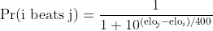
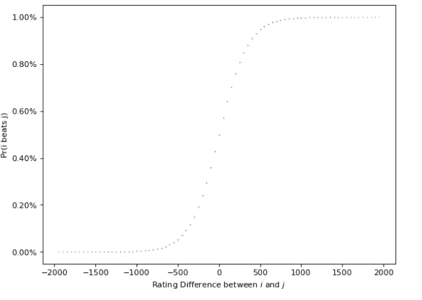
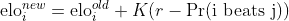
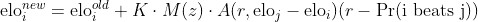
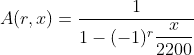
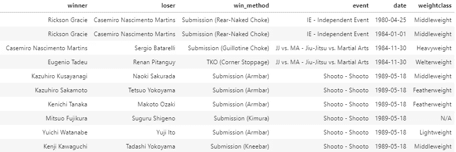
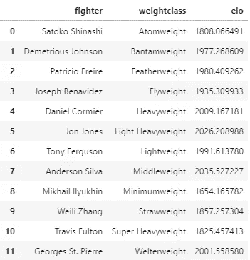
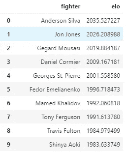

# 使用 Elo 评分系统对 MMA 拳手进行排名

> 原文：<https://medium.com/geekculture/ranking-mma-fighters-using-the-elo-rating-system-2704adbf0c94?source=collection_archive---------17----------------------->

用 python 实现。


# 介绍

在任何运动中给竞争者排名都是艰难的，综合格斗(MMA)也不例外。在你可以在网上浏览的每个 MMA 论坛中，你都会看到一系列关于 goa . t .的讨论，你也会在任何贴出的列表中发现很少的一致意见。那么，有没有可能想出一个多人都能认同的排名方法呢？让我们试一试。

体育运动有多种排名方法，但今天我们将探索 **Elo 评级系统，**其他的留给以后的帖子。Elo 是一个评级系统，用于计算零和游戏(即一些人胜利意味着另一些人失败的游戏)中玩家的相对技能，使其适合格斗运动排名，即使它是在非常不同的背景下构思的。

该系统本身实际上是在 20 世纪 60 年代作为国际象棋评级系统而创建的。而不是一般的体育运动。尽管如此，它的使用已经扩展到许多体育运动，如足球、篮球、美式足球、棒球和许多其他运动(FiveThirtyEight 已经普及了它在 NFL 和足球世界杯预测中的使用。有关更多信息，请参见[1])。

# 该理论

让我们简单地探讨一下这个系统是如何工作的，以及在应用它之前我们可以从结果中期待什么。我还会稍微改变一下术语，使其与 MMA 更直接相关。

Elo 的基本公式给出了一场比赛的预期结果，它是参赛选手等级差异的函数。例如，给定两个战士 *i* 和*j*，他们之间战斗的预期结果可以计算为:



这个公式与逻辑函数有着密切的联系，不同之处在于，我们不是以欧拉数为基数，而是以 10 为基数，但它仍然为胜利概率提供了一个平滑的 sigmoid 函数。让我们检查一下。

```
import numpy as np
import matplotlib.pyplot as plt
import matplotlib.ticker as mtick
import seaborn as sns
rating_range = np.arange(500, 2500, 50)
probs = [prob_i_beats_j(ri, rj) for ri in ratings for rj in ratings]
rating_diff = [ri - rj for ri in ratings for rj in ratings]
fig, ax = plt.subplots(figsize=(8, 6), dpi=100)
sns.scatterplot(rating_dff, probs, ax=ax, s=1)
ax.yaxis.set_major_formatter(mtick.PercentFormatter())
ax.set_xlabel("Rating Difference between $i$ and $j$")
ax.set_ylabel("Pr(i beats j)")
```



Probability of victory vs. rating difference

并且基于以下公式更新战斗结果之后的战士等级:



其中 *r* 是 *1* 如果斗士 *i* 赢了 *0* 如果输了。括号中的值作为预测的匹配概率之间的误差度量。而 *K* 是一个比例因子，用于校准评级变化的速度。这个方程也与统计学习中使用的梯度下降公式有密切的相似之处。Steven Morse 的这篇博文[2]对 Elo 作为一个统计学习模型有很好的描述。

这个原始的实现有一系列的限制，在 Elo Wikipedia 页面[3]和我之前提到的其他链接中有很好的解释。我们将在实现中解决的两个问题是胜利的边际和自相关。

*   胜利的差额:Elo 不考虑一个战士如何赢得一场战斗。判决(一致或分歧)将按照与完成相同的方式计算。我们想要排名更高的战士，我们将引入一个胜利系数 *M(r)* 来说明这一点。我们的实现将为一致决策给出 3 分，为分裂决策给出 1 分，为完成决策给出 5 分，但是可以使用更详细的评分函数来提高评级。
*   **自相关**:因为最受欢迎的人赢的次数更多，也更有可能结束一场比赛，他们的评分调整可能会变得过度膨胀，尤其是在存在胜率因素的情况下。我们实现了一个自相关因子 *A(x)* 非常类似于 FiveThirtyEight NFL Elo 算法实现的一个自相关因子，以对此进行调整。

考虑到这两种调整，我们的 Elo 调整公式如下:



其中 *z* 是战斗的胜利方法。从算法上来说，我们对于 *M(z)* 的函数有如下实现:

```
def get_win_method_weight(x: str) -> float:
    if "Decision" in x:
        if "Split" in x:
            return 1.
        else:
            return 3.
    elif "KO" in x:
        return 5.
    elif "Submission" in x:
        return 5.
    else:
        return 0.
```

和



# 将 Elo 应用于 MMA

为了创建我们的排名，我们将使用从网上抓取的 MMA 比赛数据集，并实现我们在 python 中描述的方法。该数据集由 353.952 场比赛组成，包含关于获胜者、失败者、获胜方法以及其他一些属性的信息。它看起来像下面的熊猫数据帧:



Fight dataset sample.

我们将创建一个类来存储和更新每个战士的等级。它基于以下 python 库: [Elo 算法在 Python 中的实现(github.com)](https://github.com/ddm7018/Elo)

每个拳手都将从 1500 分开始，相同范围内的数值通常用于国际象棋和其他运动中，公式中使用的系数也考虑了这一等级。该类存储拳手的等级，并根据比赛结果实现更新。

```
class Elo:
    def __init__(self, k: int):
        self.rating_dict = {}
        self.k = kdef __getitem__(self, player: str) -> float:
        return self.rating_dict[player]def __setitem__(self, player: str, data: float) -> None:
        self.rating_dict[player] = datadef get_margin_factor(self, score: float) -> float:
        return np.log2(score + 1)def get_inflation_factor(self, r_win: float, r_lose: float) -> float:
        return 1 / (1 - ((r_lose - r_win) / 2200))def add_player(self, name: str, rating: float = 1500.):
        self.rating_dict[name] = ratingdef update_ratings(self, winner: str, loser: str, score: float) -> None:

        expected_result = self.get_expect_result(
            self.rating_dict[winner], self.rating_dict[loser]
        )
        margin_factor = self.get_margin_factor(score)
        inflation_factor = self.get_inflation_factor(
            self.rating_dict[winner], self.rating_dict[loser]
        )self.rating_dict[winner] = self.rating_dict[winner] + self.k * margin_factor * inflation_factor * (1 - expected_result)
        self.rating_dict[loser] = self.rating_dict[loser] + self.k * margin_factor * inflation_factor * (-1 + expected_result)def get_expect_result(self, p1: float, p2: float) -> float:
        exp = (p2 - p1) / 400.0
        return 1 / ((10.0 ** (exp)) + 1)
```

然后，我们将使用以下函数创建我们的 Elo 计分器并将其应用于格斗数据集:

```
def calc_elo_rank(df: pd.DataFrame) -> pd.DataFrame:
    elo_scorer = Elo(k = 20)
    fighter_set = set(df['winner_slog'].unique().tolist() + df['loser_slog'].unique().tolist())
    for fighter in fighter_set:
        elo_scorer.add_player(fighter)elo_f1 = np.zeros((len(df,)))
    elo_f2 = np.zeros((len(df,)))for rowidx, fs_row in tqdm(enumerate(df.itertuples())):

        fighter = fs_row.winner_slog
        opponent = fs_row.loser_slog
        score = fs_row.win_method_scoreelo_f1[rowidx] = elo_scorer[fighter]
        elo_f2[rowidx] = elo_scorer[opponent]elo_scorer.update_ratings(fighter, opponent, score)df.loc[:, 'elo_f1'] = elo_f1
    df.loc[:, 'elo_f2'] = elo_f2

    return df
```

# 结果

在将该算法应用于整个数据集之后，我们在每个结果之后得到每个战斗机的 Elo 评级。对于排名，我们将根据每位拳手的最高 Elo 评分，即他们职业生涯的巅峰来评估他们。

```
max_ranking = (pd.concat([
        fight_df[['winner', 'winner_slog', 'weightclass', 'elo_f1']]
        .rename(
            dict(winner='fighter', winner_slog='fighter_slog', elo_f1='elo'),
            axis=1),
        fight_df[['loser', 'loser_slog', 'weightclass', 'elo_f2']]
        .rename(
            dict(loser='fighter', loser_slog='fighter_slog', elo_f2='elo'),
            axis=1)
    ])
    .groupby(
        ['fighter', 'fighter_slog', 'weightclass'],
        as_index=False)['elo']
    .max()
)
```

执行此聚合后，我们可以创建多个等级。

## 部门排名

首先，让我们看看每个部门谁是最好的。



结果是非常有趣的，许多 UFC 战士被认为是他们那个时代最好的，是他们部门的 G.O.A.T。这份清单的一个局限性是，体重等级是从战斗人员档案中获得的，它们反映了战斗人员在获得数据时所处的体重等级，这对于在不同类别之间跳跃的战斗人员来说是一个问题。这造成了一些错误，比如狄米崔斯·约翰逊被列为最轻量级，尽管在终极格斗锦标赛中是轻量级。

可悲的是，我们的数据集也没有关于性别的信息，男性和女性的评级混在一起，所以我们现在不会有女性排名的全貌。但是即使有这样的限制，这个模型看起来工作得很好。

一些有趣的结果也出现了，如帕特里西奥·弗莱雷在轻量级和托尼·弗格森在轻量级。弗格森是分区的大明星，但他通常不被认为是最伟大的轻量级选手；卡比·努尔马戈梅多夫和 BJ·佩恩是这份名单中比较常见的名字。

## **查找 G.O.A.T.**

如果我们试图找到 MMA 的山羊，Elo 告诉我们什么？



很有意思；最常见的名字如安德森·席尔瓦、乔恩·琼斯、费多尔和普惠制都在名单上。安德森占据榜首，可能是因为他在顶级比赛中的高完成率，而 GSP(许多人眼中的山羊)在名单上有点靠后，因为他作为冠军的大多数胜利都是决策。名单中一些有趣的名字包括特拉维斯·富尔顿和马迈德·哈利多夫，他们不是主要 MMA 组织的成员，但却有着令人印象深刻的记录。

# 最后的想法

Elo 提供了一种简单但可靠的方法来对战士进行排名。虽然并不完美(由于方法和数据的限制)，但我们可以在 Elo 实现产生的列表中看到许多最受欢迎的名字。你对结果和实施有什么看法？你感到惊讶吗？你会做些不同的事情吗？请在评论中告诉我们。

# 参考

[1][https://fivethirtyeight . com/features/introducing-NFL-elo-ratings/](https://fivethirtyeight.com/features/introducing-nfl-elo-ratings/)

[2]https://stmorse.github.io/journal/Elo.html

[3][https://en.wikipedia.org/wiki/Elo_rating_system](https://en.wikipedia.org/wiki/Elo_rating_system)