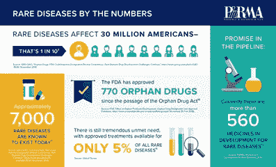
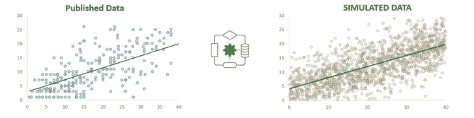
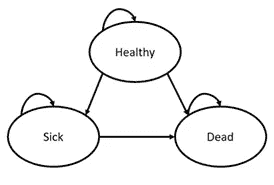
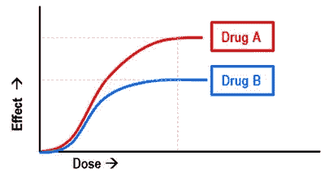

# 罕见疾病:构建成本效益模型的挑战

> 原文：<https://medium.com/geekculture/rare-diseases-challenges-faced-in-building-cost-effectiveness-model-7bebf39f8776?source=collection_archive---------34----------------------->

Photo from [https://emerj.com/ai-sector-overviews/machine-learning-in-pharma-medicine/](https://emerj.com/ai-sector-overviews/machine-learning-in-pharma-medicine/),Reposted with permission

有没有想过一种治疗罕见疾病的极其昂贵的药物怎么可能具有成本效益？或者为什么一家制药公司沉迷于一种罕见疾病药物的研究，而在全球范围内患者寥寥无几？或者，为什么付款人会将如此昂贵的药物列入其处方集？罕见病市场的表现不同于高患病率疾病，HEOR 的标准做法不适用于它们。让我们讨论一下，为治疗一种罕见疾病的孤儿药建立成本效益模型有哪些挑战。

不同国家对罕见疾病的定义各不相同，从万分之一到万分之一不等。罕见疾病还包括发病率更低的超罕见疾病(NICE 定义为五万分之一)。这些疾病主要是慢性和致命的，造成了沉重的社会负担，需要紧急优先处理。每年 2 月的最后一天被庆祝为罕见疾病日，以提高对这些被忽视疾病的认识。

*Source:* [*https://www.phrma.org/Media/Progress-in-Fighting-Rare-Diseases*](https://www.phrma.org/Media/Progress-in-Fighting-Rare-Diseases)

罕见病治疗数量如此之低的众多原因之一(一些原因是由于市场有限，制药公司缺乏罕见病药物的 R&D，或者罕见病药物非常昂贵，等等。)是在 HTA 批准之前，对罕见疾病进行经济建模时面临的挑战数量。

尽管全球有 7，000 多种不同的罕见疾病，但由于患者数据、研究、疾病自然史和临床结果的限制，经济建模是一种新现象，导致难以生成稳健的模型。

这篇文章将带你了解在为罕见疾病进行经济建模时所面临的限制，以及我们如何克服它们。

在研究罕见疾病时，发病率太低，而且患者研究和临床试验只在极少数患者身上进行，因此数据点总是有限的。因此，为成本效益模型寻找投入成为一项挑战。

**数据模拟**

在进行进一步分析以发现健康状态或健康状态之间的转移概率或计算疾病的发展速度之前，可以实施的一个关键技术是“数据模拟”它指的是创建多个数据点，同时保持数据的当前趋势。在数据不可用的情况下，我们可以利用该疾病的可用文献中的图表和数据。以下是模拟数据点应遵循的步骤:

***步骤一:数字化***

在没有数据的情况下，可以使用在线数字化仪将文献中的图数字化。

***第二步:曲线拟合***

可以使用 Python 或 MS Excel optimizer 进行曲线拟合；两者都给出了有希望的结果。

**例如**，在下图中，我们可以使用曲线拟合来建立年龄和残疾指标之间的关系。在这种情况下，年龄和标识符度量之间存在线性关系。

Image by Author: Simulated data over the fitted line in the right picture from fewer data available for disease(88 points)

Mathematical Relationship for Linear Equation

***第三步:模拟***

如上所述，在研究罕见疾病时，明显的限制是可供研究的患者数量少。在这种情况下，我们可以使用各种技术来模拟数据。因为在这种情况下我们有一个线性关系，所以可以使用回归方程的系数来模拟数据，包括方差。

下面列出了在收集经济建模的一些输入数据时所面临的挑战，以及克服这些挑战的可能方法:

**1)** **健康状态:**

为了创建成本效益的马尔可夫图，我们需要区分健康状态以及患者在疾病中可能发展的方向。

Image by Author: Simple Makov Model for three health states

对于一般疾病，已经定义了健康状态。然而，在罕见的疾病中，健康状态可能并不总是可用的。有两条路可以走-

a)深入研究可用的文献，您可能会在其中找到定义的健康状态。(联系 kol 进行讨论也会有所帮助)

b)通常情况下，总会有一个特定的指标来衡量疾病的严重程度，如残疾评分(如心血管疾病的 LDLC)，可用于创建“健康状态”。使用上一节中描述的模拟数据，我们可以创建存储桶来分隔阶段，或者运行分段练习来区分它们。

**2)** **转移概率:**

对于罕见疾病，患者从一种状态进展到另一种状态的概率不容易获得。

纵向数据的可用性对于计算转移概率至关重要，因为患者的旅程用于分析转移。可以使用机器学习技术，如多项式逻辑回归(或其他分类算法，我尝试的另一个 F1 得分较高的算法是 SVM)来计算转移概率，在这些数据上开发倾向模型。

然而，在一些罕见的疾病中，进展太慢，或者不能在特定的持续时间内跟踪患者(训练模型所需的)，缺乏过渡的证据。在这种情况下，我们试图利用特定时间的数据，并训练一个模型来计算转移概率。这种方法可能不是获得转移概率的最佳方法，但在缺乏证据的情况下，这是唯一合理的方法。

**3)** **成本:**

对于罕见疾病，药物仍在进行临床试验，或者没有竞争药物可以比较成本，研究类似疾病可以证明有助于找到阶段性成本。然而，在使用其他疾病的成本时，必须考虑疾病的性质、进展的速度和平均年龄、疾病在每个阶段的严重程度等因素。

此外，基于上述因素，某些类别的成本与我们的案例无关，可能需要从分析中移除。

**4)** **药物的功效:**

药物的疗效与降低疾病的进展直接相关，即由于治疗导致的状态内转换的频率降低，这意味着一组新的转换概率开始发挥作用。

为了计算这些由于治疗引起的转移概率，我们可以将承诺的功效直接应用于我们的标识符度量，并使用度量的更新的缩减值来重新训练早先建立的分类模型。可以通过比较治疗组和未治疗组来观察药物的疗效*(如果没有比较药物，药物 A 将是未治疗组，如下图所示)*

Image by Author: Comparing Efficacy of drugs available in the market

**结论**

上述四个方面及其应用的解决方案帮助我们挽救了生命，因为该模型已被 HTA 机构接受，并且同类药物中的突破性药物已在多个国家上市。