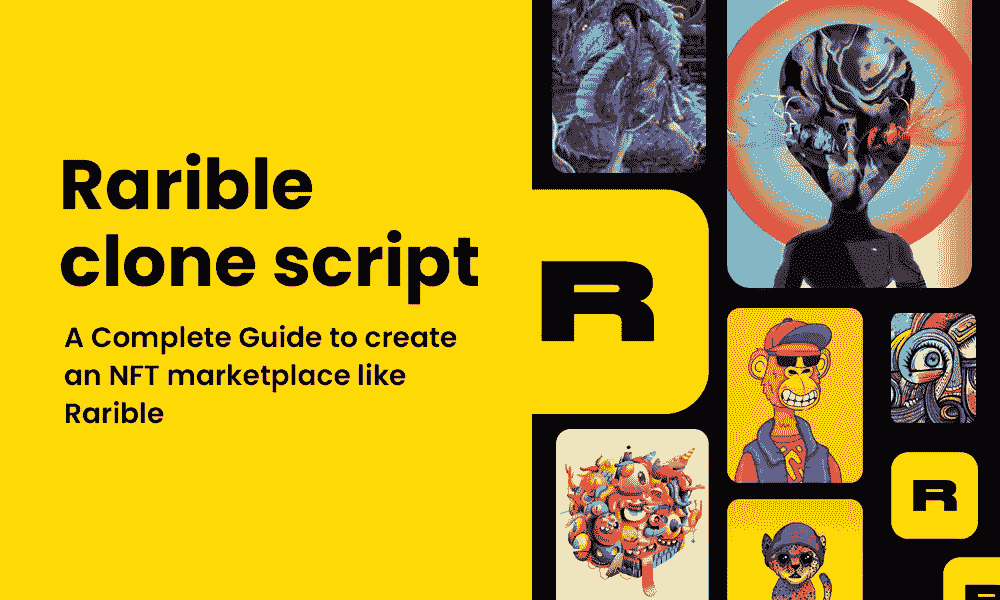

# Rarible 克隆脚本——创建类似 Rarible 的 NFT 市场的完整指南

> 原文：<https://medium.com/geekculture/rarible-clone-script-a-complete-guide-to-create-an-nft-marketplace-like-rarible-8aba48d02ce1?source=collection_archive---------12----------------------->

不可替代令牌(NFT)越来越受欢迎，这已经发生了巨大的变化，并且仍在发展，以达到更高的标准。随着交易量从 2021 年 12 月的不到 30 亿美元增加到 2022 年 1 月的近 70 亿美元，NFT 市场在新的一年蓬勃发展。根据 DappRadar 的数据，当 NFT 的销售额在 2021 年达到近 250 亿美元时，NFT 热开始升温。最近几天，新涌入的 NFT 市场日益增多。很多投资人和创业者都渴望找到最好的投资平台。

Rarible 是几个数字艺术画廊和市场之一，NFT 的所有者可以在这里展示藏品并出售。让这个市场与众不同的是，任何成员都可以在以太坊区块链网络上创建自己的 NFT。

# 什么是稀有的 NFT 市场？

Rarible NFT 市场由企业家阿列克谢·法林(Alexey Fallin)、产品经理亚历山大·索尔尼科夫(Alexander Solnikov)和产品设计师伊利亚·科莫尔金(Ilya Komolkin)于 2019 年建立。该公司位于洛杉矶，拥有 160 万用户，交易价值为 2.74 亿美元。Rarible 脱颖而出的原因之一是它吸引了大公司和名人的合作。社交媒体网站推特、拳击手弗洛伊德·梅威瑟和女演员林赛·罗韩都在 Rarible 的帮助下发布了他们的 NFTs。

Rarible 并不要求你成为一个名人来创建一个 NFT 项目。Rarible 使用分散且安全的区块链平台，是一个让有抱负的艺术家在数字空间展示才华的市场。它允许艺术家销售他们的作品，如音乐、视频等。

# 你如何在网上购买和交易 NFT？

由于 Rarible 支持以太坊区块链上的交易，因此有多种方式可以买卖 NFT。这都与代币的铸造地点和价格有关。在 Rarible 上有两种简单的买卖 NFT 的方法:以固定价格购买或通过拍卖。

*   **固定价格—** 卖方将 NFT 以固定价格向买方挂牌出售。如果您想购买，请按 NFT 上的“购买”按钮，完成交易。
*   **拍卖—** 通过拍卖，一件 NFT 在一段有限的时间内被拍卖，许多人可以在这里投标。拍卖结束时出价最高者将有权以最高价购买 NFT。此外，考虑到任何加密交易通常都是要纳税的。

Rarible 支持的每个区块链都有不同的购买 NFT 的方式。例如 CryptoEggs“文明”集合，一个在以太坊区块链网络上制作的动画 NFT 集合。点击“购买”按钮购买 NFT，并将其添加到链接的钱包中。收取 2.5%的服务费后，会弹出一个结账窗口。如果你的钱包里没有足够的钱，你也可以使用 Visa 或 Mastercard 购买。

然而，并不是所有的钱包和区块链都允许你用信用卡或借记卡购买非功能性钱包。例如——奥茨 NFT 收藏品是在泰佐斯区块链上铸造的。选择“立即购买”时，您必须有足够的 Tezos 硬币来完成交易。使用 Tezos NFTs，你不能直接使用 Visa 或 Mastercard 购买，但可以使用 Rarible 上的卡直接将资金添加到你的钱包中。

如果您拥有一个或多个 NFT，您可以将它们列在您的个人资料中进行展示和销售。由于 NFT 存储在您连接的加密钱包中，您可以选择在网站上您的个人资料下显示什么，并列出您的价格。如果有人决定购买你的 NFT，Rarible 会处理安全交易，确保移动 NFT 买家的钱包并存入你的硬币。

# Rarible 有汽油费吗？

Rarible 使艺术家在平台上制作 NFT 变得极其简单，只需几分钟就能与世界其他地方分享。您可以创建独一无二的、独一无二的、特定的 NFT 的多个版本。您可以设定投标价格或进行拍卖。

作为一个创作者，你可以决定你的作品未来销售的版税收入。每次你的作品在二级市场上出售，你都会自动获得一笔版税，如果你愿意，可以低至 1%，也可以高达 20%或更多。

虽然你必须为铸造 NFT 支付汽油费，但你可以选择在汽油费较低的时候铸造你的 NFT。或者你可以利用免费铸造的选择，买方为你支付汽油费。

当你免费铸造时，你的 NFT 被添加到“稀有”收藏中，而不是你的个人收藏中。

# 你是如何创建像 Rarible 这样的 NFT 市场的？

许多创业公司正在考虑像 Rarible 一样推出自己的 NFT 市场，以进入 NFT 世界。但是建立一个像 Rarible 这样基于 DAO 的 NFT 市场并不像创建一个普通的网站。这是多重过程，稀有的概念是非常独特的。因此，初创公司需要一个伟大的 NFT 开发团队来实现他们推出 NFT 市场的目标。由于开发过程的费用和时间，许多企业家已经放弃了建立自己的 NFT 市场的想法。

但是如果你的梦想真的独一无二，总有办法实现。技术专家和开发者社区在注意到许多新企业家对启动类似于 Rarible 的 NFT 市场的兴趣后，开发了被称为 [**Rarible 克隆脚本**](https://alwin.io/rarible-clone-script) 的最佳解决方案。

# 为什么稀有克隆脚本？

Rarible clone script 是一个经过多重测试的无 built 市场软件，建立在以太坊区块链网络上，用来创建一个像 Rarible 一样的 NFT 市场。与其他开发方法相比，Rarible clone 脚本有很多优点。

*   在最可靠的以太坊区块链上创造
*   完全可定制和测试的软件。
*   多数字钱包支持
*   在短时间内建立一个 100%的 NFT 市场，预算适中。
*   使用先进的技术和工具开发。

Rarible clone script 价格低廉，但你不必担心产品的质量。它拥有所有的基本功能、先进的技术和安全功能，与广受欢迎的 NFT 市场一样——稀有。

现在你有了如何通过使用稀有克隆脚本启动 NFT 市场进入加密世界的答案。

因此，毫不犹豫地进入 NFT 空间，用独特的商业理念统治 NFT 世界。

# 稀有克隆脚本的主要特性:

*   区块链驱动
*   搜索机制
*   侵犯版权
*   各种收藏品
*   智能合同
*   钱包支持
*   基于社区的指南
*   简单快速的分类
*   社区治理
*   投票机制
*   完全分散的自治组织

# 稀有克隆脚本的商业优势:

Rarible clone script 因其下列商业优势而受到许多 NFT 投资者和密码创业者的高度青睐:

*   有效的数据分析
*   高投资回报率
*   社区治理
*   智能合同已审核
*   多重标准非功能性测试
*   可定制
*   无缝体验
*   完全安全
*   ETH 标准支持
*   更快的部署

这些都是使该解决方案完全独特并被广泛采用的优势。

# 谁提供了一个高效稀有的克隆脚本？

看完这篇文章后，现在每个创业者的脑海中都有一个问题，“谁提供了最好的稀有克隆脚本？”没错！伙计们，我知道你们的日程很忙，所以你们没有太多的时间去分析像 NFT 这样的市场。通过向脚本提供者提供我的研究结果，我将使您的分析过程更加简单。经过深入分析，我想到了 WeAlwin Technologies 这个名字。他们让我反复深入研究关于他们的细节。他们是领先的 [**NFT 市场发展公司**](https://www.alwin.io/nft-marketplace-development) ，他们符合上述所有标准。如果你计划进入像 Rarible 这样的 NFT 市场，你可以和他们联系以获得一个全功能的 Rarible 克隆脚本。