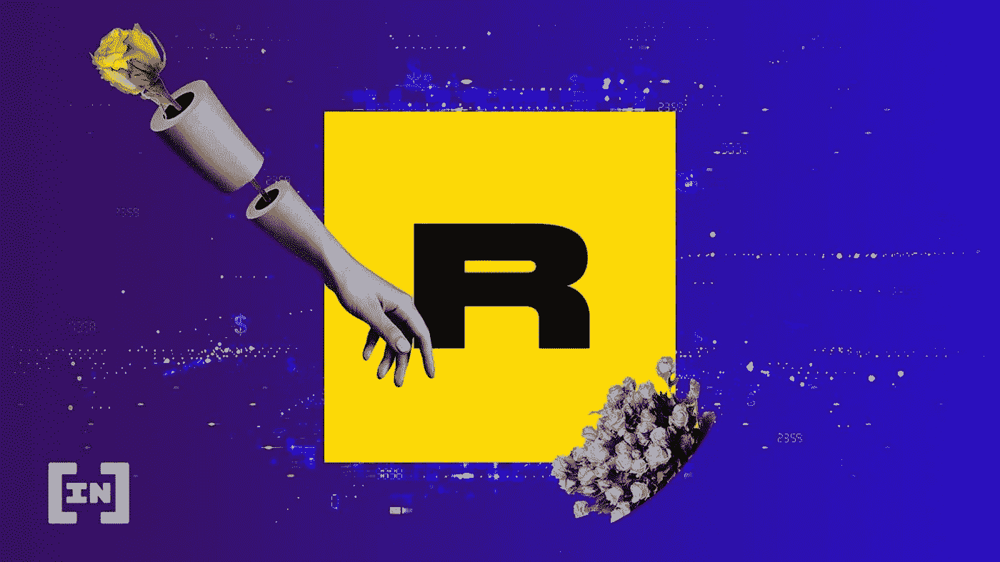
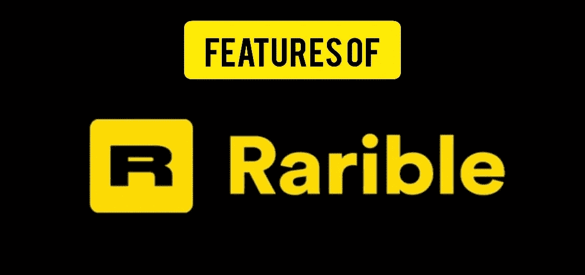
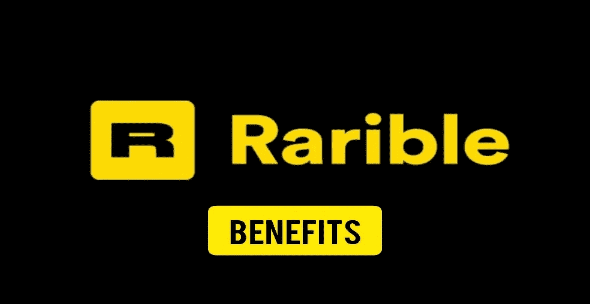
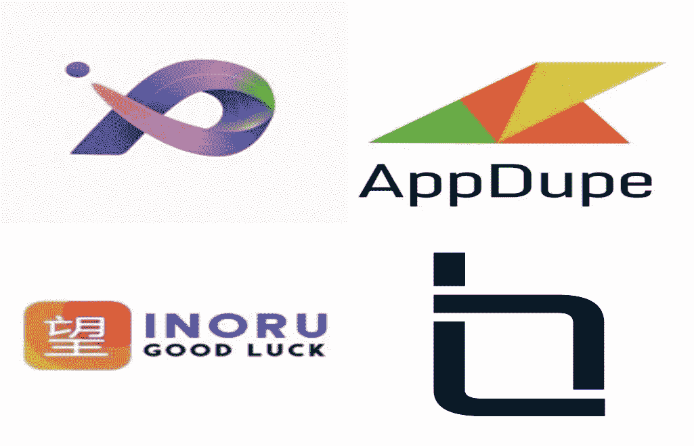

# 稀有克隆脚本[比较公司+功能]

> 原文：<https://medium.com/geekculture/rarible-clone-script-comparing-companies-features-b9d1c05e96cb?source=collection_archive---------18----------------------->

如今，技术的快速发展和加密货币的发展越来越受欢迎，这使得用户可以安全地交易他们的 NFT，而 Rarible 是实现这一梦想的平台之一。在这篇文章中，我们将讨论 Rarible 的历史和一些事实，Rarible 的具体功能，如智能合同，多钱包，然后我们将比较不同的公司。和我们在一起。

Rarible 平台成立于 2020 年，其首席执行官是 Alexei Flin，他也是 Sticker.place 的创始人。2021 年 6 月，Rarible 从一个风险投资者财团那里赢得了 1420 万美元，目前交易价格为 26.79 美元，24 小时交易量为 13，326，215 美元，比前一天的价格上涨了 9.80%。它也是可定制的，并且它给有创造力的艺术家以 NFT 的形式销售他们的创作，例如绘画、电影和音乐专辑的机会。用于创作独特艺术作品的 NFT 令牌称为 ERC 721，用于制作同一艺术作品不同版本的令牌称为 ERC1155。除了有创意、安全、无 bug 之外，[**最好的稀有克隆脚本**](https://radindev.com/rarible-clone-script/) 也是经济的，换句话说，用户可以很容易地在一眨眼的时间内创建一个 NFT 平台，没有任何困难。

我们如何使用稀有的克隆脚本？

使用 Rarible 脚本的第一步是使用您的加密钱包和您选择的信息创建一个帐户，然后，您可以轻松地铸造一个 NFT，或者您可以对您正在考虑的 NFT 出价，但有一点应该记住，那就是 NFT 应该发行，如果不是，您不能对它出价，如果 NFT 发行， 它可供拍卖或竞标，如果 NFT 的所有者接受你的出价，你可以将钱送到所有者的钱包并达成交易，所以现在，你是 NFT 的所有者，你要决定如何处理它。

稀有克隆脚本有哪些特性？

我想到的第一个特性是使用所谓的 Rarible 来列出、销售和购买 NFT 的能力。如前所述，这是一个非常安全的地方，因此人们可以放心地在那里进行交易，这将改善买家和卖家的体验。

另一个值得一提的特性是可访问性。它兼容不同的设备，如手机、桌面等，因此它给用户带来了快速访问他们自己的市场的好处，无论他们在哪里，何时在系统上操作。

您可以在 Rarible 中使用各种钱包，它不局限于特定的钱包，因此用户可以更容易地使用他们拥有的任何一种货币来使用该平台，这一功能可以吸引众多用户。

对于用户来说，安全是他们最看重的一个因素。需要有一个安全的地方来保存你自己的信息和你自己的钱。在稀有的平台上。用户可以放心，他们的信息不会受到任何危险的威胁。

在非正规金融服务的交易或转让过程中，双方之间的合同非常重要。Rarible 使用了智能合同，使流程更加有效和简单，并遵守 ERC-721 标准来处理可转让性和所有权。

寻找你想要的 NFT 的搜索过程可能会让人不知所措，因为可能没有过滤额外信息的选项，但这对于 Rarible 来说不是问题。专家们试图让这个平台能够带来符合用户口味和愿望的结果，这样，他们就可以很容易地过滤掉他们认为无用的信息，使搜索过程变得更加有趣和可爱。

另一个因素是，Rarible 可以应用于任何区块链网络，尽管 Rarible 克隆脚本只能支持以太坊、Flow 和 Tezos，但它可以根据客户的需求进行定制。

竞价是平台的本质，竞价状态直播是用户想要的东西之一。它为谁工作？出价发出后，卖方只有有限的时间接受或拒绝出价。这种竞价使得平台的气氛更加活跃，鼓励用户参与各种竞价。

每个人收到的稀有克隆脚本由内置的 NFT 艺术家注册表组成，其中包括在您的平台上注册的所有 NFT 艺术家的简介。为了使简介有趣，他们可以做各种各样的事情。他们可以附上他们的社交媒体手柄链接，并在屏幕上显示其他信息，如果这些信息是可见的，他们可以吸引你的注意。

**稀有克隆脚本的好处**

高端安全性:对于用户来说，确保他们拥有其他用户的完全忠诚并且他们永远不会被欺骗是非常重要的，因此，制定一个稀有的克隆脚本是确保你安全和你总能获得良好利润的最简单的方法。

技术支持:每个人都知道，在使用 Rarible 时，编码和修复可能出现的错误会令人沮丧和不知所措。Rarible script 为管理员提供了使用不涉及代码处理的系统的可能性，因此，任何人都可以管理操作过程和财务是非常生动的。

有时，对于一些用户来说，更改区块链可能会很麻烦和困难，但在 Rarible 中，用户可以随时随地更改区块链。对于切换网络有困难的用户来说，这是一个必需的功能。

你可以很容易地找到你想要的任何一种 NFT，如上所述，ERC-721 和 ERC-1155，给用户创造大量的 NFT 的可能性，你可以创造一个 NFT，并用 ERC-1155 扩展它。对于充满激情的艺术家来说，这是一个展示他们迷人艺术作品的巨大机会。

用户可以在他们自己的稀有克隆脚本中包含六个特性，就像真正的稀有平台一样。

自由 NFT 创作。

与 NFT 艺术家交流。

让你的以太坊 NFTs 碳负。

关注喜爱的收藏家、艺术家和朋友。

底价。

基于域的稀有克隆脚本

一般收藏品的 NFT 市场是所有人都想要的，但另一方面，基于域名的 NFT 市场业务在用户中越来越受欢迎。这里有一些领先的领域，你可以在此基础上建立你的稀有克隆。 **‍**

音乐

艺术

录像

虚拟空间

运动

不动产

供应链

喜剧演员

门票和活动(媒体)

**如何打造 NFT 市场？**

开发市场的第一步是要知道你在为谁创建市场，你需要了解你的受众，你需要知道你创建这个市场的目的，当然，你需要决定你想与哪个平台合作。下一步是考虑你希望你的市场拥有的功能和技术，比如过滤器、搜索选项、列表、钱包、智能合同、店面等等。

一旦决定了要添加到平台中的特性，就需要考虑平台需要开发的技术。以下是创建 NFT 市场可能需要的一些技术组合:

**区块链平台**

以太坊:这是 NFTs 世界中最著名的平台之一。在这个平台中，保留所有权的历史要容易得多，因为交易历史和令牌元数据是可验证的。这个平台的另一个好处是它永远不会关闭，因此，代币将永远可用于转让、出售或购买。

**Flow** :这款[区块链](https://www.blockchain.com/)是为新一代数字资产、游戏和应用程序设计的，目前有如此多的用户使用它来创建 NFTs 和 NFT 市场，但不同的是，他们使用的编程语言目前被如此多的用户使用。

Tezos :这是一个开源的区块链平台，面向受众多构建者、研究人员和验证者保护的资产，它使用预编译的 FA2·NFT 合同语言，显然，它可以支持 NFT 市场的发展。

**存储平台**

**IPFS** :它是有目的地以分散的方式存储媒体。此外，它可以很容易地存储所有与 NFT 相关的数据。

这也是一种分散式存储，旨在存储最重要的信息。它拥有为 NFTs 启动自己的分散存储所需的一切。

Pinata: 它是 IPFS 上可以用来上传和管理文件的平台之一，正如预期的那样，它可以为 NFTs 提供安全和可验证的文件。

当决定使用哪个平台，编码过程完成后，就是铸造 NFT 的时候了，一旦完成，你就可以开始你自己的 NFT 市场了。

**NFT 市场公司**

众所周知，有很多公司可以帮助你建立 NFT 市场，比如 Interexy、Inoru、AppDupe 和 LeeayHerts。在文章的这一部分，我们将介绍这些公司。

**RadinDev** :成立于 2017 年，被认为是 NFT 五大公司之一，为客户提供不同领域的 NFT 开发服务，如 CEX、DEX、Hybrid 和 NFTs。与这家公司合作给客户带来了发展个人所需市场的好处。根据你的项目，做项目的价格是不同的。

成立于 2006 年，为世界各地提供开发服务，也为音乐、艺术、体育等不同领域提供服装解决方案。使这家公司如此享有盛誉的是准时交货的政策，它还提供及时的支持。他们给你的服务费用差别很大，但是他们尽量做你能负担得起的项目。然而，他们的平均时薪是 25 美元。

AppDupe :它于 2007 年在印度成立，和其他两家公司一样，它被认为是 NFT 最好的公司之一，也和其他两家公司一样，它提供各种领域的服务，如音乐、房地产、元宇宙等。他们的平均时薪是 50 到 99 美元。

**LeewayHerts:** 它于 2007 年在美国成立，是一家知名的 NFT 发展公司，与世界各地的初创公司和乐队合作。他们在各种平台上创建 NFT 市场，如以太坊、Tron、EOS、Tezos 等。他们的时薪是 50 到 99 美元，他们愿意为你的项目负责。