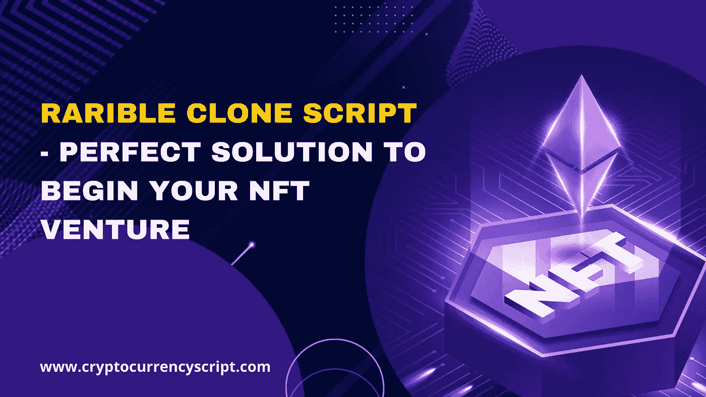

# 稀有克隆——开始你的 NFT 冒险的完美解决方案

> 原文：<https://medium.com/geekculture/rarible-clone-script-perfect-solution-to-begin-your-nft-venture-8400c3a2f58?source=collection_archive---------12----------------------->

Rarible Clone Script — Perfect Solution to begin your NFT Venture

在当前的加密领域，许多企业家准备在 web3 领域开展业务。说到 web3.0 业务，NFT 市场业务是一种重要的业务模式，这使得企业家像许多其他受欢迎的 NFT 市场一样创建业务，尤其是稀有的 NFT 市场。

根据 CoinMarketCap 的数据，加密收藏品的市值高达 1895 万美元。因此，这是企业家推出 NFT 市场平台的绝佳时机。

如果你是一名企业家，想要创建自己的 NFT 市场，那么你可以停止搜索市场的成本，因为我将帮助你用最流行的克隆脚本——Rarible 来创建你的市场。

在这篇文章中，我想解释为什么 [***稀有克隆脚本***](https://www.cryptocurrencyscript.com/rarible-clone-script) 是开始你的 NFT 创业的完美方式。

# 什么是稀有的？

Rarible 是最受欢迎的 NFT 市场平台之一，允许交易或购买/销售数字收藏品，这些收藏品按艺术、音乐、视频、游戏角色等分类。，没有任何技术知识。这个 NFT 市场始于 2020 年。在很短的时间内，Rarible 已经成为 NFT 世界的流行语，它的用户遍布世界各地。根据 Growjo 州目前的统计数据，他们的估计年收入为每年 14.6 美元。

这是许多新生的创业公司和密码企业家表现出他们有兴趣开始类似于 Rarible 的自己的 NFT 市场的令人惊叹的方面。嗯，一些企业家认为，推出一个像 NFT 这样的稀有市场是一项相当复杂的任务，可能需要更多的技术支持和强大的财务背景。但这些东西只有从零开始开发才合适，其他方面不行。

一个最简单的方法来启动你自己的 [***NFT 市场开发***](https://www.cryptocurrencyscript.com/nft-marketplace-development) 像 Rarible 用 Rarible 克隆脚本。

让我们看看什么是稀有的克隆脚本。

# 什么是稀有克隆脚本？

Rarible Clone Script 是一个完全预编码的白标解决方案，拥有所有必要的特性和功能，可以立即启动像 Rarible 这样的 NFT 市场。这个稀有的脚本建立在以太坊区块链网络上，用户可以在平台上购买、出售和铸造数字收藏品。你可以调整所有的功能和区块链网络。

如果你有兴趣创建一个多区块链支持 NFT 市场，这太容易实现了。除此之外，作为一名企业家，你还有很多额外的业务。这不会产生任何侵犯版权的行为，因为它将完全类似于原始软件而不破坏软件的创造性。

你不用担心它会侵犯版权。该脚本完全类似于原始软件而创建，不会破坏软件的原创性。它是高度可定制的，因为它可以根据业务需求进行修改。因此，您可以根据法律管辖区和 NFT 商业要素的级别创建您的软件。

# 稀有刀概述

Rarible DAO 是一个基于 Rarible 的去中心化自治组织，它帮助用户进行买卖 NFT 的交易。它们有特定的功能。

1.  RARI 代币将被用来管理贸易。
2.  它们是按照令牌治理来划分的。奖励按照特定的白皮书进行分配。也就是说，将近 25%的令牌将分配给智能合约功能
3.  25%的代币分配给 RARI 社区
4.  未标记的 RARI 代币允许参与信令投票。
5.  他们有一个灵活的锁定期。所以你可以根据自己的舒适程度决定是下注还是不下注。

# 为什么要在其他 NFT 平台上创建一个稀有的克隆？

与 Rarible 相关的 NFT 为数字化加密和 NFT 资产提供了可交易性、流动性、价值和互操作性，随着域名行业的高速增长，预计 2025 年的门票将达到 680 亿美元，成为最受欢迎的平台。

# 使用稀有克隆软件的好处

**可扩展性**

借助这一白色标签的可定制选项，您可以根据业务需求修改端对端，使其具有高可扩展性

**用户监控**

这个稀有的克隆提供了全面监控的杠杆作用，并提供了每一个数据。

**高投资回报率**

在 Rarible Clone 脚本中，您可以集成有效的特性，从而获得高投资回报率

**测试版模块**

在 Beta 模块的帮助下，你可以在你的 NFT 市场上运行无数的测试。

**成本效益**

与其他技术相比，开发像 Rarible 这样的 NFT 市场的成本非常低。

**短周期**

用稀有的克隆体发射它需要很短的时间。

**智能合约定制**

根据您的业务需求，您可以更安全地定制您的智能合同。

**区块链兼容性**

在改造区块链网络方面的高兼容性，以及让多个区块链支持 NFT 市场的潜力。

这些都是 Rarible clone 提供的令人惊叹的商业利益。

# 罕见的克隆脚本特性

在 Rarible Clone 中，有大量的功能可用。您需要考虑一些能够为您的用户提供更好的用户体验的基本特性。您可以添加其他适合您业务需求的定制功能。以下是你的稀有克隆软件中包含的基本功能。他们是，

*   店面
*   高级过滤器
*   出价购买
*   创建列表
*   多重钱包系统
*   评级和评论
*   代币铸造
*   高流动性 API
*   多语言协助
*   多支付网关集成
*   买家/作者/管理员面板
*   尖端的安全功能及更多。

这些是你需要查看稀有克隆脚本的重要特性。现在创业者天生就问这个问题，要花多少钱？

# 做一个像 Rarible 这样的 NFT 市场要花多少钱？

一个稀有的克隆脚本的价格从 6000 美元到 6000 美元 10K 起，但这不是一个普通的价格。因为根据您的业务定制的附加功能，插件或插件的成本可能会有所不同。但是成本变化与划痕成本不同。

正如我上面提到的，基于你的克隆脚本提供者，稀有克隆软件的价格是不同的。不仅仅是价格，你的稀有克隆脚本的质量也会有所不同。因此，找到一个值得信赖的稀有克隆脚本提供者比其他人更值得关注。

# 谁提供熟练稀有的克隆脚本？

读完这篇文章后，现在每个企业家心中都有一个问题，“谁提供了最好的稀有克隆脚本？”对！我知道你们的日程很忙，所以你们可能没有太多的时间去做很多关于 NFT 市场的分析。通过将我的研究结果提供给脚本提供者，我将使您的分析过程更加简单。深度分析后，我听了 Zodeak 这个名字。他们让我反复深入探究关于他们的细节。

他们符合上述所有标准。如果你打算像 Rarible 一样进入 NFT 市场，你可以联系他们获得一个成熟的 Rarible 克隆脚本。