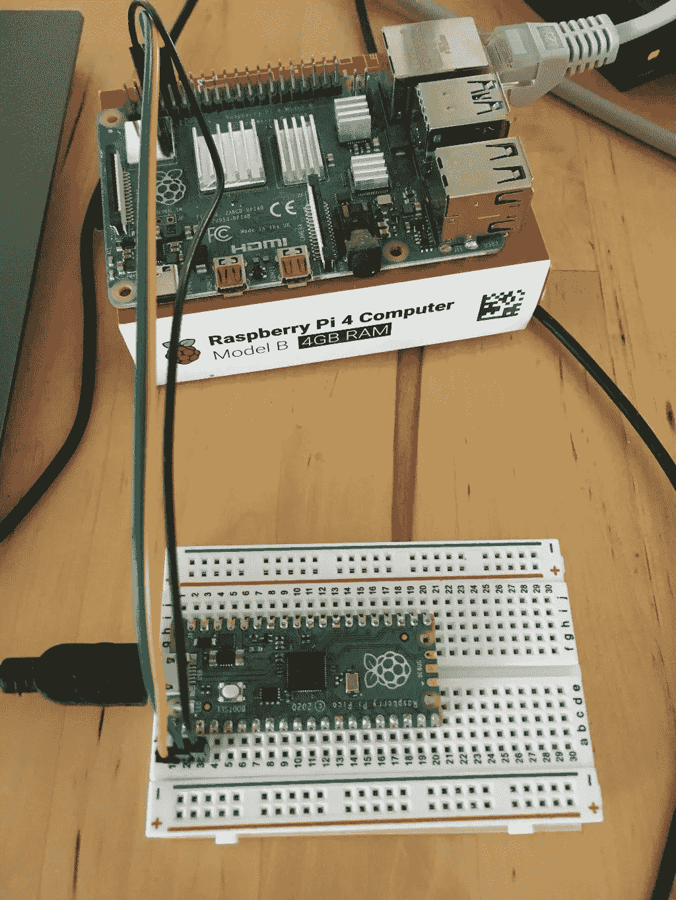

# Raspberry Pi:用于 I2C、SPI、UART 的 Python 库

> 原文：<https://medium.com/geekculture/raspberry-pi-python-libraries-for-i2c-spi-uart-3df092aeda42?source=collection_archive---------4----------------------->



Raspberry Pi 是最受业余爱好者欢迎的单板计算机之一。它的 40 个引脚支持 I2C、SPI 和 UART 协议。如果您阅读了本系列，您会对这些协议很熟悉。但是你怎么能把它们和你的树莓派一起使用呢？

本文向您展示了如何使用 Python 处理这些协议。对于每个协议，我将列出库，并向您展示一个简单的示例，以便您可以轻松地开始。

*本文原载于* [*我的博客*](https://admantium.com/blog/micro09_raspberry_pi_i2c_spi_uart_python_libraries/) 。

# I2C

使用 I2C 设备时，您有多种选择。无处不在的通用库 luma 提供了一个[通用串行对象](https://luma-core.readthedocs.io/en/latest/interface.html)，它支持 I2C 连接。用法很简单:导入库，定义 IC2 寄存器，然后开始发送和读取数据。下面是一个如何建立 I2C 连接的示例

```
from  luma.core.interface.serial.i2c import i2ci2c_connection = i2c(port=0, address=0x3c)i2c_connection.data('Hello')
```

然而，该库旨在创建用于实例化具体屏幕的连接对象，因此如果您使用其他基于 I2C 的传感器，它可能不合适。

另一个选项是 Python [smbus2 库](https://pypi.org/project/smbus2/)。它支持 i2C 协议和几种低级读写访问方法。它访问其主机内置的 smbus 内核模块，从中可以获得一个 I2C 实例。

```
from smbus2 import SMBus, i2c_msgi2c = SMBus(1)msg = i2c_msg.write(80, 'Hello'.encode())
bus.i2c_rdwr(msg)
```

# 精力

连接 SPI 器件的第一步是确定将器件连接到哪条 SPI 总线。在 Raspberry Pi 上，[存在不同的 SPI 总线系统](https://www.raspberrypi.org/documentation/computers/raspberry-pi.html#serial-peripheral-interface-spi): 3 个 SPI 总线系统用于版本 3 之前的 Raspberry Pi，7 个 SPI 总线系统用于 Raspberry Pi 4。记下具体的总线，因为它将映射到系统中需要用于配置的设备文件。

SPI 协议由一个主动维护的库 [spidev](https://pypi.org/project/spidev/) 支持。它可以轻松连接任何相连的 SPI 器件，根据所需规格配置该连接(速度单位为 HZ、时钟极性等)，然后读取和写入数据。假设您要在总线 5 上连接一个 SPI 器件，以下示例将连接该器件并向其写入数据。

```
from spidev import SpiDevspi = SpiDev()
spi.open(5,1)spi.max_speed_hz = 4000msg = [0x01, 0x02, 0x03]
spi.xfer(msg)answer = spi.readbytes(100)
print(answer)spi.close()
```

另一个选项是 [Adafruit_Blinka 库](https://github.com/adafruit/Adafruit_Blinka)，这是一个通用库，为运行 MicroPython 或 CPython 的设备封装了 CircuitPython API。因为 Raspberry Pi 与 CPython 一起工作，所以您可以使用这个库及其许多函数。它提供了接口 PI 的 SPI 特定 GPIO 引脚的抽象，以及创建连接的 SPI 类。但是，您需要在[附加配置](https://learn.adafruit.com/circuitpython-on-raspberrypi-linux/spi-sensors-devices)之后安装这个库，然后使用 SPI 总线 1。完成后，您就可以使用 SPI 器件了，如下所示:

```
import time
import busiospi = busio.SPI(board.SCK_1, MOSI=board.MOSI_1, MISO=board.MISO_1)spi.configure(baudrate=400000)spi.write(b'\x01')
spi.write(b'\x02')
spi.write(b'\x03')time.sleep(0.120)answer = spi.read(f)
print(answer)spi.deinit()
```

# 通用非同步收发传输器(Universal Asynchronous Receiver/Transmitter)

对于 UART 连接，有几种选择。Python 库 [pyserial](https://pypi.org/project/pyserial/) 为进行串行连接提供了一个简单的、可配置的对象。您可以配置设备文件、波特率和其他通信方面，如位大小、奇偶校验、超时等。它实现 Pythons 上下文管理器协议，因此在其程序块结束时自动关闭连接。这里有一个例子:

```
from serial import Serial with Serial('/dev/ttyUSB0', 9600) as serial:
  serial.send('Hello to Arduino')
  answer = serial.readline()
  print(answer)
```

第二个选项也是 [Adafruit_Blinka 库](https://github.com/adafruit/Adafruit_Blinka)，特别是 [busio UART API](https://circuitpython.readthedocs.io/projects/blinka/en/latest/api.html#busio.UART) 。与 PySerial 非常相似，您可以使用默认配置创建一个连接，然后开始向其中读写数据。但是，它不处理设备文件，而是直接处理 pin。

```
from busio import UARTserial = UART(14,15,baudrate=9600)serial.write('Hello to Arduino')
answer = serial.readline()
print(answer)serial.deinit()
```

# 结论

在 Raspberry Pi 上，有几个使用 I2C、SPI 和 UART 协议的选项。本文不是这些库的完整列表。一方面，有非常具体的库，比如 UART 的`pyserial`，或者 I2C 的`spidev`。另一方面，像`luma`和`busio`这样的通用库支持两种或所有三种协议。考虑到这一点，我建议选择通用库，尤其是如果您打算连接到这些库已经支持的传感器。