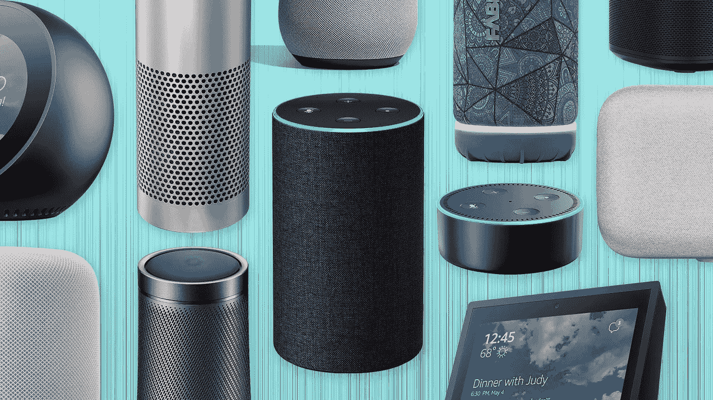
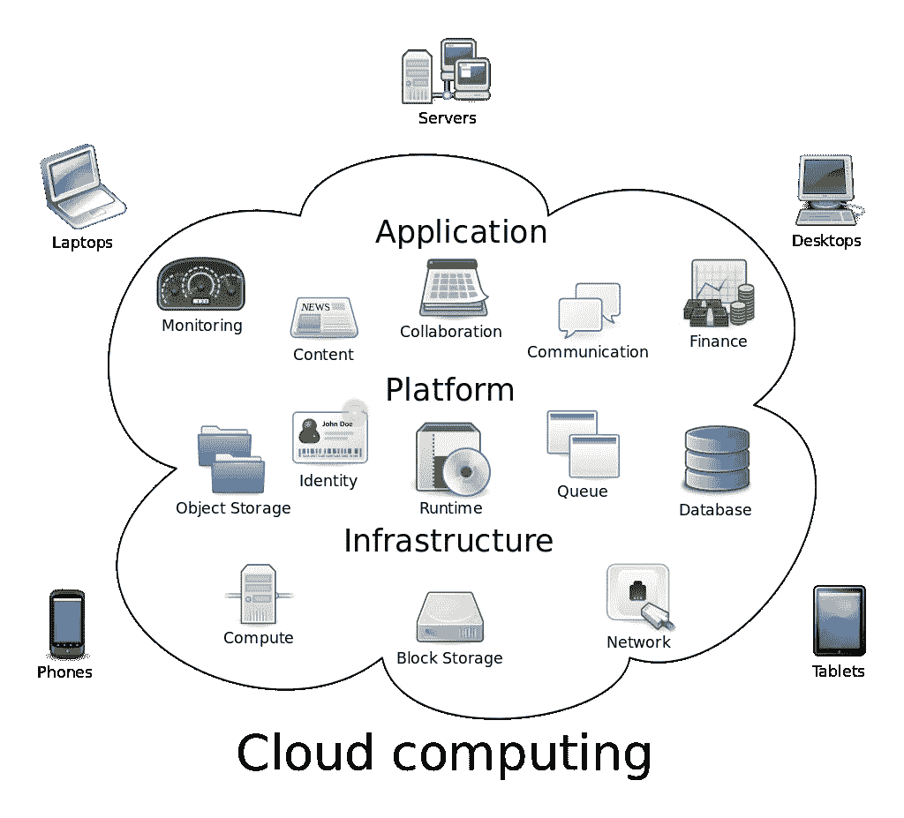
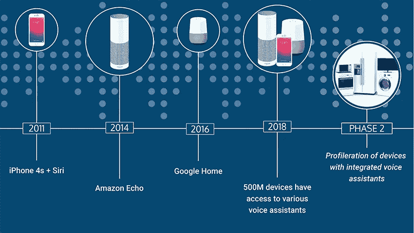
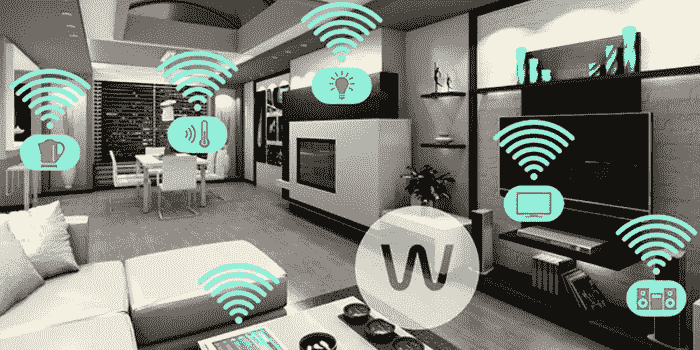
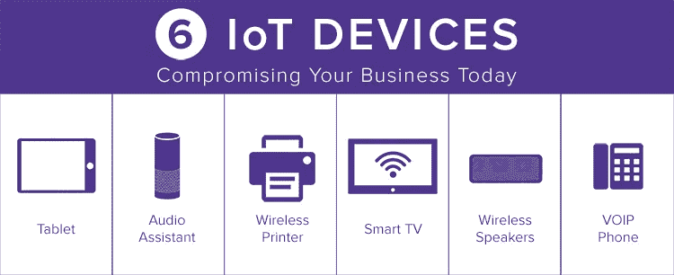
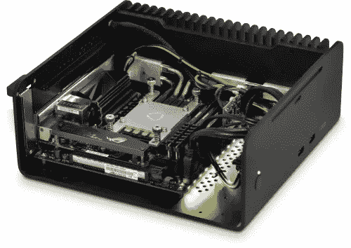
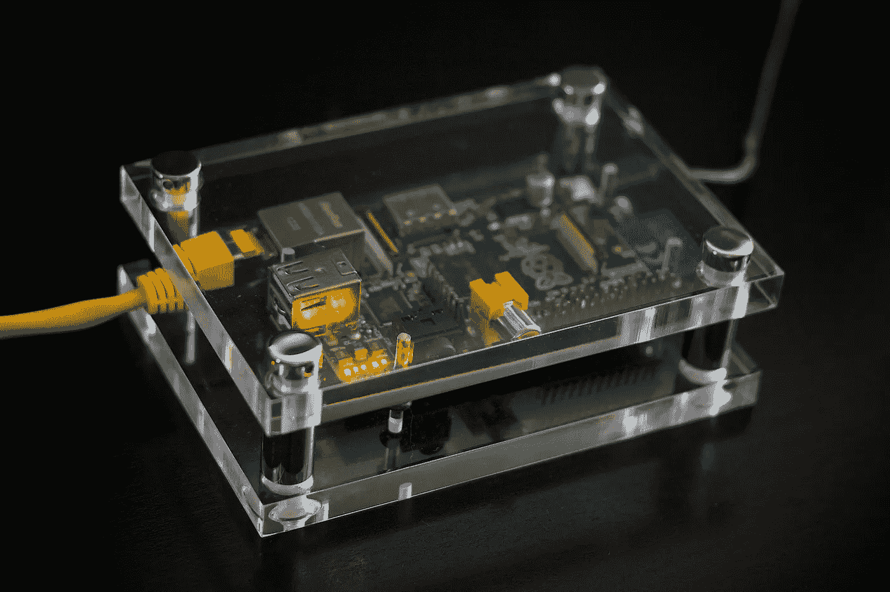

# Raspberry Pi 智能扬声器和自助服务

> 原文：<https://medium.com/geekculture/raspberry-pi-smart-speaker-and-roll-your-own-services-dfdaddb6cc85?source=collection_archive---------1----------------------->

Image by [Steven Stone](https://audiophilereview.com/author/steven-stone/) from [AudiophileReview](https://audiophilereview.com/affordable-speakers/are-smart-speakers-everyones-future/)

经过阅读和思考，我已经基本决定我的下一个家庭科技项目将是一个[树莓皮](https://www.raspberrypi.org/)驱动的智能音箱。我这样做有几个原因，在可能的情况下，我喜欢在应用程序级别推出自己的服务；例如，我自己的私人流媒体服务使用虚拟私人服务器、基于云的存储和 [Plex](https://www.plex.tv/) ，而不是仅仅使用[网飞](https://www.netflix.com/)；我自己的多模式(即通过电视和智能手机访问相同的内容)控制台替代 PC/复古游戏服务，使用不同的仿真器、 [LaunchBox](https://www.launchbox-app.com/) 前端和云存储，而不是简单地获得一个[任天堂 Switch](https://www.nintendo.com/switch/)；我自己的电子书服务使用类似的云存储， [Ubooquity](https://vaemendis.net/ubooquity/) 图书服务器，以及跨不同设备的客户端应用，而不是亚马逊 Kindle 生态系统。

这样做通常涉及一些用于自动化或配置的 Linux 命令行脚本，以及使用什么应用程序和现有服务的知识。这对于任何一个不太懂技术或者非常耗时的人来说都不算什么，但是你不能要求一个普通的消费者去做。

Image by [vschlichting](https://depositphotos.com/portfolio-2296007.html) from [Depositphotos](https://depositphotos.com/40754867/stock-photo-cloud-computing.html)

这主要是因为我以前是一名技术人员；它允许我探索和玩有趣的新技术！此外，我不喜欢在相互竞争的服务之间做出选择，尤其是媒体和内容被不同的服务独占的情况下；在我看来，仅仅因为想看不同的电视节目，就不得不在不同的服务之间转换，这对消费者来说是不好的。

当独家内容被绑定到特定的应用程序时，它就失去了信息技术和计算的大部分意义，这意味着将数据从媒体或来源中分离出来。最后，虽然在中长期内，时间或设备等前期成本可能高于简单订购或购买现有服务和设备，但这些成本远低于经常向多个竞争服务或拥有多个不同设备支付的成本。

Image by [Shreyas Sali](/@salishreyas?source=post_page-----4a1c32a6be12--------------------------------) from [Medium](/@salishreyas/are-voice-assistant-apps-trending-amazonalexa-googleassistant-4a1c32a6be12)

考虑到我现有的自制服务，下一个明显的地方是智能音箱，它可以将我基于现有应用程序的服务整合在一起。对此的要求将是同时访问[亚马逊 Alexa](https://alexa.amazon.com/) 、[谷歌助手](https://assistant.google.com/) t 和开源人工智能语音助手[迈克罗夫特](https://mycroft.ai/)；从同一设备，未来可能扩展到任何其他语音助手。

它需要播放音乐或任何其他录制的媒体，如来自不同流媒体源的有声读物，如 [Spotify](https://www.spotify.com/) 、 [Google Play Music](https://play.google.com/music) 或 my media，而无需切换应用程序。理想情况下，它可以在控制设备上运行命令，或者与[家庭助理/haas.io](https://www.home-assistant.io/) 进行事件交互，用于任何未来的智能家庭自动化。

Image by [AtReef](https://www.youtube.com/channel/UChodFMXh71jg3E--yxoCeMA) from [YouTube](https://www.youtube.com/watch?v=n8MJd8E_kTM)

虽然几乎每个平台上都有这些不同应用程序的实现，但几个要求意味着使用新设备是有意义的。智能音箱需要一直开着，随时可用。它会放在我家卧室里我最常使用的地方，通常是在一天开始时看新闻或者播放背景音乐，但不会打断我的睡眠。

我现有的游戏 PC/工作站有一个强大的风扇和一个混合固态/机械硬盘，两者都产生噪音，高功率要求意味着它不是一个合适的平台。类似地，我现有的 HTPC/控制台替代 PC，类似地，虽然没有风扇问题，几乎没有噪音，但由于类似地依赖于标准机械硬盘驱动器，使其不适合，因此在噪音方面受到影响。

我的平板电脑和智能手机电池寿命短，不适合使用，这通常意味着它们有时会不可用。我的媒体服务器是一个托管在数据中心的虚拟机，没有直接的、物理上可访问的接口。

Image by [Markku Rossi](https://blog.ssh.com/author/markku-rossi) from [SSH.COM](https://blog.ssh.com/the-chalubo-botnet-is-probing-enterprises-to-exploit-weak-passwords-and-vulnerable-devices)

这意味着需要一个新设备来运行应用程序和访问在线服务，从而驱动智能扬声器。新设备需要无风扇，只有固态存储，没有机械部件，以最小化噪音和良好的 Wi-Fi 连接性&蓝牙。这提供了几个硬件选项。

第一款是带固态硬盘的无风扇电脑。有几种可用的，大多基于 NUC 或现有的迷你电脑模式，旨在用于媒体电脑或工业用途，如数字标牌、演示或设备安静运行至关重要的任何地方。第二个是 Raspberry Pi，这是一款廉价、常见且支持良好的单板计算机，通常用于许多需要低功耗数字控制器的不同小型技术项目。

Image by [Quiet PC](https://www.amazon.co.uk/stores/Quiet+PC/page/0692AD7A-1528-439A-9F13-24C898A3227F) from [Amazon](https://www.amazon.co.uk/Quiet-PC-Sentinel-AMD-Fanless/dp/B07XG74KKW)

由于需要许多不同的单独应用程序和软件，因此托管操作系统需求得到了很好的支持。它需要开放和可扩展，因为我不知道我可能会遇到什么问题，可能需要除了简单的安装配置额外的工作。

它需要易于脚本化，以实现不同应用程序和组件之间的自动化连接。这使得 Linux 成为基于 [Debian](https://www.debian.org/) 发行版的显而易见的选择，因为它有广泛的支持和软件包管理系统。

Image [Nico Kaiser](https://www.flickr.com/photos/nicokaiser/) from [Flickr](https://www.flickr.com/photos/nicokaiser/7576625174/)

答在看了价格、所需的全部组件并考虑了供应商之后；显而易见的选择是运行 Raspbian 操作系统的 Raspberry Pi。这符合上述所有要求，同时仍比其最接近的替代品略便宜。

其他必要的硬件组件将是具有内置麦克风的蓝牙扬声器，以充当智能扬声器本身，以及必要的用户接口硬件，以获得为扬声器供电的设备的初始配置，如键盘、鼠标、显示器等。然而，一旦智能扬声器顺利工作，这些将不会被使用，此时它将成为其自身控制设备的主要接口。