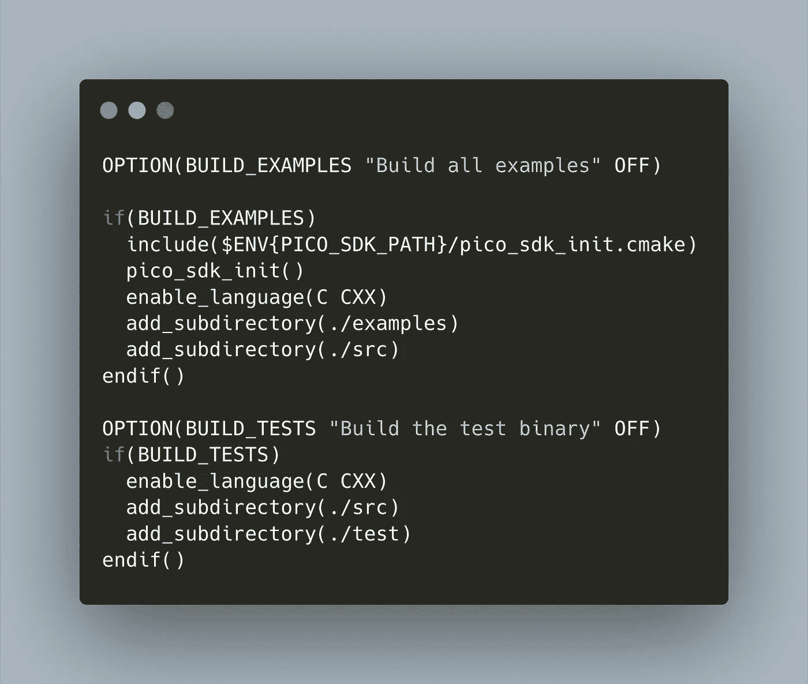

# Raspberry Pico 和 CMake:高级设置

> 原文：<https://medium.com/geekculture/raspberry-pico-and-cmake-advanced-setup-81ce47613076?source=collection_archive---------37----------------------->



CMake 是树莓微微生态系统的构建系统。在上一篇文章中，我从一个不熟悉 c 的开发人员的角度解释了 CMake 的基本原理。如果您已经理解了，现在您应该可以轻松地用 CMake 构建您的程序了。

在此基础上，本文涵盖了额外的技术:条件配置、预处理器符号，包括第三方库，以及如何添加测试。

*本文原载于* [*我的博客*](https://admantium.com/blog/pico07_advanced_cmake/) 。

# 示例:Pico DHT11 库

这篇文章解释了我在库中使用的设置。一个很好且不太复杂的例子是我从 DHT11 传感器读取温度数据的库: [pico-dht11-lib](https://github.com:admantium-sg/pico-dht11-lib) 。

这个项目有下面的目录结构，我将在文章中提到。此外，查看回购，了解本文中解释的所有技术。

```
├── CMakeLists.txt
├── cmake
│   └── cmocka.cmake
├── include
│   └── admantium
│       └── pico-dht11.h
├── src
│   ├── CMakeLists.txt
│   └── pico-dht11.c
└── test
    ├── CMakeLists.txt
    ├── mocks.h
    └── test.c
```

# 条件配置

在某些项目中，您需要构建一个具有特定案例的项目:仅库、示例代码或测试。这些情况也有不同的需求，比如它们将使用项目的哪些部分，链接到哪些其他库，甚至使用特定的编译器或编译器选项。

使用 CMake 选项可以实现条件配置:在根配置文件中定义，它们将您的项目分解到其他配置文件和源代码。

在 pico-dht11-lib 中，条件配置`BUILD_EXAMPLES`和`BUILD_TESTS`表示如下:

```
OPTION(BUILD_EXAMPLES "Build all examples" OFF)if(BUILD_EXAMPLES)
  include($ENV{PICO_SDK_PATH}/pico_sdk_init.cmake)
  pico_sdk_init()
  enable_language(C CXX)
  add_subdirectory(./examples)
  add_subdirectory(./src)
endif()OPTION(BUILD_TESTS "Build the test binary" OFF)
if(BUILD_TESTS)
  enable_language(C CXX)
  add_subdirectory(./src)
  add_subdirectory(./test)
endif()
```

关键字`OPTIONS`后跟一个符号、一个描述性字符串和一个布尔值。然后，在其他 CMake 文件中的任何地方，您都可以引用这个选项名，并使用像`if`和`elseif`这样的表达式来分支构建选项。

如何调用选项？从根目录调用`cmake`时，添加选项及其布尔值:

```
cmake -B build -S . -DBUILD_TESTS=ON
```

# 定义预处理器符号

选项还有助于将预处理符号传递给源代码文件:简单地使用完全相同的名称。

在 pico-dht11-lib 中，`BUILD_TESTS`或`BUILD_EXAMPLES`的存在将决定是否包含 Raspberry Pico SDK 或模拟文件。

```
// src/pico-dht11.c
#include <admantium/pico-dht11.h>
#ifndef BUILD_TESTS
#include <pico/stdlib.h>
#endif#ifdef BUILD_TESTS
#include <../test/mocks.h>
#endif
```

要将选项传递给源代码文件，您需要通过添加指令`target_compile_definitions`来修改同一文件夹中的可执行文件/库配置文件。检查 CMake 选项是否处于活动状态，如果是，将它传递给库或可执行文件。

```
# src/CMakeLists.txtif(TEST_BUILD)
  # pass -D TEST_BUILD when compiling
  target_compile_definitions(pico-dht11 PUBLIC -D TEST_BUILD)
  target_link_libraries(pico-dht11 test)
else()
  # normal build, link with pico_stdlib
  target_link_libraries(pico-dht11 pico_stdlib)
endif(TEST_BUILD)
```

# 包括第三方库

CMake 有着悠久的历史，因此它有一个很长的命令列表，您可以使用它来包含其他库。Pico SDK 使用 git 子模块。最近的一个选择，也是对我来说开箱即用的一个，是`FetchContent`。使用 CMake 文件，您可以指向 Github 上的任何其他 CMake 项目，添加选项，然后可以在您的其他 CMake 文件中使用它。

pico-dht11-lib 使用了[的 cmocka 测试框架](https://cmocka.org/)。为了将它包含在项目中，使用了以下文件。

```
# cmake/cmocka.cmakeinclude(FetchContent)FetchContent_Declare(
  cmocka
  GIT_REPOSITORY https://gitlab.com/cmocka/cmocka.git
  GIT_TAG        cmocka-1.1.5
  GIT_SHALLOW    1
)set(BUILD_SHARED_LIBS ON)
set(WITH_STATIC_LIB ON)
set(WITH_EXAMPLES OFF)FetchContent_MakeAvailable(cmocka)
```

然后，测试可执行文件可以与 cmocka 符号链接。

```
# test/CMakeLists.txtfile(GLOB FILES *.c *.h)
add_executable(test ${FILES})include(../cmake/cmocka.cmake)
target_link_libraries(test PRIVATE cmocka-static pico-dht11)
```

# 包括测试

测试的包含是以上所有步骤的总和:定义一个 CMake 选项来有条件地配置和构建您的项目，使用选项名称作为预处理程序符号，并将您的测试代码链接到测试库。

pico-dh11-lib 中的一个简单测试用例是 DHT11 结构的配置。

```
#include <stdarg.h>
#include <stddef.h>
#include <setjmp.h>
#include <stdint.h>
#include <stdio.h>#include <cmocka.h>#include <admantium/pico-dht11.h>DHT11 *dht;void test_dht_config(void **state)
{
  dht = dht11_new((PinConfig){
      .DATA_PIN = 16
  }); assert_int_equal(dht->DATA_PIN, 16);
}int main(int argc, char *argv[])
{
  printf("Runing Tests\n"); void *state; const struct CMUnitTest tests[] = {
      cmocka_unit_test(test_dht_config),
  }; return cmocka_run_group_tests(tests, NULL, NULL);
}
```

参见我的 [cmocka 文章](https://admantium.com/blog/pico03_testing_with_cmocka/)了解更多关于测试的知识。

# 结论

本文向您展示了高级的 CMake 技术。首先，我们学习了如何在根 CMake 文件中定义 CMake 选项，以及如何使用它们进行条件配置和构建。其次，我们看到了用`cmake`命令调用的 CMake 选项是如何作为预处理器符号传递给源文件的。第三，我们看到了如何使用`FetchContent`命令来包含任何其他的 CMake 项目。最后，我们看到了所有这些技术是如何结合在一起来包含和构建测试的。