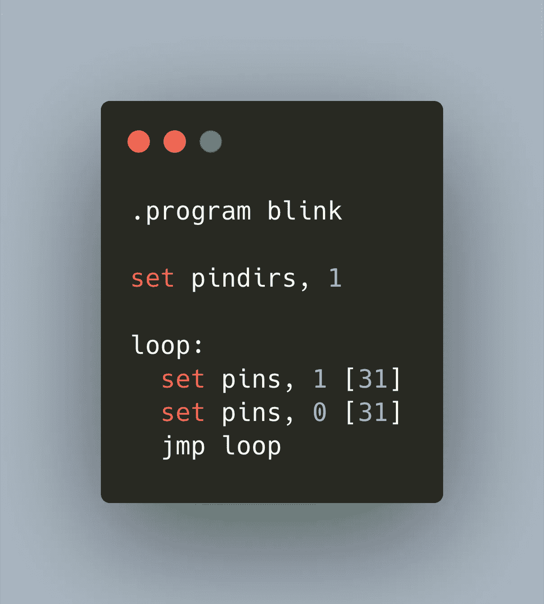

# Raspberry Pico:用 PIO 状态机编程

> 原文：<https://medium.com/geekculture/raspberry-pico-programming-with-pio-state-machines-e4610e6b0f29?source=collection_archive---------1----------------------->



在微控制器编程中，与其他硬件的接口可能非常简单，也可能非常具有挑战性。如果传感器等其他硬件支持 I2C、SPI 或 UART 等标准总线系统，您只需将它们连接起来，并通过实现的总线系统读取/写入数据。如果你需要连接其他硬件，你必须实现精确的定时信号，用多个管脚发送和接收数据，并解释这些信号。

您可以用普通的 C 语言编写这些时序考虑事项，但这意味着要非常小心地编程，因为您受限于处理器的时钟周期，需要了解每行代码的时序影响。

为了应对这一挑战，Raspberry Pico 有一个独特的硬件扩展:PIO，可编程输入/输出的缩写。PIO 被实现为 4 个独立的状态机。每个状态机与 FIFO 队列相连，与主程序交换数据。除了队列之外，stata 机器可以 DMS 和访问所有 GPIOs，但不能访问其他硬件或协议。

Pico 社区使用 PIO 来输出声音效果或视频，连接到专有的 LCD 系统，或连接其他需要非常特定的协议的硬件。

为了帮助你开始使用 PIO，这一篇文章是一个简明的介绍:学习硬件部分的基本知识，看看一个 PIO 程序是什么样子，以及它如何与一个 C 主程序交互，最后潜入 PIO 编程语言。

*本文原载于* [*我的博客*](https://admantium.com/blog/pico09_pio/) *。*

# 你为什么需要 PIO？

当您想要与无法连接到板载支持的 USB、I2C、SPI 或 UART 协议的硬件接口时，您必须编写时间非常有限的代码来读写 GPIOs。然而，当您想要连接的外部硬件需要非常低的数据传输速度时，您就需要处理中断或长等待周期。

官方的 C SDK 指南明确指出，对比你的主进程慢 1000 倍的协议使用 IRQ 是不切实际的，因为你将注定 CPU 在大部分时间都在等待。或者，在另一端，您可能有一个高周期的硬件，您正在迫使您的微控制器从不错过任何一个时钟周期。这两种挑战都迫使你陷入相同的境地:所有的 CPU 资源都将花费在处理或等待一个外部硬件上。你不能用你的 Pico 做其他任何事情。

PIO 子系统为这个问题引入了一个新颖的解决方案。从表面上看，它类似于[现场可编程门阵列(FGPA)](https://en.wikipedia.org/wiki/FGPA) ，为构建复杂逻辑提供编程环境。但你不是用软件设计集成电路，然后需要编写与这种状态交互的微控制器软件。相反，您可以直接编程多达 4 个不同的状态机。每个状态机可以自由访问 GPIO 引脚以读写数据，可以缓冲来自处理器或其他 DMA 的数据，并通过中断或轮询通知处理器其计算结果。

# PIO 示例程序:闪烁的 LED

让我们定义一个简单的 PIO 启动程序，它将使 LED 闪烁。我们需要定义两个文件:一个 PIO 文件，它保存了类似汇编程序的代码，另一个是带有`main`函数的普通 C 文件。

让我们先看看 PIO 的档案。一个 PIO 文件由两部分组成:一个是定义 PIO 指令的`program`部分，另一个是包含将 PIO 程序暴露给`main`程序的函数的`c-sdk`部分。基本布局是这样的:

```
.program hello...% c-sdk {
...
%}
```

# PIO 计划

PIO 程序本身实际上是用汇编语言编写的，准确地说是汇编语句的子集。要交替打开和关闭 led，以下程序就足够了:

```
.program helloset pindirs, 1loop:
  set pins, 1 [31]
  set pins, 0 [31]
  jmp loop
```

让我们一行一行地剖析这个程序。

*   第 1 行:`program`语句开始声明一个 PIO 程序。它需要有一个标识符，这个标识符将在编译和链接过程中使用。
*   第 3 行:`SET`指令是一个多用途语句。这一行意味着我们将所有已配置的 set 引脚设置为输出
*   第 5 行:这个`loop`声明是一个自由格式的标签，用来对一个更大的程序的各个部分进行分组。
*   第 6 行:将配置的 LED 引脚设置为在总共 32 个时钟周期内输出高值。每个 PIO 语句在 1 个时钟周期内执行，并且可以使用额外的 5 位值来等待额外的周期。
*   第 7 行:将配置的 LED 引脚设置为在总共 32 个时钟周期内输出低值。
*   第 8 行:用`JMP`我们回到先前定义的`loop`标签。

# C-SDK 绑定

为了运行这个程序，您还需要定义一个 C-SDK 绑定。本质上，绑定是 PIO 程序内部的一个函数。在编译期间，它将被编译器拾取，编译器输出一个头文件，您可以将它集成到主程序中。

添加以下代码——本文后面会有详细的解释。

```
% c-sdk {static inline void hello_program_init(PIO pio, uint sm, uint offset, uint pin) {
  // 1\. Define a config object
  pio_sm_config config = hello_program_get_default_config(offset); // 2\. Set and initialize the output pins
  sm_config_set_set_pins(&config, pin, 1); // 3\. Apply the configuration & activate the State Machine
  pio_sm_init(pio, sm, offset, &config);
  pio_sm_set_enabled(pio, sm, true);
}
%}
```

# 主程序

最后，我们在主程序文件中添加所有的东西。

```
#include <stdio.h>
#include <stdbool.h>
#include <pico/stdlib.h>
#include <hardware/pio.h>
#include <hello.pio.h>#define LED_BUILTIN 25;int main() {
  stdio_init_all(); PIO pio = pio0;
  uint state_machine_id = 0;
  uint offset = pio_add_program(pio, &hello_program);  hello_program_init(pio, state_machine_id, offset, LED_BUILTIN, 1); while(1) {
    //do nothing
  }
}
```

在这里，我们可以看到以下详细信息:

*   第 4 行:为了使用 PIO 状态机，我们需要包含这个特殊的头
*   第 5 行:该语句包括编译期间汇编的 PIO 程序。它将公开之前定义的函数`hello_program_init`，并将指向程序的指针定义为`hello_program`。注意命名约定！
*   第 12 行:Pico 有两条不同的状态机总线，我们需要将我们的状态机定义为属于其中一条。
*   第 13 行:我们定义了状态机的 id(一个 4 位值)
*   第 14 行:这条语句分配动态内存来保存状态机代码。它返回一个内存偏移值，我们将把这个值传递给状态机初始化
*   第 16 行:我们初始化并启动程序

# PIO 技术细节

看过示例后，让我们深入了解技术细节。

# PIO 组件

Pico 提供了两个 PIO 模块，每个模块中有 4 个状态机。每个状态机都提供以下组件。

*   TX FIFO/RX FIFO:从主程序接收或向主程序发送 32 位值
*   输入移位寄存器(ISR)/输出移位寄存器(OSR):这些寄存器保存易失性数据，用于状态机和主程序之间的直接交换。
*   暂存寄存器:标记为`x`和`y`，这些 32 位寄存器允许您存储状态机所需的任何附加数据。
*   可配置的时钟分频器:Pico 的时钟周期为 133MHz，可通过 16 位值调整至 2000Hz
*   灵活的 GPIO 映射:Pico 的核心是访问 GPIO 引脚的能力，每个状态机可以处理四组不同的 GPIO(输入、输出、set、side-set)
*   DMA 访问:不涉及主处理器而直接访问内存
*   IRQ 标志:可以设置或清除 8 个全局标志，每个状态机和主程序都可以立即访问中断

# PIO 汇编语言

为了给 PIO 编程，你要使用汇编语言的一种特殊方言。在示例程序中，我们已经看到了如何将逻辑电平应用于引脚，以及如何定义一个简单的循环。汇编语言中只有 9 个命令，以及一些用于代码结构的附加语句。我将简要介绍所有指令，但是所有指令的完整定义，请参见[官方文档](https://datasheets.raspberrypi.org/pico/raspberry-pi-pico-c-sdk.pdf)的第 3.3.2 节。

因为语言非常压缩，所以几个语句执行多个功能。尤其是如何正确使用 GPIO 引脚可能会很棘手。因此，我将语句分成不同种类的函数。

# 程序结构

为了从总体上构建您的程序，您可以使用以下命令。

*   `.program NAME` -程序的名称，也是编译过程中生成的头文件的名称，用于访问主程序中的状态机
*   `.define NAME VALUE` -类似于你的 C 程序，你可以定义在状态机中可见的顶级常量
*   `LABEL:`——标签是相关语句的句法分组。您可以定义任何标签，然后跳回它
*   `; COMMENT` -分号后面的任何内容都是注释
*   `.wrap_target`和`.wrap` -重复运行一段游 PIO 程序的指令
*   `.word` -存储一个原始的 16 位值作为程序中的指令(每个 PIO 语句都是一个 16 位值)
*   `.side_set COUNT (opt)` -该指令另外配置该程序的侧引脚。计数值是从指令中减少的位数，opt 值决定 PIO 程序中的`side`语句是可选的还是强制的。当你使用这个声明时，你可以附加额外的命令到所有的表达式，例如`out x, 1 side 0`将一个字节从`OSR`转移到 FIFO RX，并将 SIDE 引脚设置为逻辑低电平。

**移动移位寄存器内的数据**

*   `in SOURCE count` -将数据移入 ISR，来源可以是`X`、`Y`、`OSR`或`ISR`，计数为`0...32`
*   `out DESTINATION count` -将数据从 OSR 转移到目的地`X`、`Y`、`ISR`
*   `mov DESTINATION, SOURCE` -将数据从源(`X`、`Y`、`OSR`或`ISR`)移动到目的(`X`、`Y`、`OSR`或`ISR`)
*   `set DESTIANTION, data` -向目的地写入一个 5 位数据值(`X`、`Y`)

**在移位寄存器和主程序之间移动数据**

*   `pull` -将数据从 TX FIFO 加载到 OSR
*   `push` -将数据从 ISR 推送到 RX FIFO，然后清除 ISR
*   `irq INDEX op` -将 IRQ 号`index`修改为清除(`op=0`)或设置(`op=1`)

**将数据写入 GPIO 引脚**

设置引脚

*   `set PINDIRS, 1` -将配置的 SET 引脚定义为输出引脚
*   `set PINS, value` -将高(`value=1`)或低(`value=1`)写入设置引脚

输出引脚

*   `mov PINS, SOURCE` -从源(`X`、`Y`、`OSR`、`ISR`)写入输出引脚(`X`、`Y`、`OSR`或`ISR`)

**从 GPIO 引脚读取数据**

设置引脚

*   `set PINDIRS, 0` -将配置的 SET 引脚定义为输入引脚

输入引脚

*   `mov DESTINATION, PINS` -从输入引脚写到目的地(`X`、`Y`、`OSR`、`ISR`和输出`PINS`)

**条件语句**

*   `jmp CONDITION LABEL` -当以下`CONDITION`类型之一为真时，转到`LABEL`
*   `!(X|Y|OSRE)` -当`X`、`Y`、`OSR`为空时为真
*   `X-- | Y--)` -当暂存寄存器为空时为真，否则递减暂存寄存器
*   `PIN` -当 JUMP 引脚为逻辑高电平时为真
*   `wait POLARITY TYPE NUMBER` -延迟进一步处理，直到极性匹配..
*   `pin NUMBER` -输入引脚
*   `gpio NUMBER` -绝对编号的 gpio
*   `irq NUMBER` - IRQ 号(如果极性为 1，IRQ 号被清除)
*   `nop` -什么都不做

# PIO 构型

PIO 程序是高度可配置的。pico 中的 c-sdk 部分定义了一个将由 Pico 汇编程序编译的包装函数。这个函数可以从主程序中访问，它可以接收任何参数。

您可以在该功能中配置令人眼花缭乱的方面——以下列表简要描述了所有选项。

*   定义输入引脚、输出引脚和侧引脚
*   为`JMP`指令定义一个特殊引脚
*   初始化输入引脚的方向
*   配置输入和输出移位寄存器的移位方向、自动加载和位大小(最高 32 位)
*   将输入移位寄存器配置为额外的输出移位寄存器，反之亦然
*   时钟分频器将应用于默认的 133Mhz 时钟时间，这是一个 16 位值，因此您可以将 PIO 时钟周期缩小到 2000Hz，如 0,492ms。

为了在使用 PIO 时能有所有的配置选项，我喜欢使用下面的模板。按照这个模板，我只需配置我需要修改的内容，或者删除我不需要的内容。

```
static inline void __program_init(PIO pio, uint sm, uint offset, uint in_pin, uint in_pin_count, uint out_pin, uint out_pin_count, float frequency) {
  // 1\. Define a config object
  pio_sm_config config = __program_get_default_config(offset); // 2\. Set and initialize the input pins
  sm_config_set_in_pins(&config, in_pin);
  pio_sm_set_consecutive_pindirs(pio, sm, in_pin, in_pin_count, 1);
  pio_gpio_init(pio, in_pin); // 3\. Set and initialize the output pins
  sm_config_set_out_pins(&config, out_pin, out_pin_count);
  pio_sm_set_consecutive_pindirs(pio, sm, out_pin, out_pin_count, 0); // 4\. Set clock divider
  if (frequency < 2000) {
    frequency = 2000;
  }
  float clock_divider = (float) clock_get_hz(clk_sys) / frequency * 1000;
  sm_config_set_clkdiv(&config, clock_divider); // 5\. Configure input shift register
  // args: BOOL right_shift, BOOL auto_push, 1..32 push_threshold
  sm_config_set_in_shift(&config, true, false, 32); // 6\. Configure output shift register
  // args: BOOL right_shift, BOOL auto_push, 1..32 push_threshold
  sm_config_set_out_shift(&config, true, false, 32); // 7\. Join the ISR & OSR
  // PIO_FIFO_JOIN_NONE = 0, PIO_FIFO_JOIN_TX = 1, PIO_FIFO_JOIN_RX = 2
  sm_config_set_fifo_join(&config, PIO_FIFO_JOIN_NONE); // 8\. Apply the configuration
  pio_sm_init(pio, sm, offset, &config); // 9\. Activate the State Machine
  pio_sm_set_enabled(pio, sm, true);
}
```

# 结论

PIO 是 Raspberry Pico 的可编程输入/输出状态机，是一种连接任何硬件的新颖解决方案。状态机不再浪费 CPU 周期和空闲等待时间，或者相反，不再总是读写管脚，而是承担与任何硬件交互的重任。它们可以配置为在 2000HZ 至 133Mhz 范围内工作，可以自由访问所有 GPIO 引脚，可以在每个时钟周期读写这些引脚。用一种简化的、类似汇编语言的语言，你可以对这些状态机进行编程，使其遵守特定的时序约束，并与主程序交换位数据。这篇文章展示了 PIO 是如何工作的，列出了组件和所有的编程语言语句。最后，我们看到了状态机的许多配置选项。您可以调用多达 8 个状态机与您的主程序一起工作——您的用例是什么？