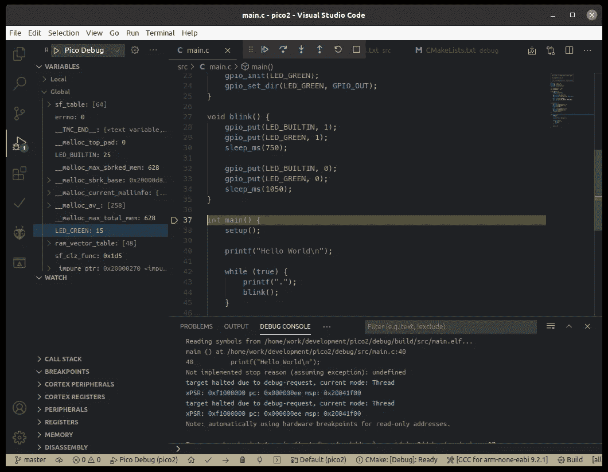
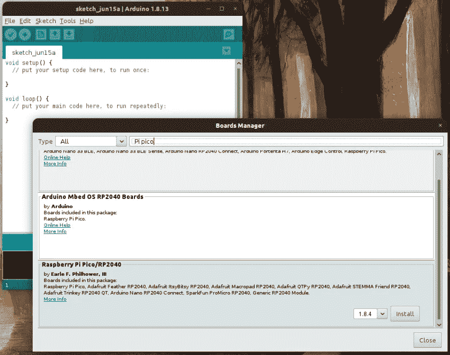
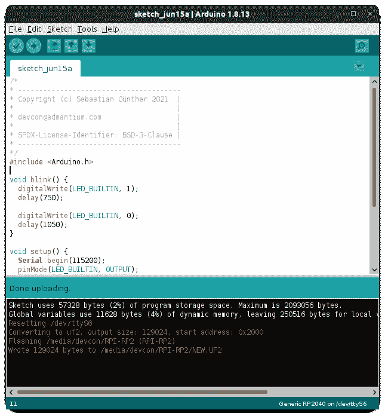
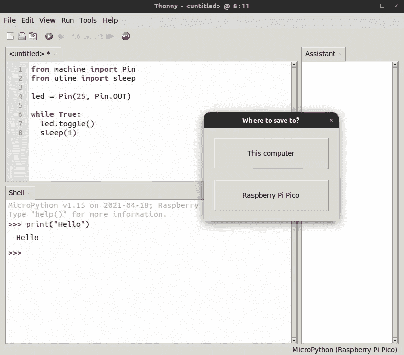
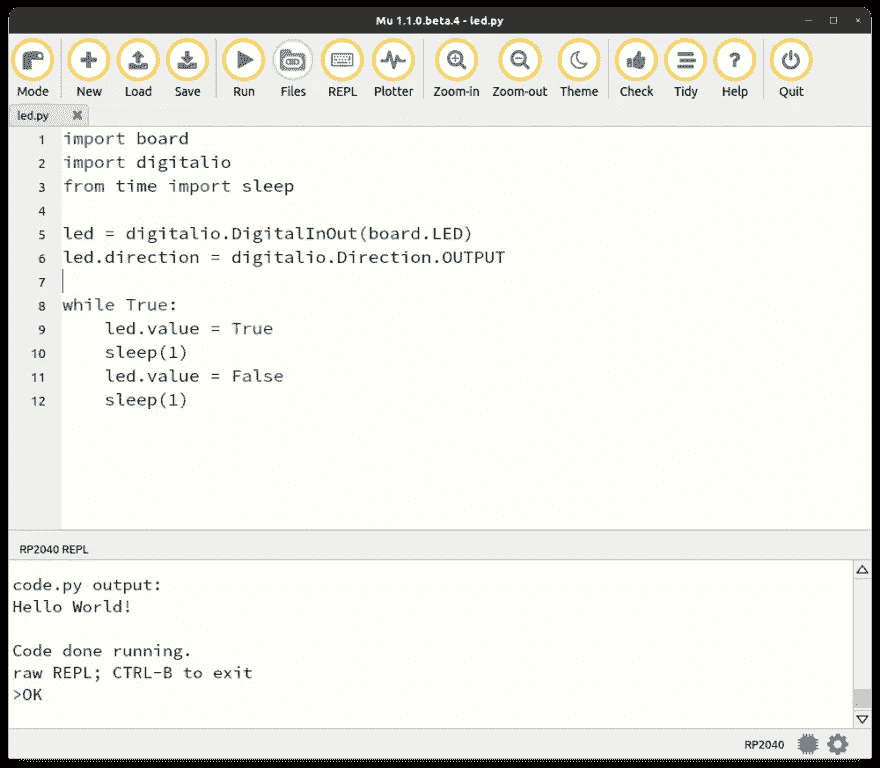

# Raspberry Pico:完整的 SDK 概述(原生 C/C++，Arduino，MicroPython，CircuitPython)

> 原文：<https://medium.com/geekculture/raspberry-pico-the-complete-sdk-overview-native-c-c-arduino-micropython-circuitpython-1ce3a70c2527?source=collection_archive---------15----------------------->



Raspberry Pico，简称 Pico，是 Raspberry Pi 基金会的一款新型微控制器。2021 年初发布时，提供了两个框架:原生 C/C++ SDK 和一个 MicroPython 端口。大约半年后，两个新增组件变得稳定了:Arduino 框架，它是 C-SDK 的一个包装器，您可以在其中使用 Arduino 命令 CircuitPython，它是 Python 的另一个嵌入式版本。本文是对所有可用框架的全面总结。您将了解安装、特性、支持编辑器，并看到每个框架的闪烁 LED 示例。

*本文原载于* [*我的博客*](https://admantium.com/blog/pico10_sdk_overview/) 。

# C/C++-SDK

原生 C/C++ SDK 是由 Raspberry Pi 基金会开发和维护的原始版本。

安装和使用在[官方文档(PDF)](https://datasheets.raspberrypi.org/pico/getting-started-with-pico.pdf) 中介绍。正确的设置可能很困难:您可以应用指南中提到的步骤，或者当您使用 Linux 操作系统时，使用[官方的一行程序](https://raw.githubusercontent.com/raspberrypi/pico-setup/master/pico_setup.sh)来完全设置复杂的工具链。

没有标准的编辑器，但是官方文档解释了如何用支持 CMake 和调试的扩展来定制 [Visual Studio 代码](https://code.visualstudio.com/)。对于一个具体的项目设置，我无耻地自我推销我自己的入门工具包: [pico-project-bootstrap](https://github.com/admantium-sg/pico-project-bootstrap) 。

您的 IDE 可能如下所示。


[最新版本 v1.20](https://github.com/raspberrypi/pico-sdk/releases) 具有现有的功能:更好地支持[自由 RTOS](https://www.freertos.org/about-RTOS.html) ，实时 Linux 系统，几个用于 DMA、时钟和互斥的更新，甚至支持新的硬件板，如新的 Pimoroni Pico LiPo。

典型的闪烁 LED 示例如下:

```
/*
* ---------------------------------------
* Copyright (c) Sebastian Günther 2021  |
*                                       |
* devcon@admantium.com                  |
*                                       |
* SPDX-License-Identifier: BSD-3-Clause |
* ---------------------------------------
*/
#include <stdio.h>
#include <stdbool.h>
#include "pico/stdlib.h"int LED_BUILTIN = 25;void blink() {
  gpio_put(LED_BUILTIN, 1);
  sleep_ms(750); gpio_put(LED_BUILTIN, 0);
  sleep_ms(1050);
}int main() {
  stdio_init_all(); gpio_init(LED_BUILTIN);
  gpio_set_dir(LED_BUILTIN, GPIO_OUT); puts("Hello World\n"); while (true) {
    puts(".");
    blink();
  }
}
```

# Arduino 框架

Arduino 是一个标识微控制器家族和 IDE 的名称，在 IOT 和机器人项目中广泛使用并广为人知。Arduino 板通常是用 C 语言编程的，默认的框架抽象了引脚、串行输入/输出、伺服等。自从[发布 1.20 版](https://github.com/raspberrypi/pico-sdk/releases)以来，你可以用 Arduino 框架编写你的 Rasperry Pico。这意味着 C-SDK 函数被包装，您可以使用典型的 Arduino 命令。

有两种方法可以实现这一点。首先，如果你来自 Arduino 世界，你可以将 Rasperry Pico 作为一个板添加到你的 Arduino IDE 中。根据[安装手册](https://arduino-pico.readthedocs.io/en/latest/install.html#installing-via-arduino-boards-manager)将 [Pico Arduino 库](https://github.com/earlephilhower/arduino-pico)添加到你的板卡管理器中。然后，选择合适的电路板，您就可以开始编程了。



或者，您可以使用 VS Code PlattformIO 扩展——一个支持各种类型硬件的微控制器插件——和 WizIO 扩展。阅读我的文章[使用 platformio](https://admantium.com/blog/pico01_getting_started/)进行简单启动，然后选择 Arduino 框架类型。



你为什么会使用这个框架？如果你熟悉 Arduino，你可能会有一个更好、更熟悉的 Arduino 编程的开始，并且可以直接投入到开发中。此外，Arduino 框架已经成熟了 10 年，因此为连接和控制硬件提供了大量的库:步进电机和伺服电机、显示器、传感器。 [Pico Arduino 框架文档](https://arduino-pico.readthedocs.io/en/latest/)指出，您可以使用伺服类来控制电机，并且完全支持 SPI 和 I2C——因为许多传感器库都基于这些协议，它们也应该与 Arduino 端口一起工作。

在这个框架中，您的闪烁 LED 示例如下所示:

```
/*
* ---------------------------------------
* Copyright (c) Sebastian Günther 2021  |
*                                       |
* devcon@admantium.com                  |
*                                       |
* SPDX-License-Identifier: BSD-3-Clause |
* ---------------------------------------
*/
#include <Arduino.h>int LED_BUILTIN = 25;void blink() {
  digitalWrite(LED_BUILTIN, 1);
  delay(750); digitalWrite(LED_BUILTIN, 0);
  delay(1050);
}void setup() {
  Serial.begin(115200);
  pinMode(LED_BUILTIN, OUTPUT);
}void loop() {
  Serial.write("Hello World\n"); while (true) {
    Serial.write(".");
    blink();
  }
}
```

上传草图并运行它。

# 微型 Python

MicroPython 是 Python3 专门针对微控制器的一个端口。Python 是一种功能强大的脚本语言，用它可以编写短小精悍的程序。

Raspberry Pico 的设置再简单不过了:从 Raspberry Foundation 获取[官方 UF2 文件](https://micropython.org/download/rp2-pico/rp2-pico-latest.uf2)，或者从官方 [MicroPython 项目页面](https://micropython.org/download/rp2-pico/)下载最新版本。然后，只需在大容量存储模式下连接您的 Raspberry Pico，删除 UF2 文件，在重置后，您可以通过串行连接到您的 Pico。因为 Python 是一种解释型语言，这意味着您可以通过串行连接编写代码并立即运行它。

官方推荐的 MicroPython 的 IDE 是 [Thonny](https://thonny.org/) 。Thonny 故意简单。在文本编辑器区域，您可以编写 Python 代码，然后将其存储在您的计算机上或直接存储在 Raspberry Pico 上。存储在 Pico 上意味着:无论是在 Pico 上的根或`lib`文件夹中，你都可以保存任何脚本，允许你用不同的文件进行更复杂的项目。而如果你直接在根目录下保存一个名为`main.py`的脚本，这将作为你 Pico 的程序执行。或者，您可以打开到 Pico 的串行连接，并以交互方式实现一个程序。



紧凑的 [MicroPython 参考文献](http://docs.micropython.org/en/latest/pyboard/quickref.html#)展示了简单脚本的可行性:只需 4 行代码，您就可以编程中断、控制伺服电机或设置定义良好的 PWM。MicroPython 还支持 SPI、I2C 甚至 CAN 总线。然而，[官方 Raspberry Pico 文档](https://datasheets.raspberrypi.org/pico/raspberry-pi-pico-python-sdk.pdf)明确列出了哪些函数可以工作。

对于 MicroPython，闪烁的 LED 示例如下:

```
#
# ---------------------------------------
# Copyright (c) Sebastian Günther 2021  |
#                                       |
# devcon@admantium.com                  |
#                                       |
# SPDX-License-Identifier: BSD-3-Clause |
# ---------------------------------------
#
from machine import Pin
from utime import sleepled = Pin(25, Pin.OUT)while True:
  led.toggle()
  sleep(1)
```

# CircuitPython

这个 Python 变种是 Adafruit 公司开发的一个分支。他们生产各种各样的微控制器，并在早期投资于脚本语言，而不是基于 Arduino 的主板上使用的主流 C 语言。如今，CircuitPython 的端口也运行在不同的微控制器上，包括 Raspberry Pico。

首先，应用与 MicroPython 相似的步骤:从官方 CurcuitPython 项目页面[下载 UF2 文件，在大容量存储模式下连接 Pico 并删除 UF2 文件。](https://circuitpython.org/board/raspberry_pi_pico/)

官方 IDE 是 [Mu](https://codewith.mu/) 。它的布局类似于 Thonny IDE:顶部是一个代码编辑器，底部是一个终端，一旦 Pico 连接上就运行交互式 python 控制台。文件处理和交互式开发工作类似。Mu 有额外的特性:一个[交互式调试器](https://codewith.mu/en/tutorials/1.1/debugger)，带有一个检查器模块来查看变量等。在运行时，还有一个[绘图仪](https://codewith.mu/en/tutorials/1.1/plotter)，一个将打印的数字转换成图形的图形工具。



CircuitPython 提供类似的库函数，通过 SPI 或 I2C 连接到其他传感器和硬件。核心库在名称和功能上有所不同，所以请务必阅读 [Adafruit 入门指南](https://learn.adafruit.com/getting-started-with-raspberry-pi-pico-circuitpython/using-adafruit-ar-with-rasberry-pi-pico)。此外，它还捆绑了类似于库的模块，为几种传感器提供开箱即用的支持，包括显示器、led 条纹、游戏手柄甚至音频——参见[完整列表](https://circuitpython.readthedocs.io/projects/bundle/en/latest/drivers.html)。

MicroPython 的闪烁 LED 示例如下所示。

```
#
# ---------------------------------------
# Copyright (c) Sebastian Günther 2021  |
#                                       |
# devcon@admantium.com                  |
#                                       |
# SPDX-License-Identifier: BSD-3-Clause |
# ---------------------------------------
#
import board
import digitalio
from time import sleepled = digitalio.DigitalInOut(board.LED)
led.direction = digitalio.Direction.OUTPUTwhile True:
    led.value = True
    sleep(1)
    led.value = False
    sleep(1)
```

# 结论

Raspberry Pico 是一款多功能微控制器，可以用四种不同的框架进行编程，对于一款大约 6 个月前发布的产品来说，这一点令人印象深刻！本文介绍了这些框架:原生 C/C++ SDK、Arduino 框架、MicroPython 和 CircuitPython。对于每一个，您都了解了它的安装、IDE 支持、语言特性，并看到了一个闪烁的 LED 示例。现在，您将在下一个项目中使用哪个框架？