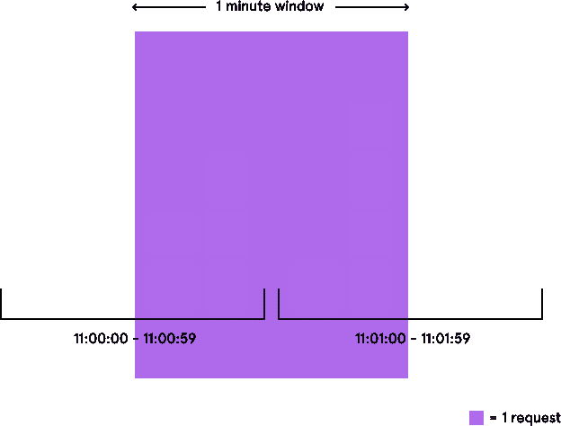

# 速率限制——可扩展系统的好方法

> 原文：<https://medium.com/geekculture/rate-limiting-a-good-approach-for-scalable-system-45e338b77ffc?source=collection_archive---------14----------------------->


Source: Google

可用性和可靠性是任何应用程序最重要的因素之一。当您构建任何可伸缩的应用程序时，您不仅要确保它是健壮的，还要确保它始终可用。流量的突然增加会影响服务质量，甚至可能导致所有客户的服务中断

速率限制是一项强大的功能，通过保护您的应用程序免受恶意攻击，有助于实现可用性和可靠性。

# **什么是速率限制**

总的来说，它允许我们控制服务器处理用户请求的速度。如果你正在和一个 API 对话，并且收到 HTTP *429 太多请求*响应状态代码，你已经被速率限制了。这意味着您已经超过了给定时间段内允许的请求数。

# **为什么限速**

速率限制通常用于阻止坏机器人对您的应用程序产生负面影响。速率限制有助于缓解的 Bot 攻击包括

1.  暴力攻击
2.  DoS 和 DDoS 攻击
3.  网页抓取

速率限制还可以防止API 过度使用，这不一定是恶意的或由于 bot 活动造成的，但必须防止。一般来说，API 速率限制的工作方式是每个用户在每个 time_interval 允许 X 个请求。时间间隔可以是秒、分、小时或天。这样做的原因是为了防止任何用户消耗太多的资源(内存、CPU、数据库)，从而防止系统响应其他用户。

它允许我们基于一些指定的约束来处理用户请求，例如:

1.  有更好的数据流
2.  攻击风险降低(安全性提高)
3.  服务器永远不会过载

# 权衡和限制

在构建速率限制器时，您需要在用户体验、安全性和性能之间进行权衡。控制数据流最常见的原因是维护基于 API 的服务的可用性。但是也有安全方面的好处。一次无意或有意的入站流量激增都会占用宝贵的资源，并影响其他用户的可用性。因此，必须有一个明确定义的约束(限制)，它可以基于以下任何一项:

1.  **用户**:这里的约束是特定于一个用户的，使用一个唯一的用户标识符来实现
2.  **位置**:这里的约束是基于地理的，并且是基于发出请求的位置实现的
3.  **IP 地址**:这里的约束基于发起请求的设备的 IP 地址

# 速率限制算法

速率限制可以在客户端级别、应用程序级别、基础架构级别或两者之间的任何级别实现。客户端级别的速率限制将阻止所有超额请求从客户端到服务器的网络调用。有不同算法用于设计和实现服务器端速率限制器，每种算法都有其优点和缺点。让我们逐一讨论。

> ***固定窗口计数器***

这是一种简单、高效的内存算法，记录在速率限制的时间间隔内来自发送方的请求数。例如，如果我希望我的 API 允许单个用户每分钟 100 个请求，我们有一个 60 秒的窗口。因此，从`00:00:00`开始，一个窗口将从`00:00:00`到`00:01:00`。

因此，对于发送者在一分钟内发出的第一个请求，我们可以根据计数存储发送者的 ID，现在是`1`，因为这是第一个请求。在同一窗口内的后续请求中，我们检查发送方是否超过限制(即计数不大于 100)。如果发送者没有，我们将计数加 1；否则，请求将被丢弃，并触发一个错误。

在窗口结束时，我们重置每个发送者的记录来计数`0`，并对当前窗口重复该过程。

**优点**:易于实现，内存效率高

**缺点**:当窗口快结束时，例如在第 55 秒时，服务器每分钟完成的工作比计划的要多得多。例如，我们可能在 55 到 60 秒之间收到一个用户的 10 个请求，而在下一个 0 到 5 秒的窗口中收到同一用户的另外 10 个请求。因此，服务器在 10 秒钟内为这个用户处理了 20 个请求。



If we count requests in fixed minute windows, we could let through up to twice the number of allowed requests per minute.

> ***滑动窗口日志***

滑动日志算法只是为用户发出的每个请求存储一个时间戳。可以根据时间对请求进行分类，以便改进操作。

当 web 应用程序处理一个请求时，它会检索上一个窗口(60 秒)中记录的所有请求，并检查请求的数量是否超过了允许的限制。如果请求数量少于限制，则记录请求并进行处理。如果请求的数量等于限制，则放弃请求

**优点**:准确，不受窗口结束时请求激增的影响，因为没有固定的窗口。

缺点:它不是内存高效的，因为我们最终为每个请求存储一个新条目。

> ***推拉窗计数器***

这是固定窗口计数器和滑动窗口日志的组合。整个窗口时间被分解成更小的时段。每个桶的大小取决于速率限制器允许的弹性有多大。每个桶存储对应于桶范围的请求计数。

因此，当接收到发送者的请求时，我们检查发送者的记录是否已经存在，以及是否已经有该时间戳的条目。如果两种情况都成立，我们只需增加时间戳的计数器。

在确定发送者是否已经超出其限制时，我们检索在最后一个窗口中创建的所有组，然后对它们的计数器求和。如果总和等于限制，则发送方已达到其限制，传入请求将被丢弃。否则，插入或更新时间戳，并处理请求。

另外，可以将时间戳组设置为在窗口时间耗尽后过期，以控制内存消耗的速率。

**优点**:与滑动窗口日志相比，内存效率高

**缺点**:仅适用于不太严格的回看窗口时间，尤其是较小的单位时间

> ***令牌桶***

在这个算法中，对于每个唯一的用户，我们将记录他们最后一次请求的 Unix 时间戳和 Redis 中一个散列内的可用令牌数。为了提高内存效率，我们将这两个值存储在一个 hash 中，而不是作为两个独立的 Redis 键。哈希示例如下所示:

```
"user_1" : {
     "timestamp" : 1619787784790
     "tokens": 10
}
```

每当来自用户的新请求到达时，算法将从 Redis 获取散列，并基于选择的重新填充率和用户最后一次请求的时间来重新填充可用的令牌。然后，它会用当前请求的时间戳和新的可用令牌数来更新散列。当可用令牌计数下降到零时，速率限制器知道用户已经超过了限制。

**优点**:由于单个 redis 键存储时间戳&计数，因此内存消耗最小；由于窗口在用户之间不是固定的，因此准确性较高；因此，它是基于用户的活动来确定的

缺点:redis 操作不是原子的。在分布式环境中，“先读后写”的行为产生了一种竞争条件，这意味着速率限制器有时会过于宽松

> ***漏桶***

漏桶算法利用一个队列以 FIFO 的方式接受和处理请求。队列大小受到限制。当请求排队时，它们以相对恒定的速率被处理。这意味着，即使服务器遇到突发流量，传出响应仍以相同的速率发出。

一旦队列填满，服务器将丢弃任何传入的请求，直到为更多的请求释放空间。

**优点**:输入速率可以不同，但输出始终不变。

**缺点**:与令牌桶相比，大突发速率较慢，因为它总是以恒定速率发送数据包

# 结论

速率限制不仅保护您的应用程序免受攻击，还确保您的应用程序始终可用。不同的速率限制算法提供不同的优点和缺点。然而，任何算法的选择完全基于需求的种类。速率限制的理想解决方案将随着时间的推移以及性能、安全性和用户体验之间的权衡而变化。

包括速率限制几个现实生活场景是:

1.  每位用户的日交易额上限为 10 万卢比
2.  每个用户每天只能执行 100 个 API 请求的公共 API
3.  闪购，每个用户只能购买一次。