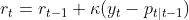
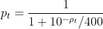
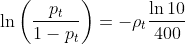
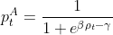
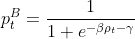
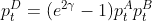
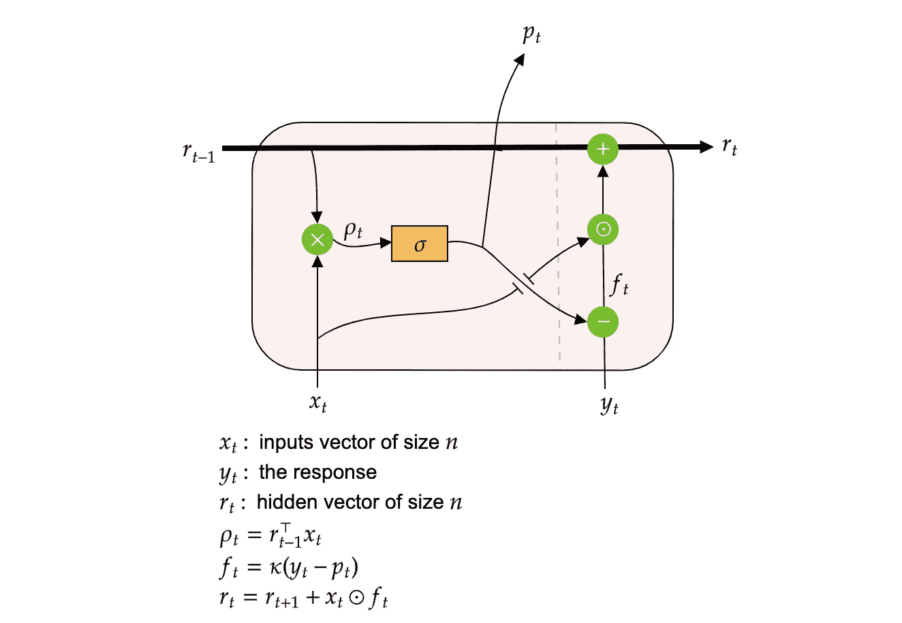
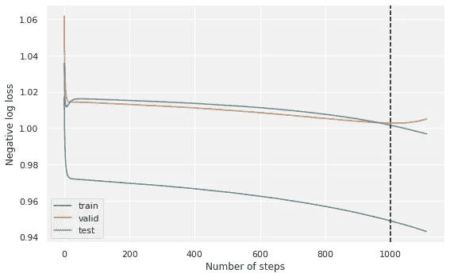
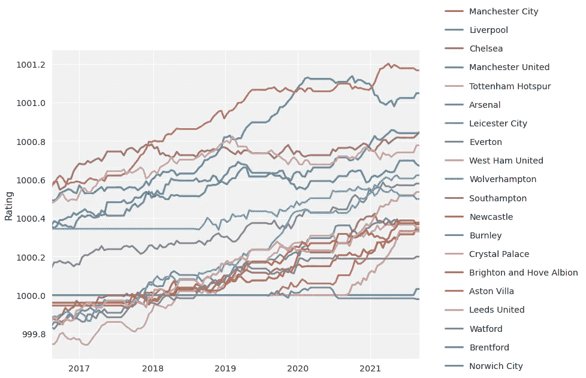

# 基于递归神经网络和 JAX 的足球评分和预测

> 原文：<https://medium.com/geekculture/rating-and-predicting-football-with-recurrent-neural-network-and-jax-5a5f56510ee?source=collection_archive---------7----------------------->

## 机器学习变得简单

## 优化的 Elo 评级


Image by [Joshua Golde](https://unsplash.com/@joshgmit)

## 介绍

当谈到体育或比赛时，评分总是被提到桌面上。我们总是想排名和衡量一个球员或一支球队如何相互比较。这正是评级的作用。

在过去的几十年里，出现了许多评级方法。例如， **Kenneth Massey** 提出了一种 NCAA 大学足球的评级方法，并在点数传播的约束下使用线性回归。最近，梅斯特雷*等人* (2019)提出了一种贝叶斯方法，用于体育比赛中的成对比较，其中评级遵循由核函数指定的时间动态。微软正在使用 Tom Minka 开发的评级系统 TrueSkill 来寻找技能相似的玩家一起玩在线视频游戏。

在所有这些方法中，有一个在足球界经常被引用:Elo 评级，来自物理学家 Arpad Elo。虽然最初是为国际象棋选手排名而开发的，但该模型现在广泛用于体育运动，特别是建立国际足联世界排名。

在本文中，我们将快速介绍 Elo 评级系统及其背后的数学原理，重点介绍在预测框架中的实现和使用。我们将使用为高性能机器学习和神经网络设计的 [**JAX 框架**](https://github.com/google/jax) 在 Python 中实现该模型。本文中的 python 代码和示例可以在 GitHub 上找到[，数据由](https://github.com/octosport) [Sportmonks 提供。](https://www.sportmonks.com/)我们的实现可以用于**任何运动或比赛**对于****的评分和预测。****

# **ELO 评级模型**

**顾名思义，该模型旨在评级。这并不意味着我们不能用它来做预测，但主要的输出将是收视率，所以让我们从这一点开始。**

## **评级方程**

**Elo 评级系统实际上相当简单，只需要很少的代数。在下文中，我们将使用足球队评级作为一个例子，假设 A 队与 b 队比赛。这两个队只有三种可能的结果:赢、输或平。**

**让我们直截了当地写出主要评级等式。一个团队的评级更新被给予 by⁴:**

****

**Team rating update**

> **指标 **t** 代表一个完成事件的时间。由于预测是在比赛开始前进行的，所以 **p** 是在知道赛前信息( **t|t-1)** 的情况下估计的。但是，为了简单起见，我们将在本文的其余部分用 **t** 来索引 **p** 。**

**该等式简单地说明了新评级等于旧评级加上系数 K 因子( **κ)** 乘以结果( **y** )和预测( **p** )之差。假设 K 因子为 20，如果团队获胜，结果为 1，如果团队失败，结果为 0，否则为 0.5。假设 A 队的得分是 2300，我们的预测是有 60%的机会获胜，结果是 1，新的得分是 2308。**

**如果团队预计会赢( **p=1** )并赢得比赛( **y=1** )，则评级不会改变。另一方面，如果球队几乎肯定会输( **p=0** )，但却赢得了比赛，这是一个惊喜。在这种情况下，团队评分会相应提高。**

> **Elo 评级虽然非常简单，但考虑到了惊喜效应和团队级别差异，以更新团队评级。**

**在大多数评级系统中，**K 系数是固定的**。此参数控制评等更新的速度。比率越高，评级变得越强越快。例如，国际足联 Elo 评级根据比赛 importance⁴.使用不同的 k 系数不固定的是预测。我们可以使用外部预测，并将它们作为评级的输入。但是这些预测也可以内化，这就是 Elo 评级系统的第二个等式。**

> **只有在团队同时接受训练的情况下，评级才允许我们对团队进行比较。您不能比较两个不同型号的两个评分。**

## **预测方程**

**使用两个团队的评级，我们可以做出预测。例如，在 FIFA Elo 评级中，使用以下等式进行预测**

****

**FIFA Elo prediction for team A to win**

**其中参数 **ρ** 等于**A 队和 B 队的评分差**。现在我们可以问这个等式从何而来。事实上，数字 10 和 400 是固定的，可以根据委员会的不同而不时改变。但是从数据科学家的角度来看，我们可以做得更好。**

**借助一点代数知识，我们可以将前面的等式转化为:**

****

**The modified FIFA Elo prediction equation**

**原来等式的左边部分是逻辑 regression⁵.中使用的所谓的 *logit* 函数**

> **经典的 Elo 评级系统可以看作是对团队评级的逻辑回归。**

**我们还观察到 **ρ** 前面的比值只是一个衡量评级差异的数字，对应的是评级的 beta。那个数字最好是从数据中得知的**。****

# **增强的 Elo 评级**

**在前一部分中，我们已经看到，Elo 评级可以解释为一个逻辑模型。让我们定义**系统的现代版本**。我们从 A 队对阵 b 队的类似概率函数开始。A 队获胜的概率现在是:**

****

**Probability for team A to win**

**首先，我们用指数( **e** )数替换了前面等式中的数字 **10** 。第二，我们用一个参数 **β** 代替 1/400。第三，参数 **γ** 将允许我们控制抽牌。如你所见，概率现在是 **sigmoid 函数**。**

**如果没有可能的**平局，**B 队获胜的概率正好是 1 减去 A 队获胜的概率。但是当出现平局时，B 赢的概率变成:**

****

**Probability for team B to win if a draw is possible**

**在这种情况下， **γ > 0** 和我们不再有概率之和等于 1。由此，我们可以推导出抽签概率:**

****

**The draw probability**

**评级更新保持不变，但我们做了两处更改。首先，K 因子将是模型学习的参数。第二，我们在平局的情况下改变更新规则。在经典版本中，当出现平局时，更新使用 0.5 作为获胜概率的结果。**如果平局，我们根据两队获胜概率的差异更新评分**。例如，如果 A 队获胜的概率是 80 %, B 队获胜的概率是 5%,但是出现了平局，则 A 队(分别为，B)将减少(分别为。增加)乘以 75%的 K 因子。如果他们有相同的获胜概率，评分不会改变。**

**现在我们知道如何计算收视率和概率。模型的参数集包含初始团队的评级、K 因子和 sigmoid 参数，总共有 **n+3** 个参数。我们需要的只是数据、损失函数和优化算法。但在此之前，让我们看看如何将完整的模型表示为递归神经网络。**

## **一种递归神经网络表示**

**如果你对神经网络不感兴趣，你可以跳过这一部分，因为这不会影响对文章其余部分的理解。我们可以在 Elo 评级模型的增强版本和序列神经网络之间建立联系。这些网络架构的一个例子是用于语言翻译的 LSTM。**

> **Elo 评级系统的增强版本可以被视为一个递归神经网络，其中评级是隐藏状态。**

**为了简单起见**让我们假设抽签结果不可能像篮球中的**一样，所以 **y** 是二进制的。我们有 n 支球队，每周都在一起比赛。一场比赛由 A 队对阵 b 队组成。我们预测 A 队获胜的概率( **y=1** )。**

**我们可以将所有匹配的评级序列表示为一个循环网络。我们把这个网络的一个小区叫做 **Elo 小区**。该单元格将在每次匹配后输出预测并更新评级。每个团队的评级可以解释为单元格隐藏状态。**

**每个单元格将团队等级和一个向量 **x、**作为输入，这两个向量都是团队数量的大小。**除了 A 队和 B 队分别取值为 1 和-1 之外，向量 x 是 0 的向量。**单元分为两步:输出 A 队获胜概率的**预测步骤**和使用二进制变量 **y** 输出新评级的**更新步骤**单元。该单元可以表示如下**

****

**The Elo cell**

**由于两个队的评级不受其他队评级的影响，网络可以表示为一个很长的序列，其中比赛是按时间排序的。**

> **初始状态也是一组可训练参数，对应于每个团队的初始评级。**

**网络看起来是这样的:**

****

**The Elo network**

**最后一个单元格列出了用于预测后续事件的评级。为了简单起见，我们在实现中不使用网络表示，尽管它是具有相同损失和参数数量的完全相同的优化。**

## **使用 JAX 的梯度下降进场**

**学习模型的参数并不简单，而且需要大量的计算机。事实上，预测取决于评级，而评级又取决于之前对所有车队的预测。**

**为了帮助我们，我们将使用`jax`，这是一个由 Google 开发的 python 库，可以使用`numpy`执行自动微分。**

> **Numpy 必须用下面的命令从 JAX 导入`import jax.numpy as jnp`**

**JAX 可用于训练神经网络和许多其他需要微分和快速计算的应用。**

**我们要优化的损失函数是我们要梯度下降的负对数损失。负对数损失给出了由模型计算的概率质量的度量。有了匹配的数据集，步骤是计算**平均** **损失**，找到整体梯度，更新参数，并重复。假设我们知道如何计算平均对数损失，在 JAX 得到梯度神奇地完成如下**

```
from jax import grad
from jax import jit#average_log_loss is a function
grad_function = jit(grad(average_log_loss))
```

**`jit`函数编译用于快速计算的函数。注意，`grad`计算给定第一个参数的梯度，在我们的例子中是`paramameters`的字典。清单和字典被 JAX 诠释得很好。现在，`grad_function`是一个函数，它采用与损失函数相同的参数，并将返回参数和数据的梯度值。**

**我们将执行经典的[梯度下降](https://en.wikipedia.org/wiki/Gradient_descent)。我们定义梯度步长`learning_rate`和最大迭代次数`max_step`。然后，按照以下循环进行最小化:**

```
for i in range(max_iter):
    gradient = grad_function(parameters, training_data)
    for key, val in parameters.items():
        parameters[key] = val - learning_rate * gradient[key]
```

**由于模型的递归性质，我们需要计算完整的匹配序列，以获得平均对数损失。在 JAX 我们可以使用`[lax.scan](https://jax.readthedocs.io/en/latest/_autosummary/jax.lax.scan.html)`。该函数被设计成在携带信息的同时有效地循环。它将三个主要参数作为输入:在每次迭代中执行的函数`scan_function`，可以存储参数的函数`carry`，以及包含循环的函数`data`的函数`data`。它返回最后的`carry`和`output`，这是所有`scan_function`输出的列表。例如，如果我们的数据集包含 100 个匹配，`scan_function`将被执行 100 次，而`output`将包含 100 个输出。**

**在我们的例子中，我们循环匹配，整个过程是:**

```
def scan_loss(params, data):
    carry = dict()
    carry["params"] = params
    carry["rating"] = params["init"]
    carry, output = lax.scan(**scan_function**, carry, data)
    return {
        "carry": carry, #contains last updated parameters ans rating
        "loss_history": output[0], #all losses
        "rating": output[1], #all ratings
    }def average_log_loss(params, data):
    scan_loss_result = scan_loss(params, data)
    return -jnp.mean(scan_loss_result["loss_history"])
```

**在这里，`scan_function`将更新评级，计算概率，并获得一场比赛的损失。**类似于处理一个 Elo 细胞。**所有损失都包含在列表`output`中，并使用`average_log_loss`函数计算平均对数损失。**

# **一个英超联赛的例子**

**让我们以英超联赛(EPL)为例。该数据集包括 2016 年至 2021 年之间的所有 EPL 比赛，共 1129 场比赛。数据将分为三组:训练组(截至 2019 年 6 月)，验证组(2019 年 6 月-2020 年 6 月)，测试组(2020 年 6 月-2021 年 9 月)。训练集用于计算梯度和更新参数。验证集用于找到最佳梯度步骤的数量。当验证损失停止下降时，梯度下降停止。测试装置将是我们的坚持装置。**

**为了训练模型，我们需要首先将数据放入正确的格式中，分割三个集合，然后进行训练。**

```
import pandas as pd
import datetime
from octopy.elo import dataset
from octopy.elo import elo#get the data
data = pd.read_csv('https://raw.githubusercontent.com/octosport/octopy/master/data/epl.csv')#format the data
elo_data = dataset.EloDataset(valid_date= '2019-06-01',test_date= '2020-06-01',time= data['date'])#split the data
elo_data.split_train_test(data[['home','away']].values,data[['home_goals','away_goals']].values)#build the model and train
model = elo.EloRatingNet(elo_data.n_teams_)
model.optimise(elo_data,learning_rate=0.1)
```

**模型在迭代 1010 时停止了训练。路径损耗如下图所示。**

****

**Negative log loss optimization path**

**验证损失远离训练损失，这意味着模型过度拟合。处理过度拟合是另一个问题，我们不会在这里讨论，但我们可以使用与神经网络相同的技术。然而，测试损失接近验证损失，这意味着该模型已经概括得相当好。我们最终得到 1.001 的测试损失，这对于这种类型的模型来说是相当不错的。**

**这个模型有趣的部分是收视率。评级现在是最佳的，因为它们是从训练模型中推断出来的。该团队的评分如下所示:**

****

**Team’s rating history**

**你可以看到这个排名和 EPL 的官方 Elo 评级系统差不多。不同的是，现在你可以做出与优化评级一致的预测。例如，下面给出了 2021 年 9 月 11 日阿森纳对诺维奇的预测:**

```
model.predict_proba('Arsenal','Norwich City')
```

**阿森纳有 66.8%，诺维奇有 14.4%，平局有 18.8%。这些数字与[市场隐含的概率](https://www.oddsportal.com/soccer/england/premier-league/arsenal-norwich-rR4Pi7Wd/)一致。这个 EPL 例子的 python 代码可以在 [GitHub](https://github.com/octosport/octopy/blob/master/notebooks/Rating_and_Predicting_Football_with_Recurrent_Neural_Network_and%C2%A0JAX.ipynb) 上获得。**

# **结论**

**在本文中，我们展示了如何增强传统的 Elo 评级系统。我们与序列神经网络建立了联系，这为超出本文范围的许多改进打开了大门。**

**所展示的模型可以在任何运动上进行**训练，其中团队或运动员的比赛结果由两个或三个问题来表示。该模型不仅输出当前评级和排名，而且还能够做出一致的预测。****

**本文使用的所有代码都可以在 [GitHub](https://github.com/octosport/octopy) 上找到。**

# **参考**

**[1] K. Massey，[统计模型应用于运动队的评级](https://masseyratings.com/theory/massey97.pdf)，布鲁菲尔德学院，1997。**

**[2] L. Maystre，V. Kristof 和 M. Grossglauser，[与灵活时间动力学的成对比较](https://arxiv.org/abs/1903.07746)，KDD，2019 年。**

**[3] R. Herbrich，T. Minka 和 T. Graepel， [TrueSkill(TM):一个贝叶斯技能评级系统](https://www.microsoft.com/en-us/research/publication/trueskilltm-a-bayesian-skill-rating-system/)，2007 年，*神经信息处理系统进展 20，麻省理工学院出版社。***

**[4]参见[世界足球 Elo 评分。](https://en.wikipedia.org/wiki/World_Football_Elo_Ratings)**

**[5]参见[逻辑回归。](https://en.wikipedia.org/wiki/Logistic_regression)**