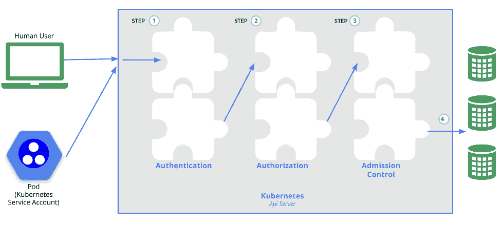

# RBAC 将管理 Kubernetes

> 原文：<https://medium.com/geekculture/rbac-to-manage-kubernetes-5417d6658329?source=collection_archive---------66----------------------->

撰写人—[Ran Dvir](https://www.linkedin.com/in/ran-dvir-86b808121/)devo PS Engineer @[Cloudride](http://www.cloudride.co.il/)

RBAC 是基于角色的访问控制的缩写。您可以使用这种方法将用户和应用程序限制在系统或网络的特定区域。使用基于角色的访问控制时，可以根据用户的角色来限制对重要资源的访问。

基于角色的访问控制(RBAC)对网络资源的访问控制由组织内各个用户的角色决定。例如，单个用户的访问权限是指他或她执行指定任务的能力，如创建、读取或编辑文件。

使用这种方法，IT 管理员可以创建更细粒度的安全控制，但他们必须遵循特定的流程，以免无意中创建一个麻烦的系统。

为了正确实施 Kubernetes RBAC 项目，建议采用以下方法:

*   实施最小特权原则:默认情况下，RBAC 禁用所有访问。管理员在更精细的级别上确定用户权限。确保您仅将必需品授予用户；授予额外的权限会带来安全风险并增加攻击面。
*   不断调整您的 RBAC 战略:RBAC 规则和角色不是自治的——IT 团队不能简单地将 RBAC 政策置之不理。以缓慢的速度验证 RBAC 是最好的方法。如果不能达到满意的状态，分阶段实施 RBAC。
*   创建更少的角色并重用现有的角色。不应该通过定制 Kubernetes 角色来满足[个人用户的需求](https://technologyadvice.com/blog/information-technology/role-based-access-vs-user-based-access/#:~:text=Users%20are%20still%20given%20a,%2Dusers%2C%20users%2C%20etc.)，从而破坏 RBAC 权限的目的。在 RBAC，角色而不是用户被用作决定因素。相同的权限应该分配给用户组，角色应该是可重用的。它简化了现有角色的角色分配，提高了角色分配流程的效率。

# RBAC 的认证和授权

# 证明

建立 TLS 连接后，将进行身份验证。这是第一步。接下来，API 服务器被集群创建脚本或集群管理员配置为运行一个或多个认证器模块。密码、普通令牌和客户端证书都包含在身份验证模块中。

# Kubernetes 的用户

Kubernetes 集群中的用户通常分为两类:Kubernetes 管理的服务帐户和普通用户。

# 批准

在验证请求来自选定的用户之后，应该对请求进行授权。该请求必须指明用户名、请求的操作以及受请求影响的对象。如果策略授权用户执行所请求的操作，则请求被批准。

# 准入控制

用于修改或拒绝接纳请求的模块被称为接纳控制模块。除了授权模块可用的所有属性之外，准入控制器模块还可以访问正在创建或修改的对象的内容。与认证和授权模块不同，准入控制器模块会立即拒绝请求。

# 在 RBAC 的角色

您在 Kubernetes RBAC 的角色决定了您将访问、管理和更改哪些资源。Kubernetes RBAC 模型由三个主要组件组成:主题、角色和角色绑定:

# 角色和集群角色

这组权限定义了如何访问权限。角色管理命名空间级别的权限，而集群角色管理集群级别或集群内所有命名空间的权限。

# RoleBinding 和 ClusterRoleBinding。

主题根据它们的组和服务帐户列出，并概述了它们的相关角色。有三种类型的角色绑定:roles、ClusterRoles 和 ClusterRoleBindings。RoleBindings 绑定角色；ClusterRoles [管理命名空间资源上的权限](https://kubernetes.io/docs/reference/access-authn-authz/rbac/#:~:text=ClusterRoles%20have%20several%20uses.,be%20granted%20across%20all%20namespaces)，ClusterRoleBindings 将 ClusterRoles 绑定到命名空间。

# 学科

传统上，RBAC 规则中的主体是用户、组或服务帐户。

# 聚集的集群角色

组合几个集群角色是可能的。具有聚集规则的 ClusterRole 对象由在集群控制平面内运行的控制器监控。该对象的 rules 字段提供了一个标签选择器，控制器可以使用它来组合其他 ClusterRole 对象。

# 提及主题

主题和角色由 RoleBindings 或 ClusterRoleBindings 绑定。组、用户和服务帐户都是有效的主题。

Kubernetes 中的用户名表示为字符串。它可以是诸如“Ruth”的普通名称，诸如“kelly@example.com”的电子邮件名称；或者代表用户 ID 的一串数字。作为一名集群管理员，您可以配置身份验证模块以生成所需格式的用户名。

# 角色绑定和默认角色

默认情况下，API 服务器通常会创建[集群角色绑定和集群角色对象](/avmconsulting-blog/rbac-service-type-in-kubernetes-eadf754af42f)。控制平面直接管理许多这样的资源，因为它们是以 system:为前缀的。

# 自动对账

每次 API 服务器启动时，缺少的权限和缺少的主题都会添加到默认的集群角色中。随着 Kubernetes 版本中主题和权限的改变，它允许集群修复意外的修改。

默认情况下，RBAC 授权人启用自动对帐。默认群集角色或角色绑定可以设置为 false，从而阻止内部协调。重要的是要记住，当缺少主题和默认权限时，集群可能会变得不可用。

# 最后

Kubernetes 在组织间的实施达到了历史最高水平。它是任务关键型的，需要严格的安全性和合规性规则和措施。通过根据用户在组织中的角色定义允许每个用户执行的操作类型，可以确保正确管理集群。

*最初发表于*[*【https://www.cloudride.co.il】*](http://www.cloudride.co.il)*。*