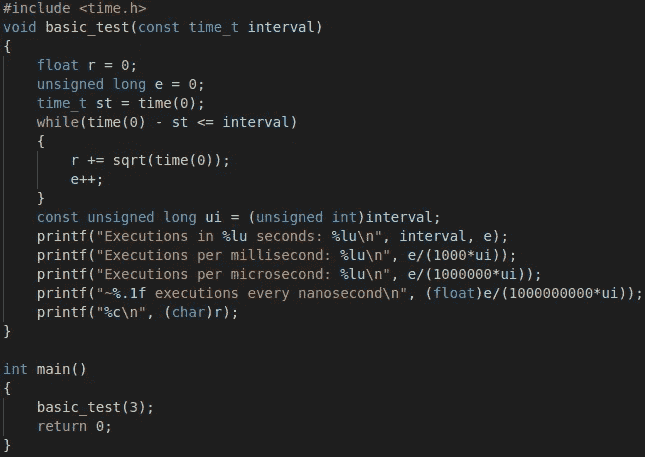
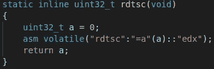
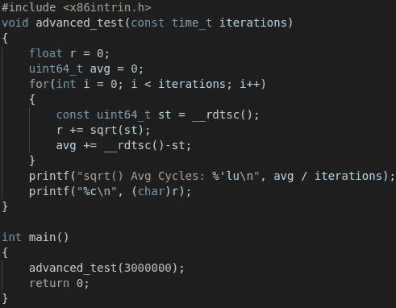
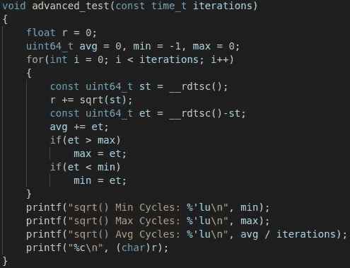

# RDTSC 是唯一的基准。

> 原文：<https://medium.com/geekculture/rdtsc-the-only-way-to-benchmark-fc84562ef734?source=collection_archive---------14----------------------->

如果你正在对那些只有几行指令的小函数进行基准测试，或者仅仅是那些在很短时间内完成执行的函数，那么获得精确基准测试的唯一方法就是使用 [RDTSC](https://en.wikipedia.org/wiki/Time_Stamp_Counter) 函数。

传统上，当人们决定对代码段进行性能基准测试时，他们可能会选择一些不同分辨率的计时器，分辨率越低，基准测试运行的迭代次数就越多，以获得更好的近似值。

传统上，电脑都有一个第二分辨率跑马灯，使用[时间()](https://www.geeksforgeeks.org/time-function-in-c/)功能显示在[时间. h](https://pubs.opengroup.org/onlinepubs/009695399/basedefs/time.h.html) 中。使用这个低精度计时器，我们可以做这样的事情:



Executions in 3 seconds: 1,098,775,381
Executions per millisecond: 366,258
Executions per microsecond: 366
~0.4 executions every nanosecond

我们将 time(0)指定为 sqrt()函数的输入，因为这将为 sqrt()函数提供编译器无法预测的值，从而确保编译器不会以某种方式优化我们的 while 循环，导致我们的基准测试结果不再代表我们想要的结果。最后，我们还必须对我们的 *r* 变量做一些事情，以防止编译器以不希望的方式优化我们的基准。我们用每次迭代的 sqrt()输出递增一个变量，然后在最后将该变量打印到控制台。在我们的例子中，我们将“float r”转换为单个字符，并将其打印到控制台，以避免干扰控制台输出。

我们可以通过将采样间隔从 3 秒增加到更高的值来使用上述函数提高结果的精度，或者我们可以通过使用 timer.h [clock()](https://www.geeksforgeeks.org/clock-function-in-c-c/) 函数来获得更复杂的结果，该函数提供更高分辨率的计时器，从而在相同的 3 秒间隔内产生更精确的结果。

在 windows 上，作为 win32 API 的一部分，你有[QueryPerformanceCounter()](https://docs.microsoft.com/en-us/windows/win32/api/profileapi/nf-profileapi-queryperformancecounter)，它精确到不到一微秒，尽管据我所知，当调用这个函数时，你必须将它锁定到单个 CPU 内核，否则操作系统级上下文切换会混淆结果。这可以通过使用[SetThreadAffinityMask()](https://docs.microsoft.com/en-us/windows/win32/api/winbase/nf-winbase-setthreadaffinitymask)函数在已经被设置为单个 CPU 内核的相似性的线程中调用 QueryPerformanceCounter 来完成。

此外，windows 有两个毫秒分辨率的计时器，它们是流行的 [GetTickCount()](https://docs.microsoft.com/en-us/windows/win32/api/sysinfoapi/nf-sysinfoapi-gettickcount) 和 WinMM 函数 [timeGetTime()](https://docs.microsoft.com/en-us/windows/win32/api/timeapi/nf-timeapi-timegettime) ，精度更高，达到 5 毫秒或更高。虽然它们是毫秒计时器，但实际精度可能不到一毫秒。

因此，我们已经讨论了大多数操作系统 time()和 clock()上可用的低精度和高精度定时器，以及特定于 windows 的定时器。虽然它们是足够的，但是它们需要更大的样本量来弥补定时功能所损失的精度。

最好的解决方案当然是使用 RDTSC 函数，它计算 CPU 时钟周期的滴答数；这意味着，对于 RDTSC 记录的每一个滴答，CPU 都进行了一次迭代或一个周期。平均而言，截至 2021 年，现代 CPU 的工作频率约为 4.2 GHz，这意味着它每秒执行 42 亿次循环。

尽管每次调用 RDTSC 函数都会返回不同的结果，但是在我们得出一个稳定的平均值之前，这个函数也需要被多次采样。对于运行在 4.2 GHz 的英特尔处理器，我发现 3，000，000 个样本足以获得稳定的平均值。

使用 RDTSC 定时器只需要包含 [x86intrin.h](https://software.intel.com/sites/landingpage/IntrinsicsGuide/#) 就可以使用 [__rdtsc()](https://docs.microsoft.com/en-us/cpp/intrinsics/rdtsc) 函数。[尽管英特尔喜欢宣称并非如此。](https://software.intel.com/sites/landingpage/IntrinsicsGuide/#text=rdtsc&expand=5578)



You can also just call the instruction directly grabbing only its lower 32 bits.

这就是我们的高精度 RDTSC 实现在 sqrt()函数上的样子:



sqrt() Cycles: 17

这在实际的 CPU 周期中为我们提供了一个非常精确的基准，即单个函数平均需要多长时间。我们也可以像这样输出平均值旁边的最高值和最低值；



sqrt() Min Cycles: 12
sqrt() Max Cycles: 7,709
sqrt() Avg Cycles: 17

最后，将所有这些放在一个大型高精度测试中，该测试与一些 [math.h](https://en.wikipedia.org/wiki/C_mathematical_functions) 函数相关:

您应该能够使用任何优化标志(如-Ofast)来编译它，并且它不会破坏预期的结果。如果你想看这篇文章中包含的其他代码片段，请参考[的扩展版本。](https://gist.github.com/mrbid/31e295c5db2339820dde44571fb98596)

诚然，您的基准测试将包括调用 __rdtsc()函数的延迟，但这是一个较小的错误，我个人认为不值得尝试计算 __rdtsc()调用的平均延迟以从最终平均值中减去。

你可能也有兴趣看看我在[乘-累加运算](https://github.com/TFCNN/DOCS/tree/main/MAC%20Bench)上做的基准测试。

https://godbolt.org/是一个有用的工具，它输出你的 C 或 C++代码的编译汇编指令。否则，您可以将-S 标志传递给 GCC 编译器，或者对编译后的二进制文件使用 objdump -d。

```
gcc bench.c -Ofast -lm -o bin
gcc -S bench.c -Ofast -lm -o bin.asm
objdump -d bin > objdump_bin.asm
```

**自从写了这篇文章，我发现在 Windows 上使用**[**getsystem time()**](https://docs.microsoft.com/en-us/windows/win32/api/sysinfoapi/nf-sysinfoapi-getsystemtime)**函数也是一个流行的选项:**
[https://stack overflow . com/questions/10905892/equivalent-of-gettimeday-for-Windows](https://stackoverflow.com/questions/10905892/equivalent-of-gettimeday-for-windows)

**英特尔，《如何对代码执行时间进行基准测试》，2010 年**
[https://www . Intel . com/content/dam/www/public/us/en/documents/white-papers/ia-32-ia-64-Benchmark-Code-Execution-paper . pdf](https://www.intel.com/content/dam/www/public/us/en/documents/white-papers/ia-32-ia-64-benchmark-code-execution-paper.pdf)