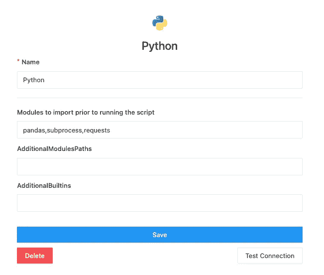
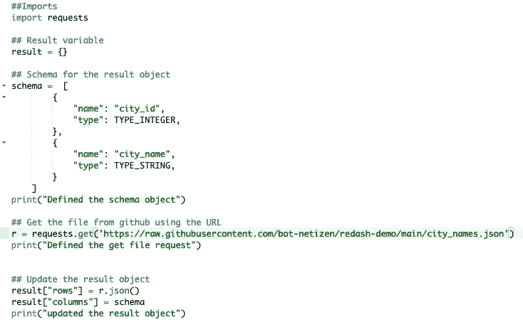
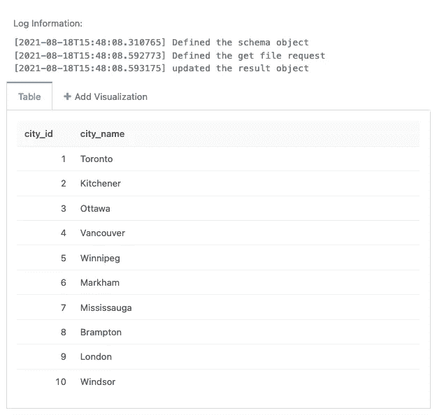
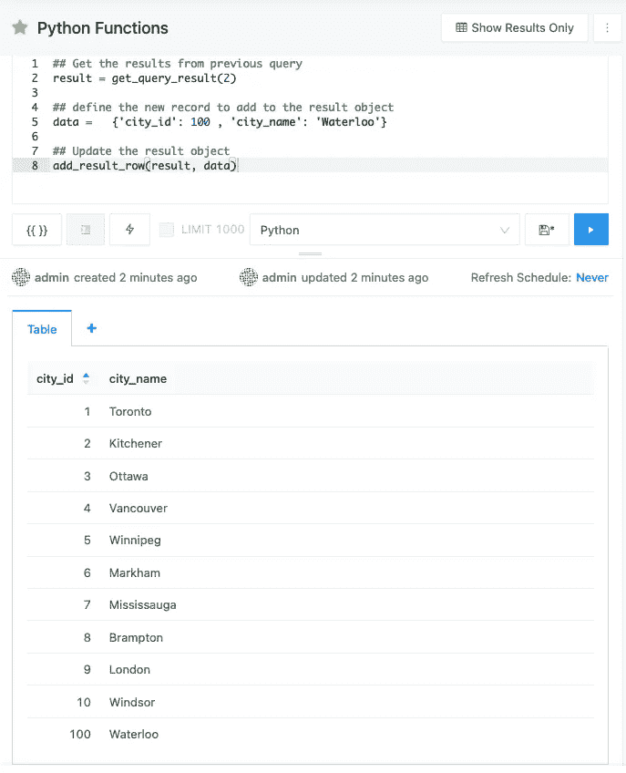

# 回复:破折号 Python 数据源

> 原文：<https://medium.com/geekculture/re-dash-python-data-source-e5200a863cb2?source=collection_archive---------12----------------------->

Redash 是一个开源的免费 BI 工具，用户可以使用 docker 在他们的机器上轻松设置。它是非常轻量级的，易于用于跨多个数据源分析数据。Redash *v10-preview* 版本出来了，你可以用下面的教程试试。

[](/@Iqbalkhattra85/re-dash-open-source-bi-tool-a27fb26b3072) [## 回复:dash——开源 BI 工具

### 过去在黑色终端上查询数据或者将数据导入 Excel 表格进行分析的日子已经一去不复返了。数据…

medium.com](/@Iqbalkhattra85/re-dash-open-source-bi-tool-a27fb26b3072) 

Redash 自带 20 多个数据源，它可以通过使用数据源 UI 轻松连接到任何开源或云数据库。然而，在 Redash 中还有一些其他数据源可以用来从 URL 或 API 中提取数据。这些数据源在默认情况下是不启用的，出于安全原因，建议仅在个人系统上使用。

我们将在本文中讨论如何使用 Python 作为数据源来实现。

[](https://redash.io/help/data-sources/querying/supported-data-sources) [## 支持的数据源

### 编辑描述

redash.io](https://redash.io/help/data-sources/querying/supported-data-sources) 

# 用例

作为专门进行数据分析的工程师或分析师，我们通常需要在数据之上添加一个解码层，然后才能在最终用户仪表板上共享或呈现数据。例如，`city_id = 1`对于查看仪表板或复杂可视化的任何人来说都没有意义。在这种情况下，将映射或维度数据集添加到后端数据源并不是一个好的设计选项，因为在分析后不再需要数据集。

其次，在生产系统中添加和删除数据集会产生额外的开销，这可能需要几天到几周的时间，这取决于您的数据团队的日程安排，他们最希望避免一次性请求:)

# Python 数据源

在这样的场景中，我们需要一个数据源，它可以从外部数据源读取数据，还可以灵活地操作结果集，以便与其他数据查询相结合。

redash 中的 Python 数据源为用户提供了查询外部 URL/API 和提取一次性解码文件进行专门分析的灵活性。当前数据源不支持全局 python 函数，但它通过一些预定义的函数提供了广泛的功能，默认打印函数也可用于脚本的简单调试。

## **如何启用？**

**默认情况下** python 不能作为数据源，用户需要在设置 Redash 实例时更新`redash.env`文件并添加下面一行。该选项仅在`self-hosted`实例中可用，或者用户可以咨询他们的 Redash 管理团队来启用它。

```
REDASH_ADDITIONAL_QUERY_RUNNERS=redash.query_runner.python
```

> 如果您已经有一个 redash 实例在运行，请在设置参数后重新启动您的 celery workers。

## 怎么用？

Redash 要求每个查询都返回一个 python 中的`dict`类型`result`对象，用于以表格或图形格式可视化记录。数据库的所有内置查询运行器类为每个查询返回一个 dictionary 对象，格式如下。

**结果对象格式:**

```
result = {
    "rows": [
        {"id": 1, "value": "s2f1"},
    ],
    "columns": [
        {
            "name": "id",
            "friendly_name": "id",
            "type": TYPE_INTEGER,
        },
        {
            "name": "value",
            "friendly_name": "value",
            "type": TYPE_STRING,
        }
    ]
}
```

每个结果对象包含两个键

*   `rows`键包含用于查询的 n 条输出记录的列表。在输出中，每个行元素可以包含 n 个列。每个行元素都必须是 JSON 格式。
*   `columns`键包含记录的模式。每个模式字段必须有两个字段值`name` & `type`。Python query runner 为结果对象提供了预定义的数据类型，如下所述

```
# Supported data types
- TYPE_DATETIME                                   
- TYPE_BOOLEAN                                  
- TYPE_INTEGER                                   
- TYPE_STRING                                   
- TYPE_DATE                                   
- TYPE_FLOAT
```

所以在 python 数据源的情况下，用户必须格式化他们的`python script`的输出并返回一个格式化的结果对象。

**功能:**

Python 查询运行器还支持一组函数，用于读取和更新来自其他查询的结果对象。用户可以读取其他查询的输出，并可以使用 python 连接多个查询的输出。

```
## Return the result Object for a predefined query
get_query_result(<Redash Query ID>): ## Print Table Schema Information for a data source  
get_source_schema(<Redash Data Source Name or ID>)  

## Execute a query and return result object against a data source in ## python
execute_query(<Redash Data Source Name or ID>, <SQL QUERY>) ## Add new column to the result object
add_result_column(<result object>, <field_name>, <field_name_for_displauy>, <field_datatype>)## Add a new row to the result object
add_result_row(<result object>, <values>)
```

# 例子

我们将从 URL 中提取一个文件，并将在 redash 中创建一个数据集，以将该文件用作映射文件。

*   创建 Python 数据源并添加脚本所需的所有模块。



Python Data Source Configuration

*   创建一个 Python 脚本，并从 git hub 中提取文件。



Python Snippet for URL file

*   执行脚本并获得输出。它将打印我们使用带有时间戳的`print`函数添加的所有日志记录信息，并且它可以帮助您捕获每一步花费的时间。



Output.

**功能示例**

*   获取旧查询的结果并将新记录添加到结果集中。



Python 数据源不仅限于从 URL 或 API 中提取数据，它可以有多种用途。将它们全部列在本文的范围内是不可行的。请尝试所有内置功能，如果您遇到任何问题，请告诉我。你可以在下面的链接中找到例子的代码，我会在未来尝试添加更多的东西。

# 感谢您的阅读，祝您愉快！！