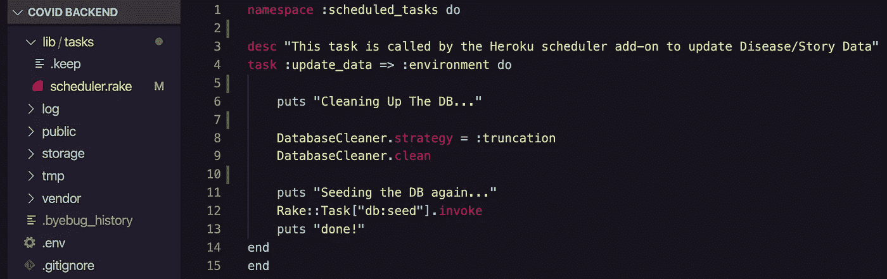
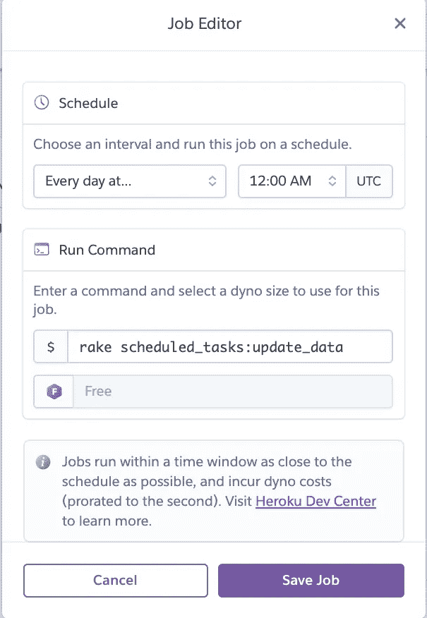

# 每天用一次性的 Dynos 重新播种你的 Heroku 数据库

> 原文：<https://medium.com/geekculture/re-seed-your-heroku-database-everyday-with-one-off-dynos-a77822052086?source=collection_archive---------59----------------------->

在我的[上一篇博客](https://teapuddles.medium.com/seeding-a-rails-backend-with-an-external-api-1eb192271005)中，我讨论了如何从外部 API 中植入数据库。这对于从除了你自己的后端之外的来源获取信息来说是非常棒的，并且是构建许多项目的非常重要的工具。然而，一旦你把你的新项目推到 Heroku 上，会发生什么呢？如果您植入的信息不断更新(股票、每周销售额等)，该怎么办？你是否计划每天重置你的数据库，使你的网站信息保持最新？我的意思是，你当然可以，但从全局来看，这会给你和你的项目带来麻烦。输入 Heroku dynos 和一次性 dynos。

No, not those dinos…dynos…

> Dynos 是隔离的虚拟化 Linux 容器，旨在根据用户指定的命令执行代码- [Heroku](https://www.heroku.com/dynos#:~:text=Dynos%3A%20the%20heart%20of%20the,simplify%20development%20and%20enhance%20productivity.&text=The%20containers%20used%20at%20Heroku,on%20a%20user%2Dspecified%20command.)

正如上面提到的，dynos 是装满代码的容器，这些代码根据用户指定的命令执行。这意味着对于任何规模的代码库，您都可以存储简化工作流程和提高生产率的代码。

一次性动态代码是可执行的代码，我们可以用它来管理我们所有的管理和维护任务。播种我们的数据库属于这一类，但还有什么呢？根据 Heroku 网站，一次性 dynos 可用于以下用途:

*   初始化数据库或运行数据库迁移。(例如`rake db:migrate`或`node migrate.js migrate`)
*   运行控制台或 REPL 外壳来运行任意代码，或者对照实时数据库检查应用程序的模型。(例如`rails console`、`irb`或`node`)
*   提交到应用程序回购中的一次性脚本(例如`ruby scripts/fix_bad_records.rb`或`node tally_results.js`)。

对于本指南，我们将重新播种我们的数据库，这属于第一类。此外，和前面的指南一样，我将使用 Ruby on Rails。在我们开始之前，首先确保您已经完成了以下工作。

*   将你的后台连接到一个 Heroku 站点。
*   安装了 gem ' [数据库清理器](https://github.com/DatabaseCleaner/database_cleaner)
*   在你的应用程序上安装 Heroku 调度程序(非常容易做到！点击这里链接[的文件即可。一旦你设置好了，不要担心添加任何东西，我们会去做的。)](https://devcenter.heroku.com/articles/scheduler)

现在我们已经把所有的部分都整合在一起了，是时候构建一个一次性的 dyno 了！我们需要做的就是创建一个 rake 任务。为此，在/app/db/lib/tasks 中创建一个名为`scheduler.rake`的文件。到了那里，您可以看看下面的代码。

Using ‘datbase-cleaner’, building a rake task that cleans our database is easy!

在这个例子中，我创建了一个名为`:scheduled_tasks`的名称空间，它将成为我们希望调度到我们的调度器中的所有任务的标题。这样做有利于可伸缩性和易读性。

在描述了我们的 rake 任务将做什么之后，我们将创建我们的任务`:update_data`，它调用我们的“数据库清理器”gem 来清理我们的数据库。

一旦清理完成，我们需要重新播种我们的数据库。幸运的是，因为`db:seed`已经是一个已知的 rake 任务，我们可以用`Rake::Task[“db:seed”].invoke`行调用它

在继续之前，请确保将您的更改上传到您的 Heroku 站点。

现在我们的 rake 任务已经构建好了，我们需要做的就是将它连接到我们的调度程序。如果您在安装时正确地遵循了说明，您应该会在 Heroku 主页上看到您正在运行的网站的调度程序。单击您的调度程序，并找到添加作业的选项。将弹出一个作业编辑器窗口，如下所示。

在这里，您可以将我们构建的 rake 任务添加到我们的应用程序中。我们在这里所做的基本上是告诉 Heroku 在每天的某个时间运行我们构建的 rake 任务。

设置好之后，在 rake 任务应该运行的时间之后检查您的调度程序。您将能够看到它最后一次执行的时间。

我真的很惊讶 Heroku 在他们的网站功能中内置了这样的东西，而且我真的很高兴我的应用程序可以提供新的日常信息。

如果你想看看那个项目，新冠肺炎追踪器，你可以在这里查看。