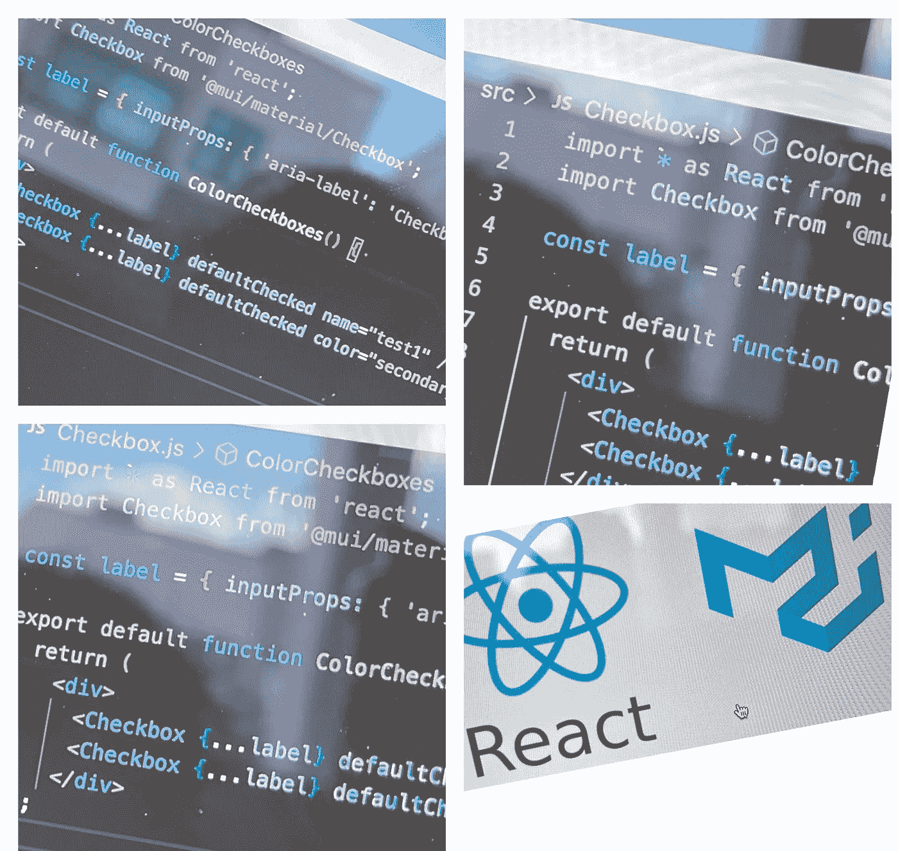

# 如何集成素材 UI 来反应 Js 应用或第三方 Lib 集成-初学者指南

> 原文：<https://medium.com/geekculture/reachow-to-integrate-material-ui-to-react-js-application-or-third-part-lib-integration-beginner-b16fa83b0cd3?source=collection_archive---------6----------------------->

在本教程中，我们将学习如何将材质 UI 集成到 React 应用程序中。

本教程还将有助于理解我们如何在 React Js 中导入任何包，如第三方库，以及我们如何根据我们的业务需求利用和导入我们的应用程序。