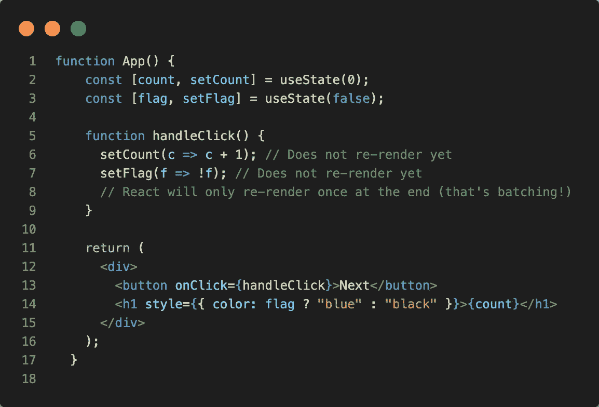
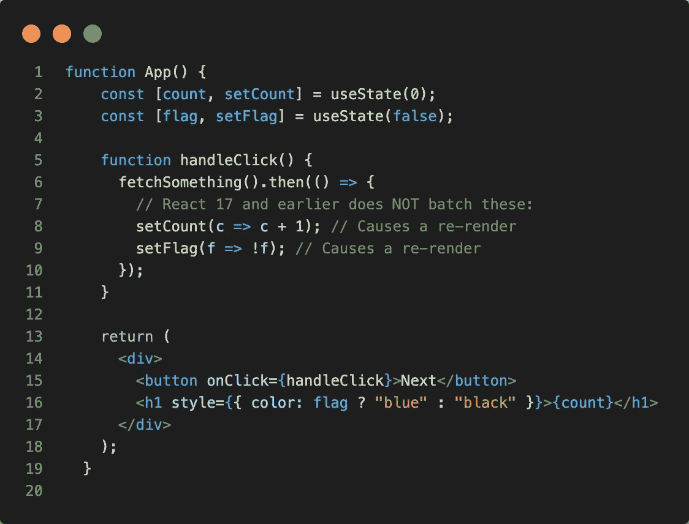
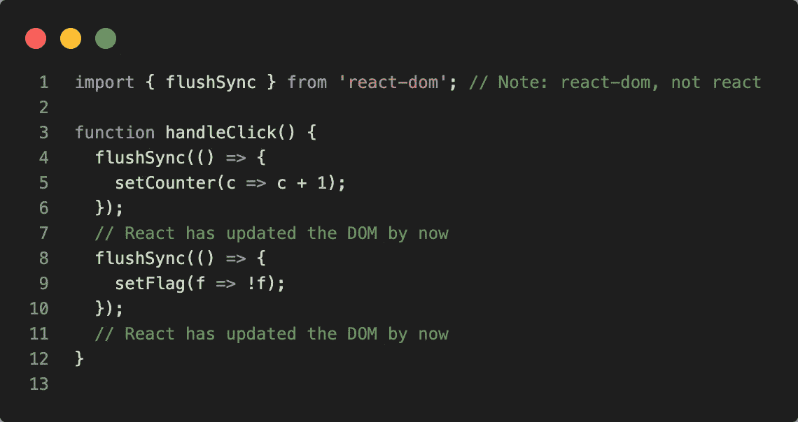

# React 18 路线图

> 原文：<https://medium.com/geekculture/react-18-road-map-e8b2ee1d510d?source=collection_archive---------36----------------------->

脸书团队已经发布了 React 18 功能的即将到来的计划。


脸书团队公布了 React-18 的计划。React 提供了许多令人兴奋的现成特性。这些不仅增强了用户体验，也让开发者的生活更加轻松。所以，这是这次将要发布的三个主要特性。

# 1.自动配料

批处理是 React 将多个状态更新分组到一个重新渲染中以获得更好的性能。

例如，如果在同一个 click 事件中有两个状态更新，React 总是将它们批处理到一个重新渲染中。如果运行以下代码，您将看到每次单击时，尽管您设置了两次状态，React 仅执行一次渲染:



这对性能非常好，因为它避免了不必要的重新渲染。它还防止您的组件呈现“半成品”状态，其中只有一个状态变量被更新，这可能会导致错误。这可能会让你想起，当你点第一道菜时，餐馆服务员并不跑去厨房，而是等你吃完。

然而，React 对于何时批量更新并不一致。例如，如果您需要获取数据，然后更新上面的`handleClick`中的状态，那么 React 将*而不是*批量更新，并执行两个独立的更新。

这是因为 React 过去只在浏览器事件(如 click)的期间批量更新*，但是这里我们在事件已经被处理(在获取回调中)之后更新状态*:**



在自动批处理中(升级到 React 18 之后)，不管状态来自哪里，它总是会被重新渲染一次。

# 不想批怎么办？

在这种情况下，您必须使用 flushSync 来重新呈现该组件。



# 2.SSR 对悬念的支持

这基本上是服务器端渲染(SSR)逻辑的扩展。在典型的 React SSR 应用程序中，会发生以下步骤:

*   服务器获取需要在 UI 上显示的相关数据
*   服务器将整个应用程序呈现为 HTML，并作为响应发送给客户端
*   客户端下载 JavaScript 包(除了 HTML)
*   在最后一步，客户端将 javascript 逻辑连接到 HTML(这就是所谓的水合)

典型的 SSR 应用程序的问题是，在下一步开始之前，整个应用程序的每一步都必须立即完成。这使得你的应用程序在初始加载时有点慢，没有反应。

React 18 正试图解决这个问题。 <suspense>component 已经发生了革命性的变化，它将应用程序分解成更小的独立单元，这些单元将经历上述每个步骤。这样一旦用户看到了内容，它就变成了交互式的。</suspense>

# 3.过渡

这是一个即将发布的令人难以置信的功能。它让用户解决了大屏幕频繁更新的问题。例如，考虑在筛选数据列表的输入字段中键入内容。您需要将字段的值存储在状态中，以便可以过滤数据并控制输入字段的值。您的代码可能如下所示:

```
// Update the input value and search results
setSearchQuery(input);
```

在这里，每当用户键入一个字符，我们就更新输入值并使用新值搜索列表并显示结果。对于大屏幕更新，这可能会导致页面在所有内容渲染时出现延迟，使键入或其他交互感觉缓慢且无响应。即使列表不太长，列表项本身也可能很复杂，每次击键都不同，可能没有明确的方法来优化它们的呈现。

从概念上来说，问题是有两个不同的更新需要发生。第一次更新是紧急更新，更改输入字段的值，并可能更改它周围的一些 UI。第二个是显示搜索结果的不太紧急的更新。

```
// Urgent: Show what was typed
setInputValue(input);// Not urgent: Show the results
setSearchQuery(input);
```

新的`startTransition` API 通过让您能够将更新标记为“转换”来解决这个问题:

```
import { startTransition } from 'react';
// Urgent: Show what was typed
setInputValue(input);// Mark any state updates inside as transitions
startTransition(() => {
  // Transition: Show the results
  setSearchQuery(input);
});
```

# React 18 工作组

脸书创建了一个由著名图书馆的作者和维护者组成的[工作组](https://github.com/reactwg/react-18)。他们一直在讨论这些功能，以获得早期反馈。这些讨论是公开的，任何感兴趣的人都可以参与。以下是我一直关注的链接:

*   [https://github.com/reactwg/react-18/discussions/4](https://github.com/reactwg/react-18/discussions/4)
*   [https://github.com/reactwg/react-18/discussions/41](https://github.com/reactwg/react-18/discussions/41)
*   [https://github.com/reactwg/react-18/discussions/21](https://github.com/reactwg/react-18/discussions/21)

好的一面是 React 18 没有任何突破性的变化，因此将我们当前的存储库升级到最新版本只需要很少甚至没有代码变化。我们可以享受他们的酷功能。

感谢您阅读这个故事。

# 参考资料:

*   [https://www.youtube.com/watch?v=Cp7RYtp-NKo&t = 617s](https://www.youtube.com/watch?v=Cp7RYtp-NKo&t=617s)
*   [https://www.youtube.com/watch?v=bpVRWrrfM1M&t = 185s](https://www.youtube.com/watch?v=bpVRWrrfM1M&t=185s)