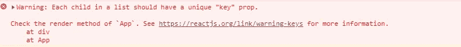
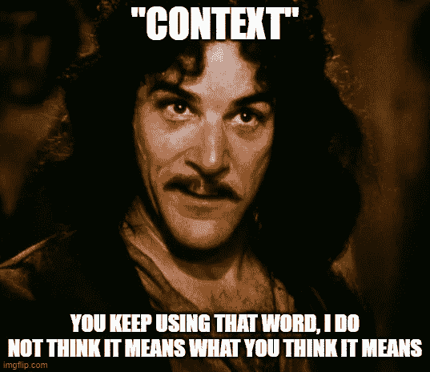

# 做出反应——5 件可能让你吃惊的事情

> 原文：<https://medium.com/geekculture/react-5-things-that-might-surprise-you-ddefd9fbac0f?source=collection_archive---------0----------------------->

React 库非常简单，也相对容易进入，尤其是有各种各样的资料可以帮助你学习它。但是每个工具都有一些技巧或问题，这些教程通常不会涉及到。当有人审查你的代码时，或者更糟糕的是，当你面临一个问题，迫切需要找到一个解决方案时，你就开始学习它们了。希望通过这篇文章，我可以揭示一些关于 React 的事情，甚至可能让你大吃一惊！


# 1.使用先前状态设置状态是不可预测的。

状态管理是 React 的基础，虽然`useState`可能是最常见的钩子，但是可能对它的实际行为有一些不了解。

让我们来看看以下组件:

在用户点击按钮后，你希望计数器的状态值是什么？

A.2
B. 1

不确定？亲自尝试一下:

Is it 2? Or maybe 1? What did you get?

不管你是否知道，猜对了。或者只是测试了一下演示——答案是 B！

原因是在我们的状态更新期间，我们使用了以前的状态值:`setCounter(count + 1)`。本质上，状态设置器函数被包装在功能组件闭包内，因此它被提供了在那个闭包中捕获的值。这意味着当它最终被执行时(state setter 函数是异步的)，它可能持有一个不再相关的状态值。最重要的是，连续执行 setState 可能会导致 React 的调度算法使用同一个事件处理程序处理多个非常快速的状态更新。

在异步函数内部设置状态时，也可能会出现同样的问题:

```
onClick={() => { 
   setTimout(() => { setCounter(counter + 1); ), 1000);
}};
```

但是，不用担心，React 实际上为这个问题提供了一个简单的解决方案—“**功能更新**”。

```
setCounter((prevCounter) => prevCounter + 1);
```

我们传递一个函数，而不是直接把值传递给`setCounter`。该函数接收**先前状态作为参数。** 这样我们可以确信 React 为我们提供了先前状态的正确值，并避免了可能导致意外行为的场景。

当您的状态更新依赖于以前的状态时，请确保使用功能更新！

这样做的另一个好处是允许函数的正确记忆，因为将值作为依赖项传递会在每次状态改变时重新创建函数。

# 2.您可以使用 useRef 来存储静态变量

我们习惯于使用 React 中的 ref 机制来访问元素的 DOM 节点，无论是因为我们需要它来计算其大小、设置焦点状态，还是基本上做 React 无法自然完成的任何事情。但是 refs 也可以用于不同的目的——我们可以用类组件免费实现，但不能用函数组件——保留一个不会在每次渲染时重新创建的静态变量。

为什么我们需要这样做？嗯，真的要看情况。例如，假设我们正在使用一些不是为 React 编写的 javascript 库。

Using a ref saves the day!

在这个例子中，我们有一只狗。狗有两个功能——一个是设定它的名字，一个是叫它。

如果我们试图使用一个简单的变量来创建这个类的实例，将会发生的情况是，如果(出于任何原因)组件被重新呈现，将会创建一个新的实例。因此，我们到目前为止所做的任何更改都将消失。

但是通过使用 ref，我们将能够保持我们的实例活动，直到我们决定通过为 ref.current 设置一个新值来覆盖它。

```
someRef.current = newValue;
```

# 3.React 可能会被强制重新安装组件

写入 DOM 是 React 可以完成的成本较高的操作之一。这就是为什么除非绝对必要，否则我们通常不想重新安装组件。唉——有时出于各种原因，我们必须这样做。那么在这种情况下，我们如何告诉 react 卸载并立即再次装载一个组件呢？通过一个简单的技巧——为我们的组件提供一个键，并更改它的值。

key prop 是一个特殊的 React 属性，您很可能在第一次尝试呈现组件数组时就已经知道了。



The famous React warning

键是帮助 React 跟踪元素的东西，即使我们已经改变了它在组件结构中的位置或重新呈现了父元素(否则每次呈现都会导致整个组件数组被重新装载，这对性能是不利的)。

使用这种机制，我们可以欺骗 React 认为一个组件与它以前的自己不同，并使它重新安装。

自己看:

顺便问一下，我们为什么需要那个？例如，这是为你的应用程序创建一个“重新加载”按钮的快捷方式。另一个用例是将 DOM 处理与 React 混合使用，我们希望 React 的状态反映“外部”对 DOM 的更新。

但除非万不得已，还是应该避免。

# 4.背景并不像你期望的那样工作

Context API 是一个很好的内置解决方案，用于在组件之间共享状态，并避免“道具钻取”——将道具从一个组件向下传递到另一个组件，有时只是为了将它们传递到真正需要的地方。



虽然它非常有用，但也有其局限性。

当用于重复或复杂的更新时，它不是那么有效。[引用脸书工程师塞巴斯蒂安·马克贝奇的话:](https://github.com/facebook/react/issues/14110#issuecomment-448074060)

> *“我个人的总结是，新的上下文已经准备好用于不太可能发生的低频更新(比如区域设置/主题)。用与旧上下文相同的方式使用它也很好。即静态值，然后通过订阅传播更新。* ***它还不能用来替代所有类似通量的状态传播。***

即使是 React-Redux 团队也不得不在[版本 6](https://blog.isquaredsoftware.com/2018/11/react-redux-history-implementation/#v7-0) 中恢复用上下文 API 重写的部分库，这仅仅是因为与之前的版本相比性能受到了显著影响(现在 React-Redux 只使用上下文来传递存储引用)。

另一个主要问题是组件不能只订阅上下文的**部分**(当上下文值是一个对象，而不是一个原语时)。

让我们看看下面的例子:


Updating any subset of the context will cause a re-render to **everything** subscribed

在这个例子中，上下文存储了一个包含两个条目的对象:姓名和年龄。然后我们有两个组件订阅了这个上下文。一种是只使用年龄，另一种是名称。但是，当只更新其中一个条目时，无论是姓名还是年龄，`<Name>`和`<Age>`组件都会被重新呈现。你可以在这里访问这个演示[，看看它是如何工作的。](https://codesandbox.io/s/context-limitations-4jhqs?file=/src/App.js)

订阅包含非原始类型值的上下文的所有组件都被重新呈现，这显然是低效的，在某些情况下可能会导致性能问题。

这个问题有一些本地解决方案，但是大多数都很麻烦。你也可以考虑使用第三方库，比如 [use-context-selector](https://github.com/dai-shi/use-context-selector) ，这使得处理这个问题更加容易。

# 5.React 有一个完整的 API 来处理儿童道具

将子组件传递给组件是一种非常常见的模式，无论您是在使用组合，还是只是编写一个可重用的包装组件。

但是，你知道吗，React 不只是渲染孩子，它还为你提供了一个 API，允许你用它做各种事情。

首先，子元素可以是一个字符串，一个对象，或者任何这些类型的数组。这样很难遍历子元素，所以我们可以调用`toArray`将子元素转换成数组:

```
React.Children.toArray(children)// If you want to use map/forEach:
React.Children.map(children, fn)
React.Children.forEach(children, fn)
```

我们还可以调用 count 来知道有多少个孩子，避免了同样的麻烦:

```
React.Children.count(children)
```

如果您需要在您的组件中强制执行一个子组件(我最近注意到 formik 就是这样做的)，您可以简单地在您的组件中包含以下行，React 将为您运行检查和错误处理:

```
React.Children.only(children)
```

你可以使用下面的沙盒来玩它:

就这样了！我真的希望其中一些对你有用。请在评论中分享你知道的任何其他 React 技巧！