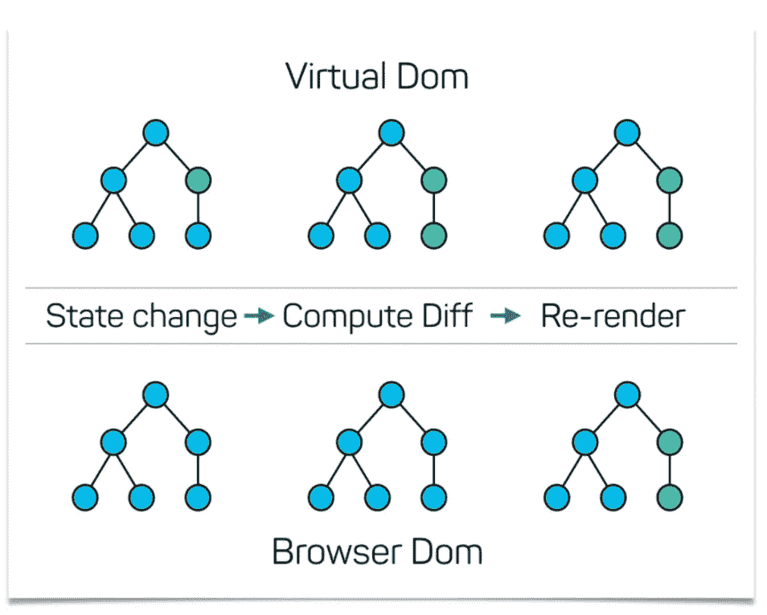

# 反应基本概念

> 原文：<https://medium.com/geekculture/react-basic-concept-ba77153d7684?source=collection_archive---------40----------------------->


React 只是一个 javascript 库，你需要自己做所有的决定。它侧重于帮助您使用组件构建用户界面。它快速、可伸缩、灵活、强大，拥有一个庞大的开发人员社区和大量资源，可以帮助您解决任何问题和情况。

## 1.反应虚拟 DOM

虚拟 DOM 只是 DOM 的虚拟表示。每次应用程序的状态改变时，更新的是虚拟 DOM 而不是真实 DOM。虚拟 DOM 速度更快，因为当新元素添加到 UI 时，虚拟 DOM 是在树中创建的。每个元素都是这个树上的一个节点。如果这些元素的状态发生变化，就会创建一个新的虚拟 DOM 树。然后将该树与先前的虚拟 DOM 树进行比较或“区别”。一旦完成，虚拟 DOM 就会计算出对真实 DOM 进行这些更改的最佳方法。因此，降低了更新真实 DOM 的性能成本。

下图显示了虚拟 DOM 树和与真实 DOM 的不同过程。



## 2.JSX

JSX 代表 JavaScript XML。JSX 允许我们在 React 中编写 HTML。JSX 是有趣的标签 syntex 如下:

```
const name = "Hr Delwar";
const status= "Good morning!";<div>
   <h1>Hello! {name}</h1>
   <h2> {status }</h2>
 </div>
```

JSX 的意思是 html 中的 javascript。JSX 使得在 React 中编写和添加 HTML 更加容易。您可以在 JSX 的任何地方使用一对花括号包含一个 javascript 表达式。

## 3.成分

组件是独立的和可重用的 html 块。它类似于返回 HTML 元素的函数。创建 react 组件时，组件名称以大写字母开头。在 react 中有两种类型的组件，类组件和功能组件。下面是一个例子:

```
//class component
class App extends React.Component {
  render() {
    return <h2>Hi, I am a  class component!</h2>;
  }
}// function componet
function App() {
  return <h2>Hi, I am also a function component!</h2>;
}
```

函数组件和类组件也返回 HTML，它们的行为相同，但是类组件有一些附加。

## 4.小道具

在 react componet 或 JSX 中指定道具有几种不同的方法。为什么我说 JSX？因为 props 是传入 react 组件的参数或属性(javascript 中的函数参数*和 HTML 中的*属性)。React components 也是一个 JSX 元素。

Props 也是您将数据从一个组件传递到另一个组件的方式，作为如下所示的参数:

```
function Person(props){
    return <h2>Hello, I am {props.name}!</h2>;
}

function App() {
    return (
      <div>
      <h1>Hi, What is your name?</h1>
      <Person name="Hr Delwar" />
      </div>
    );
}
```

这里将“name”属性从“App”组件发送到“Person”组件。

## 5.钩住

钩子类似于 javascript 函数。当你调用钩子时，你需要传递一个任意类型的 initail 值，当你不传递初始值时，默认值可能是 null。顺便说一下，react 有几种类型的钩子，状态钩子，效果钩子等等。状态钩子总是返回一个数组，它给出两个值，第一个是初始值，第二个是函数。如果你愿意，你可以通过传递任何类型参数来调用这个函数。当你调用函数的时候，反应风格就是设置状态。因此，如果你用新值设置状态，那么 react DOM 将被重新渲染，并用新的变化更新 UI。

```
import React, { useState } from 'react';

function Example() {
  // Declare a new state variable, which we'll call "count"  const [count, setCount] = useState(0);
  return (
    <div>
      <p>You clicked {count} times</p>
      <button onClick={() => setCount(count + 1)}>
        Click me
      </button>
    </div>
  );
}
```

## 6.事件

React 事件就像 HTML 事件一样，react 可以基于用户事件执行操作。React 具有与 HTML 点击、更改、鼠标悬停等相同的事件。但是与 HTML 事件有一点不同，HTML 事件是用 lowwercase 语法编写的，但是 react 事件是用 camelCase 语法编写的，react 事件处理程序是用花括号写的。

```
<button onClick={shoot}>Click Me!</button>
```

## 7.反应 CSS

有很多方法可以对 CSS 进行样式反应，比如内联样式和 CSS 样式表。

要使用 inline style 属性设置元素的样式，值必须是 javascript 对象，CSS 属性名称相同，但遵循 camelCase 语法。

```
// inline style
function App() {
    return (
      <div>
        <h1 
           style ={{color:"white", backgroundColor:"green"}}
           >Hi, I am Hr Delwar
       </h1>
      </div>
    );
}
```

To style 还可以创建一个带有样式信息的对象，并在 style 属性中引用它。

```
// style object
const styles = {
  color: "white",
  backgroundColor: "green",
  borderRadius: "5px"
}function App() {
    return (
      <div>
        <h1 
           style ={styles}
           >Hi, I am Hr Delwar
       </h1>
      </div>
    );
}
```

和样式写在一个单独的文件中，只需用。css 文件扩展名，并将其导入应用程序。

```
// extranal file is same directory App.css.title{
  background-color: green;
  color: white;
  border-radius: 5px;
  text-align: center;
} // App.js
import React from 'react';
import './App.css';function App() {
    return (
      <div>
        <h1 className="title">Hi, I am Hr Delwar</h1>
      </div>
    );
}
```

## 8.反应 ES6

ES6 代表 ECMAScript 6。React 使用 ES6，应该熟悉一些新特性，比如类、箭头函数、变量(let，const)。ES6 给 react 类组件用户带来了最大好处，因为 ES6 在 javascript 核心中添加了类特性。类特性有构造函数，当对象初始化时自动调用。还有类继承，这对 react 类组件用户也是有益的。但是 ES6 箭头功能对所有反应用户都是有效的功能。morder arrow 函数允许我们编写更短的函数语法。与常规函数相比，箭头函数对“this”关键字的处理也有所不同。简而言之，使用箭头函数没有这种绑定。

然而 ES6 的新特性类箭头函数变量(let，const)等，有助于更快地编写代码和组织代码。

## 9.反应片段

片段是 react 中一个组件返回多个元素的常见模式。片段允许您对一个子列表进行分组，而无需向浏览器 DOM 添加额外的节点。当我们需要在 react 中返回多个元素时，我们用一个 div 元素包装多个元素。但是我们不需要额外的 div。这个片段正在解决这个问题。片段是多元素的容器，没有任何额外的元素或 div。像下面这样:

```
//without fragment
function App() {
    return (
      <div>
        <h1 className="title">Hi, I am Hr Delwar</h1>
        <p>A Front-ent react developer.</p>
     </div>
    );
}//with fragment
function App() {
    return (
      <>
        <h1 className="title">Hi, I am Hr Delwar</h1>
        <p>A Front-ent react developer.</p>
     </>
    );
}
```

## 10.路由器

React 路由器是导航组件的集合。它是向用户显示不同页面的能力。这意味着用户可以通过输入 URL 或点击元素在应用程序的不同页面之间移动。在 react 中，react 路由器所做的是根据 URL 中使用的*路由*(`/`用于主页，/about 用于 about 页面，等等)有条件地呈现某些组件。).

默认情况下，react 没有路由。为了在我们的项目中启用它，我们需要添加一个名为 react-router-dom 的库。

路线示例:

```
import React from "react";

import { BrowserRouter as Router, Route, Link } from "react-router-dom";

export default function App() {
  return (
   <Router>
        <ul>
          <li><Link to="/">Home</Link></li>
          <li><Link to="/about">About</Link></li>
          <li><Link to="/contact">Contact</Link></li>
        </ul>

    <Route path="/" exact>
      <Home/>
    </Route>
    <Route path="/about" exact>
      <About/>
    </Route>
    <Route path="/contact" exact>
      <Contact/>
    </Route>   
</Router>
  );
}

const Home = () => (
  <>
    <h1>Home</h1>
  </>
  );

const About = () => (
  <>
    <h1>About</h1>
  </>
  );

const Contact = () => (
  <>
    <h1>Contact</h1>
  </>
);
```