# 反应基础(带挂钩)

> 原文：<https://medium.com/geekculture/react-basics-with-hooks-298d4ac898d8?source=collection_archive---------26----------------------->

如果你是 React 的新手，我强烈推荐从 [React 文档](https://reactwithhooks.netlify.app/)开始，因为它们会给你关于我下面讨论的每个特性的更深入的解释。但是，如果您以前使用过 React，并且只需要快速复习一下基础知识，那么这就是您应该去的地方！

React(由脸书创建)是一个 JavaScript 库，可以相对快速简单地构建动态网页。在传统的网页中，您必须构建一个完整的 HTML 文件和脚本来更新 DOM，而 React 允许您编写称为*组件*的代码块，然后可以使用(和重用！)来组装你的网页。然后，这些组件可以使用*状态*来自动更新自己，而不必重新加载或导航到不同的页面！

**创建新的 React 应用**

要创建一个新的 React 应用程序，请打开您的终端并输入以下内容，将“您的应用程序名称”替换为您想要命名的任何名称。

```
npx create-react-app your-app-name-here
```

稍等片刻，等待包下载完成，现在您可以将 cd 下载到您新创建的应用程序文件夹中并运行

```
npm start
```

您将在终端中得到一条消息，表明您的服务器已经打开，然后您的浏览器应该打开到 [http://localhost:3000。现在你已经准备好开始编码了！当您保存代码时，页面将自动刷新并显示您的更改，但是，有时您可能需要重新加载页面以清除页面上的数据，或者正确呈现新的组件。](http://localhost:3000.;)

另一个有用的提示，尤其是如果您打算运行本地后端，是导航到您的 react 应用程序文件夹中的 package.json 文件，并在您的“react-scripts start”脚本前面添加 PORT= ，如下所示

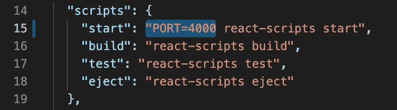

这将在 http://localhost:4000 上启动 React 应用程序，然后您可以同时在 https://localhost:3000 上运行后端。

要深入了解最初的创建过程，请查看这个[回购](https://github.com/facebook/create-react-app)。

**构建您的应用**

React 应用是用 JSX(JavaScript XML 的缩写)编写的，本质上是 JavaScript 和 HTML 的结合。虽然您不必用 JSX 语言编写，但这使得创建组件变得容易得多。我们将在下面讨论用图片写 JSX 的一些怪癖，但首先，让我们谈谈组件。

组件的编写就像 JavaScript 函数一样，但是它们返回一个要在页面上呈现的元素。组件一次只能返回一个元素，但它们可以包含嵌套元素。

看看下面代码中的注释，看看我们如何使用 JSX 来返回和呈现一个组件！

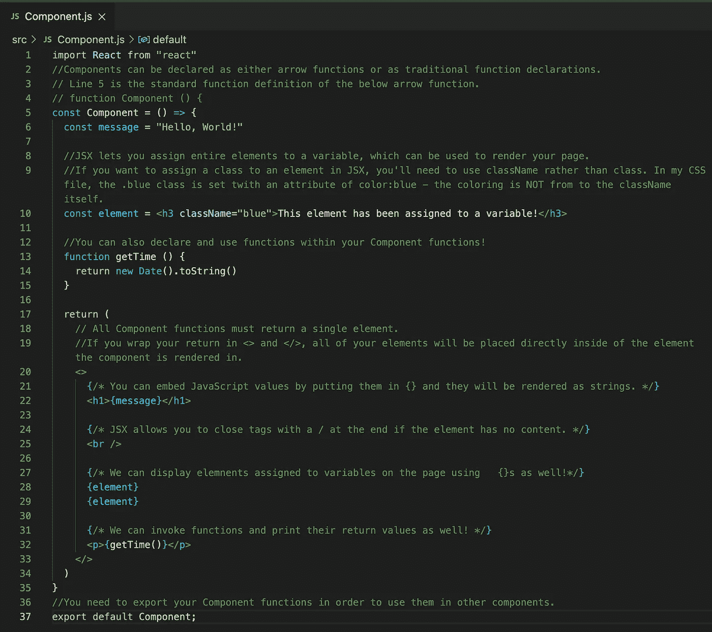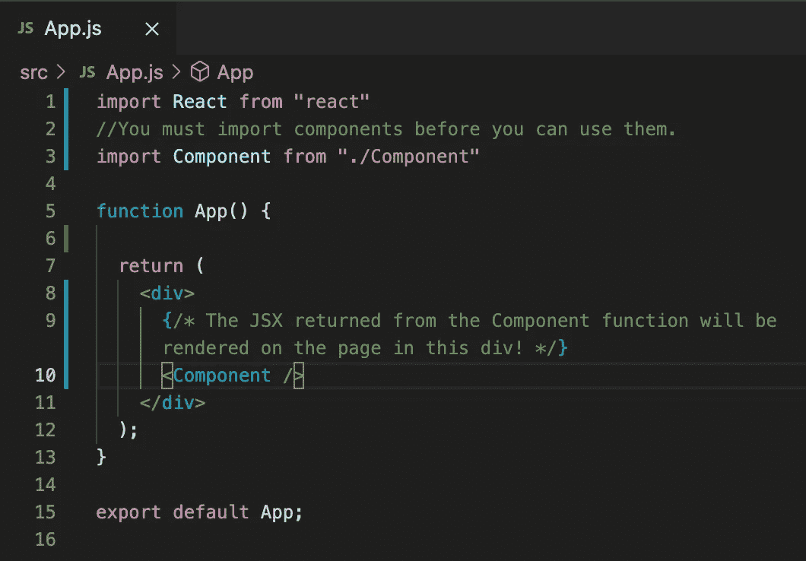

Code for App.js

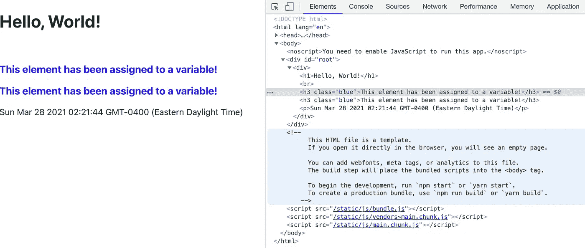

正如你在最后一张图中看到的，我们有一个 HTML 页面，它的主体中有一个 id 为“root”的 div，它来自我们的 React 应用程序在安装时附带的 index.js。下一步是我们在 App.js 中声明的 div，然后您可以看到从 Component.js 返回的所有代码都直接呈现在 App.js div 中，因为我们将它嵌套在*片段*—<>和< / >标记中。

你可以在这里阅读更多关于 JSX [的信息！](https://reactwithhooks.netlify.app/docs/introducing-jsx.html)

**道具**

Props(是*属性*的缩写)用于将信息从父组件向下传递到子组件。

有几种不同的方式传递你的道具——选择你最舒服的方式！下面，您将看到声明同一个组件 PropsExample 的四种不同方式。请注意，PropsExample.js 文件在其当前形式下无法工作，您需要删除所有选项，只保留一个选项。详细信息请查看下面代码中的注释！

这些都会呈现一个页面，上面写着“嗨，我是 Bob，31 岁！”

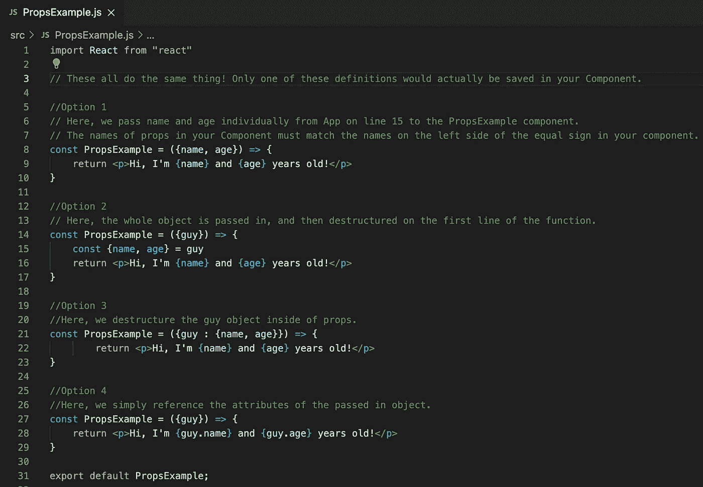

Four ways to use props passed down from a parent component.

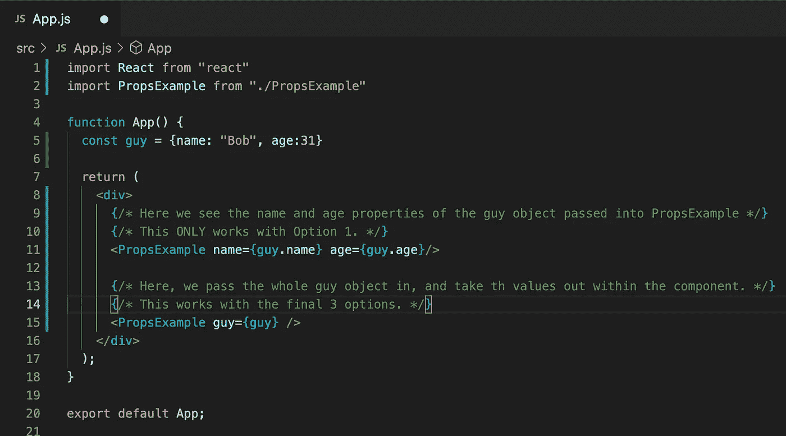

The App.js file that passes Props down to PropsExample.

如果我们有多个人使用相同的组件显示在页面上，我们需要确保为组件的每个呈现包含一个唯一的键——在下面的例子中，我们使用人的名字，但是一个好的选择通常是数据库中对象的 id。不应在数组中使用对象的索引。React 使用这些键来重新呈现单个组件——除了为其分配一个唯一的值之外，不应该在代码中使用它们。

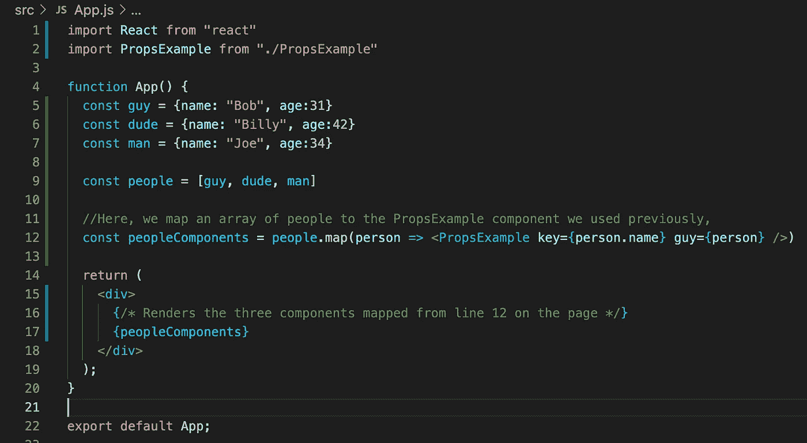

Adding unique keys to props.

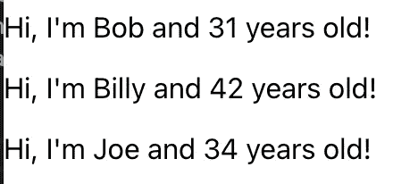

The resulting webpage

你可以在这里阅读更多关于组件和道具[的内容！](https://reactwithhooks.netlify.app/docs/components-and-props.html)

**使用状态、事件处理和受控表单**

React 中最重要的特性之一是状态——它允许我们在页面上动态呈现变化。要使用 state，我们需要将任何要使用 State 的组件顶部的导入行更改为以下内容—

```
import React, {useState} from "react"
```

导入后，我们可以调用 useState 函数，并将其赋给一个析构数组——该数组的第一个值保存状态本身的值，第二个值将是一个为状态赋值的函数——这是为状态赋值的唯一方法。

状态只能在组件函数的顶层改变，不能在循环、条件或嵌套函数中改变。应该少用 State 只在数据将被页面上的事件改变时才使用它。

要在 React 中处理事件，我们只需要给需要监听事件的元素添加一个事件处理函数，比如 onClick 或 onSubmit。我们很快会在按钮上看到一个这样的例子，但是让我们先讨论一下受控窗体。

受控表单是 react 中表单的标准——我们使用状态来跟踪表单中的数据，并对字段的更改使用 setter 函数来不断更新状态的值。通过这样做，我们可以在我们的字段中添加动态验证，确保它们满足我们可能有的任何需求，比如长度或复杂性。

在接下来的代码截图中，您还会看到三元语句，这些语句根据条件语句的状态有条件地呈现页面的各个部分。这里有一个他们如何工作的快速回顾-

```
(*condition to check* ? *expression if condition is true* : *expression if condition is false*)
```

查看下面代码中的注释，了解事件侦听器、状态和受控表单是如何工作的。

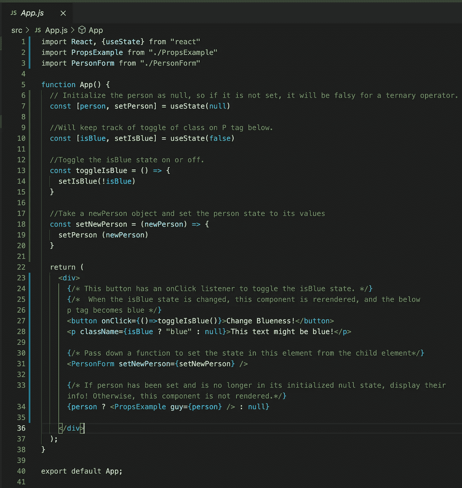

App.js code w/ state and event handling

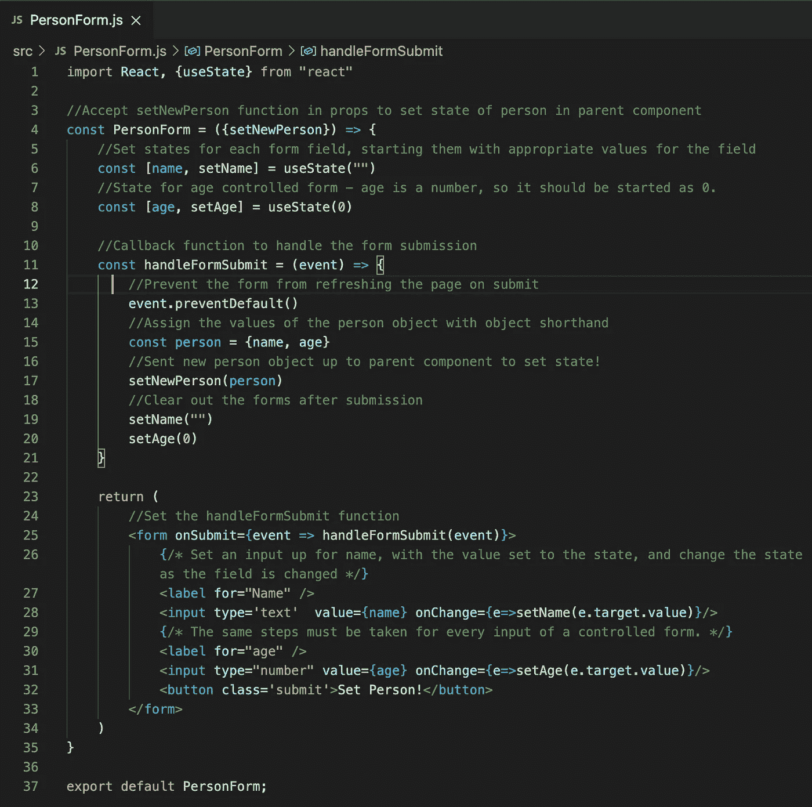

Controlled form component

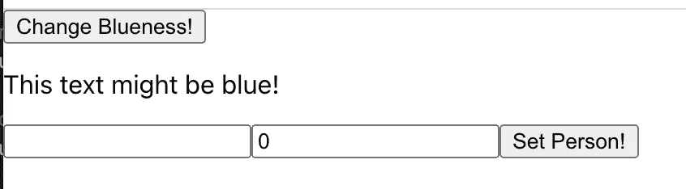

Page on load

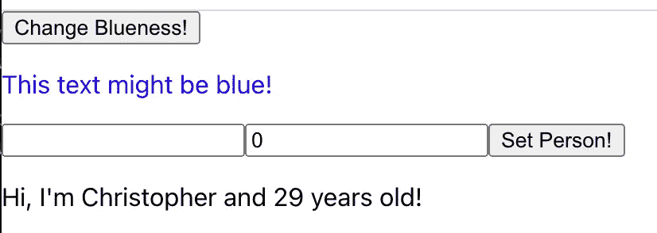

Page after button is clicked and form is submitted

你可以在这里阅读更多关于状态[的信息。](https://reactwithhooks.netlify.app/docs/state-and-lifecycle.html)

你可以在这里阅读更多关于事件处理[的内容。](https://reactwithhooks.netlify.app/docs/handling-events.html)

你可以在这里阅读受控表格[。](https://reactwithhooks.netlify.app/docs/forms.html)

**结论**

除了这里介绍的内容，还有很多东西需要考虑，但希望这是对一些基础知识的有用回顾。点击这里查看其余的文档！