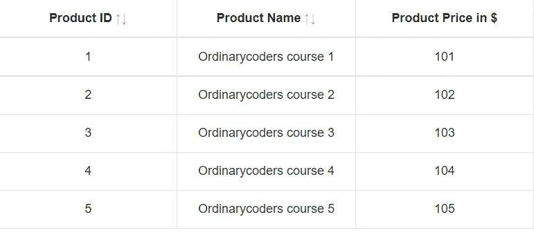
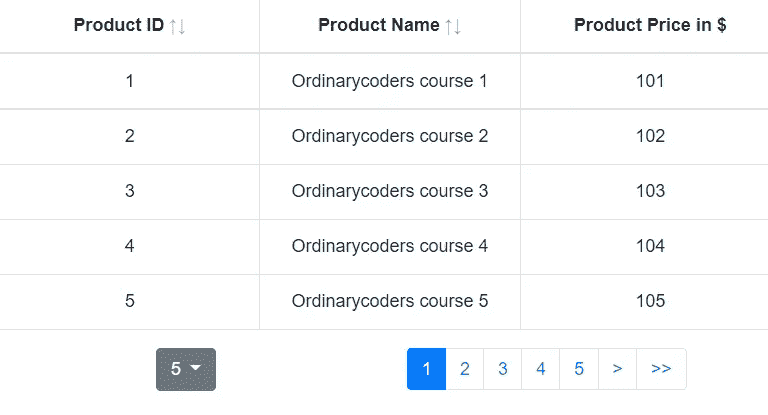
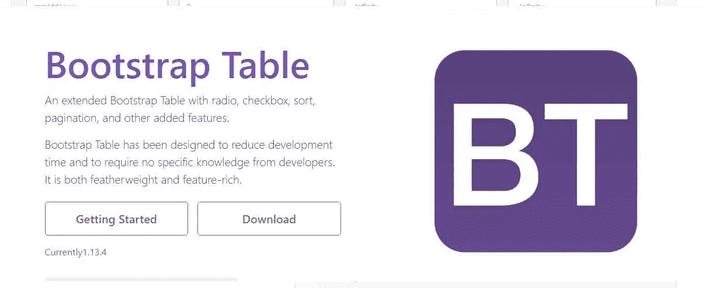

# React 引导表| Ahmed be laid

> 原文：<https://medium.com/geekculture/react-bootstrap-table-820099053df0?source=collection_archive---------7----------------------->

呈现数据所需的最基本组件之一是数据网格，也称为表。但是，它不提供应用程序中通常需要的附加功能，例如排序、过滤、分页、单元格内编辑…

这就是 React 引导表吸引眼球的地方。它们包括预定义的样式类，这些类既响应迅速又可靠，使您能够编译大量数据，并以逻辑有序的方式显示这些数据。

您可以通过添加按钮、复选框、面板和许多其他元素来增强表格。您还可以使用高级数据表选项，如排序、搜索或分页。

# 基本表格

下面是一个基本表在 Bootstrap 中的外观示例。Bootstrap 4 继承了所有的表样式，这意味着任何嵌套表的样式都将与父表相同。

# name handler 1 ordinary coders 1 @ ordinary coders 12 ordinary coders 2 @ ordinary coders 23 ordinary coders 3 @ ordinary coders 3

# 添加 React 引导表

从将 React 引导表添加到我们的项目开始:

```
# add with npm
npm install react-bootstrap-table-next
# or with yarn
yarn add react-bootstrap-table-next
```

React Bootstrap 表是基于 Bootstrap 的样式，因此我们必须为 Bootstrap CSS 文件安装 Bootstrap 包:

```
# add with npm
npm install bootstrap
# or with yarn
yarn add bootstrap
```

如果您需要额外的功能，React Bootstrap Table 提供了单独的包，如果您要使用这些额外的功能，您也需要安装它们。

现在，我们可以将引导表添加到我们的项目中。

我们将从导入 CSS 文件开始。bootstrap.css 文件用于样式化表格。然后，我们将为 Bootstrap 未涵盖的特定 React Bootstrap 表样式导入`react-bootstrap-table2.min.css`。最后，我们将导入`Bootstrap-Table`表格组件。

```
import React from "react";
import "./styles.css";import "bootstrap/dist/css/bootstrap.css";
import "react-bootstrap-table-next/dist/react-bootstrap-table2.min.css";import BootstrapTable from "react-bootstrap-table-next";const products = [
  { id: 1, name: "Ordinarycoders course 1", price: 101 },
  { id: 2, name: "Ordinarycoders course 2", price: 102 },
  { id: 3, name: "Ordinarycoders course 3", price: 103 },
  { id: 4, name: "Ordinarycoders course 4", price: 104 },
  { id: 5, name: "Ordinarycoders course 5", price: 105 }];const columns = [
  {
    dataField: "id",
    text: "Product ID",
    sort: true
  },
  {
    dataField: "name",
    text: "Product Name",
    sort: true
  },
  {
    dataField: "price",
    text: "Product Price in $"
  }
];export default function App() {
  return (
    <div className="App">
      <BootstrapTable
        bootstrap4
        keyField="id"
        data={products}
        columns={columns}
      />
    </div>
  );
}
```

结果应该如下表所示:



products 数组保存了我们想要显示的项目列表。columns 数组指定表格的列配置。对于数据字段字段，我们描述了应该显示的字段的名称、文本字段的显示名称，以及是否应该使用排序字段对每一列进行排序。

最后，我们用表格组件呈现表格。我们使用 bootstrap4 属性通知表我们正在使用框架的 bootstrap 版本 4。

之后，我们在`data`属性中提供数据，在`columns`属性中提供列配置。我们还指定产品的`id`属性应该与`key-Field`属性一起用作唯一键。

*   注意:如果不指定`bootstrap4`属性，React 引导表将呈现引导版本 3 的表。

# 配置 React 引导表

我们可以使用官方网站上提供的属性来配置 React 引导表组件。

假设我们想在表中添加分页。

如前所述，分页是在单独的包中实现的。在使用它之前，我们必须先安装它:

```
# add with npm
npm install react-bootstrap-table2-paginator
# or with yarn
yarn add react-bootstrap-table2-paginator
```

现在，我们可以将它添加到我们的表中:

```
import React from "react";
import "./styles.css";import "bootstrap/dist/css/bootstrap.css";
import "react-bootstrap-table-next/dist/react-bootstrap-table2.min.css";import BootstrapTable from "react-bootstrap-table-next";
import paginationFactory from "react-bootstrap-table2-paginator";export const productsGenerator = quantity => {
  const items = [];
  for (let i = 1; i < quantity; i++) {
    items.push({ id: i, name: `Ordinarycoders course ${i}`, price: 100 + i });
  }
  return items;
};const products = productsGenerator(100);const columns = [
  {
    dataField: "id",
    text: "Product ID",
    sort: true
  },
  {
    dataField: "name",
    text: "Product Name",
    sort: true
  },
  {
    dataField: "price",
    text: "Product Price in $"
  }
];export default function App() {
  return (
    <div className="App">
      <BootstrapTable
        bootstrap4
        keyField="id"
        data={products}
        columns={columns}
        pagination={paginationFactory({ sizePerPage: 5 })}
      />
    </div>
  );
}
```

结果应该如下表所示:



该演示与简单的表格演示相同。从`react-bootstrap-table2-paginator`包中导入分页工厂函数，而不是从前面的例子中导入分页工厂函数。我们调用这个函数，并将结果提供给表的 pagination 属性。

注意:如果您的 React 项目使用 Bootstrap，该表将与应用程序的其余部分具有相同的样式。所有附加的主题也将被应用。如果希望对应用程序中的所有表格应用样式，这是一个不错的选择。

# 结论

如果你用一个表开始 React Bootstrap 编程，你会很快学会如何处理代码。表负责以有组织的方式显示信息，以便从分组到类别的数据中查看模式和想法，当您需要显示带有排序、分页和过滤的数据网格时，选择 React Bootstrap 表是一个很好的选择。

——这篇文章发表在《普通编码者》杂志上

