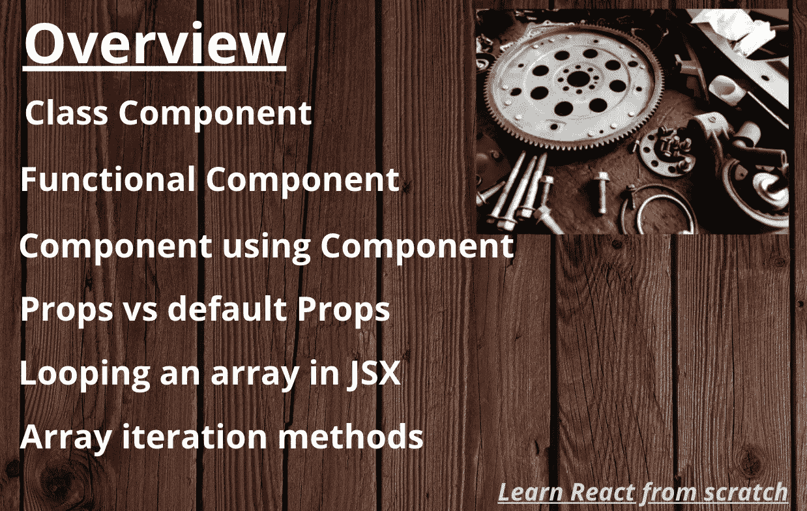
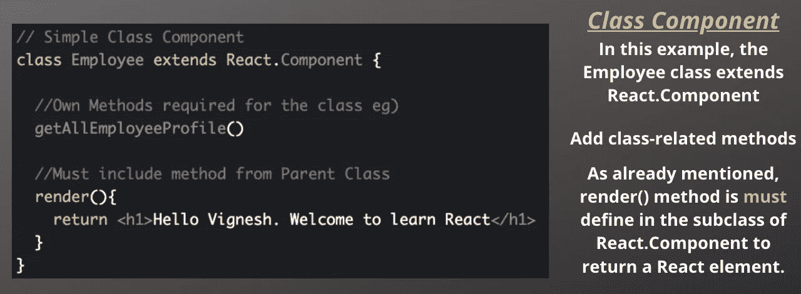
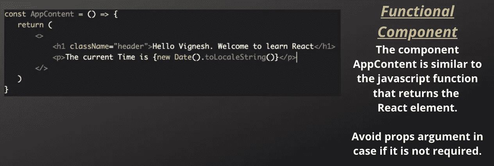
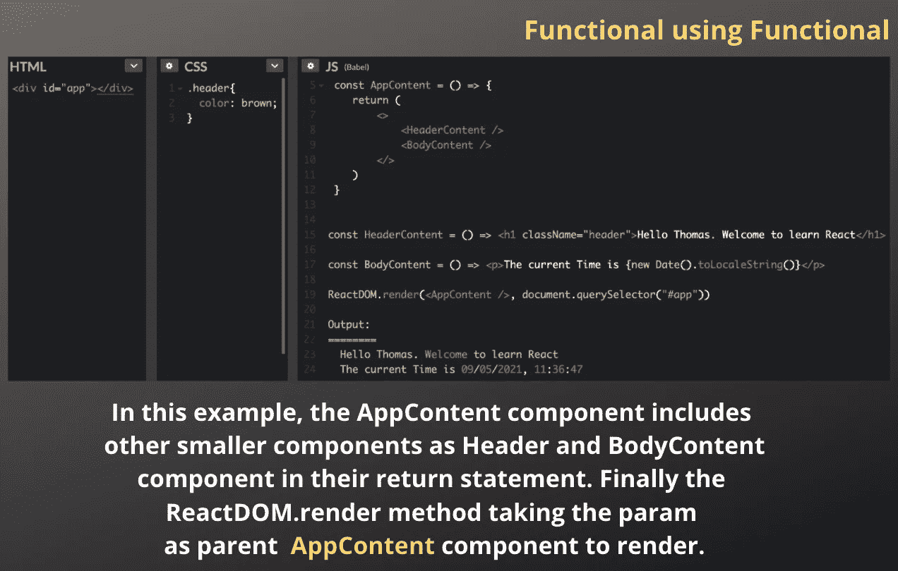
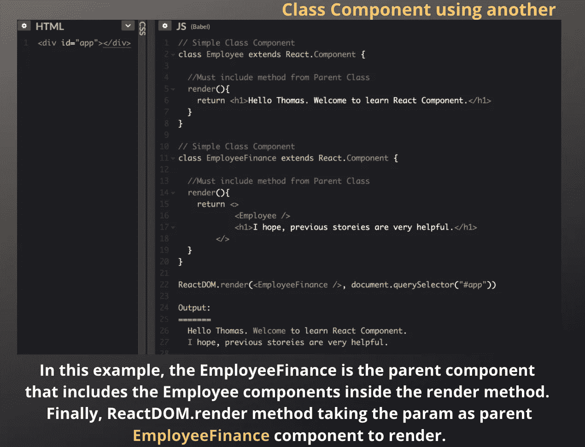
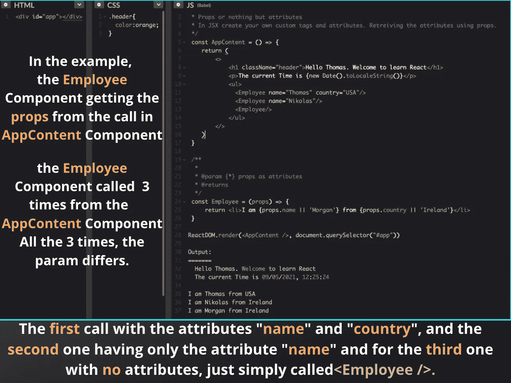
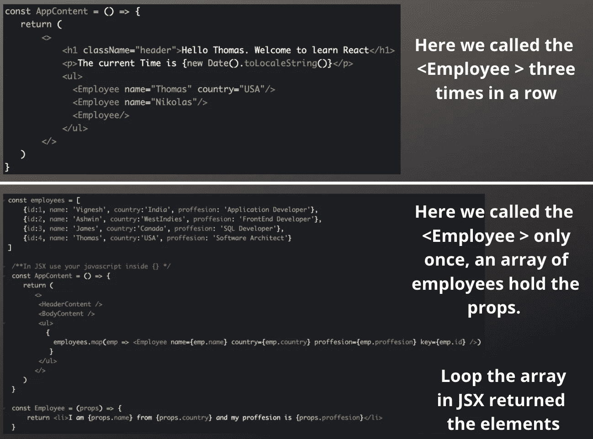
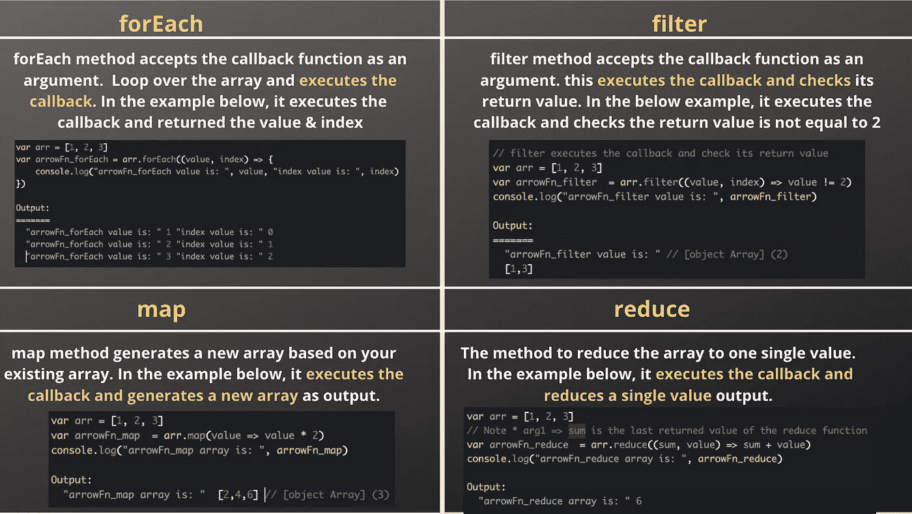

# 反应组件和道具

> 原文：<https://medium.com/geekculture/react-components-and-props-166ab224668?source=collection_archive---------28----------------------->

**Table of Contents**

该组件为前端复杂性提供了解决方案。它只是将复杂 UI 部件的大块分割成小块。因此，组件可以独立工作，易于重用。

React 组件可以用两种方式编写它，**类**组件& **功能性**组件。

在详细查看组件之前，如果你对**类没有概念。**请参考我们故事中的 [ES6 **类**特性](https://svignesh90-vs.medium.com/class-in-javascript-oops-concept-7a0a1ef96dbc)然后继续。

## 类别组件

一个类组件需要你从 React 中**扩展**。组件。[***render()***](https://svignesh90-vs.medium.com/learn-react-from-scratch-18fc9e89e8d2)*方法**必须**在子类中定义父类是否有反应。组件。让我们看一个简单的类的例子。*

**

***Class Component***

## *何时使用，为什么？*

*类组件是有状态组件，因为它们在其中实现逻辑和状态。React 生命周期方法可以在类组件内部使用。在我们后面的故事中，我们将看到 React 生命周期方法的详细视图。*

## ***功能组件***

*功能组件类似于返回 React 元素的 JavaScript 函数。一个 object **props** 作为一个参数是可用的，但是它不是强制的。*

**

***Functional Component***

## *何时使用，为什么？*

*功能组件是无状态组件，因为它们只是接受数据并显示数据。主要是它只用于渲染用户界面。生命周期方法不能在功能组件内部使用。*

## ***组件使用另一个组件** [**代码笔**](https://codepen.io/071eE211/pen/JjEzRQj)*

**

***Functional Component using another Functional Component***

> *如果您要使用其他文件或文件夹中的组件，请在此处导入相应的组件。如果/footer/Footer.js 中有页脚内容，只需导入并使用它。
> ***从'导入页脚。/footer/footer . js '；****

## *类组件使用另一种[代码笔](https://codepen.io/071eE211/pen/rNyNBGw)*

**

***Class Component using another Class Component***

## ***了解道具&默认道具** [**代码笔**](https://codepen.io/071eE211/pen/abpMByd)*

*props 代表属性，用于将数据从一个组件传递到另一个组件。假设如果 props 没有将数据从父组件传递到子组件，那么默认 props 将提供数据。让我们用一个例子来看看这个场景。*

**

***Understanding of Props***

**将* ***<员工/ >*** *返回* ***未定义或空白的*******？*****

****是**除非我们没有设置默认道具。但是在这段代码中，我们在 Employee 组件中将**“name”设置为‘mor gan’，将“country”设置为“Ireland”**的默认属性值。因此，逻辑运算符||用于设置回退值，因此每当属性丢失时，它会显示回退值来代替丢失的属性。**

## **在 JSX 循环数组[代码笔](https://codepen.io/071eE211/pen/oNBVBZd)**

**在最后一个例子中，我们手动调用了 employee 组件三次，假设在这种情况下调用次数增加了，使用 loop 来避免一个接一个地调用组件。**

****

****Looping an array in JSX****

**这里我们使用了**映射**方法来返回值，为什么不用 **forEach** 方法呢？ [**码笔**](https://codepen.io/071eE211/pen/PopqJNR)**

**再来看看**forEach*****vs*****滤镜** ***vs* 贴图 *vs*** **减少**方法的区别。**

****

****forEach** ***vs*** **filter** ***vs* map *vs*** **reduce****

**希望它能给出 ***组件&道具的基本视图，循环 JSX &数组中的数组迭代方法*** 。如有疑问或修改，请写下您的问题。**

**让我们在下一个故事中讨论 ReactJS 的下一个特性。
下一题 **:** [**处于反应状态**](https://svignesh90-vs.medium.com/state-in-react-b228c8c47a7d)**