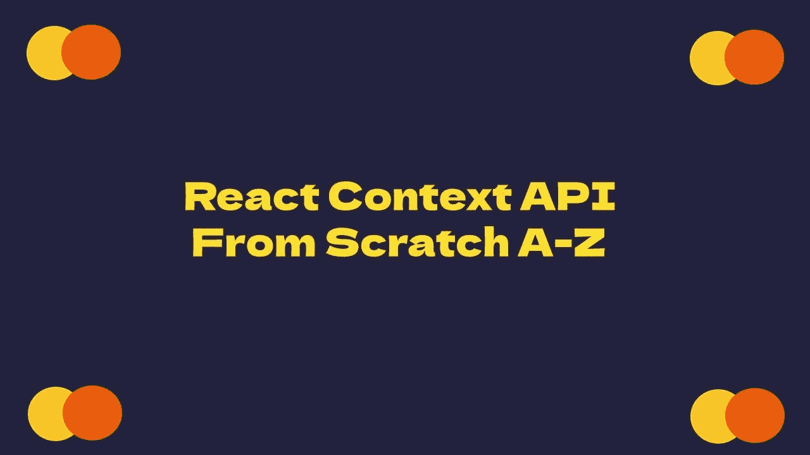

# 从头开始反应上下文 API

> 原文：<https://medium.com/geekculture/react-context-api-from-scratch-a-z-8954a05ebbec?source=collection_archive---------2----------------------->



Banner of Article

# 简介:

在过去的几年中，许多 react 项目都使用了 Redux 状态管理库。对于许多 react 项目来说，Redux 是一个很好的工具，尤其是对于整个应用程序的全局状态，使用 redux-thunk 或 redux-saga 处理动作创建者中的 API 请求，Redux 还有其他与之相关的库，如 redux-persist，它允许我们在本地存储中保存/存储数据，并在刷新时重新水合。

但是作为 React 开发人员，我问自己，如果我不需要 redux 提供的所有优秀特性，我只想使用 Redux，以避免将道具传递给深度嵌套的组件，那该怎么办。

React [上下文 API](https://reactjs.org/docs/context.html) 已经引入，自 React 版本 [16.3.0](https://reactjs.org/blog/2018/03/29/react-v-16-3.html) 起，在生产中使用变得安全。上下文 API 可以帮助将道具深入传递到嵌套组件或组件树。我不需要使用 redux，只是为了避免将属性传递给深度嵌套的组件。

## 我们将在本文中解释:

1-什么是 React 上下文？

2-何时使用 React 上下文的示例。

3-如何使用 React 上下文？

4- Class.contextType vs Context。使用基于类的组件的使用者。

5-对基于函数的组件使用上下文挂钩。

6-更新上下文。

7-消耗多个上下文。

8-注意事项。

# 什么是 React 上下文？

React context 允许我们将数据从父组件传递到子组件，并在我们的应用程序中使用我们需要的任何组件中的数据，而不使用 props，因此 React context 允许我们更容易地跨组件共享数据。当您传递可以在应用程序的任何组件中使用的数据时，React context 非常有用。

道具演练问题可以通过上下文来解决:道具从父母传给孩子的时候。

**道具钻取**是通过不需要道具的组件，将道具向下传递多个级别到嵌套组件的过程。

这里有一个道具演练的例子。该应用程序中的主题数据将作为道具传递给我们应用程序的组件。

我们正在钻主题道具通过多个组件，现在不需要它。

除了将其传递给其子组件，Header 组件不需要主题。UserMenu、LoginMenu、Menu 应该直接消费主题数据。

因为我们不需要使用道具，所以我们可以使用 React context 完全避免道具训练。

# 何时使用 React 上下文的示例:

你可以在上下文中:

*   主题数据(如暗模式或亮模式)
*   应用程序配置
*   已验证的用户名
*   用户设置
*   首选语言
*   服务的集合

使用上下文的目的是允许组件访问一些全局数据，并在数据更改时重新呈现。

数据应该放在不需要经常更新的 React 上下文上，为什么？因为上下文并不是作为一个完整的状态管理系统。它是为了让消费数据更容易。

我们可以将 React 上下文视为 React 组件的全局变量。

# 如何使用 React 上下文？

Context 是 React 内置的 API，所以我们可以通过在任何 React 文件中导入 React 来直接创建和使用 context。

1.  我们通过`createContext`方法创建上下文:

```
const myContext = React.createContext(defaultValue);
```

`createContext`函数接受一个**可选参数**:默认值。这个默认值有助于在不包装组件的情况下单独测试组件。

2.我们将上下文提供者包装在组件树周围。

3.使用`value`属性传递上下文提供者的任何数据

4.我们使用上下文消费者来读取树中任何组件的数据。

创建文件 myContext.js:

App.js 文件:

# Class.contextType 与上下文。使用基于类的组件的消费者:

在我之前的例子中，我们对基于函数的组件使用了`Context.Consumer`，我将对基于类的组件使用相同的例子:

## 什么是 contextType？

React 16.6 引入了一个新特性，允许基于类的组件在不使用`Context.Consumer`组件的情况下访问上下文。

这允许 React 自动将类组件连接到**上下文**，并且它给了我们一个新的属性`this.context`属性，我们可以在任何生命周期方法中使用它，包括 render 函数。

使用`contextType`有两种方法:

1-类的`contextType`属性可以被分配一个由`[React.createContext()](https://reactjs.org/docs/context.html#reactcreatecontext)`创建的上下文对象。使用`this`属性可以让您使用`this.context`来使用该上下文类型的最接近的当前值。

2-如果你正在使用实验性的[公共类字段语法](https://babeljs.io/docs/plugins/transform-class-properties/)，你可以使用一个**静态**类字段来初始化你的`contextType`。

下面的例子演示了这两种方式，很大一部分例子来自官方文档:

它只能在基于类的组件中使用，之所以推荐使用它，是因为它更简短、更容易，并且可以在任何地方访问上下文。

将`myContext.Consumner`替换为`contextType`后的示例如下:

# 基于函数的组件的 useContext 挂钩:

随着 [**React 钩子**](/swlh/react-hooks-from-scratch-a-z-bf8f7b404f7f) 的引入，React 16.8 提供了一种新的使用上下文的方式。你现在可以使用`useContext`钩子来使用上下文。

`React.useContext()`可用于替代渲染道具，以消耗组件顶部的上下文。

**例如:**

*`*useContext*`*钩子的好处在于它让我们的组件更加简洁，并允许我们创建自己的* [**定制钩子**](/geekculture/la-la-land-of-building-my-own-react-custom-hook-75f0a0fe53f9) *。**

*根据您的喜好，您可以直接使用消费组件或`useContext`挂钩。*

# *更新上下文:*

*以下示例将介绍如何更新上下文值，我们将对应用程序和标题组件进行一些更改:*

## *从嵌套组件更新上下文:*

*默认情况下，React 上下文 API 是无状态的，使用者组件没有专用的方法来更新上下文值。在这种情况下，您可以通过集成状态管理机制(如 useState())将函数向下传递到上下文，以允许使用者更新上下文，并在值旁边的上下文中包含更新函数，这很容易实现。*

***1-更新我的上下文文件:***

*myContext.js 文件发生了一些修改:*

*在这里，我为`theme`和`setTheme`函数设置默认值，它将由上下文提供者发送给消费者。这些只是默认值，我将在父应用程序中使用 provider 组件时提供它们的值:*

*注意:无论使用钩子还是基于类的组件，上下文都是一样的。*

***2-设置动态上下文的父状态***

*首先，为了有一个可以传递给消费者的动态上下文，我将使用父代的状态。这确保了我有一个单一的真相来源。例如，我的父应用程序将如下所示:*

```
*import { myContext, themes } from "./myContext";
import React, { useState, useMemo } from "react";
 const App = () => {  
 const [theme, setTheme] = useState(themes.light); 
 const value = useMemo(() => ({ theme, setTheme }), [theme]);
 return (    
   <>      
     .......
   </>  
   );
};*
```

*`theme`存储在状态中。稍后我们将通过上下文传递`theme`和 setter 函数`setTheme`。*

***3-在提供者中包装消费者***

*现在，在一个`myContext.povider`中，我将把必须通过上下文发送的值传递到任何更深的层次。这是我父母`App`的样子:*

```
*const App = () => {const [theme, setTheme] = useState(themes.light); 
 const value = useMemo(() => ({ theme, setTheme }), [theme]);
return (    
   <>      
   <myContext.Provider value={value}> 
       <Header />    
         <div>  
          <h1>Hello World!</h1>   
        </div>    
       <Footer />      
    </myContext.Provider>   
   </>  
 );
}*
```

*现在，无论何时点击主题切换器，它都会动态更新上下文。*

***4-创建上下文消费者:***

*为了让`themeSwitcher`设置主题，它应该通过上下文访问主题设置函数。它可能看起来像这样:*

***整个例子:***

***App.js 文件:***

*`<App />`存储上下文值。 [**记忆化**](/geekculture/great-confusion-about-react-memoization-methods-react-memo-usememo-usecallback-a10ebdd3a316) 只要主题保持不变，就保留上下文值对象，防止< App / >每次重新呈现时消费者重新呈现。*

*或者，`const value = {theme, setTheme}`会在< App / >的重新渲染过程中创建不同的对象实例，触发上下文消费者重新渲染。你可以阅读更多关于 [**记忆化**](/geekculture/great-confusion-about-react-memoization-methods-react-memo-usememo-usecallback-a10ebdd3a316) 的内容。*

# *使用多个上下文:*

*如果我们有两个上下文，一个用于主题模式，另一个用于登录用户信息，下面的示例演示了我们将如何使用它们:*

*对 myContext.js 文件进行了一些修改:*

***App.js 文件:***

*如果您喜欢直接使用消费者组件，下面的示例演示了我们将如何直接使用消费者组件来消费两个上下文，我将修改`UserMenu`组件:*

# *警告:*

*由于上下文使用引用标识来确定何时重新呈现，所以当提供者的父级重新呈现时，有一些问题可能会导致使用者中的意外呈现。*

*当您将一个对象传递给 React 上下文提供者，并且其上的任何属性都更新时，会发生什么呢？所有使用该上下文的组件都将重新呈现。状态值很少且不经常更新的较小应用程序(如主题数据)可能不会遇到这个问题。*

*如果我们的应用程序在其组件树中有许多组件，并且您需要执行许多状态更新，这将是一个问题。*

## *示例:*

*每次提供者重新呈现时，下面的代码将重新呈现所有消费者，因为总是为`userContext.provider value:`创建一个新对象*

```
*const App = () => {  
  const [theme, setTheme] = useState(themes.light);
  const value = useMemo(() => ({ theme, setTheme }), [theme]);  
 return (    
  <>      
   <myContext.Provider value={value}>     
     <userContext.Provider value={{name: "kirill"}>    
       <Header />        
        <div>           
         <h1>Hello World!</h1>      
        </div>         
       <Footer />        
      </userContext.Provider>  
    </myContext.Provider>    
  </>  
   );
};*
```

*我们将通过将`userContext.provider`的值放入父节点的状态来解决这个问题:*

```
*const App = () => {  
 const [userName, setUserName] = useState("kirill");
 return (    
  <>      
     <userContext.Provider value={userName}>    

      </userContext.Provider>  
  </>  
   );
};*
```

*如果你喜欢我的内容，请跟随我，我需要你的支持。我活跃在 Twitter[**@ IbraKirill**](https://twitter.com/IbraKirill)。*

*如果你喜欢读这篇文章，并且想支持我成为一名作家，你可以 [**请我喝杯咖啡！**](http://buymeacoffee.com/kirillibrahim)*

*如果你想深入 [**上下文，钩子，Redux**](https://click.linksynergy.com/link?id=GGg4no0HUcA&offerid=507388.3645282&type=2&murl=https%3A%2F%2Fwww.udemy.com%2Fcourse%2Freact-the-complete-guide%2F) 。我用下面的 [**课程来劝你。**](https://click.linksynergy.com/link?id=GGg4no0HUcA&offerid=507388.3645282&type=2&murl=https%3A%2F%2Fwww.udemy.com%2Fcourse%2Freact-the-complete-guide%2F)*