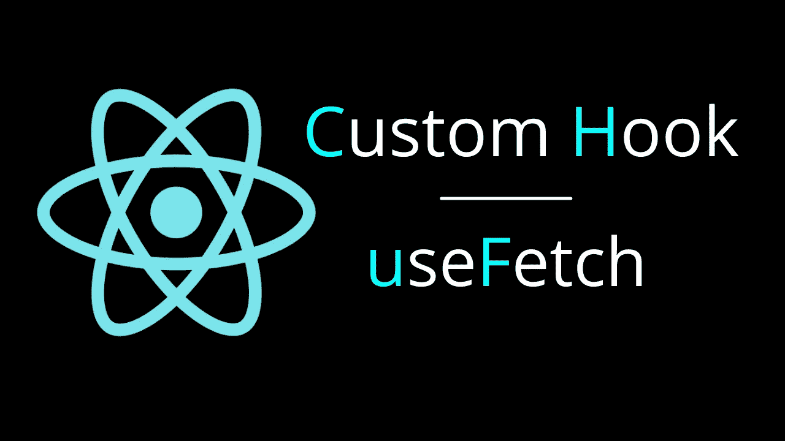
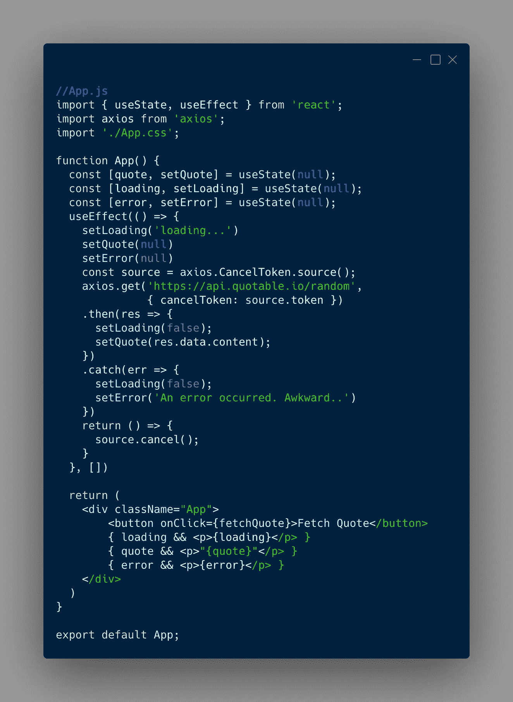
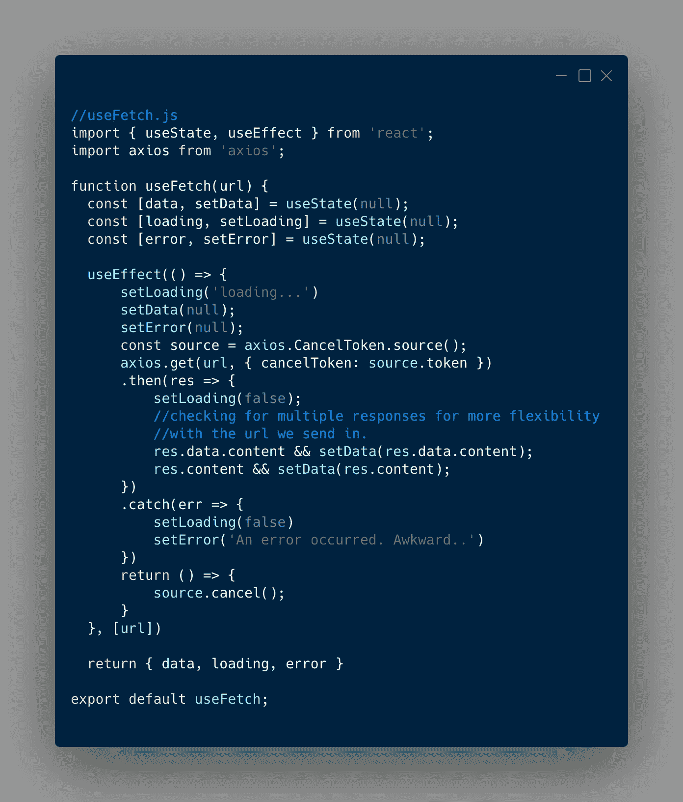
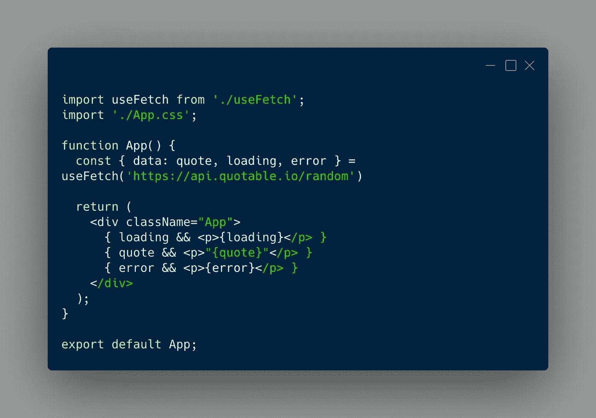

# 反应自定义挂钩—使用 Fetch

> 原文：<https://medium.com/geekculture/react-custom-hook-usefetch-87ea1d41d1ce?source=collection_archive---------9----------------------->

# 为什么使用 Fetch？

当用户访问某个页面时，获取数据是很常见的。当获取数据时，我们也使用公共逻辑。

还有大量的样板文件/逻辑塞满了我们的组件，而且不是很枯燥(不要重复)。

这些都是制作定制挂钩的好理由。我们可以将样板文件/逻辑外包到一个单独文件中。该文件将保存函数(hook ),该函数将返回我们需要在组件中使用的内容。

# 老办法

在这个例子中，我将使用`useState`钩子来跟踪加载状态、任何错误和数据。我将使用`useEffect`钩子来运行所有的代码。最后，我使用 axios 获取数据，并使用 cancel 令牌取消任何我们不再需要的未完成请求。

代码太多了。让我们移动它的大部分。

# 新的方式

我们将创建另一个名为`useFetch.js`的文件。您希望自定义钩子的名称以“use”开头，以便 React 知道像对待钩子一样对待它。

让我们复制导入语句、所有 3 个使用状态和 useEffect 函数。

你可能已经注意到了一些变化。首先，这个函数(也就是我们的钩子)被命名为 useFetch。它接收一个参数，这个参数是我们想要从中获取数据的 url。

我们还把`setQuote`改成了`setData`，让它更加通用。请注意，我们还会检查多个响应，以使其更加灵活。

最后，我们的 useFetch 函数(hook)返回我们的数据、加载和任何错误。

> 我把它们放在一个对象中，这样我们就可以在访问组件中的那些对象时使用对象*析构。这样，当我们析构它们时，顺序就无关紧要了，如果我们愿意，我们可以重命名它们。接下来我会展示给你看。*

# 在我们的组件中使用 useFetch

因此，回到我们的应用程序组件，我们将从`useFetch.js`导入我们的 useFetch 钩子，并传入我们想要从中获取数据的 url。我们将使用对象析构来访问我们需要的东西。最后，我们将数据重命名为 quote。

Muuuuuch 清洁器😎。

# 结论

自定义钩子对于清理代码非常有用。你可以在你的自定义钩子中使用 React 钩子(毕竟它们都是函数！👍).你可以封装很多重复的逻辑，然后从自定义钩子返回你需要的东西。

如果你想看的话，我有一个 YouTube 视频。

如果你喜欢了解类似的话题，请随时查看我的 [YouTube](https://www.youtube.com/channel/UCD0JOhEl8HvPowpg8Ri3CvA) 或 [Instagram](https://www.instagram.com/techcheck__/) 。

希望这能帮助到一些人，感谢你的阅读！

安德鲁