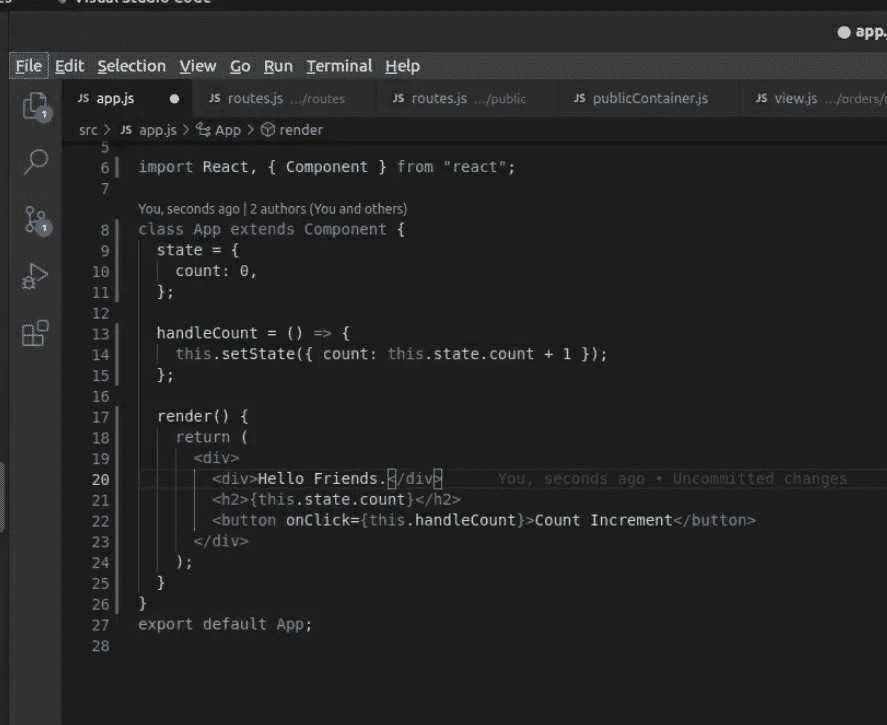
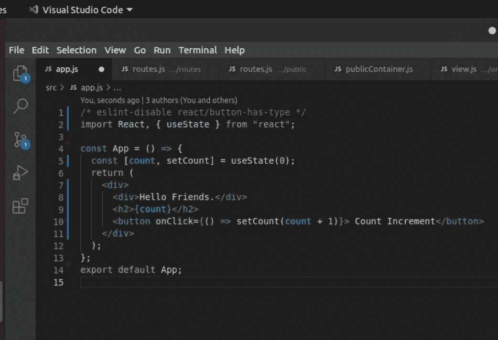
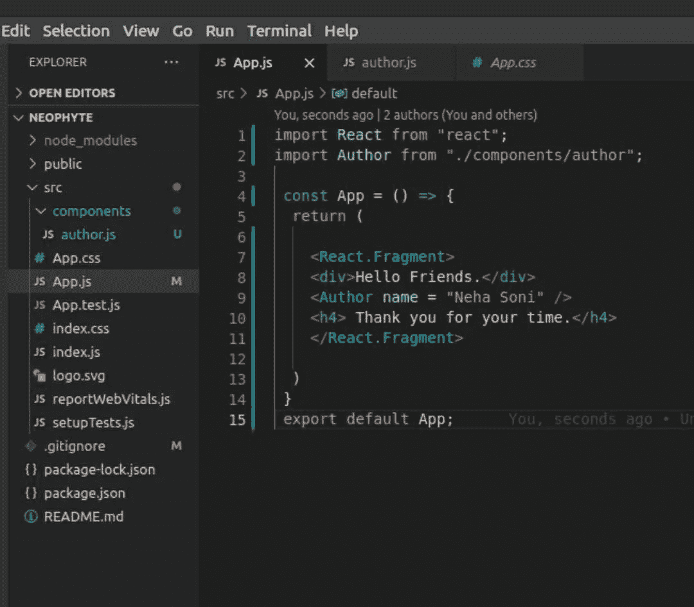
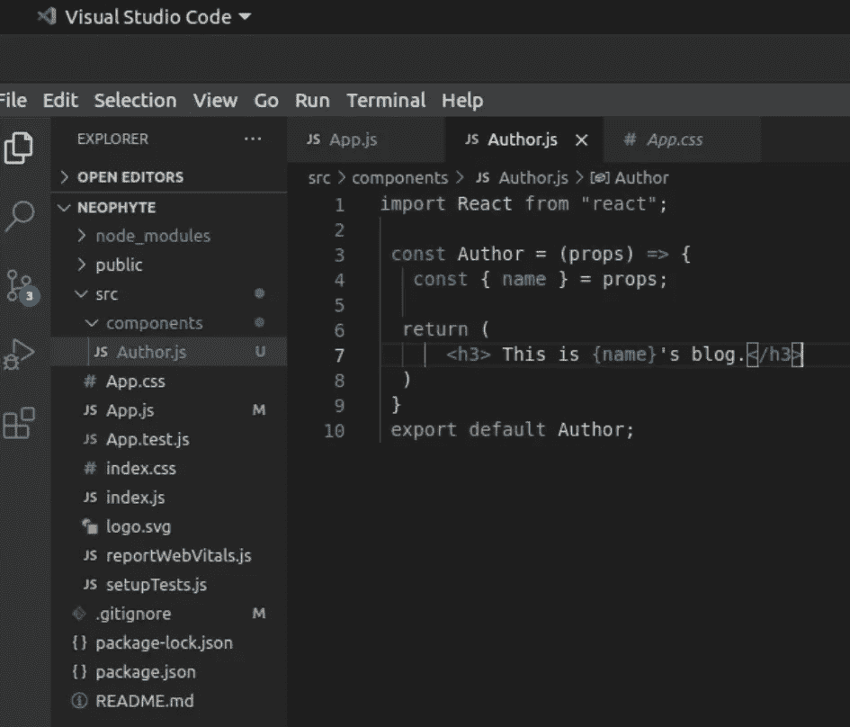
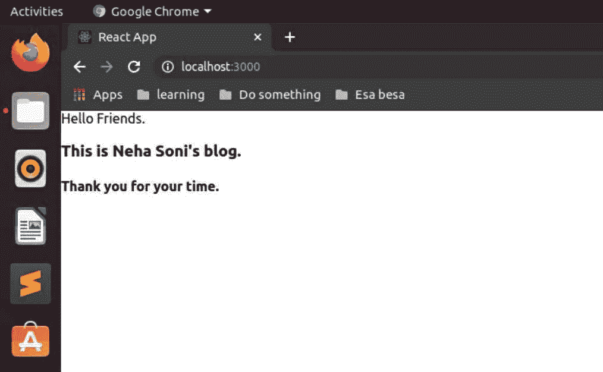
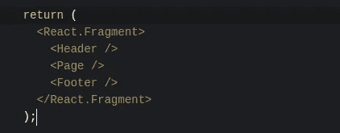
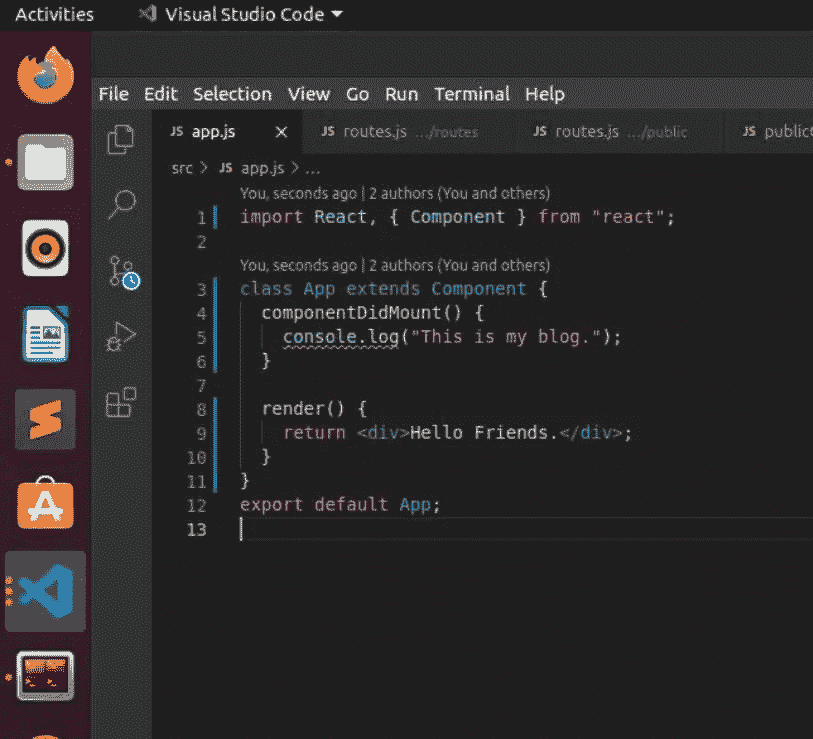
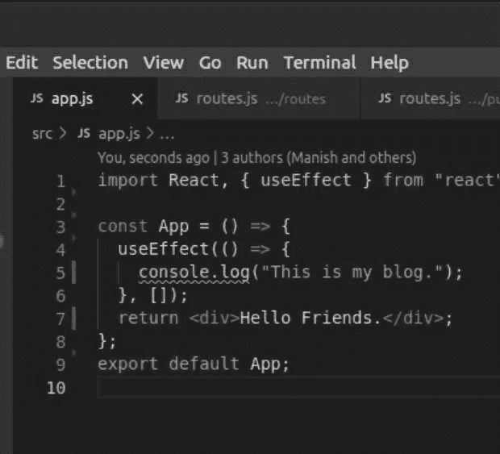

# 反应

> 原文：<https://medium.com/geekculture/react-eed0153d78f3?source=collection_archive---------38----------------------->

*   **什么是反应堆**
*   **JSX**
*   【react 是如何工作的？
*   **如何在 vs 代码中启动 react app？**
*   **组件**
*   **道具**
*   **碎片**
*   **挂钩**
*   **UseEffect()钩子**
*   **Redux**

# 什么是 reactjs

React 是一个用于构建用户界面的 JavaScript 库。这可能是一个额外的组成部分，事实上。React.js 是一个客户端 JavaScript 库。它可以帮助我们编写客户端 JavaScript 代码，这一切都是为了给网站构建现代的反应式用户界面。

# **JSX**

JSX 代表 JavaScript XML。JSX 允许开发者在 React 中编写 HTML 代码。JSX 使得在 React 中编写和添加 HTML 变得更加容易这是 React 中简单的 JSX 代码。但是浏览器不理解这个 JSX，因为它不是有效的 JavaScript 代码。这是因为我们将一个 HTML 标签赋给了一个不是字符串而是 HTML 代码的变量。

# react 是如何工作的？

使用 React，我们定义了所需的目标状态/组件，然后 React 负责运行和生成实际的 DOM 指令，更新应用程序屏幕上的可见内容。

# **如何在 vs 代码中启动 react app？**

只需运行命令:my-app 是一个文件夹名

```
npx create-react-app my-app
```

安装应用程序后，运行命令启动您的应用程序。

```
cd my-app
npm start
```

# **组件**

主要是两种类型的组件:

1.  类别组件
2.  功能组件

**类组件:-** 类组件是一个简单的 javaScript 类，创建一个返回 react 元素或返回 HTML 的渲染函数。React 生命周期方法可以在其中使用。



**Class component**

**功能组件:-** 功能组件不包含状态或生命周期挂钩，所以用更少的代码更容易阅读和测试。使用功能组件的一个主要原因是与类组件相比性能更好，因为 JS V8 引擎首先需要编译类组件，但是功能组件不需要编译就直接执行。



**Function component**

# **道具**

道具代表属性，我们可以说道具就像论点。因此，我们可以将属性从一个组件传递到另一个组件，或者我们可以将属性从父组件传递到子组件。

例如，我们有两个文件 App.js 和 Author.js，我们可以使用 props 将名称属性 App.js 传递给 Author.js。



**App.js**



**Author.js**



**output**

# **片段**

片段允许我们编写更干净的代码，最终减少不必要的 HTML 元素，并对组件/子组件列表进行分组，而无需向 DOM 添加额外的节点。



# **挂钩**

钩子在不使用类的情况下为我们提供了所有的 React 特性。React Hooks 是一个新特性，通过它我们可以在功能组件中使用状态和生命周期方法，而不必编写类组件。

# **UseEffect()钩子**

useEffect 是一个钩子，它为我们提供了在功能组件中使用生命周期的方法。每当组件呈现时，此 useEffect 都会运行。基本上，useEffect 是 componentDidMount、componentDidUpdate 和 componentWillUnMount 生命周期的组合。我们可以以多种方式使用这个 useEffect，比如组件安装生命周期等等。



**componentDidMount function**



**useEffect Function**

# **Redux**

Redux 是一个用于跨组件或应用程序范围状态的状态管理系统。因此，它帮助我们管理状态、改变和影响我们的应用程序的数据以及我们在屏幕上显示的内容。它帮助我们管理多个组件和应用程序范围的状态。

——我们可以把国家的定义分成三种主要的国家

1.  地方州
2.  跨组件/跨多个组件
3.  App 全状态。

**本地状态:-** 属于单个组件的状态。

示例:-监听输入字段中的用户输入。(文本字段)

**跨组件/跨多个组件:-** 影响多个组件的状态。

示例:-模式覆盖的打开/关闭状态。(支柱钻孔)

**应用范围状态:-** 影响整个应用或几乎所有组件的状态。

示例:-用户身份验证状态。(支柱钻孔)

因此，React Context (prop drilling)和 Redux 都可以帮助我们管理这种跨组件或应用程序范围的状态。