# 用对话框覆盖反应电子邮件验证

> 原文：<https://medium.com/geekculture/react-email-validation-with-dialog-overlay-472ee564d585?source=collection_archive---------13----------------------->

—电子邮件验证有时令人头疼，🧊

No pain no gain — 一分耕耘，一分收获

我总是觉得表单验证是一件令人头痛的事情，但在现实世界中它总是需要的，在我最近的一个项目中，我创建了**两个**覆盖图(一个**电子邮件输入覆盖图**，用户可以输入电子邮件地址，并在提交后得到一个**确认覆盖图**)。

为了简单起见，让我们先看一下**电子邮件输入覆盖图**，它是通过点击页面上的一个按钮显示的(我使用的是 [reakit](https://reakit.io/docs/get-started/) ，它是我最喜欢的 UI 库之一)📖

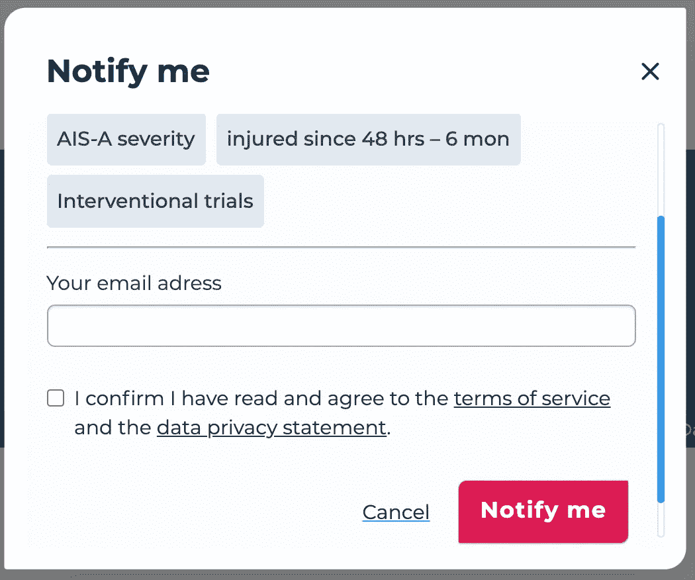

email enter overlay

*✂️ Reakit 是一个低级组件库，用于构建可访问的高级 UI 库，使用 React 设计系统和应用程序。*

这是一个简单的电子邮件验证，它验证了用户“输入**无**”、“输入**无效**电子邮件”或“**不** **接受**服务”三种不同的情况。

*上面的截图还包含其他部分，如* ***标题*** *，* ***一些背景颜色为灰色的列表*** *…但它们不在本文的讨论范围之内，让我们关注一下输入字段*🍎

**第一步**:

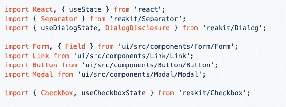

import some needed components …

**第二步**:

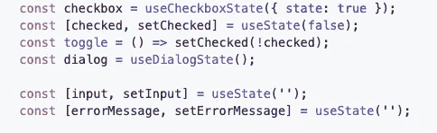

state variables needed

**第三步**:

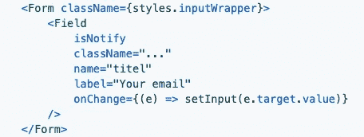

set input value, for example “**label**” should be “Your email adress” corresponding to the **email enter overlay** above, other attributes are omitted here

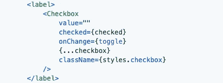

set checkbox value

**第四步:**

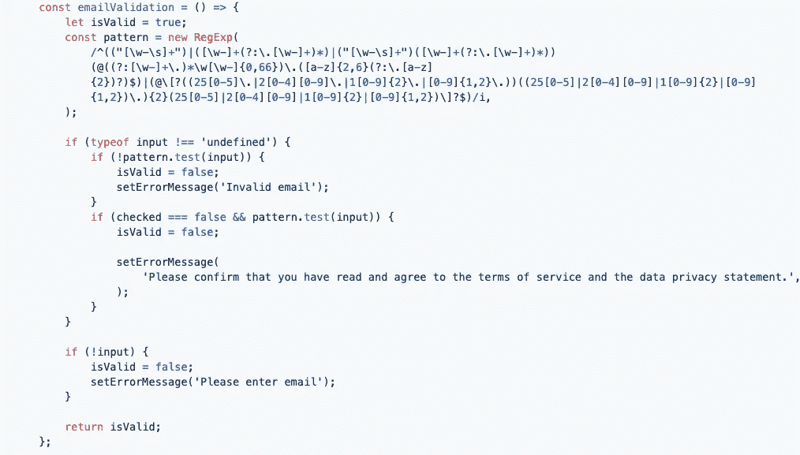

this function returns boolean weather the email input is valid or not

🎲上面的函数显示:

首先，为电子邮件创建**正则表达式** **模式**:

*   如果用户什么都不输入，点击红色的提交按钮(**通知我**)，应该会显示一条错误消息:👇

submit with empty email

*   如果用户输入一个无效的电子邮件地址，其他消息应该出现👇

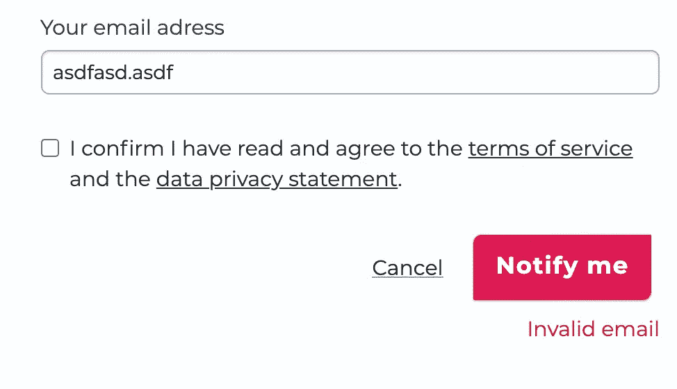

submit with invalid email address

*   如果用户输入了有效的电子邮件地址，但没有点击接受服务的复选框👇

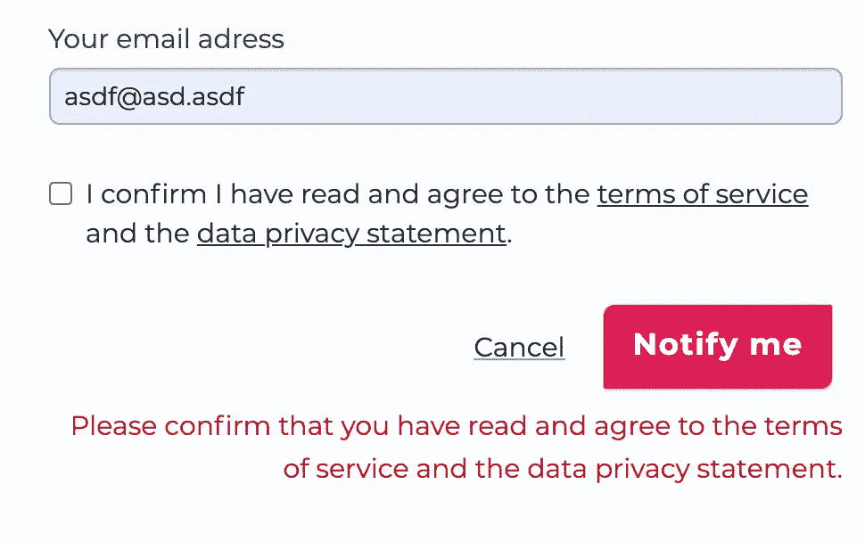

submit with valid email address without accept service

我们将通过下面的按钮**点击**事件来使用该验证功能🌈

**第五步(最终):**

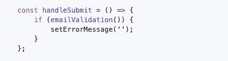

button click event

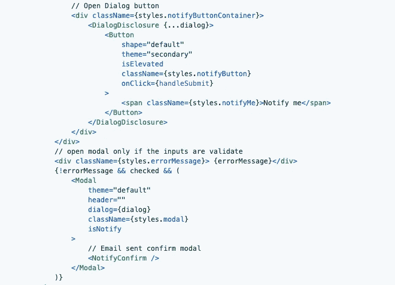

**confirm overlay** using reakit Dialog, please ignore the 
s that may cause syntax errors and some component attributes, screenshot above is only a part of this component

上面的代码显示:

用户点击提交按钮， **emailValidation** 功能将被激活( **handleSubmit** )，它检查邮件是否有效:

*   如果无效，则出现上述 3 个错误(**步骤 4** )
*   如果它是有效的，那么不显示任何错误消息
*   如果有效且没有错误信息，打开**确认覆盖**(在本例中为**<notify confirm/>**组件👇

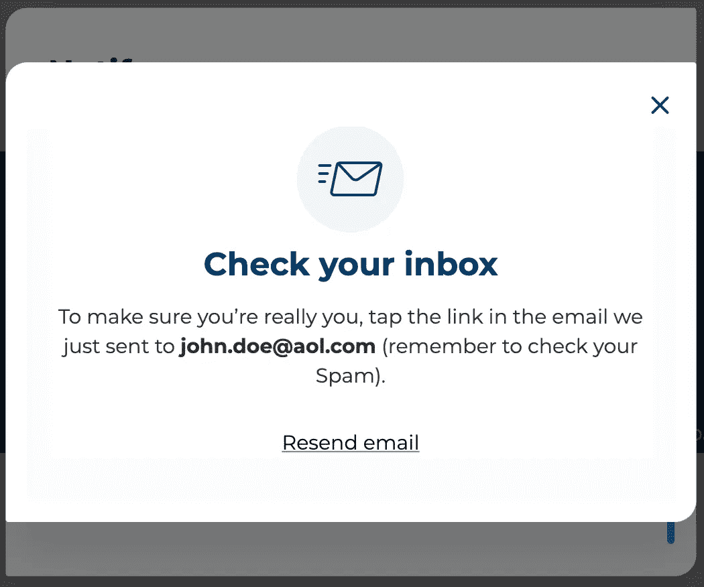

**confirm overlay** after success email validation

就是这样！🧤

以上是简单的邮件验证，希望对你有意思，有用。如果你对我的其他文章感兴趣，这里有一些链接:

[以反应方式找到最近的位置](https://xiaominzhu.medium.com/find-the-nearest-location-in-a-react-way-9ed51a999807)

[从音乐到网络开发](https://xiaominzhu.medium.com/from-music-to-web-development-my-junior-path-7421e0ddd65)

[你可以使用的 5 个 React 钩子库](https://xiaominzhu.medium.com/5-react-hook-libraries-you-could-use-d7f13066ebba)

[边做边学——使用盖茨比](https://xiaominzhu.medium.com/learn-by-doing-use-gatsby-to-create-your-first-site-af7bfb7a8a6f)

[用 Gatsby 获取 JSON 数据——源文件系统和 GraphQL](https://xiaominzhu.medium.com/sourcing-json-data-with-gatsby-source-filesystem-and-graphql-6fc7cef2a49e)

谢谢你看我的文章！🙏