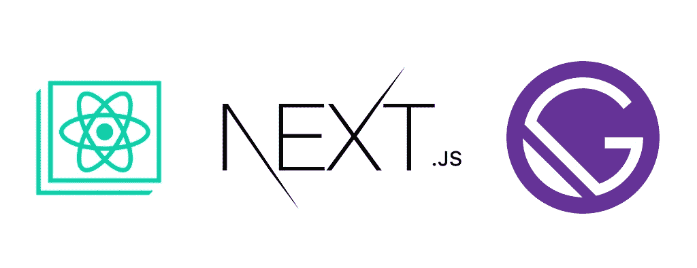

# React，Gatsby，Next.js 你下一个 app 的前端选什么？

> 原文：<https://medium.com/geekculture/react-gatsby-next-js-what-to-choose-for-your-next-apps-frontend-f7aa09529b38?source=collection_archive---------10----------------------->

随着前端 Web 开发的最新趋势，我们已经看到了 JavaScript 框架集合中的许多新增内容；他们中的每一个都有自己独特的方式，都有自己的优势和劣势。

因此，我只想看看 React 的另一面，检查在 React 库之上构建的两个主要框架，并看看为什么…